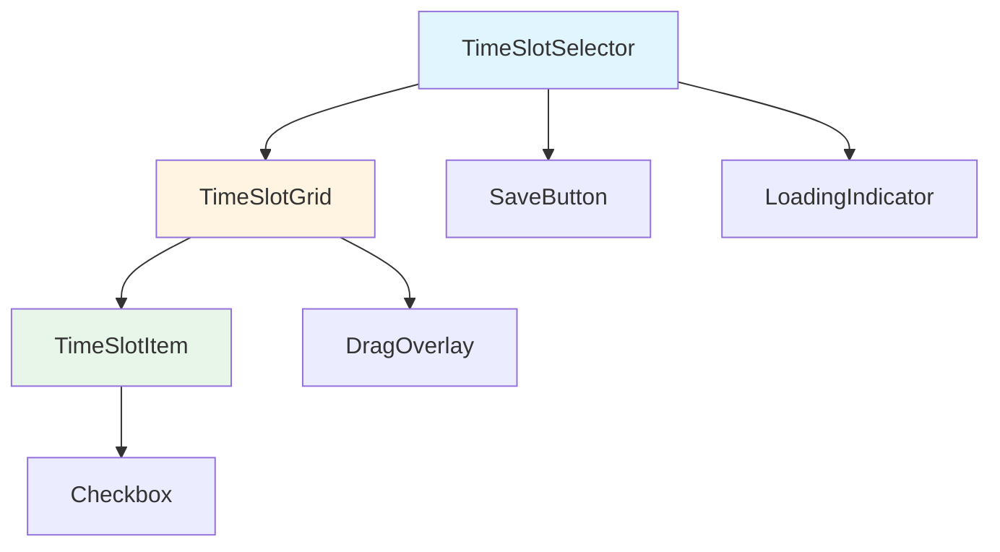
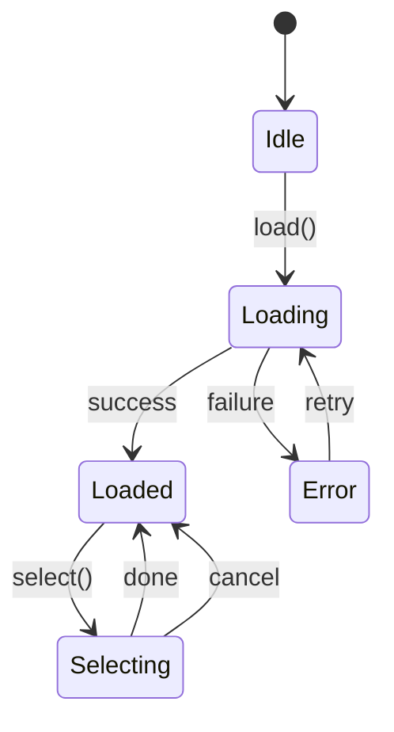
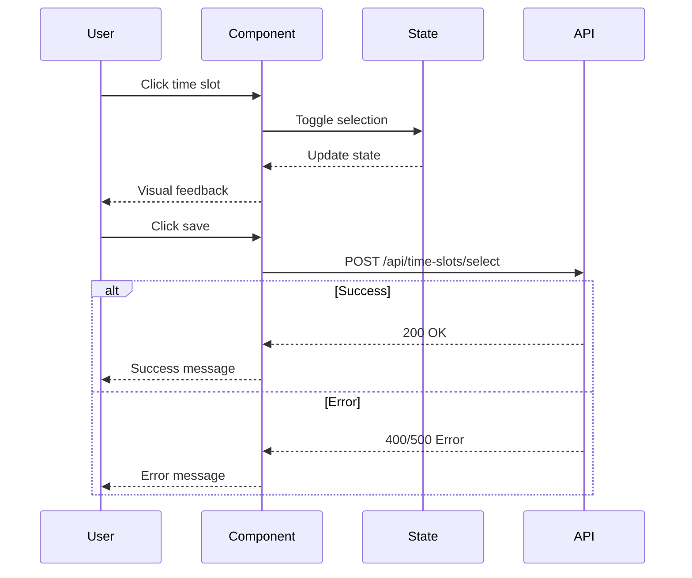

# 설계 문서 템플릿

## 표준 설계 문서 구조

### 기본 템플릿 (Markdown)

```markdown
# 기술 설계 문서: {기능 이름}

## 문서 정보

| 항목 | 내용 |
|------|------|
| **설계 ID** | DESIGN-{FEATURE}-{VERSION} |
| **작성일** | YYYY-MM-DD |
| **최종 수정일** | YYYY-MM-DD |
| **작성자** | {이름} |
| **상태** | Draft / Review / Approved / Implemented |
| **관련 문서** | - 요구사항: {링크}<br>- ToT 의사결정: {링크}<br>- 테스트 계획: {링크} |

---

## 1. 개요

### 1.1 목적
{이 설계 문서의 목적과 범위}

### 1.2 범위
- **포함**: {설계에 포함되는 컴포넌트/기능}
- **제외**: {이번 설계에서 제외되는 사항}

### 1.3 참조 문서
- EARS 요구사항: {문서 링크}
- ToT 의사결정 기록: {문서 링크}
- 프로젝트 구조: .project-structure.yaml
- 기존 아키텍처 문서: {링크}

---

## 2. 아키텍처 개요

### 2.1 기술 스택

| 레이어 | 기술 | 버전 | 선택 근거 | ADR |
|-------|------|------|----------|-----|
| UI Framework | {기술명} | {버전} | {근거} | ADR-001 |
| 상태 관리 | {기술명} | {버전} | {근거} | ADR-002 |
| 스타일링 | {기술명} | {버전} | {근거} | ADR-003 |
| 타입 시스템 | TypeScript | 5.0+ | 타입 안전성 | - |

### 2.2 아키텍처 다이어그램

```
┌─────────────────────────────────────┐
│         Presentation Layer          │
│  ┌──────────────┐  ┌──────────────┐ │
│  │ TimeSlot     │  │ SaveButton   │ │
│  │ Selector     │  │              │ │
│  └──────────────┘  └──────────────┘ │
└──────────┬──────────────────────────┘
           │
┌──────────▼──────────────────────────┐
│         State Management            │
│  ┌──────────────┐  ┌──────────────┐ │
│  │ Jotai Atoms  │  │ Derived      │ │
│  │              │  │ States       │ │
│  └──────────────┘  └──────────────┘ │
└──────────┬──────────────────────────┘
           │
┌──────────▼──────────────────────────┐
│         Business Logic              │
│  ┌──────────────┐  ┌──────────────┐ │
│  │ Validation   │  │ Error        │ │
│  │              │  │ Handling     │ │
│  └──────────────┘  └──────────────┘ │
└──────────┬──────────────────────────┘
           │
┌──────────▼──────────────────────────┐
│         Data Layer (API)            │
│  ┌──────────────┐  ┌──────────────┐ │
│  │ REST API     │  │ Error        │ │
│  │              │  │ Recovery     │ │
│  └──────────────┘  └──────────────┘ │
└─────────────────────────────────────┘
```

### 2.3 데이터 흐름

```
User Action
    ↓
Event Handler (Component)
    ↓
State Update (Jotai Atom)
    ↓
Derived State Recalculation
    ↓
Component Re-render
    ↓
UI Update
```

---

## 3. 컴포넌트 설계

### 3.1 컴포넌트 계층 구조

```
TimeSlotSelector/               # 최상위 컴포넌트
├─ TimeSlotGrid/               # REQ-F-001
│  ├─ TimeSlotItem/            # REQ-F-010
│  │  └─ Checkbox/
│  └─ DragOverlay/             # REQ-F-011
├─ LoadingIndicator/           # REQ-F-030
├─ ErrorMessage/               # REQ-F-020, REQ-F-021
└─ SaveButton/                 # REQ-F-012
```

### 3.2 주요 컴포넌트 명세

#### TimeSlotSelector (Container)

**요구사항 추적**:
- REQ-F-001: 시간대 표시
- REQ-F-002: 다중 선택
- REQ-F-030: 로딩 상태

**Props 인터페이스**:
```typescript
interface TimeSlotSelectorProps {
  /**
   * 초기 선택된 시간대 ID 목록
   * @default []
   */
  initialSelectedSlots?: string[];

  /**
   * 시간대 저장 시 콜백
   * @param selectedSlots 선택된 시간대 ID 목록
   */
  onSave?: (selectedSlots: string[]) => void;

  /**
   * 키보드 네비게이션 활성화 (REQ-F-040)
   * @default false
   */
  enableKeyboardNav?: boolean;
}
```

**상태 관리**:
```typescript
// Internal state
const [isLoading, setIsLoading] = useState(false);
const [error, setError] = useState<Error | null>(null);

// Jotai atoms
const timeSlotsAtom = useAtomValue(timeSlotsAtom);
const [selectedSlots, setSelectedSlots] = useAtom(selectedSlotsAtom);
```

**생명주기**:
```typescript
useEffect(() => {
  // 컴포넌트 마운트 시 시간대 데이터 로드
  loadTimeSlots();
}, []);
```

#### TimeSlotItem (Presentational)

**요구사항 추적**:
- REQ-F-010: 클릭 선택
- REQ-NF-010: 접근성 (WCAG 2.1 AA)

**Props 인터페이스**:
```typescript
interface TimeSlotItemProps {
  /** 시간대 데이터 */
  slot: TimeSlot;

  /** 선택 상태 */
  isSelected: boolean;

  /** 클릭 이벤트 핸들러 */
  onClick: (slotId: string) => void;

  /** 키보드 네비게이션 핸들러 (선택적) */
  onKeyDown?: (e: KeyboardEvent, slotId: string) => void;

  /** 커스텀 스타일 (가상 스크롤용) */
  style?: CSSProperties;
}
```

**렌더링 최적화**:
```typescript
export const TimeSlotItem = React.memo(
  ({ slot, isSelected, onClick, style }: TimeSlotItemProps) => {
    // 컴포넌트 구현
  },
  (prevProps, nextProps) =>
    prevProps.isSelected === nextProps.isSelected &&
    prevProps.slot.id === nextProps.slot.id
);
```

---

## 4. 상태 관리 설계

### 4.1 상태 구조

**전역 상태 (Jotai Atoms)**:
```typescript
// 시간대 목록 (REQ-F-001)
const timeSlotsAtom = atom<TimeSlot[]>([]);

// 선택된 시간대 ID 목록 (REQ-F-002)
const selectedSlotsAtom = atom<string[]>([]);

// 로딩 상태 (REQ-F-030)
const isLoadingAtom = atom<boolean>(false);

// 에러 상태
const errorAtom = atom<Error | null>(null);

// 선택 모드 (REQ-F-031)
const selectionModeAtom = atom<SelectionMode>('idle');
```

**파생 상태 (Derived Atoms)**:
```typescript
// 선택된 시간대 객체 목록
const selectedTimeSlotsAtom = atom(get => {
  const slots = get(timeSlotsAtom);
  const selectedIds = get(selectedSlotsAtom);
  return slots.filter(slot => selectedIds.includes(slot.id));
});

// 저장 가능 여부 (REQ-F-020)
const canSaveAtom = atom(get => {
  const selected = get(selectedSlotsAtom);
  return selected.length > 0 && selected.length <= 50;
});

// 선택 개수
const selectedCountAtom = atom(get => get(selectedSlotsAtom).length);
```

**쓰기 전용 Atoms (Actions)**:
```typescript
// 시간대 토글 (REQ-F-010)
const toggleSlotAtom = atom(
  null,
  (get, set, slotId: string) => {
    const current = get(selectedSlotsAtom);
    set(
      selectedSlotsAtom,
      current.includes(slotId)
        ? current.filter(id => id !== slotId)
        : [...current, slotId]
    );
  }
);

// 시간대 범위 선택 (REQ-F-011)
const selectRangeAtom = atom(
  null,
  (get, set, slotIds: string[]) => {
    const current = get(selectedSlotsAtom);
    const newIds = [...new Set([...current, ...slotIds])];
    set(selectedSlotsAtom, newIds);
  }
);

// 전체 초기화
const clearSelectionAtom = atom(
  null,
  (get, set) => {
    set(selectedSlotsAtom, []);
  }
);
```

### 4.2 상태 전환 다이어그램

```
[IDLE] ────load───→ [LOADING] ────success───→ [LOADED]
  ↑                     │                         │
  │                     │                         │
  └────error───←────────┘                         │
                                                  │
                    ┌─────────select─────────────┘
                    ↓
              [SELECTING] ────done───→ [LOADED]
                    │
                    └────cancel───→ [LOADED]
```

---

## 5. API 설계

### 5.1 API 인터페이스

```typescript
/**
 * 시간대 API 클라이언트
 */
interface TimeSlotsAPI {
  /**
   * 사용 가능한 시간대 조회 (REQ-F-001)
   *
   * @returns 시간대 목록
   * @throws {NetworkError} 네트워크 오류 시
   */
  fetchTimeSlots(): Promise<TimeSlot[]>;

  /**
   * 선택된 시간대 저장 (REQ-F-012)
   *
   * @param slotIds 선택된 시간대 ID 목록
   * @returns 저장 성공 여부
   * @throws {ValidationError} 검증 실패 시 (REQ-F-021)
   * @throws {NetworkError} 네트워크 오류 시 (REQ-F-022)
   */
  saveSelectedSlots(slotIds: string[]): Promise<boolean>;
}
```

### 5.2 API 엔드포인트

| 메서드 | 경로 | 설명 | 요구사항 |
|-------|------|------|----------|
| GET | `/api/time-slots` | 시간대 목록 조회 | REQ-F-001 |
| POST | `/api/time-slots/select` | 시간대 선택 저장 | REQ-F-012 |

### 5.3 요청/응답 타입

**GET /api/time-slots**:
```typescript
// Response
{
  "timeSlots": [
    {
      "id": "slot-001",
      "startTime": "2024-01-15T09:00:00Z",
      "endTime": "2024-01-15T10:00:00Z",
      "available": true
    }
  ]
}
```

**POST /api/time-slots/select**:
```typescript
// Request
{
  "slotIds": ["slot-001", "slot-002"]
}

// Response (Success)
{
  "success": true,
  "selectedCount": 2
}

// Response (Error - REQ-F-021)
{
  "success": false,
  "error": {
    "code": "VALIDATION_ERROR",
    "message": "최대 50개까지 선택 가능합니다",
    "details": {
      "maxAllowed": 50,
      "attempted": 55
    }
  }
}
```

### 5.4 에러 처리 전략

**에러 타입 정의**:
```typescript
class NetworkError extends Error {
  constructor(message: string, public statusCode: number) {
    super(message);
    this.name = 'NetworkError';
  }
}

class ValidationError extends Error {
  constructor(
    message: string,
    public fieldErrors: Record<string, string>
  ) {
    super(message);
    this.name = 'ValidationError';
  }
}
```

**재시도 로직 (REQ-F-022)**:
```typescript
const saveWithRetry = async (
  slotIds: string[],
  maxRetries = 3
): Promise<boolean> => {
  for (let attempt = 1; attempt <= maxRetries; attempt++) {
    try {
      return await api.saveSelectedSlots(slotIds);
    } catch (error) {
      if (error instanceof ValidationError) {
        // 검증 에러는 재시도 불필요
        throw error;
      }

      if (attempt === maxRetries) {
        throw new Error(`저장 실패 (${maxRetries}회 재시도 실패)`);
      }

      // 지수 백오프
      await delay(1000 * Math.pow(2, attempt - 1));
    }
  }

  return false;
};
```

---

## 6. 데이터 모델

### 6.1 타입 정의

```typescript
/**
 * 시간대 데이터 (REQ-F-001)
 */
interface TimeSlot {
  /** 고유 식별자 */
  id: string;

  /** 시작 시간 (ISO 8601) */
  startTime: Date;

  /** 종료 시간 (ISO 8601) */
  endTime: Date;

  /** 예약 가능 여부 */
  available: boolean;

  /** 추가 메타데이터 (선택적) */
  metadata?: {
    location?: string;
    capacity?: number;
    bookedCount?: number;
  };
}

/**
 * 선택 모드 (REQ-F-031)
 */
type SelectionMode = 'idle' | 'selecting' | 'dragging';

/**
 * 시간대 선택 결과
 */
interface SelectionResult {
  selectedSlots: TimeSlot[];
  count: number;
  timestamp: Date;
}
```

### 6.2 검증 스키마 (Zod)

```typescript
import { z } from 'zod';

const TimeSlotSchema = z.object({
  id: z.string().min(1),
  startTime: z.date(),
  endTime: z.date(),
  available: z.boolean(),
  metadata: z.object({
    location: z.string().optional(),
    capacity: z.number().int().positive().optional(),
    bookedCount: z.number().int().nonnegative().optional()
  }).optional()
}).refine(
  data => data.endTime > data.startTime,
  { message: '종료 시간은 시작 시간보다 이후여야 합니다' }
);

const SelectionRequestSchema = z.object({
  slotIds: z.array(z.string()).min(1).max(50)
});

// 사용
const validateSelection = (slotIds: string[]) => {
  try {
    SelectionRequestSchema.parse({ slotIds });
    return { valid: true };
  } catch (error) {
    if (error instanceof z.ZodError) {
      return {
        valid: false,
        errors: error.errors
      };
    }
  }
};
```

### 6.3 데이터 변환 함수

```typescript
/**
 * API 응답을 TimeSlot 객체로 변환
 */
const parseTimeSlot = (raw: any): TimeSlot => {
  return {
    id: raw.id,
    startTime: new Date(raw.startTime),
    endTime: new Date(raw.endTime),
    available: raw.available,
    metadata: raw.metadata
  };
};

/**
 * 시간대를 사용자 친화적 문자열로 변환
 */
const formatTimeSlot = (slot: TimeSlot): string => {
  const start = format(slot.startTime, 'HH:mm');
  const end = format(slot.endTime, 'HH:mm');
  return `${start} - ${end}`;
};
```

---

## 7. 성능 최적화

### 7.1 목표 및 측정

**성능 목표 (REQ-NF-001, REQ-NF-002)**:
| 메트릭 | 목표 | 측정 방법 |
|-------|------|----------|
| 초기 렌더링 | < 500ms | Lighthouse FCP |
| 사용자 입력 응답 | < 100ms | Performance.measure |
| 번들 크기 | < 100KB (gzipped) | webpack-bundle-analyzer |

### 7.2 최적화 전략

**1. 가상 스크롤 (100개+ 아이템)**:
```typescript
import { FixedSizeList } from 'react-window';

const TimeSlotGrid = ({ slots }: { slots: TimeSlot[] }) => {
  return (
    <FixedSizeList
      height={600}
      itemCount={slots.length}
      itemSize={50}
      width="100%"
    >
      {({ index, style }) => (
        <TimeSlotItem
          slot={slots[index]}
          style={style}
        />
      )}
    </FixedSizeList>
  );
};
```

**2. 메모이제이션**:
```typescript
// 컴포넌트 메모이제이션
export const TimeSlotItem = React.memo(TimeSlotItem);

// 값 메모이제이션
const sortedSlots = useMemo(
  () => timeSlots.sort((a, b) => a.startTime.getTime() - b.startTime.getTime()),
  [timeSlots]
);

// 함수 메모이제이션
const handleClick = useCallback(
  (slotId: string) => {
    toggleSlot(slotId);
  },
  [toggleSlot]
);
```

**3. Code Splitting**:
```typescript
const TimeSlotSelector = lazy(() => import('./TimeSlotSelector'));

// 사용
<Suspense fallback={<Loading />}>
  <TimeSlotSelector />
</Suspense>
```

**4. 이벤트 최적화**:
```typescript
// 드래그 이벤트 throttle (REQ-F-011)
const throttledDragHandler = useCallback(
  throttle((e: MouseEvent) => {
    handleDrag(e);
  }, 16), // 60fps
  []
);
```

---

## 8. 접근성 (Accessibility)

### 8.1 WCAG 2.1 AA 준수 전략 (REQ-NF-010)

**키보드 네비게이션**:
```typescript
const TimeSlotItem = ({ slot }: TimeSlotItemProps) => {
  const handleKeyDown = (e: KeyboardEvent) => {
    switch (e.key) {
      case 'Enter':
      case ' ':
        e.preventDefault();
        toggleSlot(slot.id);
        break;
      case 'ArrowDown':
        focusNextSlot();
        break;
      case 'ArrowUp':
        focusPrevSlot();
        break;
      case 'Escape':
        exitSelectionMode();
        break;
    }
  };

  return (
    <button
      role="checkbox"
      aria-checked={isSelected}
      aria-label={`${formatTime(slot.startTime)} - ${formatTime(slot.endTime)}`}
      onKeyDown={handleKeyDown}
      tabIndex={0}
    >
      {/* ... */}
    </button>
  );
};
```

**ARIA 속성**:
```typescript
<div
  role="group"
  aria-label="시간대 선택"
  aria-describedby="selection-help"
>
  <p id="selection-help" className="sr-only">
    화살표 키로 이동, 스페이스나 엔터로 선택
  </p>

  <ul role="list" aria-label="사용 가능한 시간대">
    {slots.map(slot => (
      <TimeSlotItem key={slot.id} slot={slot} />
    ))}
  </ul>

  <div role="status" aria-live="polite" className="sr-only">
    {selectedCount}개 시간대 선택됨
  </div>
</div>
```

---

## 9. 테스트 전략

### 9.1 테스트 커버리지 목표

| 요구사항 유형 | 테스트 방법 | 커버리지 목표 |
|-------------|-----------|-------------|
| 기능적 요구사항 | Unit + E2E | 90%+ |
| 성능 요구사항 | Performance Test | 100% |
| 접근성 요구사항 | axe-core + Manual | 100% WCAG AA |

### 9.2 단위 테스트

```typescript
describe('TimeSlotSelector', () => {
  it('should display all time slots (REQ-F-001)', () => {
    const slots = [createMockSlot(), createMockSlot()];
    render(<TimeSlotSelector initialSlots={slots} />);

    expect(screen.getAllByRole('checkbox')).toHaveLength(2);
  });

  it('should toggle selection on click (REQ-F-010)', () => {
    render(<TimeSlotSelector />);
    const slot = screen.getByLabelText(/09:00 - 10:00/);

    fireEvent.click(slot);
    expect(slot).toHaveAttribute('aria-checked', 'true');

    fireEvent.click(slot);
    expect(slot).toHaveAttribute('aria-checked', 'false');
  });

  it('should disable save when no slots selected (REQ-F-020)', () => {
    render(<TimeSlotSelector />);
    const saveButton = screen.getByRole('button', { name: /저장/ });

    expect(saveButton).toBeDisabled();
  });
});
```

### 9.3 E2E 테스트

```typescript
test('complete time slot selection flow', async ({ page }) => {
  await page.goto('/time-slot-selector');

  // REQ-F-001: 시간대 표시
  await expect(page.locator('[role="checkbox"]')).toHaveCount(20);

  // REQ-F-010: 클릭 선택
  await page.click('[aria-label="09:00 - 10:00"]');
  await page.click('[aria-label="10:00 - 11:00"]');

  // REQ-F-020: 저장 버튼 활성화
  await expect(page.getByRole('button', { name: /저장/ })).toBeEnabled();

  // REQ-F-012: 저장
  await page.click('[role="button"][name="저장"]');
  await expect(page.locator('[role="status"]')).toHaveText(/저장되었습니다/);
});
```

---

## 10. 구현 순서

### Phase 1: 기본 기능 (Week 1)
- [ ] 시간대 데이터 타입 정의
- [ ] API 인터페이스 구현
- [ ] TimeSlotGrid 컴포넌트
- [ ] 클릭 선택 기능
- [ ] 기본 상태 관리 (Jotai)

### Phase 2: 향상된 UX (Week 2)
- [ ] 드래그 선택 기능
- [ ] 로딩/에러 상태 UI
- [ ] 검증 및 에러 처리
- [ ] 성능 최적화 (가상 스크롤)

### Phase 3: 접근성 & 고급 기능 (Week 3)
- [ ] 키보드 네비게이션
- [ ] ARIA 속성 및 스크린 리더 지원
- [ ] 접근성 테스트
- [ ] 최종 통합 테스트

---
```

## 아키텍처 결정 기록 (ADR) 템플릿

```markdown
# ADR-{번호}: {결정 제목}

**상태**: {제안됨 | 검토중 | 승인됨 | 거부됨 | 폐기됨 | 대체됨}
**날짜**: YYYY-MM-DD
**결정자**: {이름}
**대체**: {이전 ADR 번호, 있을 경우}

## 컨텍스트

{결정이 필요한 배경과 상황}

**관련 요구사항**:
- REQ-XXX: {요구사항 설명}

**제약사항**:
- {기술적 제약}
- {비즈니스 제약}
- {리소스 제약}

## 결정

{내린 결정의 명확한 설명}

## 근거

**선택 이유**:
1. {이유 1}
2. {이유 2}
3. {이유 3}

**장점**:
- {장점 1}
- {장점 2}

**단점 (트레이드오프)**:
- {단점 1}
- {단점 2}

## 고려한 대안

### 대안 1: {대안 이름}
- **장점**: {장점}
- **단점**: {단점}
- **거부 이유**: {왜 선택하지 않았는가}

### 대안 2: {대안 이름}
- **장점**: {장점}
- **단점**: {단점}
- **거부 이유**: {왜 선택하지 않았는가}

## 결과

**예상 효과**:
- {긍정적 효과 1}
- {긍정적 효과 2}

**리스크**:
- {리스크 1} → {완화 방안}
- {리스크 2} → {완화 방안}

**재검토 조건**:
- {조건 1}
- {조건 2}

## 참고 자료

- {관련 문서 링크}
- {기술 레퍼런스}
```

## 다이어그램 템플릿

### 컴포넌트 다이어그램 (Mermaid)



### 상태 다이어그램 (Mermaid)



### 시퀀스 다이어그램 (Mermaid)



---

> **Best Practice**: 설계 문서는 코드와 함께 업데이트
> **Version Control**: Git으로 관리하여 설계 변경 이력 추적
> **Review**: 모든 ADR은 팀 리뷰 후 승인
