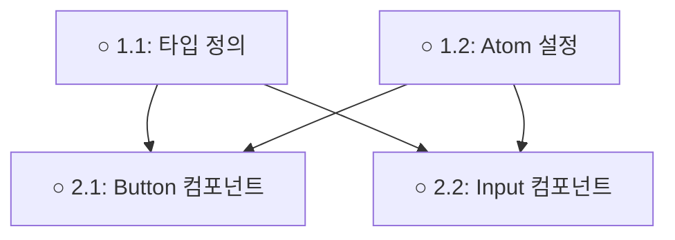

# 작업 의존성 분석 가이드

## 개요

작업 간 의존성을 식별하고 분석하여 실행 순서를 결정하고 병렬화 기회를 파악합니다.

## 의존성 유형

### 1. 순차 의존성 (Sequential Dependency)

**정의**: 작업 A가 완료되어야 작업 B를 시작할 수 있음

**식별 방법**:
```typescript
interface SequentialDependency {
  task: string;          // 현재 작업 ID
  requires: string[];    // 선행 작업 ID 목록
  reason: string;        // 의존 이유
}

// 예시
{
  task: "2.2",
  requires: ["2.1"],
  reason: "2.1에서 생성한 타입 정의를 import 함"
}
```

**식별 규칙**:
- 파일 임포트: `import { Type } from './file'` → file 생성 작업 선행 필요
- 데이터 사용: API 호출 → API 정의 선행 필요
- 기능 확장: 기본 컴포넌트 → 확장 컴포넌트

**03_plan.md 표현**:
```markdown
### 2.1 타입 정의
- **파일**: src/types/user.ts
- **내용**: User, UserRole 타입 정의
- **완료**: [ ]

### 2.2 사용자 컴포넌트 구현
- **파일**: src/components/UserCard.tsx
- **내용**: UserCard 컴포넌트 구현
- **방법**: User 타입 import하여 사용
- **완료**: [ ]
- **Dependencies**: 2.1  ← 명시적 의존성
```

### 2. Phase 의존성 (Phase Dependency)

**정의**: Phase N이 완료되어야 Phase N+1을 시작할 수 있음

**식별 규칙**:
- Phase 1: 기본 구조 (타입, 설정) → 다른 Phase의 기반
- Phase 2: 핵심 기능 → Phase 1 완료 필수
- Phase 3: 통합 및 테스트 → Phase 2 완료 필수

**Phase 완료 조건**:
```typescript
function isPhaseComplete(phase: Phase): boolean {
  // Required 작업만 확인
  const requiredTasks = phase.tasks.filter(t => !t.optional);
  const completedTasks = requiredTasks.filter(t => t.status === 'completed');

  return completedTasks.length === requiredTasks.length;
}
```

**예시**:
```markdown
## Phase 1: 기본 구조 ✓ 2025-01-15 완료
- [x] 1.1 타입 정의 ✓
- [x] 1.2 Atom 설정 ✓

## Phase 2: 컴포넌트 개발  ← Phase 1 의존
- [ ] 2.1 Button 컴포넌트
- [ ] 2.2 Input 컴포넌트
```

### 3. 파일 의존성 (File Dependency)

**정의**: 파일 A가 파일 B를 import → 파일 B 먼저 생성 필요

**분석 방법**:
```typescript
function analyzeFileDependencies(tasks: Task[]): DependencyGraph {
  const graph = new Map<string, string[]>();

  for (const task of tasks) {
    const file = task.파일;
    const imports = extractImports(task.방법); // "방법" 필드에서 import 추출

    graph.set(file, imports);
  }

  return graph;
}
```

**예시**:
```markdown
### 2.1 타입 정의
- **파일**: src/types/form.ts
- **내용**: FormField, FormError 타입

### 2.2 폼 컴포넌트
- **파일**: src/components/Form.tsx
- **방법**: import { FormField } from '@/types/form'  ← 2.1 의존
```

### 4. 데이터 의존성 (Data Dependency)

**정의**: 작업 A가 생성한 데이터를 작업 B가 사용

**예시**:
```markdown
### 3.1 API 엔드포인트 구현
- **파일**: src/api/users.ts
- **내용**: GET /api/users 구현

### 3.2 사용자 목록 페이지
- **파일**: src/pages/UsersPage.tsx
- **방법**: fetch('/api/users')를 호출  ← 3.1 의존
```

## 의존성 그래프 구축

### 그래프 표현

```typescript
interface DependencyGraph {
  nodes: Map<string, TaskNode>;     // 작업 노드
  edges: Map<string, string[]>;     // 의존성 엣지
}

interface TaskNode {
  id: string;
  title: string;
  phase: number;
  status: 'completed' | 'in_progress' | 'pending';
  dependencies: string[];           // 선행 작업 ID
  dependents: string[];             // 후속 작업 ID
}
```

### 그래프 구축 알고리즘

```typescript
function buildDependencyGraph(plan: Plan): DependencyGraph {
  const graph: DependencyGraph = {
    nodes: new Map(),
    edges: new Map(),
  };

  // 1. 노드 생성
  for (const phase of plan.phases) {
    for (const task of phase.tasks) {
      graph.nodes.set(task.id, {
        id: task.id,
        title: task.title,
        phase: phase.number,
        status: task.status,
        dependencies: task.dependencies || [],
        dependents: [],
      });
    }
  }

  // 2. 엣지 생성 및 dependents 업데이트
  for (const [taskId, node] of graph.nodes) {
    for (const depId of node.dependencies) {
      // 엣지 추가: depId → taskId
      if (!graph.edges.has(depId)) {
        graph.edges.set(depId, []);
      }
      graph.edges.get(depId).push(taskId);

      // Dependents 업데이트
      graph.nodes.get(depId).dependents.push(taskId);
    }
  }

  return graph;
}
```

## 의존성 검증

### 순환 의존성 감지

```typescript
function detectCycles(graph: DependencyGraph): string[][] {
  const cycles: string[][] = [];
  const visited = new Set<string>();
  const recStack = new Set<string>();

  function dfs(nodeId: string, path: string[]): void {
    visited.add(nodeId);
    recStack.add(nodeId);
    path.push(nodeId);

    const neighbors = graph.edges.get(nodeId) || [];
    for (const neighbor of neighbors) {
      if (!visited.has(neighbor)) {
        dfs(neighbor, [...path]);
      } else if (recStack.has(neighbor)) {
        // 순환 감지
        const cycleStart = path.indexOf(neighbor);
        cycles.push(path.slice(cycleStart));
      }
    }

    recStack.delete(nodeId);
  }

  for (const nodeId of graph.nodes.keys()) {
    if (!visited.has(nodeId)) {
      dfs(nodeId, []);
    }
  }

  return cycles;
}
```

**순환 의존성 예시** (잘못된 설계):
```markdown
2.1 → 2.2 → 2.3 → 2.1  ← 순환!

이는 설계 오류이며 수정 필요
```

### 의존성 충족 여부 확인

```typescript
function areDependenciesMet(taskId: string, graph: DependencyGraph): boolean {
  const task = graph.nodes.get(taskId);

  for (const depId of task.dependencies) {
    const depTask = graph.nodes.get(depId);
    if (depTask.status !== 'completed') {
      return false; // 선행 작업 미완료
    }
  }

  return true;
}
```

## 병렬화 분석

### 독립 작업 감지

```typescript
function findParallelizableTasks(graph: DependencyGraph, currentPhase: number): string[][] {
  const parallelGroups: string[][] = [];

  // 현재 Phase 내 작업들
  const phaseTasks = Array.from(graph.nodes.values())
    .filter(node => node.phase === currentPhase && node.status === 'pending');

  // 의존성 없는 작업들을 그룹화
  const independentGroups = groupByIndependence(phaseTasks, graph);

  return independentGroups;
}

function groupByIndependence(tasks: TaskNode[], graph: DependencyGraph): string[][] {
  const groups: string[][] = [];
  const processed = new Set<string>();

  for (const task of tasks) {
    if (processed.has(task.id)) continue;

    const group = [task.id];
    processed.add(task.id);

    // 같은 그룹에 포함 가능한 작업 찾기
    for (const otherTask of tasks) {
      if (processed.has(otherTask.id)) continue;

      // 서로 의존성이 없고, 같은 파일 수정 안 함
      if (!hasDirectDependency(task, otherTask, graph) &&
          !modifiesSameFile(task, otherTask)) {
        group.push(otherTask.id);
        processed.add(otherTask.id);
      }
    }

    if (group.length > 1) {
      groups.push(group); // 2개 이상일 때만 병렬화 의미
    }
  }

  return groups;
}
```

### 병렬 실행 조건

```typescript
function canRunInParallel(task1: Task, task2: Task): boolean {
  // 1. 다른 파일 수정
  if (task1.파일 === task2.파일) return false;

  // 2. 의존성 없음
  if (task1.dependencies.includes(task2.id)) return false;
  if (task2.dependencies.includes(task1.id)) return false;

  // 3. 동일 Phase (권장)
  if (task1.phase !== task2.phase) return false;

  // 4. 공유 리소스 없음 (DB, API 등)
  if (hasSharedResources(task1, task2)) return false;

  return true;
}
```

**병렬화 예시**:
```markdown
## Phase 2: 컴포넌트 개발

### 병렬 그룹 A (동시 실행 가능)
- [ ] 2.1 Button 컴포넌트 (src/components/Button.tsx)
- [ ] 2.2 Input 컴포넌트 (src/components/Input.tsx)
- [ ] 2.3 Select 컴포넌트 (src/components/Select.tsx)

→ 다른 파일, 의존성 없음, 동일 Phase
→ 병렬 실행으로 시간 단축 (6h → 2h)
```

## 실행 순서 결정

### 위상 정렬 (Topological Sort)

```typescript
function topologicalSort(graph: DependencyGraph): string[] {
  const sorted: string[] = [];
  const visited = new Set<string>();

  function visit(nodeId: string): void {
    if (visited.has(nodeId)) return;

    visited.add(nodeId);

    const deps = graph.nodes.get(nodeId).dependencies;
    for (const depId of deps) {
      visit(depId); // 의존성 먼저 방문
    }

    sorted.push(nodeId);
  }

  for (const nodeId of graph.nodes.keys()) {
    visit(nodeId);
  }

  return sorted;
}
```

**결과**:
```
정렬된 실행 순서:
1.1 → 1.2 → 2.1 → 2.2 → 2.3 → 3.1 → 3.2

이 순서는 모든 의존성을 만족함
```

### Critical Path 분석

```typescript
function findCriticalPath(graph: DependencyGraph): string[] {
  // 가장 긴 실행 경로 (병렬화 불가능한 체인)

  const longestPath: string[] = [];

  function dfs(nodeId: string, path: string[], totalTime: number): void {
    const node = graph.nodes.get(nodeId);
    path.push(nodeId);
    totalTime += node.estimatedTime;

    if (node.dependents.length === 0) {
      // 리프 노드 도달
      if (totalTime > longestPathTime) {
        longestPathTime = totalTime;
        longestPath = [...path];
      }
    } else {
      for (const dependent of node.dependents) {
        dfs(dependent, [...path], totalTime);
      }
    }
  }

  let longestPathTime = 0;
  for (const nodeId of graph.nodes.keys()) {
    if (graph.nodes.get(nodeId).dependencies.length === 0) {
      dfs(nodeId, [], 0);
    }
  }

  return longestPath;
}
```

**Critical Path 예시**:
```
Critical Path: 1.1 (2h) → 2.1 (4h) → 3.1 (6h) → 3.3 (3h)
총 소요: 15시간 (병렬화 불가)

병렬화 가능 작업들은 이 경로와 동시 실행 가능
```

## 의존성 시각화

### Mermaid 그래프 생성

```typescript
function generateMermaidGraph(graph: DependencyGraph): string {
  let mermaid = 'graph TD\n';

  for (const [taskId, node] of graph.nodes) {
    // 노드 정의
    const status = node.status === 'completed' ? '✓' : '○';
    mermaid += `  ${taskId}["${status} ${taskId}: ${node.title}"]\n`;
  }

  for (const [from, toList] of graph.edges) {
    for (const to of toList) {
      mermaid += `  ${from} --> ${to}\n`;
    }
  }

  return mermaid;
}
```

**출력 예시**:


---

> **참고**: 이 분석은 `task_selector.sh`에서 자동으로 수행됩니다.
> **도구**: `tools/dependency_analyzer.sh`로 그래프 시각화 가능
