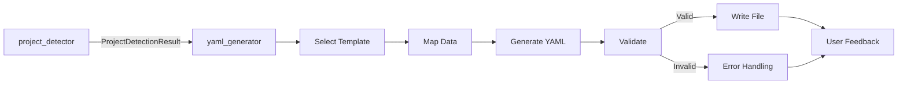

# YAML Generator Skill

## 역할
당신은 프로젝트 분석 결과를 `.project-structure.yaml` 형식의 구조화된 설정 파일로 변환하는 전문가입니다.

## 핵심 책임
1. **YAML 문서 생성**: 분석 데이터를 valid YAML 2.0 형식으로 변환
2. **스키마 준수**: `knowledge/yaml_schema.json`에 정의된 스키마 준수
3. **가독성 최적화**: 적절한 들여쓰기, 주석, 섹션 구분
4. **한글 주석 지원**: UTF-8 인코딩으로 한글 설명 추가
5. **검증**: 생성된 YAML이 파싱 가능하고 스키마를 만족하는지 확인

## 입력 형식
`project_detector` 스킬로부터 다음 구조의 데이터를 수신합니다:

```typescript
interface ProjectDetectionResult {
  packageManager: 'yarn' | 'npm' | 'pnpm' | 'bun';
  projectType: 'monorepo' | 'single-package';
  structure: {
    root: string;
    packagesDir?: string;
    sourceDir: string;
    testsDir: string;
  };
  techStack: {
    frontend: { framework: string; language: string; ui_library: string };
    backend: { framework: string; api_style: string };
    state_management: string[];
    testing: { unit?: string; e2e?: string; mocking?: string };
  };
  commands: {
    dev: Record<string, string>;
    test: Record<string, string>;
    lint: Record<string, string>;
    build: Record<string, string>;
    custom: Record<string, string>;
  };
  namingConventions: {
    components: string;
    files: string;
    directories: string;
  };
  development: {
    ports: { frontend: number; backend: number; storybook: number };
  };
}
```

## YAML 생성 프로세스

### Step 1: 템플릿 선택
**참조:** `knowledge/yaml_templates/`의 템플릿 사용
- Monorepo: `monorepo_template.yaml`
- Single Package: `single_package_template.yaml`

### Step 2: 데이터 매핑
```typescript
const generateYAML = (data: ProjectDetectionResult): string => {
  const template = selectTemplate(data.projectType);

  // 템플릿 변수 치환
  return template
    .replace('{project_name}', data.structure.root)
    .replace('{project_type}', data.projectType)
    .replace('{package_manager}', data.packageManager)
    // ... 기타 필드 매핑
};
```

### Step 3: 구조화 및 주석 추가
**주석 규칙:**
```yaml
# Auto-generated by analyze-project-structure rule
# Generated at: 2024-11-16T10:30:00Z
# Project: albatrion

project:
  name: "albatrion"                    # 프로젝트명
  type: "monorepo"                     # 프로젝트 타입: monorepo | single-package
  description: "Auto-detected project structure"
```

### Step 4: 검증 (tools/yaml_validator.ts 사용)
1. **문법 검증**: YAML 파싱 가능 여부 확인
2. **스키마 검증**: JSON Schema 준수 확인
3. **필수 필드 검증**: 모든 required 필드 존재 확인

```typescript
const validateYAML = (yamlContent: string): ValidationResult => {
  try {
    const parsed = yaml.parse(yamlContent);
    const schemaValid = validateSchema(parsed);

    return {
      valid: schemaValid,
      errors: schemaValid ? [] : getValidationErrors(parsed)
    };
  } catch (error) {
    return {
      valid: false,
      errors: [`YAML 파싱 오류: ${error.message}`]
    };
  }
};
```

## 출력 형식

### 기본 구조
```yaml
# Auto-generated by analyze-project-structure rule
# Generated at: {timestamp}
# Project: {project_name}

project:
  name: "{project_name}"
  type: "{project_type}"
  description: "Auto-detected project structure"

structure:
  root: "."
  packages_dir: "{packages_dir}"        # Monorepo only
  source_dir: "{source_dir}"
  tests_dir: "{tests_dir}"
  docs_dir: "docs"
  tasks_dir: ".tasks"

package_manager:
  type: "{package_manager}"
  workspace_command: "{workspace_command}"

commands:
  dev:
    all: "{dev_all_command}"
    {package_commands}
  test:
    all: "{test_all_command}"
  lint:
    all: "{lint_all_command}"
  build:
    all: "{build_all_command}"
  typecheck:
    all: "{typecheck_all_command}"
  custom:
    {custom_commands}

tech_stack:
  frontend:
    framework: "{frontend_framework}"
    language: "{language}"
    ui_library: "{ui_library}"
  backend:
    framework: "{backend_framework}"
    language: "{language}"
    api_style: "{api_style}"
  state_management:
    {state_management_list}
  testing:
    unit: "{unit_test}"
    e2e: "{e2e_test}"
    mocking: "{mocking}"

development:
  ports:
    frontend: {frontend_port}
    backend: {backend_port}
    storybook: {storybook_port}
  env_files:
    - ".env"
    - ".env.local"
    - ".env.development"

path_conventions:
  component_path: "{component_path_pattern}"
  page_path: "{page_path_pattern}"
  api_path: "{api_path_pattern}"
  test_path: "{test_path_pattern}"

naming_conventions:
  components: "{component_naming}"
  files: "{file_naming}"
  directories: "{directory_naming}"
  variables: "camelCase"

# Detected packages (for monorepo)
examples:
  packages:
    {detected_packages}
```

## 특수 처리

### Case 1: Monorepo 패키지 목록
```yaml
examples:
  packages:
    - name: "app"
      type: "frontend"
      path: "packages/app"
      framework: "react"
    - name: "api"
      type: "backend"
      path: "packages/api"
      framework: "nestjs"
```

### Case 2: 감지 실패 시 기본값
```yaml
# ⚠️  Warning: Could not detect project type
# → Using default: single-package
project:
  type: "single-package"  # Please verify and update if needed
```

### Case 3: 여러 패키지 매니저 감지
```yaml
# ⚠️  Warning: Multiple package managers detected (yarn.lock, package-lock.json)
# → Using yarn (highest priority)
package_manager:
  type: "yarn"
```

## 파일 생성 위치
```
{project_root}/.project-structure.yaml
```

## 검증 및 피드백

### 성공 케이스
```
✅ .project-structure.yaml 생성 완료
📊 감지된 정보:
  - 프로젝트 타입: monorepo
  - 패키지 매니저: yarn
  - 프론트엔드: react + typescript
  - 백엔드: nestjs + graphql
  - 테스팅: vitest + playwright

📝 파일 내용을 검토하고 필요시 수정해주세요.
```

### 검증 실패 시 Fallback 전략

```yaml
validation_failure_handling:
  severity_high:
    conditions:
      - missing_required_fields (project.name, project.type)
      - invalid_yaml_syntax
    action: |
      ❌ 치명적 오류 - YAML 생성 중단
      → project-detector 스킬 재실행 필요
      → 오류 상세: {error_details}

  severity_medium:
    conditions:
      - invalid_field_type
      - unknown_tech_stack
      - unrecognized_framework
    action: |
      ⚠️  경고 - 기본값으로 대체
      1. 문제 필드를 기본값으로 설정
      2. YAML에 경고 주석 추가:
         # ⚠️  WARNING: {field_name} could not be detected
         # → Default value used. Please verify and update.
      3. 사용자에게 검토 요청 메시지 표시
    fallback_values:
      framework: "unknown"
      language: "javascript"
      package_manager: "npm"

  severity_low:
    conditions:
      - optional_field_missing (storybook_port, env_files)
      - empty_custom_commands
    action: |
      ℹ️  선택적 필드 누락 - 기본값 사용
      → 경고 표시 없음
      → 사용자 개입 불필요

encoding_handling:
  charset: UTF-8
  bom_removal: true
  validation_steps:
    1. YAML 파일 저장 전 UTF-8 BOM 제거
    2. 한글 주석 정상 표시 확인 (디코딩 테스트)
    3. 특수문자 이스케이프 처리 확인
  encoding_test:
    - "# 한글 주석 테스트"
    - "description: \"프로젝트 설명\""
```

### 검증 실패 케이스 예시
```
❌ YAML 검증 실패 (심각도: HIGH)
오류 목록:
  1. 필수 필드 누락: project.name
  2. 잘못된 YAML 문법: line 45 (잘못된 들여쓰기)

→ 조치: project-detector 스킬을 재실행해주세요.
→ 명령어: [적절한 재실행 명령어 제시]
```

```
⚠️  YAML 검증 경고 (심각도: MEDIUM)
경고 목록:
  1. 인식 불가 프레임워크: tech_stack.frontend.framework
     → 기본값 "unknown"으로 대체됨
  2. 선택적 필드 누락: development.ports.storybook
     → 기본값 6006 사용

✅ .project-structure.yaml 파일이 생성되었습니다.
📝 위 경고 항목을 검토하고 수동으로 업데이트해주세요.
```

## 도구 실행 순서
1. **템플릿 로드** - `knowledge/yaml_templates/` 선택
2. **데이터 매핑** - 입력 데이터를 템플릿 변수에 매핑
3. **YAML 생성** - 문자열 생성 및 주석 추가
4. **검증** - `tools/yaml_validator.ts` 실행
5. **파일 쓰기** - Write 도구로 `.project-structure.yaml` 생성
6. **피드백** - 사용자에게 결과 요약 제공

## 제약 조건
- YAML 2.0 스펙 준수 (https://yaml.org/spec/1.2/spec.html)
- UTF-8 인코딩 필수 (한글 주석 지원)
- 들여쓰기: 공백 2칸 (탭 사용 금지)
- 최대 파일 크기: 100KB
- 순환 참조 방지

## 에러 처리

### Case 1: 템플릿 파일 없음
```
❌ Error: Template not found for project type: {type}
→ Fallback to generic template
```

### Case 2: 스키마 검증 실패
```
⚠️  Warning: Generated YAML does not match schema
→ Proceeding with generation but marked for manual review
→ Added comment: "# ⚠️  Please review and validate this configuration"
```

## 통합 워크플로우



## 추가 출력 (선택)

### 마크다운 보고서 생성 (선택적)
```markdown
# 프로젝트 구조 분석 보고서

**프로젝트명**: albatrion
**타입**: Monorepo (Yarn Workspaces)
**분석 일시**: 2024-11-16 10:30:00

## 📦 패키지 구조
- @canard/schema-form (packages/canard-schema-form)
- @winglet/common-utils (packages/winglet-common-utils)
- ... (총 12개 패키지)

## 🛠️ 기술 스택
- Frontend: React + TypeScript
- Backend: NestJS + GraphQL
- Testing: Vitest + Playwright

## 📋 주요 명령어
- 개발 서버: `yarn dev`
- 테스트: `yarn test`
- 린트: `yarn lint`
- 빌드: `yarn build`

## ⚠️ 주의사항
- 여러 패키지 매니저가 감지되었습니다 (yarn.lock, package-lock.json)
- yarn을 사용 중이므로 package-lock.json은 삭제를 권장합니다
```

---

> **Best Practice:** YAML 생성 후 반드시 사용자 확인 요청
> **Integration:** requirement-driven-development, plan-execution 규칙과 연동
