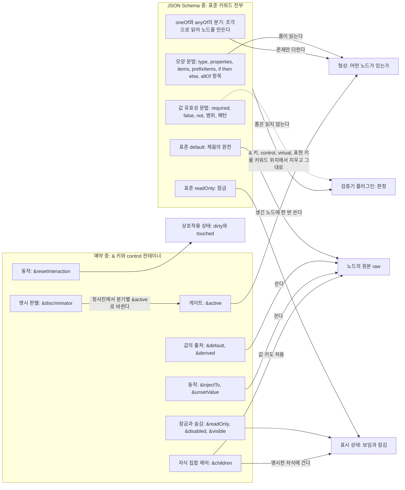
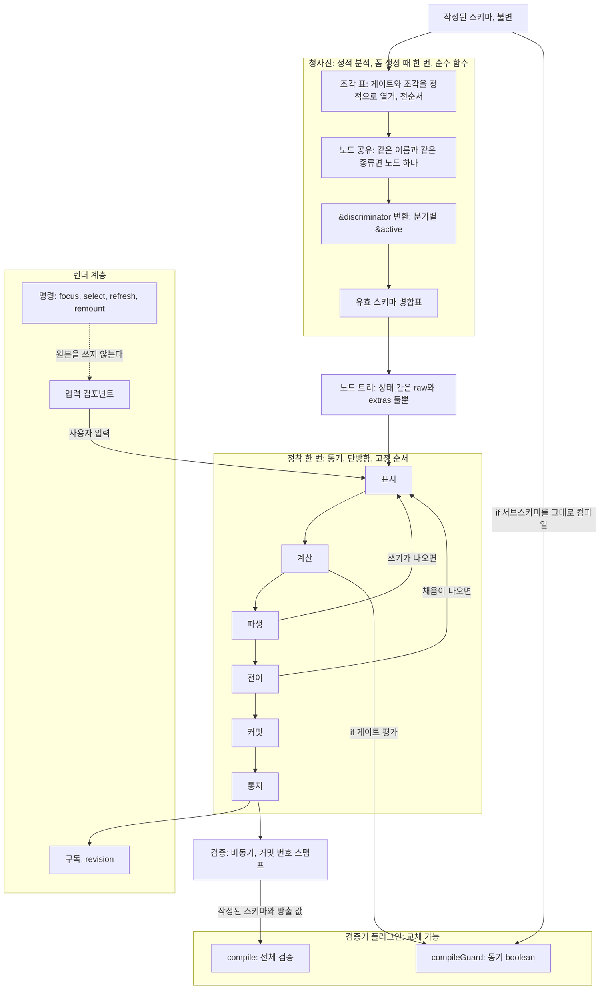
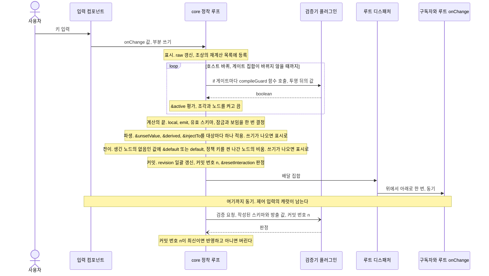

# 목표 구조 개관

상태: 5차(2026-09-23, 10라운드와 소유자의 답 스물셋 뒤)에 맞춰 다시 그린 전체 그림이다. 원리의 권위는 원리 원장 [`03-mental-model.md`](./03-mental-model.md)에 있고, 결론의 전문은 [`07-conclusions.md`](./07-conclusions.md)에, 각 부분의 결정과 상태는 해당 ADR에 있다. 이 문서는 새 결정을 만들지 않으며 부분들이 어떻게 맞물리는지만 보여 준다. 이 문서와 원장이 다르면 원장이 맞다.

한 문장으로 줄이면 다음과 같다. 폼은 JSON Schema에서 노드 트리의 모양만 읽고, 판정은 검증기에 맡기며, 값을 채우고 바꾸고 지우는 일은 사용자와 호출자, 그리고 작성자가 예약 층(`&` 키)에 적은 규칙만 한다.

## 1. 두 층 — JSON Schema 층과 예약 층

스키마의 키는 두 층으로 나뉜다. 두 층은 읽는 주체도, 쓸 수 있는 것도 다르다(원장 §1.4, ADR 0003 §1).



| 층 | 폼이 읽는 것 | 폼이 쓰는 것 | 검증기 |
| --- | --- | --- | --- |
| JSON Schema 층 | 노드 트리의 모양을 정하는 문법뿐이다(P1′). 타입(`type`, 다중 타입, 튜플), 자식의 존재(`properties`, `items`, `prefixItems`), 조건부 존재(`if/then/else`, `allOf` 항목). `oneOf`·`anyOf`의 분기는 조각으로 읽어 노드를 만들 뿐 분기를 고르지 않는다. 표준 `default`는 노드가 생길 때 채움의 원천으로, 표준 `readOnly`는 잠금으로 읽힌다. 값의 유효성 문법(`required`, `false`, `not`, `additionalProperties`, 범위와 패턴)은 읽지 않는다 | 없다. 값을 채우지도 바꾸지도 지우지도 않는다. 조각의 켜짐과 꺼짐은 있는 값을 바꾸거나 지우지 않는다(소유자 4항. 나감의 비움은 정책 키의 쓰기다) | 전부 받는다. 판정은 `validator(작성된 스키마, 방출 값)`이다(ADR 0001) |
| 예약 층 | `&`로 시작하는 제어 키(게이트·잠금·숨김·값 규칙·자식 제어·판별)와 그 객체 표기 `control.*`. 표현식은 JSON Pointer로 다른 노드의 값을 읽는다 | 원본(채움의 `&default`, `&derived`, `&injectTo`, `&unsetValue`(옛 이름 `&clearValue`, 12라운드), 나감 정책 키를 켠 노드의 나감 비움), 형상(`&active` 게이트), 표시 상태(`&visible`, `&readOnly`, `&disabled`), 상호작용 상태(`&resetInteraction`) | 보지 않는다(G2). 검증기에 넘기기 전에 키워드 위치의 `&` 키, `control` 컨테이너, `virtual`, 표현 키 목록을 지운다(규칙 둘, 원장 §1.4). 판정 때문이 아니라 컴파일 때문이다(ADR 0003 §7) |

- **두 철자.** 예약 층의 키는 평면 `&키`와 컨테이너 `control.키`의 두 철자로 쓸 수 있고, 둘은 한 선언이다. 한 노드에 둘 다 있으면 `control`이 이긴다(소유자 9항, ADR 0003 §2). `&키`는 표준 키워드의 표현식 판이다(`default`와 `&default`, `readOnly`와 `&readOnly`).
- **대체 가능성.** JSON Schema 층의 표현은 예약 층으로 옮길 수 있어야 한다(소유자 7항). `if/then/else`의 조각은 조각 객체의 `&active`로, `default`는 `&default`로, `readOnly`는 `&readOnly`로, 분기의 `const`·`enum`은 `&discriminator`로 옮긴다.
- **이름의 품사가 동작을 말한다.** 형용사(`active`, `visible`, `readOnly`, `disabled`)는 참인 동안 유지되는 상태다. 명사(`default`, `derived`)는 값의 출처다. 동사(`unsetValue`, `injectTo`, `resetInteraction`)는 에지에서 한 번 일어나는 동작이다.
- **표현 키**(`FormTypeInput`, `FormTypeInputProps`, `FormTypeRendererProps`, `formType`, `terminal`, `errorMessages`, `options`, `placeholder` 등)는 `&`를 붙이지 않는다. 렌더 계층이 읽고 작업 루프 밖에 있으며 검증기에 넘기기 전 제거 목록에 든다. 오늘 맨 키로 쓰는 `disabled`·`visible`·`active`는 제어 키이므로 `&`로 옮긴다(이주, 원장 §1.4, 소유자 13라운드 답 3).

## 2. 파이프라인



### 2.1 청사진 — 정적 분석 (ADR 0005)

작성된 스키마를 변형하지 않고, 분석 결과를 별도의 구조에 둔다. 폼 생성 때 한 번 도는 순수 함수다.

- **조각 표.** 모든 조각과 그 게이트를 스키마에서 정적으로 열거한다. 조각은 트리이며, 중첩 조각은 감싸는 조각이 켜져 있을 때만 순회한다. 전순서는 감싸는 조각의 순서, 키워드 순위(본체 `properties` < `allOf` 항목 < `if/then/else` < `oneOf`·`anyOf`), 배열 인덱스 순이다(ADR 0002).
- **노드 공유.** 같은 이름과 같은 종류(string, number, boolean, null, object, array)이면 어느 조각에서 선언했든 노드 하나를 공유한다. 켜진 선언이 하나라도 있으면 존재한다. 같은 이름에 다른 종류가 동시에 켜지면 런타임 충돌로 드러내며, 분석 단계에서 미리 throw하지 않는다(ADR 0005 §3).
- **`&discriminator` 변환.** 작성자가 union 호스트에 적었을 때만 각 분기의 그 키 `const`·`enum`을 읽어 분기별 `&active` 게이트로 바꾼다. 분기 스키마는 고치지 않는다. 변환은 여기서 끝나며 상태 칸과 작업 루프를 바꾸지 않는다(ADR 0005 §4).
- **유효 스키마 병합표.** 켜진 조각을 전순서로 합치는 규칙을 준비한다. 적용은 정착의 계산 단계에서 켜진 조각에 대해 한다. 규칙은 아래와 같다(원장 §4, ADR 0005 §5).

| 부류 | 규칙 |
| --- | --- |
| 검증 키워드(`minimum`, `enum`, `required` …) | 연언 문맥에서 교차한다. 게이트 없는 `oneOf`·`anyOf` 분기는 존재만 더하고 제약은 교차하지 않는다 |
| 주석 키워드(`title`, `description`, `format`, `default`·`&default`), `writeOnly`, `$comment`, `examples` | 뒤가 앞을 덮는다. 켜진 조각이 본체를, 전순서에서 나중 조각이 앞 조각을 덮는다 |
| 상태 키(표준 `readOnly`, `&readOnly`·`&disabled`·`&visible`·`&active`, `control.*`) | 그 노드에만 걸린다. 코어에는 글로벌도 조상 상속도 없다. 자손을 거는 길은 부모의 `&children`과 켜진 조각의 `control`뿐이다(5절) |
| 표현 키(`FormTypeInput`, `options` …, 접두 없음) | 뒤가 앞을 덮는다. `options`는 깊은 병합(`@winglet/common-utils`의 `merge`. 배열은 통째 교체, 함수·원시값은 나중 승, 늘 새 객체에)이다 |
| 값과 동작 키(`&derived`, `&injectTo`, `&unsetValue`, `&resetInteraction`) | 병합하지 않는다. 선언마다 규칙 하나이고, 같은 대상은 파생 단계의 같은 대상 규칙이 푼다 |

게이트 없는 분기가 공유 노드에 둔 주석 키워드와 표현 키는 그 노드의 유일한 선언일 때만 쓴다. 조각이 `FormTypeInput`을 더하거나 빼서 터미널 전략이 바뀌는 경로는 미정(07 11.2)이다.

### 2.2 노드 트리 — 상태는 둘뿐 (ADR 0006)

노드 트리가 곧 상태다. 노드가 실제로 소유하는 상태 칸은 원본 `raw`와 `extras`(어디에도 선언되지 않은 키와 받은 순서) **둘뿐**이다. 나머지는 상태에서 계산되거나 작업의 기록이다.

| 칸 | 성격 |
| --- | --- |
| `raw`, `extras` | 상태 |
| `active`(활성 조각과 노드의 집합), `local`(합성 값), `emit`(방출 값), `schema`(유효 스키마), `diagnostics` | 계산 결과 |
| 재계산 목록(상호작용 상태 `dirty`와 다른 것), `revision`, 커밋 번호 | 작업의 기록 |

노드는 형상에 있거나 없다. 조각이 꺼지거나 노드 게이트가 거짓이면 그 노드는 형상에 없고, 원본은 기본으로 남아 `getInactiveValues`로 읽을 수 있으며 방출에서 빠진다(P4). 비활성화는 쓰기가 아니다. 작성자나 호출자(Form 속성)가 나감 정책 키(`unsetOnInactive`, 소유자 13라운드 확정)를 켠 노드만 나갈 때 한 번 원본을 비운다(원장 §3).

### 2.3 정착 — 일곱 단계 (ADR 0007)

쓰기(또는 쓰기의 묶음)마다 한 곳에서 고정된 순서로 돈다. 표시부터 커밋까지는 동기이며 단방향이다. 통지도 동기다(ADR 0008). 비동기는 경계(검증, React, `onChange`)에만 있다.

| 단계 | 하는 일 | 이 단계의 예약 층 키 | 예산 |
| --- | --- | --- | --- |
| 표시 | 쓰기를 받은 노드의 `raw`·`extras`를 갱신하고 조상 경로의 재계산 목록에 등록한다 | `&watch`(의존 경로 선언. 청사진과 표시 단계) | 없음 |
| 계산 | 루트에서 한 번 내려간다. 재계산 목록의 자식을 먼저 완료하고 자기 `local`·`emit`·유효 스키마를 만든다. 호스트는 게이트 없는 조각만 켠 채 출발해 모든 게이트를 전순서로 평가하고, 집합이 바뀌지 않을 때까지 반복한다. 게이트는 검증기가 볼 값(투영 뒤의 값)을 본다. **원본을 읽기만 한다** | `if` 게이트(검증기 플러그인이 컴파일)와 `&active`(노드 게이트, 조각 게이트, 조각 범위 제어와 `&children`의 `active`)를 호스트 바퀴 안에서 함께 평가한다. 계산의 끝, 최종 트리에서 `&visible`·`&readOnly`·`&disabled`·표준 `readOnly`를 한 번 결정한다(글로벌 없음, 13라운드) | 호스트 바퀴 = 게이트 가진 조각 수 + 노드 게이트 수 + 1 |
| 파생 | 완성된 트리에서 규칙을 평가한다. 쓰기가 나오면 표시로 돌아간다 | `&derived`(자기 값 덮기), `&injectTo`(대상에 대한 전체 교체), `&unsetValue`(자기 값을 없음으로) | 라운드 25 |
| 전이 | **생긴 노드**(직전 커밋의 형상에 없고 이번 최종 형상에 있는 노드)의 없음인 값에 채움을 쓴다. 중간 라운드의 채움은 그 노드가 최종 형상에 없으면 버린다. 나감 정책 키를 켠 노드가 **나가면**(직전 커밋의 형상에 있었고 이번 최종 형상에 없으면, 하위 트리 포함, 공유 노드 제외) 한 번 비운다. 로드에는 나감이 없다. 쓰기가 나오면 표시로 돌아간다 | 채움(`&default` > `default` > 없음), 나감의 비움(정책 키) | 라운드 = 게이트 가진 조각 수 + 노드 게이트 수 + 1(호스트 바퀴와 같은 식. 새 라운드는 채움이나 나감의 비움이 게이트를 뒤집어 새 노드를 내거나 노드를 내보낼 때만 생긴다) |
| 커밋 | 계산 결과를 트리에 반영하고, 배달 집합의 `revision`을 한 번에 올리고, 단조 커밋 번호를 매긴다. 원본에는 쓰지 않는다 | `&resetInteraction`(식이 참이 되면 `dirty`·`touched` 초기화) | 없음 |
| 통지 | 루트 디스패처가 문서 순서 위에서 아래로 한 번 배달한다. 유효 스키마가 바뀐 노드도 배달 집합에 든다. 루트 `onChange`는 최외곽 동기 진입당 한 번이다 | 없음 | 리스너 되먹임 파동 25, `onChange` 중첩 25 |
| 검증 | `validator(작성된 스키마, 방출 값)`을 커밋 번호로 스탬프해 비동기로 요청하고, 늦게 온 결과는 버린다 | 없음 | 없음 |

- **같은 대상 규칙(파생 단계).** 라운드마다 원하는 쓰기를 모아 **대상 노드마다 하나만** 적용한다. 순위는 `&unsetValue` > `&derived` > `&injectTo` > 채움이고, 같은 종류끼리는 원천(선언) 노드의 문서 순서에서 나중이 이긴다. 경고는 없다. 진 쓰기는 버리고 그 에지도 소비한다(소유자 답 8·9, 13라운드 답 4, 원장 §4). 소비하지 않으면 다음 라운드에 진 규칙이 이겨 순위가 무의미해진다. 한 규칙은 원천 값의 한 번의 변화에 대해 한 정착 안에서 한 번만 쓴다. 곧 에지는 정착 안에서 한 번만 소비된다(07 4.30).
- **에지의 기준점은 직전 커밋이다.** 런타임에 `&injectTo`는 원천의 방출 값이 직전 커밋과 다를 때, `&derived`는 의존 값이 바뀔 때, `&unsetValue`는 식이 거짓에서 참이 될 때 쓴다. 참에서 거짓으로 돌아갈 때 `&unsetValue`는 아무것도 하지 않는다.
- **로드는 새 수명이다.** 전체 교체(마운트, `setValue(V)`, `reset()`, `defaultValue`)는 기준점을 비운다. 그래서 형상의 모든 노드가 생긴 노드로서 채움을 받고, `&injectTo`는 발화하며(`fire`, 소유자 답 6), `&unsetValue`는 로드된 값으로 평가해 참이면 지운다(소유자 답 21).
- **비수렴.** 예산은 다섯(호스트 바퀴, 파생 라운드, 전이 라운드, 리스너 되먹임 파동, `onChange` 중첩)이고, 상한은 루프를 잇는 고리 하나만 끊는다. 최외곽 쓰기는 결코 버리지 않고, 커밋된 것은 반드시 통지된다(P2, P5). 정착의 세 예산(호스트 바퀴, 파생 라운드, 전이 라운드)을 넘기면 그 정착의 자동 쓰기를 모두 뺀 원본 B를 커밋하고 `diagnostics.status = 'budgetExceeded'`로 알린다. 원본 B의 형상은 원본 B로 한 번 더 계산하며, 그 바퀴도 상한에 걸리면 마지막 바퀴의 활성 집합으로 고정한다. 리스너 되먹임 파동을 넘기면 마지막 파동은 배달하되 그 파동 안의 되먹임 쓰기를 거부한다. `onChange` 중첩을 넘긴 쓰기는 적용하고 통지하되 그 `onChange` 하나는 부르지 않는다. 이것이 "예산 초과 시에도 `onChange`는 불린다"의 유일한 예외다. 개발 모드는 최외곽 진입 끝에서 throw하고, 프로덕션은 신호만 내며 제출을 막지 않는다(소유자 답 1). 루프의 가능성을 막지는 않지만 루프를 권하는 설계도 아니다.
- 원본을 쓰는 단계는 파생과 전이뿐이고, 둘 다 표시로 돌아가 다시 계산된다. 그래서 커밋된 트리는 (스키마, 트리 전체의 `raw`·`extras`)의 순수 함수다(P3).
- `&active` 표현식이 다른 호스트의 값을 읽을 때의 평가 순서와 재순회 규칙은 미정(07 11.2)이다.

### 2.4 검증기 플러그인 (ADR 0004, ADR 0001)

검증기는 내장하지 않고 플러그인으로 받는다. 계약은 둘이다. `compile(schema)`는 전체 검증이며 비동기를 허용한다. `compileGuard(schema)`는 `if` 게이트를 평가하는 동기 boolean 함수다. 둘 다 작성된 스키마를 그대로 받는다. 폼이 파생한 유효 스키마는 폼 전용이며 검증기에 가지 않는다. `compileGuard`의 시그니처, 인스턴스 사이의 공유, `$id`·`$dynamicRef` 문맥, 컴파일 실패 정책은 미정(07 11.2)이다.

### 2.5 렌더 계층 (ADR 0008, ADR 0011)

core는 렌더러를 모른다(P5). 렌더 계층은 노드의 `revision`을 구독해 정착된 상태만 본다. 입력 컴포넌트의 입력은 부분 쓰기로 정착에 들어가며, `onChange(undefined)`는 그 키를 없음으로 만든다. `Refresh`는 공개 쓰기 옵션이 아니며 core가 쓰기의 출처로 판단한다. 그 노드 자신의 입력에서 온 쓰기에는 내지 않으므로 타이핑 중에 리마운트되지 않는다. 명령 `focus`·`select`·`refresh`·`remount`는 공개 API이며 원본을 쓰지 않는다(D-9). React 바인딩은 ADR 0011의 제안이다.

### 2.6 정착 한 번의 순서

사용자가 입력란에 한 글자를 넣었을 때 한 번의 정착이다.



검증 결과를 노드로 나누는 규칙(에러 라우팅, Q12)은 미정(07 11.2)이다. 옛 제안은 판별 노드로 모으는 것이었는데 판별 노드가 사라졌다.

## 3. 조각과 게이트 (ADR 0002)

조건부로 형상을 바꾸는 모든 구문은 "게이트 → 조각" 하나로 환원된다. 조각은 게이트가 켜고 끄는 선언 묶음이다. 게이트가 없는 조각은 늘 켜져 있다.

| 구문 | 게이트 | 조각 | 문맥 |
| --- | --- | --- | --- |
| 최상위, `allOf` 항목, 분기 안의 `if/then/else` | `if`. 검증기 플러그인의 `compileGuard`가 평가한다. 폼은 `if`의 내용에 관여하지 않는다 | `then` / `else` | 연언(분기 안이면 그 분기의 문맥) |
| 게이트 없는 `properties`, `allOf` 항목 | 항상 참 | 블록 전체 | 연언 |
| `&active`를 가진 조각 객체 | `&active`(예약 층 표현식) | 그 조각이 선언한 노드 집합 | 연언 |
| 게이트 없는 `oneOf`·`anyOf` 분기 | 항상 참(존재만) | 분기 전체 | 선언. 제약은 교차하지 않는다 |

"연언"은 모든 조각의 제약이 함께 적용되는 "그리고" 문맥이고, "선언"은 분기 가운데 하나만 맞으면 되는 "또는" 문맥이다.

- **`&active` 게이트는 한 장치의 두 범위다.** 노드 스키마에 쓰면 노드 게이트, 조각 객체에 쓰면 조각 게이트다. 둘 다 거짓이면 형상에서 빠지고 원본은 기본으로 남는다(나감 정책 키를 켜면 나갈 때 비운다). 거짓에서 참이 되면 노드가 생기므로 그때 없음이면 채운다. `&visible`의 전환은 생성이 아니다(07 4.24).
- **폼은 분기를 고르지 않는다.** 분기를 고르는 상태도, API도, UI도 없다. 분기의 필드는 노드가 되고, 어느 분기가 맞는지는 검증기만 판정한다. 분기의 형상을 좁히는 것은 게이트뿐이다. 분기 안의 `if`, 조각 객체의 `&active`, `&discriminator`의 변환이 그것이며, 셋 다 없으면 작성자가 `&`로 제어할 책임을 진다(소유자 읽기 1). 사용자가 분기를 고르게 하려면 작성자가 판별 프로퍼티를 본체 `properties`에 선언하고, 분기가 그 값을 게이트로 읽게 한다. 사용자의 선택은 그 프로퍼티에 대한 보통의 입력이다.
- **`&discriminator`는 유일한 예외다.** 작성자가 union 호스트에 `'&discriminator': 'kind'`를 적으면 청사진이 각 분기의 `kind`의 `const`·`enum`을 읽어 분기를 `&active: "../kind === <값>"`을 가진 조각 객체처럼 다룬다. 변환된 분기는 위 표의 3행(연언)이 된다. 적지 않은 union의 `const`·`enum`은 읽지 않는다. 분기에 그 키의 `const`·`enum`이 없을 때, `$ref`·`allOf` 평탄화, 분기가 자기 `&active`도 가질 때의 세부는 미정(07 11.2, ADR 0005 §4)이다.
- **분기 컨벤션.** `oneOf`·`anyOf`의 분기에 `if`를 쓸 때는 `else: false`와 `if`의 `required: [조건 프로퍼티]`가 함께 필요하다. `else: false`가 없으면 `if`가 거짓인 분기가 공허하게 통과해 분기로 세어진다(ajv 8.17.1 실측, 07 7.1). `required`가 없으면 빈 값에서 모든 `if`가 참이 되어 폼이 모든 분기의 `then`을 켠다. 이것은 검증기의 뜻이지 폼이 검사하는 규칙이 아니다. 컨벤션 문서는 ADR 0010(초안)이다.
- **금지 문법은 읽지 않는다.** `properties: { x: false }`, `not: { required: [...] }`, `else: false`는 아무 노드도 선언하지 않는다(D-3). 숨기려는 작성자는 `&active`를 쓴다.
- **게이트 가진 분기.** `oneOf`·`anyOf`의 분기가 `&active`를 갖거나(`&discriminator`로 변환된 분기 포함), 분기에 `else: false`인 `if`가 있어(키 유무로 판정, 형제 키가 있어도 같다) `if`가 분기 전체를 켜고 끄는 경우다(원장 §4).
- **개발 모드 경고.** 원장 §5의 분류표를 따른다. 청사진 경고는 다섯이다: `oneOf`·`anyOf` 분기에 `if`는 있고 `else: false`가 없음(소유자 확인); 같은 이름·다른 종류의 선언이 동시에 활성될 수 있음(노드 공유 충돌); 터미널의 빈 자식; `null` 분기·중첩 합성·`allOf` 키워드 무시; 리프가 아닌 노드의 표준 `readOnly`(효과 없음). 정착 경고는 하나다: 같은 `oneOf`에서 게이트 가진 분기가 둘 이상 켜짐(소유자 답 20). 같은 대상에 규칙이 둘 와도 경고하지 않고 순위와 문서 순서로 푼다(소유자 13라운드 답 4). 공집합 `enum`은 청사진 오류(throw)이고, 검증기 플러그인 미등록은 검증기 오류다. 경고는 개발 모드 로그이며, 프로덕션은 노드 공유 충돌의 폼 수준 경고 하나만 낸다(원장 §5). 모두 게이트 결과, 키의 유무, 선언의 `type`, 등록 상태만 보며 `if`의 내용은 읽지 않는다. `if`에 `required`가 없음과 조건 프로퍼티가 `properties`에 선언되었는지(소유자 2항)는 검사하지 않는다(소유자 답 19·23). 잘못된 스키마의 책임은 작성자에게 있고 폼은 고지할 의무만 진다.

예시. 판별 프로퍼티 `kind`는 본체에, 분기는 컨벤션대로, 조각 객체 하나는 `&active` 게이트를 가진다.

```json
{
  "type": "object",
  "properties": {
    "kind": { "type": "string", "enum": ["card", "bank"] }
  },
  "oneOf": [
    {
      "if": { "properties": { "kind": { "const": "card" } }, "required": ["kind"] },
      "then": { "properties": { "cardNumber": { "type": "string" } }, "required": ["cardNumber"] },
      "else": false
    },
    {
      "if": { "properties": { "kind": { "const": "bank" } }, "required": ["kind"] },
      "then": { "properties": { "account": { "type": "string" } }, "required": ["account"] },
      "else": false
    }
  ],
  "allOf": [
    { "&active": "../kind === 'bank'", "properties": { "bankCode": { "type": "string" } } }
  ]
}
```

- 값 `{}`에서는 두 분기의 `if`가 `required` 때문에 거짓이므로 `cardNumber`와 `account`는 형상에 없다. `allOf` 조각의 `&active`도 거짓이라 `bankCode`도 없다. 검증기는 두 분기가 모두 `else: false`에 걸리므로 이 값을 기각한다. 그것은 검증기의 판정이다.
- 사용자가 `kind`에 `card`를 넣으면 첫 분기의 `then`이 켜져 `cardNumber` 노드가 생기고, 없음이면 채움을 받는다.
- `bank`로 바꾸면 `cardNumber`는 형상에서 빠진다. 원본은 기본으로 남아 `getInactiveValues`로 읽을 수 있고 방출에서 빠진다. `account`와 `bankCode`가 생긴다.
- 같은 스키마를 생성기가 만든 `const` 태그 union으로 받으려면 분기에 `if`를 쓰는 대신 호스트에 `"&discriminator": "kind"`를 적는다.

## 4. 값 조작 표 (07 4.28)

없는 값 채우기, 있는 값 바꾸기, 있는 값 지우기가 로드, 노드 생성, 런타임의 세 시점에서 모두 가능하다(소유자 읽기 2). 예약 층의 키 넷(`&default`, `&derived`, `&injectTo`, `&unsetValue`)과 `&active`, 그리고 나감 정책 키(선택)가 빈 칸 없이 덮는다.

| 조작과 주체 | 로드(마운트, 전체 교체, `reset`) | 노드 생성(조각이나 노드 게이트가 켜짐) | 런타임 |
| --- | --- | --- | --- |
| 채움 · 호출자 | `setValue(V)`, `defaultValue` | 해당 없음 | `setValue(V, Merge)`의 새 키 |
| 채움 · 사용자 | 해당 없음 | 입력으로 조각을 켜는 간접 유발 | 빈 입력란에 처음 값 입력 |
| 채움 · 예약 층 | `&default` > `default`, 없음인 키에 한 번 | 같음(노드 단위) | 없음. 다시 채우지 않는다 |
| 변경 · 호출자 | `setValue(V, Overwrite)` | 해당 없음 | `setValue(V, Merge)` |
| 변경 · 사용자 | 해당 없음 | 해당 없음 | 입력란 편집 |
| 변경 · 예약 층 | `&derived`, `&injectTo`(로드에서 발화) | 의존 값 변화에 따른 `&derived`·`&injectTo` | `&derived`(자기), `&injectTo`(남) |
| 제거 · 호출자 | `setValue(V)`에서 V에 없는 키, `setValue(null)` | 해당 없음 | `Merge`로 키에 `undefined`를 씀(`extras` 포함) |
| 제거 · 사용자 | 해당 없음 | 해당 없음 | 입력란 비우기(`onChange(undefined)`) |
| 제거 · 예약 층 | `&unsetValue`(로드된 값으로 평가), `&active: false`(방출 제외). 로드에는 나감이 없다 | 같음 | `&unsetValue`(에지), `&active: false`(방출 제외), 정책 키를 켠 노드의 나감 비움(원본에서) |

- 런타임에 "없음일 때만 채우는" 별도의 예약 키는 두지 않는다(소유자 답 11). 채움은 노드가 생길 때 한 번이고, 값이 빠질 때마다 채우지 않으므로 `&unsetValue`로 지운 값은 다시 채워지지 않는다.
- 호출이 일으킨 예약 층의 자동 쓰기 전부(채움, `&derived`, `&injectTo`, `&unsetValue`, 나감의 비움. 로드에는 나감이 없다)는 `SetValueOption.DisableAutomaticWrites`로 끈다. 로드 값 자체는 막지 않는다. 억제 비트는 그 호출이 일으킨 자동 쓰기에 적용되므로, `Merge`에 주면 `Merge`가 통째로 준 배열의 아이템 채움도 막는다(원장 §3). `&active`의 방출 제외는 쓰기가 아니라 투영이므로 범위 밖이고, 정책 키를 켠 노드의 나감 비움은 범위 안이다.
- "없음"과 `''`·`null`은 다르다. `null`은 키 없는 전체 교체다(D-1).
- 배열 아이템의 생김과 채움(통째 쓰기의 재생성과 재조정, `push`가 로드인가, `contains`·`prefixItems`)은 미정(07 11.2)이다. `push`로 생긴 아이템이 생긴 노드로서 채움을 받는 것까지는 정해졌다.

## 5. 상태 키는 그 노드에만 (ADR 0003 §5, 원장 §4)

상태 키(표준 `readOnly`, `&readOnly`·`&disabled`·`&visible`·`&active`, `control.*`)의 규칙이다. 코어에는 로컬만 있다(소유자 13라운드 답 1).

- **코어에 글로벌은 없다.** 루트 스키마의 키는 루트 노드의 로컬 키다. 오늘 루트 키 다섯(`readOnly`·`disabled`·`active`·`visible`·`pristine`)의 특수 처리는 사라진다(이주).
- **로컬**은 노드 자신의 키, `&` 식, `control.*`이다.
- **전체 잠금은 렌더 계층의 일이다.** Form 속성 `readOnly`·`disabled`는 렌더 계층이 참일 때만 거는 전체 잠금이며 코어의 상태가 아니다(P5, 12라운드 답 1, 13라운드 답 1). 소유자: "이건 검증의 영역이 아니라 react의 표현 영역."
- **조상 상속은 없다.** 루트든 중간이든 객체 노드의 잠금은 자손에 내려가지 않는다. 리프가 아닌 노드의 잠금은 입력이 없으므로 효과가 없고 청사진 경고 대상이다. `active`·`visible`은 구조상 하위 트리를 가린다(소유자 답 13, 13라운드 답 1, 원장 §4).
- **자손을 거는 길은 둘뿐이다.** 부모의 `&children`과 켜진 조각의 `control`이다. 둘 다 상속이 아니라 명시한 대상에 거는 제어다. 조각 객체에 둔 제어 키는 그 조각이 켜져 있는 동안 그 조각이 선언한 노드 전부에 걸린다. `&children`은 부모가 이름으로 가리킨 직계 자식에 건다. 형태는 `'&children': [{ targets: ['name', 'email'], control: { readOnly: '../locked', unsetValue: '...' } }]`이며, `control`에는 상태 키뿐 아니라 값 키(`unsetValue`, `default`, `resetInteraction`)도 둔다(소유자 답 14·15).
- **로컬 층 안의 결합.** 표준 `readOnly`, `&readOnly`·`control.readOnly`, 켜진 조각의 범위 제어, 부모의 `&children` 항목이 한 노드에 겹치면 잠금(`readOnly`·`disabled`)은 하나라도 참이면 잠기고, 표시(`active`·`visible`)는 모두 참이어야 켜진다. 편집자 판정이며 소유자 확인을 기다린다(원장 §4·§7). Form 속성의 전체 잠금은 렌더 계층이 이 결과 위에 OR한다.
- `&children`의 대상별 식과 값 키의 세부, 조각에서만 선언된 자식을 `targets`로 가리킬 수 있는지, 나감 정책 키의 이름, 조각의 `control`에 둔 식 규칙(`unsetValue`·`derived`·`resetInteraction`)이 나감 에지에서 발화하는 세부는 미정(원장 §6)이다. 분기나 조각이 꺼질 때의 값 정책은 닫혔다. 기본은 유지(방출에서만 빠짐)이고, 비움은 나감 정책 키로 켠다(13라운드 답 2).

## 6. 공개 표면 요약

| 자리 | 이름 | 뜻 | 주인 |
| --- | --- | --- | --- |
| 쓰기 옵션 | `SetValueOption` 비트마스크: `Overwrite`(기본), `Merge`, `DisableAutomaticWrites`, `EnableAutomaticWrites` | 쓰기의 종류는 호출자가 선언하고 core는 추론하지 않는다(D-4). `Overwrite`는 전체 교체(로드), `Merge`는 준 키만 쓰는 부분 쓰기이며 준 배열은 통째 교체다. 억제 비트는 그 호출이 일으킨 자동 쓰기에 적용되므로 `Merge`에 주면 통째 교체된 배열 아이템의 채움도 막는다. 억제 비트가 둘인 이유는 상속, 끄기, 켜기의 세 상태 때문이다. 호출에 둘 다 없으면 Form 속성 `disableAutomaticWrites`를 따르고, 둘 다 주면 억제가 이긴다 | ADR 0007 §3, ADR 0013 |
| 쓰기 | `setValue(value 또는 updater, option?)`, `reset(option?)`, 배열 `push`·`remove`·`update` | 같은 비트가 `reset`과 마운트(`defaultValue`)에도 든다. `setSelectedBranch`는 없다 | ADR 0007 §3 |
| 값 읽기 | `value` | 합성 값(`local`) | ADR 0006 |
| | `outputValue` | 방출 값(`emit`), 옛 `normalizedValue`. `FormHandle.getValue()`는 루트의 `outputValue`와 같다 | ADR 0006 |
| | `getInactiveValues(path)` | 형상에 없는 노드의 원본을 읽기 전용으로 열거한다 | ADR 0006 |
| 진단 | 노드 칸 `diagnostics` | 이번 정착의 결과 상태. `{ status: 'stable' 또는 'budgetExceeded', exceededBudget?, iterations }`. `iterations`는 초과한 예산이 쓴 반복 횟수(상한값)다. 루트에서 관측한다 | ADR 0008 §8 |
| | 이벤트 `UpdateDiagnostics` | `diagnostics`가 바뀐 커밋에만 낸다 | ADR 0008 §8 |
| | Form 속성 `onDiagnosticsChange` | 호스트가 제출 차단 같은 대응을 거는 자리. core는 제출을 막지 않는다 | ADR 0008 §3 |
| 배치 | `batch(fn)` | fn 안의 쓰기를 표시만 하고 끝에서 정착 한 번, 통지 한 번을 낸다. 중첩은 가장 바깥이 이긴다. 정착 횟수가 바뀌므로 채움과 `&injectTo`의 결과가 순차 호출과 다를 수 있다 | ADR 0008 §3 |
| 경로 조회 | `find(path)`, `findNodes(path)` | 터미널 노드 아래의 경로는 둘 다 노드 없음으로 답한다. 공개 API가 객체를 조용히 파괴하면 안 되기 때문이다(07 4.29) | ADR 0006 §4 |
| 명령 | `focus`, `select`, `refresh`, `remount` | 렌더러와 무관한 표현 계층의 어휘이며 원본을 쓰지 않는다(D-9) | ADR 0008 |

유효 스키마가 바뀐 노드는 통지의 배달 집합에 들지만, 그 이벤트 타입과 payload와 구독 표면은 미정(07 11.2)이다. `control` 컨테이너의 타입 표면(`watch`·`children`·`default`·`unsetValue`가 `control` 안에 드는지, `computed` 철자를 별칭으로 남기는지)도 미정(07 11.2)이다.

## 7. 3차안에서 달라진 것

이 문서의 이전 판은 3차안의 그림이었다. 5차까지 달라진 것은 다음과 같다.

| 3차안 | 5차 | 근거 |
| --- | --- | --- |
| 세 층(L0 유효성, L1 형상, L2 표현)이며, L1에 "비판별 분기의 수동 선택"이 폼 상태로 있었다 | 두 층(JSON Schema 층, 예약 층). 폼은 분기를 고르지 않는다 | 원장 §1.4, 07 4.25 |
| 상태 칸에 `selection`(수동 분기 선택)이 있었고, 판별식 식별과 분기 선택 API(`setSelectedBranch`), 초기 분기 추론이 있었다 | 모두 지워졌다. 상태 칸은 `raw`와 `extras` 둘뿐이다. 오늘의 `oneOfIndex`·`anyOfIndices`도 대체물 없이 사라진다 | 07 4.25, 07 6.2의 N2 |
| 판별식은 `const`·`enum`으로 식별했다 | 작성자가 명시한 `&discriminator`만 청사진에서 분기별 `&active`로 바꾼다 | ADR 0005 §4 |
| 로드 계약과 전이 주입이 따로 있었다(조각이 켜질 때 조각 단위로 채움) | 채움은 노드 생성 사건이다. 노드가 생길 때 한 번, 노드 단위, 최종 형상 기준이며 원천은 `&default` > `default` | 07 4.22 |
| 계산이 begin 하향과 complete 상향의 두 패스였고, 표시·계산·커밋의 세 단계였다 | 계산은 루트에서 한 번 내려가며, 파생과 전이가 별도 단계다. 정착은 일곱 단계다 | ADR 0007 §1 |
| 상한을 넘기면 형상만 고정했다 | 정착의 세 예산(호스트 바퀴, 파생, 전이)을 넘기면 자동 쓰기를 모두 뺀 원본 B를 커밋하고 `diagnostics.status = 'budgetExceeded'`로 알린다. 리스너 되먹임 파동과 `onChange` 중첩은 그 고리 하나만 끊는다. 개발 모드는 throw, 프로덕션은 신호만 | ADR 0007 §1, 원장 §4, 소유자 답 1 |
| 파생의 자동 쓰기는 `&derived`와 `&injectTo`였다 | `&unsetValue`가 더해졌고, 같은 대상 규칙(순위 `&unsetValue` > `&derived` > `&injectTo` > 채움)과 정착 안의 에지 소비가 생겼다 | 07 4.23, 4.30 |
| 루트의 메모가 커밋된 스냅숏이고 각 노드의 메모가 그 부분과 같은 참조였다 | 노드의 메모는 스냅숏과 같은 참조가 아니다(S9). 검증 결과는 커밋 번호에 묶인다 | 이전 판의 주의 문구, ADR 0008 §4 |
| `computed` 컨테이너 | `control`로 이름을 바꿔 평면 `&키`와 함께 둔다. 둘 다 있으면 `control`이 이긴다 | 07 6.1 |
| `&if`(분기의 조건) | `&active`로 흡수된다. 노드 스키마에 쓰면 노드 게이트, 조각 객체에 쓰면 조각 게이트다 | 07 6.1, ADR 0003 |
| `&pristine` | `&resetInteraction`으로 이름이 바뀐다 | 07 5.0의 5 |
| 없음 | `&unsetValue`(에지에서 값 지우기), `&default`(채움의 표현식 원천), `&children`(자식 집합 제어), `&discriminator`(명시 판별)를 새로 둔다 | 07 6.1 |
| 쓰기 옵션은 미결(10비트 `SetValueOption`) | 비트마스크 넷: `Overwrite`, `Merge`, `DisableAutomaticWrites`, `EnableAutomaticWrites` | 07 6.1, 6.2의 N1 |
| 상태 키의 층 사이 규칙이 없었다 | 코어에 글로벌 없음. 상태 키는 그 노드에만, 조상 상속 없음. 전체 잠금은 Form 속성(렌더 계층) | 원장 §4, 13라운드 답 1 |
| 유효 스키마의 병합 규칙이 미결이었다 | 병합표로 정해졌다 | 07 4.27 |

## 8. 현재 구조와의 대응

`01-current-structure.md`의 관찰이 목표 구조에서 어떻게 되는가다.

| 현재(관찰) | 목표 |
| --- | --- |
| D1 스키마를 변형해 마커를 심는다 | 작성된 스키마는 불변이다. 분석 결과는 청사진에 둔다 |
| D2 모든 분기 자식을 사전 생성한다 | 유지한다. 조각은 스키마에서 정적으로 열거된다 |
| D4 값을 레벨마다 사본으로 든다 | 상태는 `raw`와 `extras` 둘뿐이고 위쪽은 계산된 메모다 |
| D5 값 전파와 알림 전파가 다른 그래프다 | 값은 정착 루프가, 알림은 루트 디스패처가 맡는다. 역할이 겹치지 않는다 |
| D6 10비트 `SetValueOption`을 다섯 곳에서 각자 해석한다 | 비트 넷. `Refresh`는 공개 옵션이 아니며 core가 쓰기의 출처로 판단한다 |
| D7 루트 단독 검증과 enhancer | 루트 단독 검증은 유지하고 enhancer는 없앤다. 판정은 커밋 번호에 묶인다 |
| D8 composition은 값 필터와 숨은 마커다 | 조각의 활성 집합이다. 꺼진 조각은 방출에서 빠지고 원본은 기본으로 남는다(비움은 나감 정책 키). 마커는 없다 |
| D9 `type` 유무로 필드와 판별식을 구분한다 | 폼은 판별식을 식별하지 않는다. 작성자가 명시한 `&discriminator`만 변환한다 |
| D10 `new Function` 표현식 | 예약 층의 표현식으로 남는다. `if` 게이트는 검증기 플러그인이 평가한다 |
| 조건부 장치 일곱, 평가기 넷 | 게이트 둘(`if`, `&active`)과 조각 하나. `&discriminator`는 청사진의 변환이다 |
| `oneOf`와 `active`가 서로 다른 라이프사이클을 탄다 | `if/then/else`, 분기의 게이트, `&active`(노드와 조각)가 같은 호스트 바퀴를 탄다 |

## 9. 검증 전략

기존 테스트는 동작이 달라져 회귀 오라클로 쓸 수 없다. 새 불변식이 오라클이 된다.

1. **차등 테스트.** 임의의 (스키마, 상호작용 시퀀스)에 대해 `form.validate()`의 판정이 독립 검증기(작성된 스키마, `FormHandle.getValue()`)의 판정과 같아야 한다. 이슈 #342 §2의 표가 시드다. 독립 검증기는 폼이 쓰는 플러그인과 **다른 구현**이어야 하고, 값은 JSON으로 직렬화한 뒤에 넣는다. 같은 플러그인에 같은 메모리 값을 넣으면 동어반복이다(`reviews/round-1.md` §7-8).
2. **청사진 테이블 테스트.** 스키마에서 청사진으로 가는 것은 순수 함수다. 조각 열거, 중첩, 노드 공유, `&discriminator` 변환을 표로 단언한다.
3. **정착 루프 테스트.** 쓰기에서 커밋된 상태까지 동기이므로 타이머 flush 없이 단언한다.
4. **`renderForm` 시나리오.** 하니스(`src/__tests__/renderForm.tsx`)는 API 수준이라 재사용한다. 기존 시나리오의 기대값은 버리고 상황 목록(null 분기 위치, 배열 제거와 추가, 활성 0→1→0, 복수 활성, 배열 항목 재인덱싱)은 자산으로 옮긴다. 최종 스펙 동작은 렌더 시나리오로 단언한다는 패키지 규칙은 그대로다.
5. **성능.** 기존 구현의 기준선(패키지 벤치와 `benchmark-form`의 scale 벤치)이 있다. 수치 예산은 ADR 0009의 미결이며 소유자 정책이다.

이슈 #342 §4의 교훈도 옮긴다. 숨은 키 누출 검사를 `JSON.stringify(...).not.toContain(KEY)`로 하면 제어 문자가 이스케이프되어 절대 실패하지 않는다. 목표 구조에는 숨은 키가 없으므로 이 검사 자체가 필요 없어지지만, "절대 실패하지 않는 단언"을 경계하는 원칙은 남긴다.

## 10. 어디에 무엇이 있는가

| 부분 | 주인 |
| --- | --- |
| 원리, 두 층, 상태, 쓰기, 계산의 질서 | [`03-mental-model.md`](./03-mental-model.md) |
| 용어, 도출로 닫힌 결정, 소유자의 답, 이름 | [`07-conclusions.md`](./07-conclusions.md) §1, §4, §5.0, §6 |
| 검증기 입력 불변 | [ADR 0001](./adr/0001-validator-input-invariant.md) |
| 게이트와 조각, 노드 게이트, 분기를 고르지 않음, `&discriminator` 예외, 분기 컨벤션 | [ADR 0002](./adr/0002-guard-fragment-model.md) |
| 예약 층의 키 목록과 단계, 두 철자, 접두 규칙(제어 키만 `&`), 상태 키는 그 노드에만, 검증기에 넘기기 전의 제거 | [ADR 0003](./adr/0003-ampersand-namespace.md) |
| 검증기 플러그인과 `compileGuard` | [ADR 0004](./adr/0004-validator-plugin-compile-guard.md) |
| 청사진, 노드 공유, `&discriminator` 변환, 병합표 | [ADR 0005](./adr/0005-blueprint-analysis-and-node-sharing.md) |
| 값의 소유, 상태 둘, 값 읽기, `find`·`findNodes` | [ADR 0006](./adr/0006-single-value-ownership.md) |
| 정착 일곱 단계, 같은 대상 규칙, 채움, `SetValueOption`, 예산 | [ADR 0007](./adr/0007-settle-cycle.md) |
| 통지, `batch`, 루트 `onChange`, `diagnostics` | [ADR 0008](./adr/0008-event-system.md) |
| 성능 예산 | [ADR 0009](./adr/0009-performance-budget-and-benchmarks.md) (수치 미결) |
| `oneOf`·`anyOf`의 폼 UX와 분기 컨벤션 문서 | ADR 0010 (초안) |
| 노드의 종류와 branch 구성, React 바인딩 | [ADR 0011](./adr/0011-branch-node-composition.md) (제안) |
| FE 오버레이의 입구를 두지 않음 | [ADR 0012](./adr/0012-fe-overlay.md) |
| core는 값을 고치지 않음, 자동 쓰기 넷과 억제 | [ADR 0013](./adr/0013-core-does-not-rewrite-values.md) |
| 아직 설계가 없는 것 | `07-conclusions.md` §11.2, 원장 §6 |

구현 슬라이스의 순서(07 11.4)는 다음과 같다. 각 슬라이스가 기다리는 설계 항목은 07 11.2에 있다.

| 순서 | 슬라이스 | 주로 닿는 ADR |
| --- | --- | --- |
| 0 | 문서 통합(원리 원장, ADR 5차), 기준선 벤치, 생성기 스키마 corpus 재실행 | 전부 |
| 1 | 청사진 분석(순수 함수): 조각 표, 노드 공유, 검증 키워드 교차. 주석 병합은 교체할 수 있는 표 | 0002, 0005 |
| 2 | 객체 노드 트리와 정착 루프: 표시, 계산, 전이, 커밋, 술어 인터페이스 뒤의 가드 스텁, 노드 게이트, 투영, 노드 생성 채움 | 0006, 0007 |
| 3 | 파생 단계: `&derived`·`&injectTo`·`&unsetValue`, 같은 대상 해소, `DisableAutomaticWrites` | 0007, 0013 |
| 4 | 통지, 커밋 번호 스탬프 검증, ajv8 `compileGuard` 플러그인, 에러 라우팅 | 0004, 0008 |
| 5 | 배열 아이템 호스트, `push`, 통째 쓰기의 identity와 채움 | 0006, 0007 |
| 6 | 상태 키와 제어: 결합 규칙, `&children`, 조각 범위 제어, `control` 별칭 | 0003, 0005 |
| 7 | React 바인딩, 참조 그룹, 렌더 테스트 이주, UI 플러그인 | 0011 |
| 8 | ADR 0010, 이주 안내, 릴리스 노트 | 0010 |
