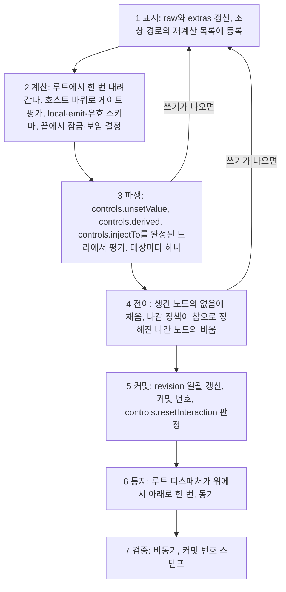
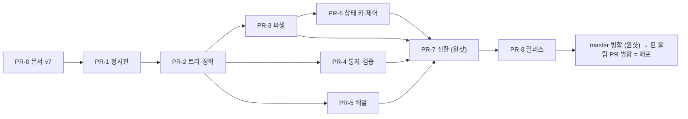

# 설계서 A부터 Z까지 — 소유자 최종 검토용

상태: **14라운드(2026-09-24), 15·16·17라운드 반영.** 17라운드(2026-09-25)는 소유자 질문 R17-1·R17-2·R17-3과 통보 넷의 답(`reviews/round-17-owner-answers.md`), 오류 채널(4번, 안 B)과 노드 구조의 수렴까지 반영했으며, 17라운드의 소유자 질문은 모두 답을 받았다. 소유자 정책이나 소유자 확인이 걸린 남은 항목(성능 예산 수치, 명령 publish의 공개 C-11, `trim` 쓰기의 부수 효과 확인)은 18라운드 안건에 있다. 개발 전에 정련할 것은 18라운드 안건(`reviews/round-18-agenda.md`)이다. 이 문서는 새 결정을 만들지 않는다. 원리 원장 [`03-mental-model.md`](./03-mental-model.md), 결정 기록 `adr/`, 목표 구조 [`02-target-overview.md`](./02-target-overview.md), 결론 [`07-conclusions.md`](./07-conclusions.md)에 흩어진 결론을 **처음부터 끝까지 한 번에 읽히도록** 다시 쓴 것이다. 이 문서와 원장이 다르면 원장이 맞다. 소유자가 이 문서를 절 단위로 통과시키면 개발 단계로 들어간다. 14라운드 검증(다섯 가치에 비춘 스웜 검증)의 판정은 §16과 [`reviews/round-14-values-check.md`](./reviews/round-14-values-check.md)에 있다.

## 0. 읽는 법

- **절 단위로 통과 또는 반려한다.** 이해되지 않는 절은 그 절만 반려하면 된다. §16(검증 결과)과 §17(개발 단계)은 판정 대상이 아니라 보고와 제안이다.
- **약어는 쓰지 않는다.** 원리 `P1`–`P5`, 목표 `G1`–`G8`, 소유자의 축 열 항목은 처음 나올 때 풀어 쓴다. 근거는 괄호 안에 "원장 §n", "ADR 00nn", "07 n.n"으로 적는다.
- **용어.**

| 용어 | 뜻 |
| --- | --- |
| 작성자 | 스키마를 쓰는 사람. 그룹 객체 셋과 표준 키워드를 적는다 |
| 호출자 | `<Form>`이나 core를 쓰는 코드. `setValue`·`reset`·Form 속성을 준다 |
| 사용자 | 입력란에 값을 넣는 사람 |
| 원본(`raw`) | 노드가 실제로 소유하는 값. 리프와 터미널 노드만 든다 |
| 형상 | 어떤 노드가 지금 존재하는가. (스키마, 원본 전체)의 순수 함수 |
| 조각 | 게이트가 켜고 끄는 선언 묶음(`then`·`else`, `allOf` 항목, `oneOf`·`anyOf`의 분기) |
| 게이트 | 조각이나 노드를 켜는 조건. `if`(검증기가 판정)와 `controls.active`(작성자의 식) 둘뿐 |
| 정착 | 쓰기 하나(또는 묶음)가 커밋된 상태에 이르는 동기 절차. 일곱 단계 |
| 자동 쓰기 | 작성자의 규칙이 원본에 쓰는 것. 채움, `controls.derived`, `controls.injectTo`, `controls.unsetValue`, 나감의 비움의 다섯 |
| 방출 값 | 원본과 형상의 투영. 검증기와 `onChange`가 보는 값 |
| 노드가 생김 / 나감 | 직전 커밋의 형상에 없다가 이번 최종 형상에 있음 / 그 반대 |

## 1. 무엇을 만드는가 — 한 문장과 다섯 가치

> 표준 JSON Schema를 **그대로** 받아, 표준 검증기와 **같은 판정**을 내리면서, 큰 폼을 **변경에 비례하는 비용**으로 움직이는, **한 장으로 설명되는** 폼 엔진(00-goals).

소유자가 14라운드에 핵심 가치 다섯을 이름 붙였다. 목표(`00-goals.md`의 G1–G8)와 원리(원장 §1의 P1–P5)가 어느 가치를 받치는지 적는다.

| 가치 | 뜻 | 받치는 목표·원리 |
| --- | --- | --- |
| 일관성 | 같은 개념은 어디서나 같은 이름·같은 규칙·같은 우선순위다. 하나의 개념에는 하나의 장치 | G4(하나의 개념에 하나의 장치), G2(층의 분리), P3(형상은 순수 함수) |
| 투명성 | 작성자와 호출자가 "왜 이 값이 이렇게 됐는가"를 문서와 런타임에서 알 수 있다 | C2(작성자 실수의 가시성), P2(원본을 쓰는 주체는 셋뿐), 오류·경고 분류표(§11) |
| 예측가능성 | 같은 스키마·같은 입력이면 문서만으로 결과를 미리 말할 수 있다 | G5(한 장으로 설명되는 라이프사이클), G1(판정의 동치), P1(판정은 검증기의 것) |
| 고속성 | 입력 한 번에 드는 일이 작고 상한이 있으며 스키마 크기에 비례 이상으로 커지지 않는다. 필요한 것만 만들고(최소 생성), 같은 일을 되풀이해도 메모리가 자라지 않으며(메모리 안정), 한 번 만든 것은 캐시해 다시 만들지 않는다(캐싱을 통한 속도, 재생성 방지). 목적은 모바일에서도 돌아가는 안정성과 경제성이다(16라운드 답 10) | G6(비용은 변경에 비례), G7(반응의 척추 보존), 예산 다섯(§7), 가드·사본 캐시(§11.1), 유효 스키마 메모(§4) |
| 표현자유도 | 실제 폼 요구를 스키마와 `controls`의 명령으로 적을 수 있고 표준 JSON Schema 표현을 잃지 않는다 | G2, G8(보편 관행), 축 6·7항(`controls`는 값을 제어하는 층, JSON Schema 표현은 `controls`로 대체 가능), P4(방출은 정책) |

가치끼리 부딪히는 자리에서 설계가 고른 쪽은 §16.2에 모아 적었다.

## 2. 원리 다섯과 소유자의 축

### 2.1 원리(원장 §1.1)

| 원리 | 한 문장 |
| --- | --- |
| P1 판정은 검증기의 것이다 | 폼은 스키마의 뜻을 해석하지 않는다. 판정 = `validator(작성된 스키마, 방출 값)`. 폼이 읽는 것은 형상을 만드는 최소한이다 |
| P1′ 폼이 읽는 것은 모양 문법뿐이다 | `type`, 자식의 존재(`properties`·`items`·`prefixItems`), 조건부 존재(`if/then/else`, `allOf` 항목, `oneOf`·`anyOf`의 분기). 값의 유효성 문법(`required`, `false`, `not`, 범위·패턴)은 읽지 않는다. 폼은 게이트 없이 분기를 고르지 않는다. 게이트는 `if`와 `controls.active` 둘뿐이고 `controls.discriminator`는 `controls.active`를 적어 주는 설탕이다 |
| P2 원본은 호출자와 작성자만 쓴다 | 쓰는 주체는 사용자 입력, 호출자의 `setValue`·`reset`·Form 속성의 나감 정책, 작성자의 규칙(채움·`controls.derived`·`controls.injectTo`·`controls.unsetValue`·나감의 비움)이다. core가 스스로 원본을 고치는 일은 없다 |
| P3 형상은 상태의 순수 함수다 | 켜진 조각과 존재하는 자식은 (스키마, 원본 전체)에서 매번 같은 절차로 계산된다. 이력을 읽지 않는다 |
| P4 방출은 정책이다 | 방출 값은 원본과 형상의 투영이다. 비활성 노드의 제외, `omitEmpty`·`omitTrailing`은 원본을 건드리지 않는다 |
| P5 core는 렌더러를 모른다 | core는 노드 트리·정착·통지만 안다. 렌더 계층이 core를 구독한다 |

P1이 가장 위다. P2·P3·P4는 값을 쓰기·계산·읽기로 나눈 것이며 한 사건이 두 칸에 걸치면 설계가 잘못된 것이다.

### 2.2 소유자의 축 열 항목(원장 §1.2, 요지)

1. 폼은 JSON Schema 문법을 해석하지 않는다. `if` 블록은 켜지는지만 본다. 예외는 작성자가 `controls.discriminator`로 명시한 union의 `const`·`enum`뿐이다.
2. 조건에 쓰는 프로퍼티는 `properties`에 선언한다. 컨벤션이며 폼은 검사하지 않는다.
3. `then`·`oneOf`·`allOf`·`anyOf` 블록에서 프로퍼티 노드를 선언할 수 있다.
4. JSON Schema 설정에 의한 형상 변환은 값을 조작하지 않는다. 조각의 켜짐·꺼짐은 있는 값을 바꾸거나 지우지 않는다.
5. 각 노드가 지금 가진 제약을 최신화해 제공할 의무는 폼이 진다(병합표, §9).
6. `controls`의 키에는 완전히 다른 규칙이 적용된다. 값을 제어하는 층이다.
7. JSON Schema 표현은 `controls` 표현으로 대체할 수 있어야 한다.
8. `controls`의 식과 `injectTo`는 예약어이며 명확한 동작 위계와 이름 컨벤션을 가진다.
9. **개정(15라운드).** 폼 전용 키는 그룹 객체 셋 안에만 둔다. 평면 `&` 축약과 `computed` 별칭은 없다.
10. **개정(13라운드).** 코어에는 글로벌 잠금이 없다. 모든 제어 필드는 자체 노드만 지원하고 `controls.children`이 예외다. Form 속성 `readOnly`·`disabled`만 "코어 트리와 유리된 전역 동작"으로 렌더 계층이 특별 관리한다.

### 2.3 소유자의 답 셋(원장 §1.3)

- `oneOf`·`anyOf`는 형상 선언이 아니라 진짜 검증 조건이다. 분기의 필드는 `if/then/else`나 `controls`로 제어하고, 순수 분기는 작성자가 `controls`로 제어할 책임을 진다.
- 없는 값 채우기·있는 값 바꾸기·있는 값 지우기는 모두 가능해야 한다. 채움의 원천은 `controls.default` > `default` > 없음, 시점은 노드가 생길 때다.
- 코어의 상태 키는 그 노드에만 걸린다. 조상 상속도 루트 글로벌도 없다.

## 3. 두 층과 키 목록

### 3.1 JSON Schema 층

| 폼이 읽는 것 | 어떻게 쓰는가 |
| --- | --- |
| `type`, 튜플(다중 `type`은 §15의 설계 항목) | 노드의 종류 |
| `properties`, `items`, `prefixItems`(옛 철자 `items: [...]`도 읽는다) | 자식의 존재 |
| `if/then/else`, `allOf` 항목, `oneOf`·`anyOf`의 분기 | 조각(§6) |
| `default` | 노드가 생길 때 채움의 원천(`controls.default` 다음) |
| `readOnly` | 그 노드의 잠금 |
| `$ref`, `$defs`·`definitions` | 참조를 따라 형상을 만든다. 재귀는 지연 해석으로 유한 트리(11라운드 실측) |
| 주석 키워드(`title`, `description`, `format`, `examples`, `$comment`, `writeOnly`) | 유효 스키마에 병합해 렌더 계층에 건넨다 |

읽지 않는 것: `required`, `false`, `not`, `additionalProperties`, `patternProperties`, `dependentSchemas`(슬라이스 1 전 설계 항목), 범위·패턴·`enum`·`const`(`controls.discriminator` 아래만 예외). 이것들은 검증기에 그대로 간다.

### 3.2 `controls` — 값·형상을 때에 따라 바꾸는 규칙과 정책

제어 키는 `controls` 그룹 안에만 적는다. 평면 `&` 축약과 `computed` 별칭은 없다(15라운드. 소유자: "숏컷을 모두 없애고 중첩 객체로 하는 게 빼기도 편하고 나중에 서버 스키마랑 클라이언트 스키마를 병합하기도 편하겠지"). 부류가 형과 동작을 말한다. 형용사는 참인 동안 유지되는 상태, 명사는 값의 출처, 동사는 참이 되는 순간의 동작, 선언은 구조다.

| 부류 | 형 | 키 |
| --- | --- | --- |
| 형용사 | `boolean` 또는 식→`boolean`. 참인 동안 | `active` `visible` `readOnly` `disabled` `unsetOnInactive` |
| 명사 | 값의 출처 | `default`(값), `derived`(식→값), `injectTo`(함수→`{ 경로: 값 }`) |
| 동사 | `boolean` 또는 식→`boolean`. 참이 되는 순간 | `unsetValue` `resetInteraction` |
| 선언 | 구조 | `children`(배열), `discriminator`(문자열), `watch`(문자열 배열) |

| 키 | 부류 | 자리 | 단계 | 하는 일 | 로드에서 | 런타임에서 |
| --- | --- | --- | --- | --- | --- | --- |
| `active` | 형용사 | 노드 스키마(노드 게이트), 조각 객체(조각 게이트) | 계산(호스트 바퀴) | 거짓이면 형상에서 뺀다. 원본은 기본으로 남고 방출에서 빠진다 | 거짓인 노드는 생기지 않는다 | 거짓→참에 노드가 생겨 채움을 받는다 |
| `visible` | 형용사 | 노드 | 계산의 끝 | 표시만 가린다. 형상·값·방출을 바꾸지 않는다 | — | 전환은 생성이 아니다 |
| `readOnly`, `disabled` | 형용사 | 노드 | 계산의 끝 | 그 노드의 입력을 잠근다. 자손에 내려가지 않는다 | — | — |
| `default` | 명사 | 노드 | 전이 | 노드가 생길 때 없음이면 채운다. 표준 `default`보다 앞 | 형상의 모든 노드가 생긴 노드 | 생긴 노드에만 |
| `derived` | 명사 | 노드 | 파생 | 의존 값이 바뀔 때 자기 값을 덮는다. 식이 `undefined`면 쓰지 않는다. 사용자가 쓴 값은 다음 의존 변화 또는 그 노드가 다시 생길 때까지 남는다 | 발화한다(직전 값이 없다) | 에지 |
| `injectTo` | 명사 | 노드 | 파생 | 원천의 방출 값이 바뀔 때 대상에 전체 교체를 쓴다. 남에게 주는 값의 출처 | 발화한다 | 에지 |
| `unsetValue` | 동사 | 노드 | 파생 | 식이 거짓→참이 되는 순간 값을 없음으로. 입력은 남는다 | 로드된 값으로 평가해 참이면 지운다 | 거짓→참에서 지우고 참→거짓에서는 아무 일도 없다 |
| `resetInteraction` | 동사 | 노드 | 커밋 | 식이 참이 되면 `dirty`·`touched`를 초기화한다. 값은 건드리지 않는다 | `unsetValue`와 같은 시점 규칙 | 같음 |
| `unsetOnInactive` | 형용사 | 노드, `children` 항목의 `controls`, 조각의 `controls`, Form 속성 | 전이 | 정책이 참으로 정해진 노드가 나갈 때 원본을 한 번 비운다. 나가는 객체·분기에 켠 정책은 함께 나가는 하위 트리로 내려가고, 자손이 스스로 적은 선언이 가까운 순서로 이긴다(17라운드 소유자 답 R17-2 ㄴ, §8.4). 어느 선언이 걸리는가도, 걸린 선언이 식일 때의 값도 직전 커밋(그 노드가 형상에 있던 마지막 커밋)의 것이다. Form 속성은 `boolean`만. 기본 꺼짐 | 로드에는 나감이 없다 | 나갈 때 한 번 |
| `children` | 선언 | 객체 노드 | 각 키의 단계 | `[{ targets: [자식 이름…], controls: { readOnly, visible, active, disabled, unsetValue, default, derived, resetInteraction, unsetOnInactive } }]`. 이름으로 가리킨 직계 자식에 건다. 안쪽 `controls`는 닫힌 목록이며 `children`·`injectTo`·`discriminator`·`watch`는 들지 않는다. 손자에 걸려면 자식 스키마에 `controls.children`을 적는다 | — | — |
| `discriminator` | 선언 | union 호스트 | 청사진 | 분기의 그 키 `const`·`enum`을 읽어 분기별 `active: "./키 === 값"`으로 바꾼다. 상태와 루프를 바꾸지 않는다. 그 키의 분기 선언을 **게이트 없는 선언으로도 취급해 끌어올린다**(14라운드 확정. 태그 키가 분기 안에만 있는 생성기 스키마도 그대로 받는다. 존재만 더하는 선언이며 제약은 교차하지 않는다 — 게이트 없는 분기와 같은 문맥, 편집자 도출). 어느 분기에도 그 키의 `const`·`enum`이 없거나, 분기 선언의 종류가 서로 다르거나, `const`·`enum` 값이 두 분기에 겹치면 청사진 오류 | — | — |
| `watch` | 선언 | 노드 | 청사진·표시 | 의존 경로 선언. 식이 읽는 경로를 정적으로 알 수 없을 때 작성자가 적는다. 경로의 값은 순서대로 공개 prop `watchValues`로 입력에 전달된다(`src/types/formTypeInput.ts:59`). 선언이 여럿이면 의존은 모든 선언의 합집합(청사진, 정적)이고 `watchValues`는 유효 스키마의 `controls.watch`(켜진 선언 가운데 전순서에서 나중 것)이며 한 선언 안의 순서와 중복은 그대로다(17라운드 스웜 수렴(편집자 결정)) | — | — |

- **조각 객체의 제어 키.** 조각 객체(`allOf` 항목, 분기, `then`)의 `controls.active`는 그 조각의 게이트이고, 그 밖의 제어 키(`controls.readOnly` 등)는 그 조각이 직접 선언한 호스트의 직계 자식에 조각이 켜진 동안 걸린다(조각 범위 제어). 더 깊은 자손에는 그 자손을 직접 선언한 안쪽 조각의 `controls`가 걸린다.
- **식의 기준점(15라운드).** 모든 JSON Pointer는 그것을 선언한 노드를 기준으로 푼다. 노드는 그 자체로 행위의 원천이자 네임스페이스다. 조각, `children` 항목, `discriminator`가 만드는 게이트는 모두 호스트 스키마 안의 선언이므로 호스트가 기준이다. 조각 객체의 `controls.active: "./kind === 'bank'"`에서 `./kind`는 호스트의 `kind`다. 조각은 같은 네임스페이스의 다른 표현 위치이지 다른 네임스페이스가 아니다(소유자). `.`·`..`는 폼의 확장 표기다(원장 §4). 자식에 적던 식을 `controls.children`으로 옮기면 `../x`를 `./x`로 고친다.
- **게이트 입력.** 게이트는 검증기가 볼 값(투영 뒤의 값)을 본다. 선언되지 않은 키의 값(`extras`)도 그 값에 든다(원장 §5). `extras`는 정적이다. 청사진 어디에도 선언되지 않은 키만 `extras`이고, 조각이 선언한 키는 그 조각이 모두 꺼지면 잠복 원본이라 게이트도 검증기도 보지 않는다(P1·P4, 14라운드).

### 3.3 `options`와 `presentation` — 정적 설정과 표현

폼 전용 키 가운데 제어가 아닌 것은 두 그룹에 든다. 맨 키는 모두 JSON Schema의 것이고 폼은 읽지 않는다. `controls`·`options` 안의 모르는 키는 청사진 오류다. `presentation`의 모르는 키는 플러그인 자유 칸이다(15라운드, `reviews/round-15-decisions.md`. 13라운드 답 3의 경계와 14라운드 O-9의 닫힌 목록을 대체한다).

| 그룹 | 뜻 | 읽는 이 | 키 |
| --- | --- | --- | --- |
| `options` | 값·형상의 정적 설정 | 청사진과 투영 | `terminal`, `virtual`, `propertyKeys`, `omitEmpty`, `omitTrailing`, `trim`(포커스 아웃 때 저장값을 자른다. 17라운드 소유자 답 R17-3, 아래 문단) |
| `presentation` | 보이는 것 | 렌더 계층만(청사진은 `presentation`을 읽지 않는다. 인라인 `FormTypeInput`의 암묵 터미널은 렌더 계층이 넘기는 판정이다, 17라운드 스웜 수렴(편집자 결정), 소유자 통보 1 허용) | `formType`, `FormTypeInput`, `FormTypeInputProps`, `FormTypeRendererProps`, `errorMessages`, 플러그인 자유 칸 |

그룹 이름은 명사이고 수는 뜻을 따른다. 셀 수 있는 항목의 지도는 복수(`controls`, `options`), 하나의 면은 단수(`presentation`). `options.virtual`은 현행대로 두되 오늘의 `required` 재작성(가상 이름을 실제 자식 이름으로 펼침)은 버린다. 작성자는 `required`에 실제 필드를 적는다. 오늘 맨 키로 쓰는 `disabled`·`visible`·`active`는 `controls`로, `terminal`·`virtual`·`propertyKeys`는 `options`로, `formType`·`FormTypeInput`·`FormTypeInputProps`·`FormTypeRendererProps`·`errorMessages`와 플러그인의 `options` 자유 칸은 `presentation`으로 옮긴다(이주). **`options.trim`(17라운드 소유자 답 R17-3).** 설정은 `options.trim`(닫힌 목록)이며 포커스 아웃 때 저장값을 자른다. 입력마다 자르지 않는다. 소유자가 든 까닭은 입력 중 공백을 칠 수 없게 되는 것이다("트림이 꺼져있을때 사용자가 띄어쓰기 입력을 못하거든 … 트림 기능은 데이터 제어 기능으로서 포커스 아웃이 될때 동작하도록 한거야"). 판단은 문자열 동작 행의 `finishInput` 칸에 두고, 어댑터는 타입을 모르는 입력 마침 신호(`finishInput`)만 보낸다(§12의 입력 계약). 그래서 React 어댑터에 문자열 전용 논리가 들어가지 않는다. 자른 값은 사용자 입력과 같은 쓰기(입력 출처)이며 코어의 자동 쓰기가 아니다(자동 쓰기는 다섯 그대로, P2). 자른 값이 현재 값과 같으면 쓰지 않는다. 이 쓰기가 오늘 `handleChange`처럼 바깥 오류를 지우고 dirty를 표시하는지는 18라운드 안건이다(`reviews/round-18-agenda.md`). 청사진은 `presentation`을 읽지 않는다. 인라인 `FormTypeInput`을 꽂은 객체·배열 노드가 터미널이 되는 암묵 규칙은 소유자가 의도된 기능이라 한 것이므로(`00-goals.md`, ADR 0011 §3) 유지하되 렌더 계층의 기능으로 옮긴다. 렌더 계층(React 바인딩)이 노드 선언의 `presentation.FormTypeInput`이 있고 `null`이 아닌지를 보는 판정 함수를 청사진에 넘기고, 청사진은 한 노드의 터미널 전략을 `options.terminal`(명시, 양방향) → 넘겨받은 판정 → `type`의 순서로 정한다(§12). core는 `presentation`을 그룹 객체로 병합하고 검증기 앞에서 지울 뿐 그 안의 키를 읽지도 해석하지도 않으며(P5), core만 쓰는 호스트에는 암묵 규칙이 없다(17라운드 스웜 수렴(편집자 결정), 소유자 통보 1 허용).

```json
{
  "type": "object",
  "properties": { "kind": { "type": "string", "enum": ["card", "bank"] }, "mode": { "type": "string" }, "locked": { "type": "boolean" } },
  "controls": {
    "active": "./mode !== 'hidden'",
    "children": [{ "targets": ["kind"], "controls": { "readOnly": "./locked" } }]
  },
  "options": { "propertyKeys": ["kind"], "omitEmpty": true },
  "presentation": { "formType": "card", "FormTypeRendererProps": { "label": "결제" } }
}
```

### 3.4 검증기에 넘기기 전 지우는 규칙 하나

키워드 위치의 그룹 객체 셋 `controls`·`options`·`presentation`을 지운다. 지우는 이유는 판정이 아니라 컴파일이다(ADR 0003 §7). 작성된 스키마 자체는 변형하지 않고 검증기에 넘길 사본에서만 지운다(ADR 0001). 오늘은 여섯 키(`FormTypeInput`, `FormTypeInputProps`, `FormTypeRendererProps`, `errorMessages`, `options`, `injectTo`)만 지우고 `&` 키·`computed`·`virtual`·`terminal` 등은 검증기까지 가므로, 그룹 셋으로 옮기는 것이 이주 항목이다. 서버 스키마에 넘길 때도 같은 셋을 지우면 되고, 서버 스키마와 클라이언트 스키마를 합칠 때는 그룹 셋만 덧붙이면 된다.

## 4. 상태 — 노드가 드는 것

```
raw          원본. 리프와 터미널 노드만 값을 든다. 자식 있는 노드는 "잘못된 종류의 값"이 왔을 때만
extras       호스트가 받은, 청사진 어디에도 선언되지 않은 키와 그 순서(정적. if 안에만 적힌 키도 여기)
--- 아래는 계산 결과 (P3) ---
active       이번 커밋의 활성 조각·노드 집합
local        활성 자식의 방출 값을 합성한 것, 투영 전
emit         local의 투영. 방출 값
schema       유효 스키마(켜진 조각을 병합한 것). 같은 조각 집합이면 같은 참조
--- 아래는 작업의 기록 ---
재계산 목록  이번 정착에서 다시 계산할 자식 (상호작용 상태 dirty와 다른 것)
revision     통지 원장. 커밋 시 일괄 갱신
커밋 번호    검증 결과의 스탬프
diagnostics  마지막 로드 이후의 기록 { status: 'stable' | 'degraded', cause?, exceededBudget?, iterations?, commit? } (모양은 ADR 0014 §5. 다음 로드까지 남고(14라운드 답 O-2) 그 동안 폼의 제출 경로가 거부한다(17라운드 소유자 답 R17-1 나))
```

- **상태는 `raw`와 `extras` 둘뿐이다.** 분기 선택(`selection`)은 폼이 분기를 고르지 않으므로 없다.
- **노드는 형상에 있거나 없다.** 없는 노드의 원본은 기본으로 남아 `getInactiveValues(path)`로 읽을 수 있고 방출에서 빠진다. 형상에 없는 노드의 규칙(`controls.derived` 등)은 평가하지 않는다.
- **상호작용 상태** `dirty`·`touched`는 현행 유지다(C6).
- **노드의 종류.** 리프(string·number·boolean·null), 객체, 배열, 터미널 객체·배열(`options.terminal: true`이거나, `options.terminal`이 없고 렌더 계층이 넘긴 판정이 참일 때. 판정은 인라인 `presentation.FormTypeInput`이 있고 `null`이 아닌가이며 청사진은 `presentation`을 읽지 않는다, §12. 자식 노드를 만들지 않고 값을 통째로 든다), 가상 노드(`options.virtual`). 터미널 아래 경로는 `find`·`findNodes` 모두 노드 없음으로 답한다(07 4.29).
- **노드의 구조(17라운드 소유자 확정).** 노드는 상속 없는 단일 클래스 `SchemaNode`의 인스턴스다. 종류마다 다른 동작은 표 `BEHAVIORS[type][strategy]`의 행에 있다. 표는 두 단계이며 잎(string·number·boolean·null)은 `terminal` 하나, 객체·배열은 `branch`·`terminal` 둘, 가상은 하나라서 행은 아홉이다. 행이 곧 오늘 하위 클래스의 정의다. 노드는 생성 때 고른 행 하나를 필드 `behavior`로 들고(`kind` 필드는 없다), 공개 `type`과 `strategy`(`'branch'` 또는 `'terminal'`, 옛 `group`)는 행에서 읽는 게터다. 필드 `runtime`은 트리마다 하나인 `SchemaNodeRuntime`을 가리킨다. 행은 계산만 하며 원본 쓰기·되돌림 기록·자식 연결·통지는 `settle`과 `dispatch`가 한다. 행의 칸, 새 core의 자리와 이름은 §17.1, 구조와 규칙은 09 §3에 있다.

## 5. 청사진 — 스키마를 한 번 읽는다 (ADR 0005)

폼 생성 때(그리고 스키마 교체 때) 한 번 도는 **순수 함수**다. 작성된 스키마를 변형하지 않고 결과를 별도 구조에 둔다.

1. **조각 표.** 모든 조각과 게이트를 정적으로 열거한다. 조각은 트리다(중첩 조각은 감싸는 조각이 켜져 있을 때만 순회). **전순서**는 호스트에서 조각까지의 경로를 (키워드 순위, 배열 인덱스) 쌍의 열로 보고 사전식으로 비교한 것이다. 키워드 순위는 본체 `properties` < `allOf` 항목 < `if/then/else` < `oneOf`·`anyOf` 분기이며 JSON 키 순서에 기대지 않는다. 노드 게이트는 그 노드를 선언한 조각 바로 뒤에, 같은 조각 안에서는 선언 순서로 든다.
2. **노드 공유.** 같은 이름·같은 종류(string, number, boolean, null, object, array)면 어느 조각에서 선언했든 노드 하나다. 켜진 선언이 하나라도 있으면 존재한다. 게이트 없는 분기끼리 같은 이름·다른 종류를 선언하면 늘 함께 켜지므로 충돌이 확실하고, 게이트에 달린 선언이 실제로 동시에 켜지면 그때 충돌이다. 둘의 드러남은 ADR 0014(채택)가 정한다: 앞은 청사진 오류, 뒤는 모든 환경에서 드러나는 정착 오류이며 마운트에서는 폼이 서지 않는다(§11.3. 5차 문서는 경고였다. 소유자 14라운드: "경고만 일어나고 동작하는 것처럼 보이는 게 더 위험합니다").
3. **`controls.discriminator` 변환.** 작성자가 union 호스트에 적었을 때만 분기별 `controls.active`로 바꾼다. 분기에 그 키의 `const`·`enum`이 없으면 게이트 없음으로 둔다. `$ref`·`allOf` 평탄화, 분기 자체의 `controls.active`와의 결합(AND)은 슬라이스 1의 설계 항목이다.
4. **병합표 준비.** §9의 규칙을 적용할 준비를 한다. 적용은 정착의 계산 단계에서 켜진 조각에 대해 한다.
5. **게이트 컴파일.** `if` 서브스키마를 검증기의 `compileGuard(root, pointer)`로 컴파일한다(동기, boolean). 프로덕션에서는 가드를 처음 필요할 때 늦게 컴파일하고(작성 루트 기준 캐시), 개발 모드에서는 청사진에서 모든 가드를 한 번 컴파일해 본다. 어느 환경이든 컴파일 실패는 그 게이트의 가드 실패다. 게이트는 거짓이고, 가드 실패는 정착 오류라 모든 환경에서 드러나며 `diagnostics`를 `degraded`로 둔다(17라운드 소유자 답 R17-1 나). 개발 모드는 마운트의 커밋 뒤 `onError`와 주인 없는 오류 싱크로 앞당겨 알리고, 프로덕션은 그 가드를 처음 평가하는 사슬 끝에서 던진다(ADR 0014 §3). 청사진 오류가 아니므로 두 환경의 형상이 같고(G5) 개발 모드가 앞당기는 것은 시점뿐이다(ADR 0004의 "늦추고" 유지, 17라운드 스웜 수렴(편집자 결정)). 떼어 낸 `if`는 `$ref` 때문에 단독 컴파일이 실패하므로 사본의 루트와 위치를 넘긴다(ADR 0004의 '결정' 절, 16라운드 실행 확인). 캐시는 코어가 검증기 인스턴스마다 WeakMap<작성 루트, { 사본, 가드 표 }>로 들고 키가 작성 루트이므로, 컴파일은 작성된 스키마의 위치당 한 번이며 폼 인스턴스 사이에 공유한다(§11.1). 공유의 나머지 세부는 슬라이스 4의 설계 항목이다(ADR 0009: 가드 하나 70–270 µs, 200개면 14–54 ms).
6. **`controls`의 식 컴파일과 역의존 표.** 식이 읽는 경로를 정적으로 뽑아 역의존 표(경로 → 그 경로를 읽는 식을 가진 노드)를 만든다. 표시 단계는 쓰기 노드의 조상과 그 역의존 노드의 조상을 재계산 목록에 넣는다. 뽑을 수 없는 식은 `controls.watch`로 작성자가 적는다(오늘의 의존 경로 구독과 같은 역할).
7. **청사진 오류와 경고.** 형상이 정해지지 않는 모순은 throw(`JSONSchemaError`)다. 정적으로 아는 `controls.injectTo` 대상 없음도 청사진 오류다(동적인 것은 정착 오류, 17라운드 소유자 답 R17-1 나). 그 밖은 경고이며 기본 출력은 개발 모드 콘솔, `onError`에는 경고 기록으로 간다. 청사진은 오류와 경고를 코드·`schemaPath`·세부를 가진 데이터로 모으고, 소비자가 없으면 모으지 않는다(§11.3).

## 6. 조각과 게이트 (ADR 0002, ADR 0010)

조건부로 형상을 바꾸는 모든 구문은 "게이트 → 조각" 하나로 환원된다.

| 구문 | 게이트 | 조각 | 문맥 |
| --- | --- | --- | --- |
| 최상위·`allOf` 항목·분기 안의 `if/then/else` | `if`(검증기 플러그인의 `compileGuard`) | `then` / `else` | 연언(분기 안이면 그 분기의 문맥) |
| 게이트 없는 `properties`·`allOf` 항목 | 항상 참 | 블록 전체 | 연언 |
| `controls.active`를 가진 조각 객체 | `controls.active`(표현식) | 그 조각이 선언한 노드 집합 | 연언 |
| 게이트 없는 `oneOf`·`anyOf` 분기 | 항상 참(존재만) | 분기 전체 | 선언. 제약은 교차하지 않는다 |

- **한 장치, 두 범위.** `controls.active`는 노드 스키마에 쓰면 노드 게이트, 조각 객체에 쓰면 조각 게이트다. 둘 다 거짓이면 형상에서 빠지고 거짓→참이면 노드가 생긴다. 노드 게이트도 게이트 가진 조각처럼 꺼진 채 출발하고 전순서 안에서 평가된다(양의 순환에서 고정점이 하나로 정해진다).
- **폼은 분기를 고르지 않는다.** 분기를 고르는 상태·API·UI가 없다. 사용자가 분기를 고르게 하려면 작성자가 판별 프로퍼티를 본체 `properties`에 두고 분기가 그 값을 게이트로 읽게 한다. 사용자의 선택은 그 프로퍼티에 대한 보통의 입력이다.
- **게이트 가진 분기.** 분기가 `controls.active`를 갖거나(`controls.discriminator` 변환 포함) 분기에 `else: false`인 `if`가 있으면(키 유무로 판정) 게이트 가진 분기다. 정착 경고 "같은 `oneOf`에서 게이트 가진 분기가 둘 이상 켜짐"은 이 분기만 센다.
- **금지 문법은 읽지 않는다.** `properties: { x: false }`, `not: { required }`, `else: false`는 아무 노드도 선언하지 않는다. 숨기려는 작성자는 `controls.active`를 쓴다.
- **작성자의 약속(ADR 0010, 폼은 검사하지 않는다).** (1) `oneOf`·`anyOf` 분기의 `if`에는 `else: false`를 붙인다. 없으면 `if`가 거짓인 분기가 공허하게 통과한다(ajv 8.17.1 실측). (2) `if`에는 `required: [조건 프로퍼티]`를 넣는다. 없으면 빈 값에서 모든 분기가 켜진다. (3) `controls.active` 분기는 검증기 쪽에도 `const`+`required`를 둔다. (4) 생성기가 만든 `const` 태그 union은 `controls.discriminator`를 명시한다. (5) 표준 `readOnly`는 터미널이 아닌 객체 노드에서는 효과가 없고, 배열 노드에서는 아이템 추가·삭제·이동 입력을 막는다. (6) 조건 프로퍼티는 `properties`에 선언한다. (7) 왕복이 정확하지 않은 양방향 `controls.injectTo`는 대상이 이미 같은 값이면 식이 `undefined`를 돌려주어 멈춘다(폼은 오늘의 순환 자동 차단을 두지 않고 예산으로 잡는다).

예시(02 §3). 판별 프로퍼티 `kind`는 본체에, 분기는 약속대로, `allOf` 조각 하나는 `controls.active` 게이트를 가진다.

```json
{
  "type": "object",
  "properties": { "kind": { "type": "string", "enum": ["card", "bank"] } },
  "oneOf": [
    { "if": { "properties": { "kind": { "const": "card" } }, "required": ["kind"] },
      "then": { "properties": { "cardNumber": { "type": "string" } }, "required": ["cardNumber"] },
      "else": false },
    { "if": { "properties": { "kind": { "const": "bank" } }, "required": ["kind"] },
      "then": { "properties": { "account": { "type": "string" } }, "required": ["account"] },
      "else": false }
  ],
  "allOf": [ { "controls": { "active": "./kind === 'bank'" }, "properties": { "bankCode": { "type": "string" } } } ]
}
```

값 `{}`에서는 두 `if`가 `required` 때문에 거짓이라 `cardNumber`·`account`·`bankCode`가 형상에 없고, 검증기는 이 값을 기각한다(검증기의 판정). `kind`에 `card`를 넣으면 `cardNumber`가 생겨 없음이면 채움을 받는다. `bank`로 바꾸면 `cardNumber`는 형상에서 빠지되 원본은 남고, `account`·`bankCode`가 생긴다.

## 7. 정착 — 쓰기 하나가 커밋에 이르는 길 (ADR 0007)

쓰기(또는 `batch`의 묶음)마다 한 곳에서 고정된 순서로 돈다. 표시부터 통지까지 동기, 단방향이다. 비동기는 경계(검증, React, `onChange`)에만 있다.



| 단계 | 하는 일 | 예산 |
| --- | --- | --- |
| 표시 | 쓰기를 받은 노드의 `raw`·`extras`를 갱신하고 조상 경로의 재계산 목록에 등록한다. 동기 | 없음 |
| 계산 | 루트에서 한 번 내려간다. 재계산 목록의 자식을 먼저 완료하고 자기 `local`·`emit`·유효 스키마를 만든다. 호스트는 게이트 없는 조각만 켠 채 출발해(노드 게이트도 꺼진 채) 모든 게이트를 전순서로 평가하고 집합이 바뀌지 않을 때까지 반복한다. 게이트는 투영 뒤의 값을 본다. 계산의 끝에서 `controls.visible`·`controls.readOnly`·`controls.disabled`·표준 `readOnly`를 한 번 결정한다. **원본을 읽기만 한다** | 호스트 바퀴 = 게이트 가진 조각 수 + 노드 게이트 수 + 1. 자식 호스트의 덧씌움 재계산도 이 예산에 함께 센다 |
| 파생 | 완성된 트리에서 `controls.unsetValue`·`controls.derived`·`controls.injectTo`를 평가하고 같은 대상 규칙(§8.5)으로 대상마다 하나만 적용한다. 쓰기가 나오면 표시로 돌아간다 | 라운드 25(전이 뒤에도 이어 센다) |
| 전이 | 생긴 노드의 없음인 값에 채움(`controls.default` > `default`. 값은 처음 채워지는 라운드의 유효 스키마에서 읽는다). 중간 라운드의 채움은 그 노드가 최종 형상에 없으면 버린다. 나감 정책이 참으로 정해진 노드가 나가면 한 번 비운다(하위 트리와 잠복 자손 포함, 공유 노드 제외, 로드에는 나감 없음, §8.4). 쓰기가 나오면 표시로 | 라운드 = 트리 전체의 게이트 가진 조각 수 + 노드 게이트 수 + 1. 쓰기를 낸 라운드만 세고 `if/then/else`는 게이트 하나로 센다 |
| 커밋 | 계산 결과를 트리에 반영하고 배달 집합의 `revision`을 한 번에 올리고 단조 커밋 번호를 매긴다. `controls.resetInteraction` 판정 | 없음 |
| 통지 | 루트 디스패처가 문서 순서 위에서 아래로 한 번 배달한다. 유효 스키마가 바뀐 노드도 배달 집합에 든다. 루트 `onChange`는 최외곽 동기 진입당 한 번 | 리스너 되먹임 파동 25, `onChange` 중첩 25 |
| 검증 | `validator(작성된 스키마, 방출 값)`을 커밋 번호로 스탬프해 비동기로 요청하고 늦게 온 결과는 버린다 | 없음 |

- **원본을 쓰는 단계는 파생과 전이뿐**이고 둘 다 표시로 돌아가 다시 계산된다. 그래서 커밋된 트리는 (스키마, 트리 전체의 `raw`·`extras`)의 순수 함수다.
- **에지의 기준점은 직전 커밋**이다. 한 규칙은 원천 값의 한 번의 변화에 대해 한 정착 안에서 한 번만 쓴다(재발화 금지). 기준점은 그 규칙이 이 정착에서 마지막으로 소비한 원천 값이며, 원천이 다른 값으로 다시 바뀌면 새 에지다. 진짜 순환은 그래서 예산에 잡힌다.
- **로드는 새 수명이다.** 전체 교체(마운트, `setValue(V)`, `reset()`, `defaultValue`)는 형상의 모든 노드를 생긴 노드로 친다. 없음인 값은 모두 채움을 받고, `controls.injectTo`·`controls.derived`는 발화하며, `controls.unsetValue`는 로드된 값으로 평가해 참이면 지운다. 로드에는 나감이 없다.
- **예산 초과.** 정착의 세 예산(호스트 바퀴, 파생, 전이)을 넘기면 그 정착의 자동 쓰기를 모두 뺀 **원본 B**를 커밋하고 `diagnostics`를 `status: 'degraded'`, `cause: 'budget'`으로 둔다(원본 B의 형상은 원본 B로 한 번 더 계산하며 그 바퀴도 걸리면 마지막 바퀴의 활성 집합으로 고정). 리스너 되먹임 파동을 넘기면 마지막 파동은 배달하되 그 파동 안의 되먹임 쓰기를 거부한다. `onChange` 중첩을 넘긴 쓰기는 적용하고 통지하되 그 `onChange` 하나는 부르지 않는다. 상한은 루프를 잇는 고리 하나만 끊고, 최외곽 쓰기는 결코 버리지 않으며, 커밋된 것은 반드시 통지된다. 그 뒤 **진입 사슬의 가장 바깥 끝에서 모든 환경에서 한 번 throw**한다. 끄는 스위치는 없다(`throwOnBudgetExceeded`는 없다). 17라운드 소유자 답 R17-1 나("나 허용. 망가진 값을 올리는게 더 위험하겠다.")이며, 12라운드 §4·10라운드 B-1·14라운드 O-4 가는 이 답으로 대체되었다. 되먹임 파동과 `onChange` 중첩의 초과도 모든 환경에서 던진다. `degraded`는 다음 로드까지 남고(지속은 14라운드 답 O-2 가) 그 동안 폼의 제출 경로가 `SchemaFormError`로 거부한다(`getValue()`는 막지 않는다, R17-1 나, §12의 진단). 마운트의 첫 정착이 예산을 넘기면 폼은 원본 B로 커밋해 서고, 커밋 뒤 `onError`와 주인 없는 오류 싱크로 드러낸다(마운트 정착 오류 가운데 폼이 서지 않는 것은 공유 충돌뿐이다, §11.3). 렌더 중에 던지지 않고 트리를 만드는 자리에서 잡으므로 서버 사이드 렌더링의 페이지는 실패하지 않는다. 소유자: "루프의 가능성을 제한하지는 않는다. 상한을 초과하면 오류를 표시한다. React 훅과 같은 설계다."
- **비용의 상한(G6, 14라운드).** 파생·전이·커밋과 원본 B의 기록은 이번 정착의 재계산 목록과 자동 쓰기 기록만 순회한다(생긴 노드의 채움, 나간 하위 트리의 순회, 나감의 비움이 도는 꺼진 조각이 선언한 하위 트리와 잠복 하위 트리의 순회는 제외, §8.4). 트리 전체 순회는 로드에서만 허용한다. 원본 B는 스냅숏이 아니라 자동 쓰기의 되돌림 기록이다. 한 정착의 라운드 상한은 파생 25 + 전이 상한이며 둘을 곱하지 않는다. `if` 게이트의 컴파일은 작성된 스키마의 위치당 1회이며 폼 인스턴스 사이에 공유한다. 토글 없는 키 입력 한 번의 검증기 호출은 조상 경로의 `if` 게이트 수에 묶인다(14라운드 고속성 검증의 어림, `reviews/raw-round14-speed.md`).
- **`controls.active` 식이 다른 호스트를 읽을 때**의 평가 순서와 재순회 규칙은 슬라이스 2 전의 설계 항목이다(§15). 역의존 표(§5의 6)가 재계산 목록을 채우는 것까지는 정해졌다.

## 8. 쓰기 — 원본을 바꾸는 사건 (P2, ADR 0013)

### 8.1 쓰기 표(원장 §3)

| 사건 | 종류 | 누가 | 자식 원본에 미치는 것 |
| --- | --- | --- | --- |
| 사용자 입력 | 부분 쓰기 | 렌더 계층 | 그 리프만. `onChange(undefined)`는 없음이 된다 |
| `setValue(V, Merge)` | 부분 쓰기 | 호출자 | V에 있는 키만. 키에 `undefined`를 쓰면 없음(`extras` 포함, `removeKey` 불필요). 통째로 준 배열은 통째 교체 |
| `setValue(V)`(기본 `Overwrite`), `defaultValue`, `reset()` | 전체 교체(로드) | 호출자 | V에 없는 자식 원본은 없음. `null`·`17`도 V다. `setValue(getValue())`도 전체 교체 |
| `controls.injectTo` | 전체 교체(대상에) | 작성자 | 원천의 방출 값이 직전 커밋과 다를 때. 로드에서 발화 |
| `controls.derived` | 자기 값 덮기 | 작성자 | 의존 값이 바뀔 때. 로드에서 발화. `undefined`면 쓰지 않는다 |
| `controls.unsetValue` | 자기 값 없음으로 | 작성자 | 거짓→참. 로드는 로드 값으로 평가 |
| 나감의 비움 | 나간 노드를 없음으로 | 정책 키를 켠 곳(작성자 또는 호출자) | 나갈 때 한 번. 나가는 객체·분기의 정책은 함께 나가는 하위 트리와 잠복 자손에 내려가고 자손이 스스로 적은 선언이 가까운 순서로 이긴다(R17-2 ㄴ, §8.4). 다른 켜진 선언이 남은 공유 노드는 나가지 않는다. 로드에는 없음 |
| 채움 | 없음인 키에 한 번 | 노드 생성 사건 | 생길 때 없음이면 `controls.default` > `default` > 없음. 이미 있던 노드는 새 조각이 켜져도 다시 채우지 않는다. 지운 값은 다시 채우지 않는다 |
| 배열 `push`/`remove`/`update` | 구조 연산 | 호출자·렌더 계층 | 그 아이템만. `push`로 생긴 아이템은 채움을 받는다 |

호스트의 원본이 `null`·`17` 같은 잘못된 종류의 값일 때 그 자식은 존재하고 렌더되며 빈 상태를 보인다. 호스트의 그 원본을 비우는 것은 사용자·호출자의 부분 쓰기뿐이고 **그 자식의 투영된 방출이 존재하게 될 때만** 비운다. 자동 쓰기(채움 등)는 비객체 호스트의 원본을 건드리지 않으므로, `setValue({ user: null })` 뒤 `name`의 채움 값은 방출에 나타나지 않고 사용자가 `name`에 입력하면 `user`가 객체가 되어 방출된다(ADR 0007 F1, ADR 0013 F10).

### 8.2 쓰기의 종류는 호출자가 선언한다

비트마스크 `SetValueOption.Overwrite | Merge | DisableAutomaticWrites | EnableAutomaticWrites`. core는 추론하지 않는다. `DisableAutomaticWrites`의 범위는 **그 호출이 일으킨 자동 쓰기 전부**(채움, `controls.derived`, `controls.injectTo`, `controls.unsetValue`, 나감의 비움)이며 로드 값 자체는 막지 않는다. `Merge`에 주면 그 `Merge`가 통째로 준 배열의 아이템 채움도 막는다. 뒤이은 사용자 입력은 다른 호출이므로 듣지 않는다. 호출에 둘 다 없으면 Form 속성 `disableAutomaticWrites`를 따르고 둘 다 주면 억제가 이긴다. `controls.active`의 방출 제외는 쓰기가 아니라 투영이므로 범위 밖이다.

### 8.3 값 조작 표(07 4.28)

| 조작 × 주체 | 로드 | 노드 생성 | 런타임 |
| --- | --- | --- | --- |
| 채움 · 호출자 | `setValue(V)`, `defaultValue` | — | `setValue(V, Merge)`의 새 키 |
| 채움 · 사용자 | — | 입력으로 조각을 켜는 간접 유발 | 빈 입력란에 처음 입력 |
| 채움 · 예약 층 | `controls.default` > `default`, 없음에 한 번 | 같음(노드 단위) | 없음. 다시 채우지 않는다 |
| 변경 · 호출자 | `setValue(V, Overwrite)` | — | `setValue(V, Merge)` |
| 변경 · 사용자 | — | — | 입력란 편집 |
| 변경 · 예약 층 | `controls.derived`·`controls.injectTo`(발화) | 의존 변화에 따른 둘 | `controls.derived`(자기), `controls.injectTo`(남) |
| 제거 · 호출자 | V에 없는 키, `setValue(null)` | — | `Merge`로 `undefined` |
| 제거 · 사용자 | — | — | 입력란 비우기 |
| 제거 · 예약 층 | `controls.unsetValue`(로드 값 평가), `controls.active: false`(방출 제외) | 같음 | `controls.unsetValue`(에지), `controls.active: false`, 나감의 비움(정책 키) |

런타임에 "없음일 때만 채우는" 별도 키는 없다. "없음"과 `''`·`null`은 다르며 `null`은 키 없는 전체 교체다.

### 8.4 나감의 비움 정책 `unsetOnInactive`

- 자리 둘: 노드의 `controls.unsetOnInactive`(그리고 `children` 항목·조각의 `controls`), Form 속성 `unsetOnInactive`. 형은 형용사 형(`boolean` 또는 식→`boolean`, 15라운드 결정 2)이고 Form 속성은 노드 문맥이 없으므로 `boolean`만이다(부류 표의 앞 판에 적힌 "`boolean`만, 13라운드"는 사실과 달랐다. 13라운드는 이름과 기본값만 정했다, 17라운드 스웜 수렴(편집자 결정)). 기본 꺼짐(유지).
- 단위는 **노드의 나감**(직전 커밋의 형상에 있었고 최종 형상에 없음). 하위 트리를 포함하고, 다른 켜진 선언이 남은 공유 노드는 나가지 않는다. 로드에는 나감이 없다. 전이 단계의 다섯째 자동 쓰기이므로 억제 비트와 원본 B의 대상이다. 쓰기로 원본 자체가 없어져 노드가 사라지는 것(배열 아이템 `remove`, 통째 교체로 짧아진 배열, 로드)은 나감이 아니라 소멸이며 비움의 대상도, 억제 비트·원본 B의 기록 대상도 아니다. 비객체 호스트 아래 자식은 존재하므로 나감이 아니다. 부모 `controls.children` 항목의 `controls.active: false`(항목 게이트)는 노드 게이트와 같은 장치라 그 노드 자신의 나감이며 층(자기 키 > 그 항목을 포함한 `children` 항목 > 조각)을 그대로 센다(17라운드 스웜 수렴(편집자 결정)).
- **무엇을 비우는가(17라운드 스웜 수렴(편집자 결정)).** 비움으로 정해진 노드는 상태 둘, `raw`(객체·배열 노드가 든 잘못된 종류의 값 포함)와 `extras`를 모두 없음으로 한다. 두 상태에는 자기 층이 없으므로 그 노드의 해석된 정책을 따른다.
- **식과 Form 속성의 시점(17라운드 스웜 수렴(편집자 결정)).** 어느 선언이 걸리는가도, 걸린 선언이 식일 때의 값도 직전 커밋(그 노드가 형상에 있던 마지막 커밋)의 것이다. 식은 다른 형용사 키처럼 노드가 형상에 있는 동안 계산된 값을 가지며 나감에서는 그 값을 쓴다. 나가는 순간 형상 밖의 노드를 새로 평가하지 않는다(§4, 12라운드 §9 "형상에 없는 노드의 규칙: 평가하지 않음", 소유자 동의). 그래서 식은 나감을 일으킨 변화를 보지 못한다(보게 하려면 12라운드 §9에 예외가 필요하다. 소유자 통보 2 허용: "예. 허용해야 합니다."). Form 속성 층은 정착이 시작될 때 core가 든 값(React가 마지막으로 커밋한 속성)이며, 속성이 바뀌는 것은 쓰기도 나감도 아니고 이미 잠복한 원본을 거슬러 비우지 않는다. Form 속성 층은 네 층의 가장 아래(포괄) 층이며 참일 때 로컬을 덮는 전체 잠금(`readOnly`·`disabled`)과 다르다.
- **누가 정하는가 — 하위 트리로 내려간다(17라운드 소유자 답 R17-2 ㄴ).** 나가는 객체·분기에 켠 `unsetOnInactive`는 함께 나가는 하위 트리로 내려간다. 13라운드 답 1("모든 control 필드는 자체 노드만 지원. children 그룹은 예외")에 둔 둘째 예외다. 소유자: "해당 브랜치가 꺼질떄, 하위 트리노드가 모두 꺼진다고 봐야할거같아." 나가는 노드의 비움 여부는 그 노드와 그 위의 **나가는** 조상들을 가까운 순서로 보아, 직전 커밋에서 세 층(노드 자신 > 그 노드를 가리키는 `controls.children` 항목의 `controls` > 그 노드를 직접 선언한 조각의 `controls`) 가운데 하나라도 명시된 첫 마디가 정하고(한 마디의 같은 층에 여럿이면 하나라도 유지면 유지), 끝까지 없으면 Form 속성이 정한다. 그래서 자손이 스스로 적은 선언이 가까운 순서로 이긴다(자손의 `false`는 남긴다). 나가지 않는 조상과 나가지 않는 선언의 정책은 내려가지 않는다. 셈의 기준은 직전 커밋의 선언이다(P3). 조각 층은 그 조각이 꺼지는 순간에도 적용된다. 세부 셋을 더한다. 첫째, **선언의 나감**: 노드는 남고 그 노드를 선언한 조각만 꺼지는 것(판별 union의 공유 객체 `addr` 아래 A 분기에만 있는 `zip`)도 사슬의 한 마디로 센다. 그 층은 나가는 선언 안의 자기 키 > 나가는 선언 또는 나가는 노드의 부모 선언에 속한 `children` 항목 > 그 선언을 호스트의 직계 자식으로 적은 조각(§3.2의 조각 범위 제어)이며, 나가지 않는 선언의 층은 세지 않는다. 둘째, **잠복 자손도 비운다**: 앞서 자기 게이트로 나가 원본을 든 채 잠복한 자손도 조상이 비움으로 나가는 순간 같은 사슬로 정해 비운다. 잠복 자손 자신의 층은 직전 커밋에 효력이 있던 선언만 세므로 명시한 유지는 이긴다. 앞선 호출에서 `DisableAutomaticWrites`로 억제된 잠복 원본도 뒤의 다른 호출에서는 비운다. 셋째, 선언의 나감에서는 `extras`를 건드리지 않는다. 남는 순서 의존 하나(조각에 명시한 유지가 조상보다 먼저 꺼진 경우)는 조각 범위 규칙의 귀결이다. 앞 판의 "13라운드 답 1 '자체 노드만'의 유일한 귀결"은 사실과 달라 지웠다(소유자는 `reviews/round-13-owner-review.md:48`의 하위 트리 OR를 버렸다). 시나리오 점검은 `reviews/raw-round14-unset-subtree.md`와 `reviews/raw-round17-convergence.md`에 있다.
- 노드 게이트 `controls.active: false`도 같은 장치라 정책대로 비우고, `controls.visible`은 언제나 보존한다.
- 비용: 나감의 비움은 나간 하위 트리를 위에서 아래로 한 번 순회하며 조상의 정책을 인자로 내려보낸다(노드당 상수, 위로 거슬러 오르지 않는다). 청사진이 "하위 트리에 정책 선언 없음"을 미리 표시하면 Form 속성이 꺼져 있을 때 순회를 건너뛴다. 꺼진 조각이 선언한 하위 트리와 잠복 하위 트리의 순회가 더해지며(노드당 상수), 이것은 §7 비용의 상한(재계산 목록과 자동 쓰기 기록만 순회한다)에 둔 예외다(원장 §4).
- 오늘의 동작(꺼지면 원본을 지우고 켜지면 노드가 생성될 때의 값, 없으면 `default`로 복원)은 이주 항목이다. 소유자: "onChange로 넘어가는 값에서 지워지는 게 기본값이면 된다." 13라운드 답 2의 되물음("차이는 재전환시 값의 잔류 여부인건가?")의 답: 차이는 셋이다. 다시 켜질 때 옛 값이 되살아나는가, 꺼진 동안 `getInactiveValues`로 읽히는가, 그 원본이 메모리에 남는가.

### 8.5 같은 대상 규칙(파생 단계)

라운드마다 후보를 모아 **대상 노드마다 하나만** 적용한다.

1. 종류 순위: `controls.unsetValue` > `controls.derived` > `controls.injectTo` > 채움.
2. 같은 종류끼리는 원천(선언) 노드의 **문서 순서에서 나중이 이긴다.** 같은 노드에 걸린 선언끼리는 층(조각의 `controls` < `controls.children` 항목 < 노드 자신)에서 세부가 이기고, 같은 층이면 조각의 전순서에서 나중이 이긴다. 경고는 없다(소유자: "겹치지 않게 짜는 게 권장이지만" 순위와 순서로 푼다).
3. 진 쓰기는 버리고 그 에지도 소비한다. 소비하지 않으면 다음 라운드에 진 규칙이 이겨 순위가 무의미해진다.
4. 순위는 라운드가 아니라 **정착 단위**다. 한 정착에서 대상에 더 높은 순위의 쓰기가 이미 적용되었으면 뒤 라운드의 낮은 순위 후보는 버리고 그 에지를 소비한다.
5. 순위는 단계도 가로지른다. 생긴 노드의 `controls.unsetValue`가 참이면 채우지 않는다.
6. 재탄생은 새 삶이다. 사용자가 쓴 값은 다음 의존 변화 **또는 그 노드가 다시 생길 때**까지 남는다. 로드 정착에서 `controls.unsetValue`의 직전 값은 거짓이며 같은 정착 안의 채움이나 파생으로 참이 되어도 지운다.

## 9. 유효 스키마 병합표 (축 5항, 원장 §4)

노드의 유효 스키마는 켜진 조각을 전순서(§5의 1)로 합친 것이다. 렌더 계층이 읽는 힌트이며 검증기에는 가지 않는다.

| 부류 | 규칙 |
| --- | --- |
| 검증 키워드(`minimum`, `enum`, `required` …) | 연언 문맥에서 교차한다. 게이트 없는 `oneOf`·`anyOf` 분기는 존재만 더하고 제약은 교차하지 않는다. 정적 연언(본체와 게이트 없는 `allOf`)의 교차가 공집합이면 청사진 오류(throw), 켜진 `then`과의 런타임 교차가 공집합이면 검증기가 값을 기각한다 |
| 주석 키워드(`title`, `description`, `format`, `default`·`controls.default`, `writeOnly`, `$comment`, `examples`) | 뒤가 앞을 덮는다. 켜진 조각이 본체를, 전순서에서 나중 조각이 앞 조각을 덮는다 |
| 상태 키(표준 `readOnly`, `controls.readOnly`·`controls.disabled`·`controls.visible`·`controls.active`) | 그 노드에만 걸린다. 로컬 선언이 겹치면 잠금은 OR, 표시는 AND(§10) |
| `options`·`presentation`의 키(그룹 단위) | 뒤가 앞을 덮되 그룹 객체(`options`, `presentation`)는 깊은 병합이다. 작성자 스키마를 변이하지 않으며, 재귀는 두 선언이 같은 키에 모두 원자가 아닌 plain object를 줄 때만 새 객체를 만들어 하고(쓰기 시 복사) 한쪽에만 있는 값은 객체라도 복사하지 않고 참조를 옮긴다. React 요소(`$$typeof`)와 ref 모양(자기 열거 키가 `current` 하나뿐인 객체)은 원자라 나중 승이다. 원자 판정 함수는 렌더 계층이 터미널 판정 함수와 함께 청사진에 넘기며 core는 React 요소의 표식을 모른다(P5). core만 쓰는 호스트가 넘기지 않으면 원자는 없다. 선언이 하나면 그 객체를 그대로 쓴다. 함수·원시값은 나중 승, 나중 조각의 `undefined`는 앞 값을 지우지 않는다. 배열은 나중 조각의 것으로 통째 교체한다(14라운드 확정. `@winglet/common-utils`의 `merge`에 선택 인자(배열 교체, 원자 판정, 한쪽 값의 참조 이동. 양쪽에 있는 객체는 새 객체에 병합한다: 쓰기 시 복사)를 더해 쓰며 인자가 없으면 오늘 동작이다. 14라운드 O-11 되물음의 답, 17라운드 스웜 수렴(편집자 결정)) |
| 값·동작 키(`controls.derived`, `controls.injectTo`, `controls.unsetValue`, `controls.resetInteraction`) | 병합하지 않는다. 선언마다 규칙 하나이며 같은 대상은 §8.5가 푼다 |
| 선언·정책 키(`controls.children`, `controls.discriminator`, `controls.watch`, `controls.unsetOnInactive`) | 병합하지 않는다. `children`과 `unsetOnInactive`는 각 선언이 속한 층에서 그 선언을 담은 조각이 켜져 있는 동안(나감에서는 직전 커밋 기준) 각각 효력을 가진다(로컬 결합, 같은 대상 규칙, 나감 비움 규칙이 층으로 푼다). `watch`는 의존이 모든 선언의 경로 합집합(청사진, 정적)이고 입력에 가는 `watchValues`는 유효 스키마의 것(켜진 선언 가운데 전순서에서 나중 것)이다. `discriminator`는 노드에 하나이며 선언이 여럿이면 같은 값만 허용하고 다르면 청사진 오류(14라운드 O-1, 15라운드, 17라운드 스웜 수렴(편집자 결정)) |

게이트 없는 분기가 공유 노드에 둔 주석·표현·상태 키는 그 노드의 유일한 선언일 때만 쓴다. 게이트 없는 분기 안의 `if/then`도 그 분기의 문맥이라 `then`의 제약을 본체와 교차하지 않는다. 노드의 터미널 전략은 청사진이 그 노드의 모든 선언에서 정적으로 정한다(순서는 `options.terminal` → 렌더 계층이 넘긴 판정 → `type`, §12). 노드가 형상에 있는 모든 경우(그 노드를 선언한 게이트 가진 선언이 켜지고 꺼지는 조합. 게이트 없는 선언은 늘 켜져 있다)마다 그 경우에 켜진 선언들로 `options.terminal`(병합표대로 전순서에서 나중 것) → 렌더 계층 판정(없음이 아닌 결과 가운데 전순서에서 나중 것) → `type`의 순서로 전략을 정하고, 경우마다 정한 전략이 서로 다르면 청사진 오류다(14라운드 O-1과 같은 모양). 그래서 게이트 없는 선언끼리 값이 달라도 나중이 이길 뿐 오류가 아니고(12라운드 §9 "병합 불가한 … 나중이 승"), 조각에만 선언된 노드는 그 조각이 모두 꺼진 경우 형상에 없으므로 그 경우를 비교하지 않으며, 게이트 없는 선언의 `options.terminal`이 전략을 정한 노드에 게이트 가진 조각이 인라인 입력을 더해도 전략이 바뀌지 않으므로 오류가 아니다. 검사는 청사진 시점에 노드마다 그 노드의 선언 수에 비례하는 한 번이다. 경우를 모두 열거하지 않는다. 각 경우의 전략은 켜진 선언 가운데 값을 가진 전순서의 나중 것이 정하므로, 게이트 없는 선언이 있으면 그것만 켜진 경우와 거기에 게이트 가진 선언을 하나씩 더한 경우를, 없으면 게이트 가진 선언이 하나씩만 켜진 경우를 비교하면 모든 경우를 비교한 것과 같다. 켜진 조각 집합에 따라 한 노드의 전략이 바뀌는 경로는 없다. `options.virtual`의 항목은 가상 노드의 선언이라 병합표가 아니라 조각의 선언 규칙(조각이 선언한 노드는 그 조각과 함께 켜지고 꺼진다, ADR 0002·0005)을 따르며, 같은 가상 이름을 다른 `fields`로 적은 경우는 슬라이스 1 전 설계 항목이다. `options.propertyKeys`·`omitEmpty`·`omitTrailing`은 유효 스키마에서 읽으므로 활성 조각 집합마다 달라도 된다(17라운드 스웜 수렴(편집자 결정)).

## 10. 상태 키와 제어 — 그 노드에만 (ADR 0003 §5)

- **코어에 글로벌은 없다.** 루트 스키마의 키는 루트 노드의 로컬 키다. 오늘 루트 키 다섯(`readOnly`·`disabled`·`active`·`visible`·`pristine`)의 특수 처리와 README의 "Priority System"은 사라진다.
- **조상 상속은 없다.** 객체 노드의 잠금은 자손에 내려가지 않는다. 터미널이 아닌 객체 노드의 잠금은 입력이 없으므로 효과가 없고(표준 `readOnly`는 청사진 경고), 배열 노드의 잠금은 렌더 계층이 아이템 추가·삭제·이동 입력에 적용하며, 터미널 객체·배열은 입력이 있으므로 리프와 같다. `active`·`visible`은 구조상 하위 트리를 가린다.
- **자손을 거는 길은 둘뿐이다.** 부모의 `controls.children`(이름으로 가리킨 직계 자식)과 켜진 조각의 `controls`(그 조각이 직접 선언한 호스트의 직계 자식). 둘 다 상속이 아니라 명시한 대상에 거는 제어다. 나감의 비움 정책 `unsetOnInactive`는 상태 키가 아니며, 13라운드 답 1의 둘째 예외로 함께 나가는 하위 트리에 내려간다(17라운드 소유자 답 R17-2 ㄴ, §8.4).
- **로컬 층 안의 결합.** 표준 `readOnly`, `controls.readOnly`, 켜진 조각의 범위 제어, 부모의 `controls.children` 항목이 한 노드에 겹치면 잠금(`readOnly`·`disabled`)은 하나라도 참이면 잠기고, 표시(`active`·`visible`)는 모두 참이어야 켜진다(선언은 합집합·제한은 교집합). 제어 키는 `controls` 안에만 적는다. 평면 `&` 축약과 `computed` 별칭은 없다(15라운드).
- **전체 잠금은 렌더 계층의 일이다.** Form 속성 `readOnly`·`disabled`는 참일 때만 거는 전체 잠금이며 코어의 상태가 아니다. 렌더 계층이 코어의 결과 위에 OR한다. 소유자: "코어 트리와 유리된 전역 동작으로 읽으면 된다."

## 11. 검증기 플러그인, 검증, 오류와 경고 (ADR 0001, 0004, 원장 §5)

### 11.1 계약

검증기는 내장하지 않고 플러그인으로 받는다. `compile(schema)`는 전체 검증(비동기 허용), `compileGuard(root, pointer)`는 `if` 게이트를 평가하는 동기 boolean 함수다. `compile`은 사본을, `compileGuard`는 사본의 루트와 위치를 받는다. 사본은 검증기 인스턴스와 작성 루트 객체의 쌍마다 한 번 만들어 코어가 메모한다(검증기 인스턴스마다 WeakMap<작성 루트, { 사본, 가드 표 }>). 플러그인의 `compileGuard`는 가드 캐시를 들지 않는다. 사본 루트의 등록(루트마다 한 번의 `addSchema`와 고유 키 배정)은 플러그인의 검증기 인스턴스가 든다(ajv는 같은 키의 재등록에 실패한다, 16라운드 실행 확인). 캐시와 등록의 이 소유는 16라운드 편집자 결정이며 Vincent가 확정했다(16라운드 답 10). `$id`가 있는 사본 루트는 고유 키를 주어도 `$id`로 충돌하며(ajv 8.17.1 실행 확인), 그 처리는 PR-4의 '같은 `$id` 루트의 중복 등록 처리'가 정한다. 살아 있는 트리는 자기 작성 루트 객체를 강하게 든다. 사본 루트의 등록과 가드는 그 작성 루트를 쓰는 살아 있는 트리가 있는 동안 남고, 마지막 트리가 폐기되면 크기 상한이 있는 최근 해제 목록에 두었다가 밀려날 때 푼다(참조 세기 + 최근 해제 목록). 참조 수는 커밋(효과)에서 올리고 그 정리에서 내린다. 렌더에서 만들어졌으나 커밋되지 않은 트리의 작성 루트는 참조 수 0으로 최근 해제 목록에 든다. 목록에서 밀려날 때 플러그인 등록과 함께 코어 캐시의 그 작성 루트 항목도 지운다(다음 마운트는 사본·가드·등록을 함께 다시 만든다). 같은 스키마 객체로 다시 마운트하면 다시 컴파일하지 않고(재생성 방지), 메모리 상한은 수거 시점과 무관하게 '살아 있는 작성 루트의 수 + 목록 크기'다(메모리 안정). 16라운드 답 10에서 편집자 도출이며 해제 방식은 16라운드 스웜 수렴(편집자 결정)으로 정했다(`FinalizationRegistry`는 정리 콜백의 호출이 보장되지 않아 기본 경로로 쓰지 않는다). 코어의 캐시는 WeakMap이지만 플러그인의 등록과 컴파일 결과는 강한 참조이기 때문이다. 같은 `$id`의 새 루트가 등록될 때 참조 수가 0인 옛 루트의 등록은 먼저 푼다. 목록의 크기와 해제 계약의 세부는 슬라이스 4의 설계 항목이다(09 §2.6의 여덟째). 검증기는 두 자리에서 온다: 전역 기본인 플러그인과, 그 폼만의 인스턴스를 주입하는 Form 속성 `validatorFactory`(14라운드 확정: 없애지 않고 넓힌다. 같은 계약 `compile` + `compileGuard`를 받고 플러그인보다 앞선다). 미등록 판정은 둘을 함께 본다. 둘 다 없어도 청사진 오류가 아니다. `if` 게이트의 조각은 꺼진 채 두고 경고를 낸다(ADR 0004의 합의 유지). **검증기 없음(17라운드 소유자 답, 통보 3 고침).** 검증 모드가 `None`이 아닐 때 검증기가 없으면 거부하지 않고 검증 없이 진행한다. 소유자: "오류만 내보내고 거절은 하지 마시죠. 사용자가 인지만 하면 될거고, 기본값이 있어서 사용자가 오히려 불편할겁니다. 저는 jsonSchema 로 form 만 그리고, 유효성검증은 따로 하지 않는 사용예도 알고있어서요." 알림은 개발 모드 콘솔(프로덕션의 기본 출력은 없다)과 `onError`의 경고 기록(`level: 'warning'`, 코드 `SCHEMA_FORM_WARNING.VALIDATOR_MISSING`, 가칭, 소유자 확인 (가))이며 모든 환경에서 트리마다 한 번(마운트, 재생성 reset) 간다. 값을 통째로 바꾸는 `setValue`나 같은 스키마 reset에서는 다시 보내지 않고, 검증 모드를 `None`으로 적으면 알림이 없다. **검증 불가.** 검증기는 있으나 전체 스키마 컴파일이 실패하면 커밋 뒤 첫 검증 요청·`validate()`·제출이 한 오류(`SchemaFormError`)로 모든 환경에서 거부되고(R17-1 나) `onError`와 주인 없는 오류 싱크로 한 번 드러나며, 그 로드에서 `OnChange` 검증을 다시 예약하지 않는다(ADR 0014 §6). 기본 검증 모드 `OnChange | OnRequest`는 그대로 두며 검증기 유무에 따른 암묵 기본값은 두지 않는다. 서버 사이드 렌더링을 쓰면 검증기 등록은 서버와 클라이언트 모두에서 한다. `compileGuard`의 `$id`·`$dynamicRef` 문맥은 슬라이스 4의 설계 항목이며, 가드의 컴파일 실패는 그 게이트의 가드 실패다(§5의 다섯째).

### 11.2 검증

로드가 아닌 커밋마다(검증 모드의 `OnChange` 비트가 켜져 있을 때) 커밋 번호를 스탬프해 비동기로 요청하고 늦게 온 결과는 버린다. 요청은 최외곽 진입당 1회이나 실행은 마이크로태스크에 모아 최신 커밋 번호 하나만 돌린다(14라운드 확정). 로드 뒤의 검증 요청은 규칙이 하나다: 로드 뒤 `OnChange` 비트가 켜져 있으면 한 번. 요청 자리는 마운트는 렌더 계층의 준비 시점(폼이 커밋된 뒤, 오늘 `handleReady`의 자리), reset은 진입 끝이다. 그래서 서버 사이드 렌더링에서는 검증이 돌지 않으며, core만 쓰는 호스트(C3)는 마운트 검증을 직접 요청한다(§14의 38행, 17라운드 스웜 수렴(편집자 결정)). `OnChange` 검증의 실행 실패(검증 함수의 런타임 throw, 요청 시점의 `$ref` 순환)는 `onError`에 한 번, 이어 주인 없는 오류 싱크로 한 번 드러내며 core가 소유한 프로미스를 미처리 거부로 남기지 않는다. 호출자가 기다리는 `validate()`와 제출 경로는 그 프로미스의 거부로 드러낸다. 이 드러남은 환경과 무관하다. 판정은 `validator(작성된 스키마, 방출 값)`이며 독립 표준 검증기의 판정과 같아야 한다(G1). 검증 결과를 노드로 나누는 규칙(에러 라우팅)은 슬라이스 4의 설계 항목이다. 잔여 키의 표시는 플러그인 계약 `rejectedKey`로 한다.

### 11.3 오류·경고 분류표(세 축: 언제, 누구 잘못, 어떻게 드러남)

**정본은 ADR 0014(4판, 채택)다.** 세 층은 오류(삼키지 않고 드러냄), 경고(동작을 바꾸지 않는 알림), 검증 결과(노드 `errors`)다. 작성자 스키마·호출자 데이터에서 온 정착 오류는 모든 환경에서 커밋·통지 뒤 사슬 끝에서 던진다(17라운드 소유자 답 R17-1 나). 둘 이상의 오류는 `SchemaFormError`의 `details.errors`로 묶는다(`AggregateError`·`cause`는 쓰지 않는다). 검증기가 없어도 청사진 오류가 아니며 거부하지 않는다(ADR 0004 유지, 통보 3의 답). 마운트 정착 오류에서 폼이 서는지는 원인별이다(공유 충돌만 서지 않는다). 바운더리는 다시 던지지 않고 가두고 보고한다. `OnChange` 검증 실패는 `onError`와 주인 없는 오류 싱크로 드러난다. 가드는 프로덕션에서 늦게, 개발 모드에서 일괄 컴파일하며 실패는 그 게이트의 가드 실패다. `onError`는 검증 결과를 뺀 폼 내부의 오류와 경고를 같은 모양의 기록으로 받는 관찰자다(4번 안 B). 코드 목록은 ADR 0014 §7이다.

가르는 물음은 "이 사건 뒤에도 원장의 규칙이 지켜지는가"다. 스키마가 작성된 그대로 판정되는 한 스키마의 뜻이 의도와 다른 것은 경고이고, 폼이 작성자의 선언이나 호출자의 쓰기를 빼거나 바꾼 커밋은 오류다. 오류는 삼키는 스위치가 없다. 경고는 동작을 바꾸지 않으며 기본 출력은 개발 모드 콘솔이다(`onError`에는 경고 기록으로도 간다). 정착·통지 사슬(사슬 머리, 곧 리스너·`onChange` 밖에서 열린 동기 진입과 그 통지·`onChange`·리스너 안에서 열린 진입 전부)의 오류는 모두 모아 두었다가 커밋 → 통지 → 검증 요청 → `onChange` → 기록마다 `onError` 뒤 사슬 머리의 끝에서 한 번 던지므로 값은 커밋되고 통지된다. 오류가 둘 이상이면(관찰자가 던진 예외를 원래 오류와 합칠 때 포함) `SchemaFormError` 하나로 묶어 전용 코드로 발생 순서대로 `details.errors`에 담고, 하나면 그대로 던진다. 식이 던진 원래 예외는 `details.error`에 싣는다. `controls`의 식이 던지면 게이트는 거짓, 상태 키 선언은 없음, 파생 규칙은 후보 제외로 정착을 마친다. 호출자 코드가 머리가 아닌 진입(마운트, 렌더 계층의 이펙트, reset의 재대조)의 오류는 렌더 중이나 이펙트 안에서 던지지 않고 폼이 커밋된 뒤 `onError`와 주인 없는 오류 싱크(§12)로 드러낸다. 마운트에서 폼이 서는지는 아래 마운트 정착 오류의 원인별 규칙을 따른다(렌더 중에 던지지 않는 것은 드러남의 자리일 뿐 폼을 세운다는 결정이 아니다).

**관찰자 `onError`(4번 안 B, 17라운드 스웜 수렴(편집자 결정), 소유자 확인 (가)(나)).** Form 속성 `onError(record)`는 검증 결과를 뺀 폼 내부의 오류와 경고를 같은 모양의 기록으로 받는 관찰자다. 소유자의 셋째 답("모든 form 내부 error를 정리해서 출력할 수만 있다면, (warning / error 모두) onError 핸들러를 넣어도 괜찮을 것 같기도 해. 오히려, validate error 가 걸러진 에러 로깅용 전용 채널로 쓸 수 있겠어")을 따른 것이며, 다시 던지지 않는 것과 검증 오류를 섞지 않는 것은 소유자의 답이다. 계약의 전문(받는 것과 받지 않는 것, 기록 모양, `level`, 시점, 환경, 기본 출력과의 관계, 중복 막기, 서버, StrictMode, 바운더리 경로, 핸들러가 던질 때, 핸들러 안의 쓰기, 비용)은 ADR 0014 §3에 있고, 요지는 다음과 같다.
- **받지 않는 것.** 검증 결과(노드 `errors`의 `ValidationIssue`, `onValidate`, `errors` 속성과 외부 오류, 제출의 `ValidationError`), 정착 추적, `diagnostics`의 상태 변화(원인 오류는 기록된다), 핸들러 자신의 예외, 호스트 `onSubmit`의 예외, 폼 인스턴스 밖의 사건(`registerPlugin`). 같은 제출 거부라도 `degraded`는 기록되고 검증 실패는 기록되지 않는다.
- **기록.** `{ level, code, message, path?, schemaPath?, details?, error?, aggregate?, surface?, componentStack? }`이다. `level`은 `'error'` 또는 `'warning'`, `surface`는 그 오류가 핸들러 밖에서 드러나는 길(`'thrown'`, `'rejected'`, `'sink'` 가운데 하나)이다. `code`는 `BaseError.code`와 같은 `<GROUP>.<SPECIFIC>`(경고는 `SCHEMA_FORM_WARNING.<SPECIFIC>`)이다. 형 이름 `FormErrorRecord`·`FormErrorCode`는 가칭이다.
- **흐름을 바꾸지 못한다.** 반환값은 무시되며, 기본 드러남(사슬 끝 throw, 프로미스 거부, 주인 없는 오류 싱크, 개발 모드 콘솔)은 핸들러가 던지지 않는 한 핸들러가 있든 없든 같다.
- **시점.** 사슬은 커밋 → 통지 → 검증 요청 → `onChange` → 기록마다 `onError` → throw다. 렌더 중에 트리를 만드는 자리의 기록(청사진, 마운트 정착)은 폼이 커밋된 뒤 준비 이펙트에서(서지 않으면 대체 화면의 이펙트에서), `validate()`·제출은 오류 층의 원인일 때 거부 직전에, 바운더리가 잡은 오류는 `componentDidCatch`에서 부른다. 렌더 중과 서버에서는 부르지 않는다.
- **환경.** 같은 사건은 모든 환경에서 같은 기록으로 한 번 간다. 핸들러가 있으면 프로덕션에서도 경고를 받는다. 가드 컴파일 실패만 개발 모드가 시점을 앞당긴다(§5의 다섯째). 경고의 기본 출력은 오늘처럼 개발 모드 콘솔이며 프로덕션에서는 없다.
- **중복과 핸들러의 예외.** 폼이 던진 객체는 폼 인스턴스의 `WeakSet`에 넣어 바운더리가 다시 잡을 때 핸들러 전달을 한 번 거르고, 경고는 구조 키로 로드마다 한 번이다. 핸들러가 던지면 부른 쪽이 있는 자리는 원래 드러날 값을 앞에 두어 `SchemaFormError`(`details.errors`)로 묶어 던지거나 거부하고, 부른 쪽이 없는 자리는 핸들러의 예외를 싱크로 보낸다(바운더리 밖으로 내보내지 않는다). 핸들러 안에서 이 폼에 쓰면 호출자 오류로 즉시 던진다(`validate()`는 허용).
- **비용.** core는 트리를 만들 때 보고기(`report`, `hasConsumer`, 가칭)를 인자로 받는다. 핸들러가 없는 프로덕션은 기록, 메시지 서식, 경고 판정을 하나도 만들지 않으므로 비용이 없다(§16.2의 고속성 대 투명성 유지).
- **공개 계약.** 오류·경고 코드 문자열 목록이 새 공개 계약이 된다. 코드를 더하면 minor, 이름을 바꾸거나 없애면 major다.

`onChange`·`onDiagnosticsChange`는 마운트 동안의 호출을 오늘처럼 버린다. 구독 리스너와 `onChange`가 던진 예외, `batch(fn)`의 fn이 던진 예외는 배달을 끝낸 뒤 사슬 끝에서 모든 환경에서 던지며 가칭 `onListenerError`는 `onError`에 흡수한다. 오류 메시지는 프로덕션에서도 줄이지 않는다.

**환경(17라운드 소유자 답 R17-1 나).** 오류는 모든 환경에서 같게 드러난다. 청사진 오류(가드 컴파일 실패는 청사진 오류가 아니다, §5의 다섯째), 호출자 오류, 리스너·`batch` fn 예외, 공유 충돌(14라운드 O-10), 검증 실행 실패에 더해, 작성자 스키마·호출자 데이터에서 온 정착 오류(예산 초과, `controls` 식·가드 실패, 동적 `controls.injectTo` 대상 없음)와 되먹임 파동·`onChange` 중첩의 초과, 검증 불가도 모든 환경에서 커밋·통지 뒤 사슬 끝에서 던지거나 거부한다. 끄는 스위치는 없다(`throwOnBudgetExceeded`는 없다). 12라운드 §4·10라운드 B-1·14라운드 O-4 가는 이 답으로 대체되었다. React 이벤트 처리기에서 시작된 쓰기의 throw는 화면과 입력을 내리지 않고 전역 오류로 보고되며, 호스트 이펙트에서 부른 쓰기의 throw는 호스트의 바운더리로 가 화면을 내릴 수 있다. 폼의 바운더리는 다시 던지지 않고 가두어 오늘의 대체 화면을 그리며 `onError`와 싱크로 보고한다(§12). 검증기가 없을 때와 검증 불가는 §11.1, `OnChange` 검증 실패는 §11.2, `degraded` 동안의 제출 거부와 호스트가 폼 수준 표시를 그릴 자리는 §12의 진단이 적는다.

**마운트 정착의 오류(17라운드 스웜 수렴(편집자 결정), 17라운드 소유자 답 R17-1 나).** 마운트 정착의 오류는 렌더 중에 던지지 않고 트리를 만드는 자리(청사진 오류와 같은 자리, §12)에서 잡으며, 폼이 서는지는 원인마다 소유자의 답을 따른다. (1) 공유 충돌: 모든 환경에서 폼이 서지 않는다. 폼 자리에 청사진 오류와 같은 대체 화면을 그리고 커밋 뒤 이펙트에서 `onError`와 싱크로 드러낸다(14라운드 O-10). (2) 예산 초과: 모든 환경에서 폼이 선다. 원본 B로 커밋하고 `diagnostics`를 `degraded`(`cause: 'budget'`)로 두며, 커밋 뒤 준비 이펙트에서 `onError`와 싱크로 드러낸다. (3) 식·가드 실패, 동적 `controls.injectTo` 대상 없음: 식·가드 실패는 자리별 값(ADR 0014 §4)으로, 대상 없음은 그 규칙을 후보에서 빼고 정착을 마쳐 모든 환경에서 폼이 서며, `degraded`로 두고 (2)와 같이 커밋 뒤 드러낸다. 어느 경우든 생성 자리에서 잡으므로 서버 사이드 렌더링의 페이지는 실패하지 않는다. reset 재생성의 첫 로드는 호출자가 있는 사슬이므로 새 트리로 커밋하고 reset의 사슬 끝에서 드러낸다. "마운트에서는 값을 잃지 않는다가 성립하지 않는다"의 출처는 원장이 아니라 ADR 0014 3판 §2였다.

아래는 5차 문서의 표에 14라운드 확정 사항과 17라운드 소유자 답(R17-1 나, 통보 3 고침, 4번 안 B)을 반영해, ADR 0014 §7의 분류표를 이 문서의 절에 맞춰 줄인 것이다. 코드와 기록의 칸별 규칙은 ADR 0014 §7에 있다. 표의 사건은 검증 결과와 정착 추적 행, 그리고 호출자 오류 행의 플러그인 등록 실패(폼 인스턴스 밖)와 `onError` 전달 중의 쓰기를 빼고 모두 `onError`에 기록으로 간다.

| 부류 | 언제 | 누구 잘못 | 드러남 | 항목 |
| --- | --- | --- | --- | --- |
| 청사진 오류 | 청사진 분석 | 작성자 | throw(`JSONSchemaError`). 렌더 계층은 트리를 만드는 자리에서 잡아 폼 자리에 대체 화면을 그리고 커밋 뒤 `onError`와 주인 없는 오류 싱크로 드러낸다(§12). reset 안의 재생성에서는 reset이 던지기 직전에 `onError`에 간다 | 지원하지 않는 `type`; 배열 형태 모순; 정적 연언의 `type` 재정의·`const` 충돌·불가능한 범위·공집합 `enum`; `options.virtual` 참조 오류; `controls`의 식 컴파일 실패; `controls.discriminator`가 가리키는 키의 `const`·`enum`이 어느 분기에도 없거나 분기 선언의 종류가 서로 다르거나 값이 겹침(14라운드 확정); `controls`·`options` 안의 모르는 키(15라운드); 게이트 없는 분기끼리 같은 이름·다른 종류의 선언(ADR 0014); 선언 사이 터미널 전략의 불일치(§9); 정적으로 아는 `controls.injectTo` 대상 없음(17라운드 소유자 답 R17-1 나) |
| 청사진 경고 | 청사진 분석 | 작성자 | 개발 모드 콘솔(중복 억제). 프로덕션의 기본 출력은 없다. `onError`는 모든 환경에서 경고 기록으로 받는다 | 분기에 `if`는 있고 `else: false`가 없음; `null` 분기·`allOf` 키워드 무시(오늘의 경고 가운데 유지하는 둘. `null` 도달 불가 경고는 분기 내용을 읽으므로 폐기, 가상화 꺼짐 경고는 렌더 계층으로); 터미널이 아닌 객체 노드의 잠금(표준 `readOnly`, `controls.readOnly`·`controls.disabled`. 효과 없음) |
| 검증기 경고 | 트리 생성(마운트, 재생성 reset) | 호출자 | 거부하지 않는다. 개발 모드 콘솔, `onError`의 경고 기록(`level: 'warning'`)이 모든 환경에서 트리마다 한 번(17라운드 소유자 답, 통보 3 고침과 확인 (가)) | 검증 모드가 `None`이 아닌데 플러그인에도 `validatorFactory`에도 검증기가 없음; 검증기가 없어 `if` 게이트의 조각이 꺼짐(§11.1) |
| 정착 경고 | 계산·파생 | 작성자 | 개발 모드 콘솔. `onError`는 모든 환경에서 경고 기록으로 받는다 | 같은 `oneOf`에서 게이트 가진 분기가 둘 이상 켜짐. 같은 대상 규칙 둘은 경고가 아니다. 식·가드 실패와 동적 `controls.injectTo` 대상 없음은 경고가 아니라 정착 오류다(아래 행, R17-1 나) |
| 렌더 계층 경고 | 렌더 | 작성자 | 개발 모드 콘솔. `onError`는 그 필드나 폼의 커밋 뒤 경고 기록으로 받는다 | `presentation`의 의심 키(코어 키 다섯과 대소문자만 다른 키, `controls`·`options`의 키 이름을 `presentation`에 적은 키. `presentation.trim`도 여기에 든다); 가상화 꺼짐 |
| 정착 추적(개발 모드) | 정착 | — | 개발 모드에서 정착마다 기록: 진입(공개 API, 옵션 비트), 라운드별 {단계, 규칙 종류, 원천 경로, 대상 경로, 이전 값, 이후 값, 결과(적용 / 누구에게 짐 / `undefined`라 후보 아님 / 억제 / 최종 형상 밖이라 철회)}, 예산 초과 시 마지막 라운드의 규칙 목록. 프로덕션은 기록하지 않는다. `onError`에 가지 않는다 | 자동 쓰기 다섯의 출처(C2·P2, 14라운드). 공개 payload에는 출처를 더하지 않는다(14라운드: 니즈가 약하다. 필요하면 나중에 더한다) |
| 정착 오류 | 정착 | 작성자 스키마(호스트 바퀴·파생·전이의 순환, 식, 가드, 동적 대상), 호출자 데이터, 소비자 코드(되먹임 파동·`onChange` 중첩의 순환) | 커밋(예산 초과면 원본 B, 식·가드 실패면 ADR 0014 §4의 자리별 값, 대상 없음이면 그 규칙을 후보에서 뺀 커밋)·통지 뒤 사슬의 끝에서 모든 환경에서 throw(R17-1 나, 끄는 스위치 없음). 작성자의 선언이 빠진 커밋이면 `diagnostics`가 `'degraded'`와 `cause`로 다음 로드까지 남고(14라운드 답 O-2) 그 동안 폼의 제출 경로가 `SchemaFormError`로 거부한다(`getValue()`는 막지 않는다). 되먹임·중첩 초과는 소비자 코드의 쓰기를 거부한 것이라 남기지 않는다. 마운트에서는 폼이 서고 커밋 뒤 드러낸다(공유 충돌만 서지 않는다, 위 마운트 정착의 오류) | 호스트 바퀴, 파생, 전이, 되먹임 파동, `onChange` 중첩의 초과; `controls` 식의 런타임 throw; 가드의 평가 실패와 컴파일 실패; 동적 `controls.injectTo` 대상 없음(대상 경로가 청사진에 없거나 터미널 아래임. 형상에 없는 노드를 가리키는 것은 오류가 아니다, ADR 0014 §4); 공유 충돌(같은 이름·다른 종류의 실제 동시 활성, 14라운드 O-10) |
| 리스너 오류 | 통지 | 소비자 코드 | 배달을 끝낸 뒤 사슬 머리(리스너·`onChange` 밖에서 열린 동기 진입)의 끝에서 모든 환경에서 throw(둘 이상이면 `SchemaFormError`의 `details.errors`). `onError`가 기록마다 먼저 받는다(가칭 `onListenerError`는 흡수, 17라운드 스웜 수렴(편집자 결정)) | 구독 리스너와 `onChange`가 던진 예외, `batch(fn)`의 fn이 던진 예외 |
| 호출자 오류 | 공개 API 호출 | 호출자 | throw(`SchemaFormError`) | `FormTypeInputMap` 패턴, 플러그인 등록 실패(`UnhandledError`), `Overwrite`와 `Merge`를 함께 준 `setValue`; `onError` 전달 중의 쓰기(기록하지 않는다); 재생성 reset으로 폐기된 노드에 대한 쓰기(09 §2.6의 일곱째) |
| 검증기 오류 | 검증 요청 | 플러그인·호출자 | `validate()`의 거부(`reject`). `onError`에도 한 번 간다(ADR 0014. 5차 문서는 노드 `errors`에 `jsonSchemaCompileFailed`로 흘렸다). `OnChange` 검증의 실행 실패는 `onError`와 주인 없는 오류 싱크로 한 번씩 드러나며 미처리 거부로 남기지 않는다(§11.2). 검증기는 있으나 전체 스키마 컴파일이 실패한 것은 검증 불가이며 청사진 오류가 아니다. 검증 모드가 `None`이 아니면 커밋 뒤 첫 검증 요청·`validate()`·제출이 모든 환경에서 거부된다(R17-1 나, §11.1) | 검증 함수의 런타임 throw, 요청 시점의 `$ref` 순환, 검증 불가(검증기는 있으나 컴파일 실패) |
| 렌더 오류 | 렌더 | 소비자 코드(사용자 주입 컴포넌트) | 필드·루트 바운더리가 가두어 대체 화면을 그린다. 다시 던지지 않고 `componentDidCatch`에서 `onError`와 주인 없는 오류 싱크로 보고한다(§12) | 사용자 주입 컴포넌트(`FormTypeInput`, 렌더러 넷, `Placeholder`)가 렌더 중에 던진 예외 |
| 검증 결과 | 검증 뒤 | 사용자 입력 | 노드 `errors`(`ValidationIssue`), 제출 시 `ValidationError`. `onError`에 가지 않는다(`onValidate`) | 검증기가 낸 항목 |

개발 모드 경고는 게이트 결과, 키의 유무, 선언의 `type`, 등록 상태만 보며 `if`의 내용은 읽지 않는다. 검사하지 않는 것: 조건 프로퍼티가 `properties`에 있는지, `if`에 `required`가 있는지. 잘못된 스키마의 책임은 작성자에게 있고 폼은 고지할 의무만 진다. 이름 충돌 하나를 고친다: 노드 `errors` 항목의 인터페이스 `JSONSchemaError`는 `ValidationIssue`가 된다.

## 12. 통지와 렌더 계층 (ADR 0008, 0011)

- **통지는 커밋 뒤 1회, 루트 디스패처, 동기.** 렌더 계층은 정착된 상태만 본다. 동기여야 제어 입력의 캐럿이 남는다(계승 제약 T-1).
- **`batch(fn)`.** fn 안의 쓰기를 표시만 하고 끝에서 정착 한 번·통지 한 번. 중첩은 가장 바깥이 이긴다. `fn` 안의 `reset`은 경로와 무관하게 그 로드를 곧바로 정착하고 그 커밋은 `fn` 끝의 통지 한 번에 합류한다(ADR 0008 §3, 09 §2.6의 열째, 16라운드 스웜 수렴(편집자 결정)). 정착 횟수가 바뀌므로 채움과 `controls.injectTo`의 결과가 순차 호출과 다를 수 있다(축의 귀결, 문서화 대상).
- **루트 `onChange`는 최외곽 동기 진입당 1회.** 디바운스 없음.
- **진단.** 루트의 `diagnostics`는 마지막 로드 이후의 작업 기록이다: `{ status: 'stable' | 'degraded', cause?: 'budget' | 'expression' | 'injectTarget' | 'sharedConflict', exceededBudget?, iterations?, commit? }`, 모든 칸은 `commit`의 커밋을 기술한다(모양은 ADR 0014 §5. 다음 로드까지의 지속은 14라운드 답 O-2). 이벤트 `UpdateDiagnostics`(바뀐 커밋에만), Form 속성 `onDiagnosticsChange`. core는 제출을 모른다. `degraded` 동안에는 `<Form>`의 제출 경로(`FormHandle.submit`, `useFormSubmit`)가 `SchemaFormError`로 거부하며, 부른 쪽이 없는 네이티브 submit은 거부 대신 `onError`와 주인 없는 오류 싱크로 보낸다. `getValue()`는 막지 않는다(17라운드 소유자 답 R17-1 나). 제출이 막힐 때 호스트가 폼 수준 표시를 그릴 자리는 둘이다. 제출 거부의 `SchemaFormError`(부른 쪽이 받고 `onError`에도 기록된다)와 `onDiagnosticsChange`(상태가 `'degraded'`로 바뀌는 커밋에서 미리 받는다)다.
- **core는 React를 모른다**(C3, 목표). 스키마의 컴포넌트 자리는 core에서 불투명한 값이다. 오늘 core는 두 자리에서 React를 런타임에 가져온다: `getNodeGroup.ts`의 `isReactComponent`(터미널 추론)와, `ValidationManager` → `app/plugin`의 `PluginManager`를 거쳐 가져오는 React 구성 요소 모듈(`src/core/nodes/AbstractNode/utils/ValidationManager/ValidationManager.ts:1`, `src/app/plugin/PluginManager.ts:3-11`)이다. 앞의 것은 렌더 계층의 판정 함수로 옮기고(아래 터미널 전략), 뒤의 import 분리는 PR-4 전 설계 항목이다(§15, 17라운드 게이트 B의 사실 정정). 명령 `focus`·`select`·`refresh`·`remount`는 렌더러와 무관한 표현 계층의 어휘이며 원본을 쓰지 않는다. `Refresh`는 공개 쓰기 옵션이 아니며 core가 쓰기의 출처로 판단한다(자기 입력에서 온 쓰기에는 내지 않으므로 타이핑 중 리마운트가 없다).
- **터미널 전략.** 청사진은 한 노드의 터미널 전략을 `options.terminal`(명시, 양방향) → 렌더 계층이 넘긴 판정(인라인 `presentation.FormTypeInput`이 있고 `null`이 아님, 00-goals.md:116의 의도된 기능) → `type`의 순서로 정한다. 청사진은 `presentation`을 읽지 않는다(§3.3, 17라운드 스웜 수렴(편집자 결정)). 선언 사이 규칙은 §9. 판정 함수는 렌더 계층(React 바인딩)이 병합의 원자 판정 함수(React 요소와 ref 모양, §9)와 함께 청사진에 인자로 넘기며, core만 쓰는 호스트에는 이 암묵 규칙도 원자도 없다. 판정 함수는 선언 하나를 받아 셋 가운데 하나를 돌려준다. 참(인라인 `presentation.FormTypeInput`이 있고 `null`이 아님), 거짓(그 키의 값이 `null`), 없음(그 키가 없거나 값이 `undefined`)이다. 없음은 앞 선언의 판정을 지우지 않으며(병합표의 `undefined`와 같다, §9), 키 이름은 판정 함수만 안다. 루트는 마운트 때 받은 두 판정 함수를 들고, reset 호출 안의 재생성(09 §2.6의 일곱째)은 같은 함수들로 청사진을 다시 돈다(마운트와 reset이 같은 형상, G4). 청사진이 정한 전략은 공개 `node.strategy`(옛 `node.group`)가 된다. 청사진은 `type`과 `strategy`만 내고, 노드는 생성 때 `BEHAVIORS[type][strategy]`의 행 하나를 골라 필드 `behavior`로 든다(§4). 행이 없는 조합(잎의 `options.terminal: false`, 가상의 `options.terminal: true`와 가상에 둔 인라인 `presentation.FormTypeInput`)의 처리와 이주는 18라운드 안건이다(`reviews/round-18-agenda.md`).
- **에러 바운더리.** 사용자 주입 컴포넌트(`FormTypeInput`, 렌더러 넷 `FormTypeGroupRenderer`·`FormTypeLabelRenderer`·`FormTypeInputRenderer`·`FormTypeErrorRenderer`, `Placeholder`) 자신의 렌더 오류는 필드 바운더리가 격리한다(패키지 규칙). 필드 바운더리는 오늘처럼 인라인 입력(`useFormTypeInput.ts:36-37`), 덮어쓴 입력(`SchemaNodeInputWrapper.tsx:56-57`), 정의·맵의 입력(`formTypeInputDefinitions.ts:32·37`, `formTypeInputMap.ts:32·37`), 렌더러(`SchemaNodeProxy.tsx:59`), `Placeholder`(`VirtualizationManager.ts:214`)를 감싼다. 폼의 바운더리는 다시 던지지 않고 오류를 가두어 대체 화면을 그리되 `componentDidCatch`에서 `onError`와 주인 없는 오류 싱크로 보고한다. 청사진 오류는 트리를 만드는 자리(`RootNodeContextProvider`의 생성)에서 잡아 폼 자리에 오늘과 같은 대체 화면을 그리고 커밋 뒤 이펙트에서 드러낸다(17라운드 스웜 수렴(편집자 결정), 09 §2.3의 넷째. 오늘은 `console.error`뿐이다). 중첩 `<Form>`의 청사진 오류는 안쪽 폼 자리에서 멈추고, 다시 던지지 않으므로 오류 부류 판별(`instanceof`, `group`)에 기대지 않는다. 공개 동작(대체 화면)은 바뀌지 않는다. `@winglet/react-utils`의 ErrorBoundary와 감싸개 둘에 렌더 때 보고 함수를 얻는 선택 인자를 더한다. 주지 않으면 오늘 동작이고 changeset은 `minor`이며, ErrorBoundary의 `console.error`는 그 모듈의 INTENT대로 남는다. 이 확장은 그 모듈 INTENT의 'Ask first'에 해당하며 소유자가 허용했다(17라운드 확인 (나): "확장 허용합니다"). PR-7에서 그 모듈의 `DETAIL.md`를 먼저 갱신한 뒤 코드를 고치고, 인자의 모양은 PR-7에서 정한다. 모듈 수준에서 감싼 바운더리의 경로는 17라운드 스웜 수렴(편집자 결정)으로 닫혔다. `Form.tsx:311-312`의 범용 감싸개를 schema-form의 바깥 감싸개로 바꾸고, 그 감싸개가 인스턴스 보고기(최신 핸들러, `WeakSet`, 경고 집합, 전달 중 표지)를 들어 문맥으로 내린다. 감싸는 자리가 모듈 수준·`FormProvider`·폼마다로 갈리는 필드 바운더리는 감싸기를 그대로 두고 렌더 때 문맥의 보고기를 읽는다. 보고기가 루트 바운더리 바깥에 있으므로 대체 화면 뒤에도 산다. 바운더리가 잡은 기록에는 `componentStack`을 싣고, 핸들러가 `componentDidCatch`에서 던져도 그 예외를 바운더리 밖으로 내보내지 않고 싱크로 보낸다(ADR 0014 §3). 주인 없는 오류 싱크는 `window`에 `reportError`가 있으면 그것을 부르고, 없으면 `ErrorEvent`가 있을 때만 `window`에 보내 취소되지 않으면 `console.error`를 한 번 부르며, `window`가 없으면(서버 사이드 렌더링) `console.error`를 한 번 부른다. `process.emit('uncaughtException')`은 부르지 않는다. React 18 개발 모드는 렌더 오류를 전역 오류로 다시 재생하므로 바운더리가 잡은 오류가 `window`의 'error'에 두 번 닿을 수 있다(09 §4.4의 시험 항목).
- **입력 계약.** 입력 컴포넌트의 `onChange(undefined)`는 그 키를 없음으로 만든다. 사용자가 입력을 마치면(포커스 아웃) 어댑터는 타입을 모르는 입력 마침 신호 `finishInput`을 보내고, 판단은 그 노드 동작 행의 `finishInput` 칸이 한다(문자열 행은 `options.trim`, §3.3). 그 칸은 쓸 값을 돌려줄 뿐이며 쓰기는 `dispatch`의 진입이 입력 출처로 한다. `finishInput` 신호는 바인딩 전용 내부 통로이고 공개 표면이 아니다. core만 쓰는 호스트에 열지는 18라운드 안건이다.

## 13. 공개 표면

| 자리 | 이름 | 뜻 |
| --- | --- | --- |
| 스키마 그룹 | `controls`, `options`, `presentation` | §3. 맨 키는 JSON Schema의 것 |
| 렌더 계층(노드 단위) | `FormTypeInput`과 정의 목록 `formTypeInputDefinitions`. 렌더러 넷 `FormTypeGroupRenderer`·`FormTypeLabelRenderer`·`FormTypeInputRenderer`·`FormTypeErrorRenderer`(넷 모두 플러그인 키이자 같은 이름의 Form 속성. 오늘의 `FormGroup`·`FormLabel`·`FormInput`·`FormError`와 `CustomFormTypeRenderer`). 공통 props `FormTypeRendererProps`, 문맥 `FormTypeRendererContext` | 15라운드 |
| 합성 API | `Form.Group`·`Form.Label`·`Form.Input`·`Form.Error`·`Form.Render`와 props `FormGroupProps`·`FormLabelProps`·`FormInputProps`·`FormErrorProps`·`FormRenderProps`. `path`를 받아 그 노드의 일부를 그리며 `Form.Group`·`Form.Label`·`Form.Input`·`Form.Error`는 같은 이름의 `FormTypeXRenderer`를 부르고 `Form.Render`는 소비자가 직접 그린다 | 그대로 |
| 쓰기 옵션 | `SetValueOption.Overwrite`(기본), `Merge`, `DisableAutomaticWrites`, `EnableAutomaticWrites` | §8.2 |
| 쓰기 | `setValue(value 또는 updater, option?)`, `FormHandle.reset(option?)`(억제 비트 둘만, ADR 0013), 배열 `push`·`pop`·`update`·`remove`·`clear` | `setSelectedBranch`는 없다 |
| 값 읽기 | `value`(합성 값), `outputValue`(방출 값, 옛 `normalizedValue`), `getInactiveValues(path)` | `FormHandle.getValue()`는 루트의 `outputValue` |
| 진단 | `diagnostics`, 이벤트 `UpdateDiagnostics`, Form 속성 `onDiagnosticsChange` | §12 |
| 배치 | `batch(fn)` | §12 |
| 경로 조회 | `find(path)`, `findNodes(path)` | 터미널 아래 경로는 노드 없음. 노드 메서드 `findAll`은 `findNodes`로 바뀐다(§14) |
| 노드 | 상속 없는 단일 클래스 `SchemaNode`. 식별 게터 `type`과 `strategy`(`'branch'` 또는 `'terminal'`, 옛 `group`). 가드 아홉(`isBranchNode`·`isTerminalNode`는 `strategy`를 보며 이름을 유지한다) | §4. 필드 `behavior`·`runtime`은 공개 형에 싣지 않는다. 멤버 목록은 공개 겉면의 `DETAIL.md`와 멤버 목록 시험이 정하며, 겉면의 크기(루트 전용 넷, 명령 넷을 노드 메서드로 둘지, `subnodes`·`defaultValue`·`resetSubtree`·`schemaPath`·`key`의 존폐)는 18라운드 안건이다 |
| 명령 | `focus`, `select`, `refresh`, `remount` | 원본을 쓰지 않는다 |
| Form 속성(렌더 계층) | `readOnly`, `disabled`(전체 잠금, 참일 때만), `unsetOnInactive`(나감 정책의 포괄 층), `disableAutomaticWrites`(억제 기본값), `onError`(검증 결과를 뺀 폼 내부의 오류와 경고를 같은 모양의 기록으로 받는 관찰자, ADR 0014 §3. 검증 결과는 `onValidate`. 가칭 `onListenerError`를 흡수한다. `throwOnBudgetExceeded`는 없다, R17-1 나), `onDiagnosticsChange`, `validatorFactory`(그 폼만의 검증기 인스턴스, `compile` + `compileGuard`) | §10, §8, §11 |
| 검증기 플러그인 계약 | `compile`, `compileGuard`, `rejectedKey` | §11 |
| 오류 클래스 | `JSONSchemaError`(throw), `SchemaFormError`, `ValidationError`, `UnhandledError`, 인터페이스 `ValidationIssue`, 기록 형 `FormErrorRecord`와 코드 형 `FormErrorCode`(가칭. 코드 목록은 공개 계약, ADR 0014 §7) | §11.3 |
| 이벤트 | 유효 스키마 변경 이벤트의 타입·payload·구독 표면은 슬라이스 4의 설계 항목 | |

이름 규칙 셋(15라운드). `FormType…`은 노드 단위 조각과 그것을 그리는 것이고 플러그인이 등록하며 Form 속성이 덮고 스키마 `presentation`이 노드별로 고르거나 props를 준다. `…Renderer` 접미는 그리는 것이다. `Form.X`는 `path`를 받는 합성 API이고 props는 `FormXProps`다. 구성 요소를 담는 키는 파스칼이고 props 객체 키는 그 props 타입의 이름을 그대로 쓴다. 이 패키지에서 `controls`는 규칙이지 입력 위젯이 아니고, `Group`은 한 필드 단위(라벨·입력란·오류)이지 여러 컨트롤의 묶음이 아니다. `controls`의 타입 표면은 §3.2 표가 정한다(안쪽 `children[].controls`는 닫힌 목록).

**이름 규칙(17라운드 소유자 확정).** 넓은 범위의 이름(내보내는 형, 모듈 수준 함수, fractal 진입점의 이름)은 `SchemaNode` 접두를 쓴다. `Node`로 줄여 부르는 것은 한 형의 필드나 한 모듈 안의 지역 이름처럼 아주 좁은 이름공간에서만 한다(전역 `Node`와 헷갈리지 않게). 그래서 형은 `SchemaNodeRecord`·`SchemaNodeRuntime`·`SchemaNodeFactory`, 모듈 수준 생성 함수는 `schemaNodeFactory`이고, 런타임 안의 필드처럼 좁은 자리에서만 `nodeFactory`로 줄인다. 소유자: "Node로 축약해서 부를때는, 매우 협소한 네임스페이스 내에서만 썼으면 해요. 나머지도 마찬가지입니다." 오늘의 공개 이름 가운데 `Node`로 줄인 것(형 `ArrayNode`·`BooleanNode`·`NullNode`·`NumberNode`·`ObjectNode`·`StringNode`·`VirtualNode`, `NodeState`, `NodeEventType`, 가드 `is…Node`)에 이 규칙을 적용할지와 그 이주는 18라운드 안건이다(가드 `isBranchNode`·`isTerminalNode`의 이름 유지는 17라운드 노드 구조 논의의 `group` 행에서 소유자가 받아들인 것이다). 입력 마침 신호 `finishInput`은 바인딩 전용 내부 통로이며 공개 표면이 아니다(§12).

## 14. 오늘과 달라지는 것 — 이주 항목

완전한 파괴적 변경이며 `@canard/schema-form`과 플러그인 패키지 전부가 함께 메이저 버전급 변경으로 올라간다(C7). 판 번호는 1.0.0-beta 프리릴리스 뒤 1.0.0이다(16라운드 소유자 답, 09 §6.2의 열넷째). 릴리스 노트와 이주 프롬프트(`docs/agents` 경로)를 낸다(C8).

| # | 오늘 | 새 설계 |
| --- | --- | --- |
| 1 | `oneOf`·`anyOf`의 `const`·`enum` 자동 감지로 분기를 고른다 | 폼은 분기를 고르지 않는다. 명시 `controls.discriminator` 또는 분기 안 `if/then/else: false` 또는 `controls.active` |
| 2 | `oneOfIndex`·`anyOfIndices`, 분기 선택 API | 대체물 없이 사라진다. 분기의 필드는 노드이고 활성 여부는 노드의 `active` |
| 3 | `&if`(분기의 조건) | `controls.active`로 흡수 |
| 4 | `computed` 컨테이너 | `controls`로 이름 변경. 별칭 없음(15라운드) |
| 5 | `&pristine` | `controls.resetInteraction` |
| 6 | 없음 | `controls.unsetValue`, `controls.default`, `controls.children`, `controls.discriminator`, `controls.unsetOnInactive` 신설 |
| 7 | `allOf` 항목 안의 `if/then/else`는 병합되지 않고 경고만 | 병합된다 |
| 8 | 분기 전환 때 공유 노드를 다시 채운다 | 이미 있던 노드는 다시 채우지 않는다 |
| 9 | 표준 `readOnly`와 `&readOnly`는 택일(표준이 이김) | OR |
| 10 | `allOf` 항목끼리 겹친 표준 `readOnly`는 먼저 승 | OR |
| 11 | 공개 문서의 `derived` 레벨 약속 | 에지(의존 값이 바뀔 때만) |
| 12 | 루트 키 다섯(`readOnly`·`disabled`·`active`·`visible`·`pristine`)의 특수 처리, README "Priority System" | 사라진다. 루트 키는 루트 노드의 로컬 키. 전체 잠금은 Form 속성 |
| 13 | 로컬 순위 사슬(노드 `readOnly: false`가 `&readOnly`를 이김) | OR |
| 14 | 맨 키 `disabled`·`visible`·`active` | `controls.disabled`·`controls.visible`·`controls.active` |
| 15 | 조각이 꺼지면 원본을 지우고 켜지면 노드가 생성될 때의 값(없으면 `default`)으로 복원 | 기본 유지(방출에서만 빠짐). 비움은 `unsetOnInactive` |
| 16 | `virtual`의 `required` 재작성(가상 이름 → 실제 자식) | 하지 않는다. 작성자가 실제 필드를 적는다 |
| 17 | `find`·`findNodes`가 터미널 아래 경로에 터미널 노드를 별칭으로 돌려줌 | 노드 없음 |
| 18 | 10비트 `SetValueOption` | 비트 넷 |
| 19 | 루트 `onChange` 매크로태스크 디바운스 | 최외곽 동기 진입당 1회 |
| 20 | `normalizedValue` | `outputValue` |
| 21 | 인터페이스 `JSONSchemaError`(노드 오류 항목) | `ValidationIssue` |
| 22 | `INFINITE_LOOP_DETECTED`는 배치 도중 throw해 커밋을 남기지 않음. 검증기 컴파일 실패는 `console.error` + 노드 오류. `Form`의 자기 바운더리가 마운트 오류를 삼킴. 검증기 없이도 조용히 동작 | 원본 B를 커밋·통지한 뒤 사슬의 끝에서 모든 환경에서 throw(R17-1 나). 전체 스키마 컴파일 실패는 검증 불가, 가드 컴파일 실패는 그 게이트의 가드 실패, 요청 시점 실패는 `validate()`의 거부. 루트 바운더리는 다시 던지지 않고 가두어 `onError`와 주인 없는 오류 싱크로 보고한다. 검증기가 없어도 폼은 서며 `if` 게이트의 조각은 꺼진 채 경고를 낸다. 검증기가 없으면 거부하지 않고 개발 모드 콘솔과 `onError`의 경고 기록으로 트리마다 한 번 알리며, 검증기는 있으나 전체 스키마 컴파일이 실패하면 검증 모드가 `None`이 아닐 때 검증 요청·`validate()`·제출이 모든 환경에서 거부된다(소유자 통보 3 답, R17-1 나, 17라운드 스웜 수렴(편집자 결정)) |
| 23 | 조건부 폼 생성 시 가드 컴파일 비용 없음 | `compileGuard` 컴파일이 생긴다(가드 200개에 14–54 ms, 위치당 1회·인스턴스 사이 공유) |
| 24 | `then`·`else`의 `required`로 필드를 켜고 끔(`then.required`가 `computed.active`가 됨) | 읽지 않는다. 그 필드를 `then.properties`로 옮기거나 `controls.active`를 적는다 |
| 25 | 조건도 판별식도 없는 `oneOf`·`anyOf`는 어느 분기도 켜지지 않음 | 모든 분기가 켜진다 |
| 26 | `&if`의 경로 기준점은 호스트(`./kind`) | 바뀌지 않는다. 조각·`children`·`discriminator`의 식도 호스트 기준(15라운드). 자식에 적던 식을 `controls.children`으로 옮길 때만 `../x`를 `./x`로 고친다 |
| 27 | `injectTo` 순환 자동 차단 | 없다. 예산이 잡는다. 왕복이 정확하지 않은 양방향 주입은 식이 `undefined`를 돌려주어 멈춘다(ADR 0010) |
| 28 | 검증기 앞 제거 키 여섯 | 키워드 위치의 그룹 객체 셋(§3.4). strict 검증기에는 동작 변화 |
| 29 | 꺼졌다 켜질 때 노드 생성 시점의 값으로 복원, `oneOf` 전환에서 같은 이름·같은 타입 값을 이음 | 원본은 그대로 남는다(기본). 잇기 장치는 없고 노드 공유가 대신한다 |
| 30 | 평면 `&키` 축약 | 사라진다. 제어 키는 `controls` 안에만(15라운드) |
| 31 | 맨 키 `terminal`·`virtual`·`propertyKeys`, `formType`·`FormTypeInput`·`FormTypeInputProps`·`FormTypeRendererProps`·`errorMessages`, `options.trim`, `options`의 플러그인 자유 칸 | `options.terminal`·`options.virtual`·`options.propertyKeys`, `presentation`의 다섯 키, 자유 칸. `options.trim`은 `options`에 그대로 두고 적용 자리만 바뀐다(§14의 44행, 17라운드 소유자 답 R17-3) |
| 32 | 플러그인 키 `FormGroup`·`FormLabel`·`FormInput`·`FormError`, Form 속성 `CustomFormTypeRenderer`, 타입 `FormTypeRenderer` | `FormTypeGroupRenderer`·`FormTypeLabelRenderer`·`FormTypeInputRenderer`·`FormTypeErrorRenderer`. Form 속성 `CustomFormTypeRenderer`는 `FormTypeGroupRenderer`가 되고 같은 이름의 Form 속성 `FormTypeLabelRenderer`·`FormTypeInputRenderer`·`FormTypeErrorRenderer`가 새로 생긴다. `ChildNodeComponentProps`와 `FormGroupProps`의 공개 prop `FormTypeRenderer`(와 `OverridableFormTypeInputProps`의 Omit 목록)도 `FormTypeGroupRenderer`로 바꾼다. `FormInputProps`·`FormRenderProps`도 `ChildNodeComponentProps`와 교차하므로 같은 이름 변경을 받는다(17라운드 스웜 수렴(편집자 결정), 사실 정정). 합성 API `Form.*`의 이름과 `…Props` 형 이름은 그대로(그 안의 prop `FormTypeRenderer`는 위대로 바뀐다) |
| 33 | Form 속성 `validatorFactory`는 함수 하나 | `{ compile, compileGuard }` 객체. 플러그인과 같은 계약(§11) |
| 34 | 검증기 플러그인 계약은 `compile`뿐 | `compileGuard(root, pointer)`와 `rejectedKey`가 더해진다. ajv6·7·8 플러그인이 동기 가드 경로를 구현한다 |
| 35 | `node.jsonSchema`는 마운트 때 고정된 값 | 켜진 조각을 병합한 유효 스키마. 활성 조각 집합마다 메모되어 같은 집합이면 같은 참조, 바뀌면 통지의 배달 집합에 든다(§4·§7·§9) |
| 36 | `FormHandle.reset`은 `<Form>` 안의 `RootNodeContextProvider` 아래를 다시 마운트하고(`showError`·첨부 파일 맵 인스턴스·provider는 남고 맵의 내용은 비운다) 그때 새 `jsonSchema`·`defaultValue` prop을 반영 | 로드다(09 §2.6, 16라운드 스웜 수렴(편집자 결정)). 같은 스키마(같은 객체이거나, JSON 부분이 키 순서까지 깊게 같고 함수·컴포넌트 칸이 참조로 같음)면 루트의 로드 한 번이고 트리·캐시·노드 참조가 남는다. 다르면 reset 호출 안에서 트리와 캐시를 새로 만들고(비용은 `<Form key>`의 재생성과 같다) 돌아오기 전에 핸들을 새 트리로 바꾼다. 값은 호출 시점에 커밋된 prop이며, 같은 처리기에서 prop을 바꾼 reset은 그 커밋에서 한 번 더 반영한다(끝에서 새 prop이 반영된다. 그 경로에서는 `onChange`가 두 번이고, `startTransition` 안에서는 첫 로드의 옛 값이 한 번 그려진다). 입력은 자식 프록시를 그리지 않는 입력만 다시 마운트하고(오늘은 provider 아래 전부), 대체된 입력의 늦은 쓰기는 버린다. 어느 경로든 `showError`는 prop 값으로 돌아가고(오늘은 유지), `onStateChange`는 상태가 바뀐 때만 내며, 검증 결과는 비운 뒤 `OnChange` 비트가 켜져 있을 때만 한 번 검증한다(오늘은 모드와 무관하게 늘). `onChange`는 방출 값의 참조가 바뀐 때만 낸다(오늘은 늘 낸다). 스키마 객체를 제자리에서 고친 뒤의 reset은 그 변경을 반영하지 않는다(오늘은 reset마다 `clone`해 다시 읽는다). 노드 참조가 reset을 넘어 이어지는 것은 같은 스키마일 때뿐이다. `FormHandle.reset(option?)`은 억제 비트 둘만 받는다 |
| 37 | 플러그인이 `options.*`에 자유 키를 둠(`protocols`·`lazy`·`minimum`·`maximum` 등)과 맨 키(`lazy`·`radioLabels`·`switchLabels`·`switchSize`·`ampm`·`minRows`·`maxRows`) | `presentation.*`로 옮긴다. `options`는 닫힌 목록(`terminal`·`virtual`·`propertyKeys`·`omitEmpty`·`omitTrailing`·`trim`)이라 남겨 두면 청사진 오류 |
| 38 | 마운트 때 검증 모드와 무관하게 한 번 검증한다(`Form.tsx:139`) | 로드(마운트·reset) 뒤의 검증은 `ValidationMode`의 `OnChange` 비트가 켜져 있을 때만 한 번이다. `OnRequest`만 켠 폼은 마운트 때 검증하지 않는다(09 §2.6의 아홉째, 16라운드 스웜 수렴(편집자 결정)). 마운트의 검증 요청은 렌더 계층의 준비 시점(폼이 커밋된 뒤, 오늘 `handleReady`의 자리), reset은 진입 끝에서 내며 규칙은 "로드 뒤 `OnChange` 비트면 한 번"이다. core만 쓰는 호스트(C3)는 마운트 검증을 직접 요청한다(§11.2, 17라운드 스웜 수렴(편집자 결정)) |
| 39 | 호출자의 전체 교체 `setValue(V)`는 브랜치에도 Refresh를 내어 객체·배열 입력 아래 서브트리 전체를 다시 마운트한다 | reset과 같은 입력 판정이다. 자식 프록시를 그리지 않는 입력만 다시 마운트하고(값 전체를 스스로 그리는 사용자 브랜치 입력은 오늘처럼 다시 마운트된다), 대체된 입력의 늦은 쓰기는 버린다(09 §2.6의 열넷째, 16라운드 스웜 수렴(편집자 결정)) |
| 40 | 공개 `node.group`(`'branch'` 또는 `'terminal'`) | `node.strategy`(값은 그대로, 17라운드 소유자 확정). 가드 `isBranchNode`·`isTerminalNode`는 이름을 유지한다. 소비자는 `FallbackComponents/FormGroupRenderer.tsx:18`, UI 플러그인 넷의 `FormGroup`, 스토리와 시나리오 시험이다 |
| 41 | 오류를 받는 Form 속성이 없다. 오류는 throw·`console.error`·노드 오류로 흩어지고 경고는 개발 모드 콘솔뿐이다 | Form 속성 `onError` 신설. 검증 결과를 뺀 폼 내부의 오류와 경고를 같은 모양의 기록으로 받는 관찰자이며 흐름을 바꾸지 못한다(4번 안 B, §11.3, ADR 0014 §3). 오류·경고 코드 목록이 공개 계약이 된다 |
| 42 | 진단 신호가 없다(`INFINITE_LOOP_DETECTED`를 던질 뿐). 앞 판 설계의 `diagnostics.status`는 `'budgetExceeded'`, `exceededBudget`은 예산 다섯이었다 | `status`는 `'stable'` 또는 `'degraded'`, 원인 `cause`(예산, 식, 대상, 공유 충돌), `exceededBudget`은 정착 예산 셋, `commit`. 다음 로드까지 남고 그 동안 폼의 제출 경로가 거부한다(R17-1 나, §12) |
| 43 | 필드 바운더리와 `Form`의 자기 바운더리는 렌더 오류를 가두어 대체 화면을 그리고 `console.error`만 한다 | 가두고 대체 화면을 그리는 것은 같다. 다시 던지지 않고 `componentDidCatch`에서 `onError`와 주인 없는 오류 싱크로 보고한다(§12). `@winglet/react-utils`의 바운더리 감싸개에 렌더 때 보고 함수를 얻는 선택 인자가 더해진다(소유자 허용, `minor`) |
| 44 | `options.trim: true`이면 `StringNode`가 내부 사건 `Blurred`를 구독해 흐림 때 원본을 잘린 값으로 덮는다(`StringNode.ts:118-122`) | 포커스 아웃 때 자르는 동작은 같다. 판단은 문자열 동작 행의 `finishInput` 칸이 하고 어댑터는 타입을 모르는 입력 마침 신호 `finishInput`만 보낸다. 자른 값은 사용자 입력과 같은 쓰기(입력 출처)이며 현재 값과 같으면 쓰지 않는다(17라운드 소유자 답 R17-3, §3.3). 이 쓰기가 바깥 오류를 지우고 dirty를 표시하는지는 18라운드 안건이다 |
| 45 | `isTerminalNode`는 `node.group === 'terminal'`로 판정하면서 형을 잎 넷으로 좁힌다(`src/core/nodes/filter.ts:195-198`) | `node.strategy`로 판정하고, 형의 좁히기를 터미널 객체·배열까지 포함하도록 바로잡는다(공개 형 변경) |
| 46 | 노드 메서드 `findAll` | `findNodes`(`FormHandle`은 이미 `findNodes`다) |
| 47 | 잎의 `options.terminal: false`는 `'branch'`가 되어 `FormGroupRenderer`가 fieldset으로 그리고, 가상의 `options.terminal: true`와 인라인 `FormTypeInput`은 `'terminal'`이 되어 자식 구성 요소를 비운다 | `BEHAVIORS[type][strategy]`에 행이 없는 조합이다. 처리와 이주는 18라운드 안건이다 |

## 15. 아직 정하지 않은 것 — 슬라이스 안의 설계 항목

17라운드의 소유자 질문은 모두 답을 받았다(§16.3). 소유자 정책이 걸린 항목은 18라운드 안건에 있다. 아래 항목 가운데 "18라운드 안건"이라 적은 것은 PR-1·PR-2를 막거나 개발 전에 정련할 것이라 18라운드에서 먼저 닫고(`reviews/round-18-agenda.md`, 주제 이름 A–E와 노드 구조·전환 방식은 그 파일의 것), 나머지는 구현 슬라이스가 시작할 때 짧은 설계로 닫는다(원장 §6, 07 11.2). 성능 예산 수치는 소유자 정책이다.

| 항목 | 슬라이스 |
| --- | --- |
| `$ref` 재귀에서 정적 열거가 끝나는 규칙, 값 union·다중 `type` 슬롯, `dependentSchemas`, `patternProperties`와 스키마 값 `additionalProperties`(동적 키의 노드화 여부), `controls.discriminator`의 `$ref`·`allOf` 평탄화와 분기 자체 `controls.active`와의 AND, 노드의 `required` 표시가 켜진 `then`을 반영하는 규칙, 같은 가상 이름을 다른 `fields`로 적은 `options.virtual` 항목(§9) | 1 전(18라운드 안건 A: 청사진이 읽는 스키마의 범위) |
| `controls` 식 언어의 명세: 허용 문법과 전역 이름, `@` 맥락과 그 변경이 에지인지, `#`·`*` 표기, 경로가 읽는 값(원본인지 방출인지 투영인지 — 게이트는 투영 값), 비활성·없는 노드를 읽을 때의 값, `controls.injectTo`의 함수 형태와 `ctx` 인자, 배열 항목의 색인과 길이를 읽는 문법 | 1·2 전(18라운드 안건 B: `controls` 식 언어 명세) |
| `controls.active` 식이 다른 호스트를 읽을 때의 평가 순서, `setValue(undefined)`와 비객체 V의 `Merge`, 되먹임 거부를 호출자에게 알리는 표면 | 2 전(18라운드 안건 B·C: 식 언어 명세, 쓰기 의미론의 세부) |
| 프로토타입 v7: 게이트 입력의 `extras`, 같은 순위 규칙, 나감 에지, 전이 라운드 상한이 나감 비움(하위 트리와 잠복 자손으로 내려가는 R17-2 ㄴ 포함)을 포함해 실제로 보장되는지 | 2 전(18라운드 안건 D: 프로토타입 v7, PR-0 실행 확인) |
| 객체 호스트 `default`의 자손 분배 규칙(프로토타입에만 흔적) | 2 전(18라운드 안건 C: 쓰기 의미론의 세부) |
| 에지의 값 동등 판정(참조인지 깊은 비교인지), `controls.derived` 의존 집합의 출처, 조각의 `controls`에 둔 식 규칙이 나감 에지에서 발화하는 세부 | 3 전 |
| `compileGuard` 계약 세부, 인스턴스 사이 공유의 나머지 세부(§5·§11.1이 정한 캐시 밖), 사본 루트 등록의 해제 계약 세부(§11.1: 최근 해제 목록의 크기, 참조 수의 증감 시점, 재생성 reset의 같은 `$id`), `validatorFactory`와 플러그인의 계약 통일, 검증 에러 라우팅, 유효 스키마 변경 이벤트의 표면 | 4 |
| core가 `ValidationManager` → `app/plugin`의 `PluginManager`를 거쳐 React 구성 요소 모듈을 런타임에 가져오는 import의 분리(검증기 주입 경로. `ValidationManager.ts:1`, `PluginManager.ts:3-11`, §12, 17라운드 게이트 B의 사실 정정) | PR-4 전 |
| 배열 아이템의 생김과 채움(통째 교체의 identity, `push`가 로드인가, `contains`·`prefixItems`) | 5 |
| `controls.children`의 대상별 식과 값 키 세부, 조각에서만 선언된 자식을 가리킬 수 있는가, 대상이 형상에 없을 때 | 6 |
| 노드 `resetSubtree()`를 남기는가와 남길 때의 값 출처(§13에 없다. `FormHandle.reset`과는 다른 연산. 존폐는 18라운드 안건의 공개 표면 크기에 든다), 폐기된 트리의 참조를 끊는 범위(소비자가 든 옛 노드가 옛 트리를 붙잡는가), 입력 판정(자식 프록시의 마운트 여부)의 구현 확인(안 되면 소유자에게 올린다)(09 §2.6) | 7 전 |
| 모듈 수준에서 감싼 루트·필드 바운더리(`Form.tsx:311-312`, `PluginManager.ts:39-40`)가 폼 인스턴스의 `onError`와 `WeakSet`에 닿는 경로(문맥을 읽는 바운더리, 또는 인스턴스마다 감싸기)(§12) | 닫힘(17라운드 스웜 수렴(편집자 결정), §12. `@winglet/react-utils` 확장은 소유자 허용이며 선택 인자의 모양만 PR-7에서 정한다) |
| 성능 예산 수치(ADR 0009 미결, **소유자 정책**)와 '일정 수준'의 형태·수치, 번들 예산. 기준선은 있다 | 착수 전(18라운드 안건 E) |
| 노드 구조의 설계 빈틈 넷: 탐색이 기대는 `subnodes`·`variant`의 존폐(N2), 런타임 형의 타입 순환(N5), 레코드에서 공개 판별 합집합으로의 형 변환(N6), 행이 없는 조합(잎의 `options.terminal: false`, 가상의 `options.terminal: true`와 가상에 둔 인라인 `presentation.FormTypeInput`)의 처리와 이주(N14). 공개 표면의 크기(루트 전용 넷 `globalState`·`setSubtreeState`·`clearSubtreeState`·`globalErrors`, 명령 넷을 노드 메서드로 둘지(C-11), `subnodes`·`defaultValue`·`resetSubtree`·`schemaPath`·`key`의 존폐), `ContextNode`의 자리, 문서 주석 `{@inheritDoc}` 관례, 내부 통로(`finishInput` 신호)를 core만 쓰는 호스트에 열지 | PR-2 전, N14는 PR-1 전(18라운드 안건: 노드 구조) |
| `trim` 쓰기의 부수 효과: 자른 값의 쓰기가 오늘 `handleChange`처럼 바깥 오류를 지우고 dirty를 표시하는가(§3.3) | PR-4 전, 어댑터 쪽은 PR-7 전(18라운드 안건) |
| 전환 방식의 세부: 레거시 디렉토리의 이름과 자리, 그 동안 기존 시험과 스토리북을 돌리는 방법(§17.1) | PR-1 전(18라운드 안건) |

## 16. 14라운드 검증 — 다섯 가치에 비춘 판정

독립 검토 여덟을 동시에 돌렸다(가치 축 다섯, 현행 코드 대조, 코드 사실, antigravity 외부 시각). 판정·가름·수정 명세는 [`reviews/round-14-values-check.md`](./reviews/round-14-values-check.md), 원문은 `reviews/raw-round14-*.md`다.

### 16.1 판정

| 가치 | 판정 | 무엇이 걸렸고 어떻게 닫았는가 |
| --- | --- | --- |
| 일관성 | 조건부 통과 → 수정 반영 | 소유자 확정 규칙은 모든 문서에서 같았다. 편집자 문장 아홉 곳(표현 키의 코어 읽기, 07의 `derived` 병합 행, 같은 종류 동점, 잠금 무효 범위, 키 목록, 낡은 문장)을 원칙으로 고쳤다 |
| 투명성 | 실패 → 수정 뒤 조건부 통과 | 자동 쓰기 다섯의 출처가 런타임에 없었다. 개발 모드 정착 기록을 C2·P2에서 도출해 넣었다(§11.3). 예산 초과 신호의 지속(O-2)과 공개 payload의 출처(O-3)는 14라운드 답으로 확정(§16.3) |
| 예측가능성 | 조건부 통과 → 수정 반영 | 문면만으로 결과가 갈리던 곳 넷: `extras`의 뜻(정적으로 확정), 노드 게이트의 위치·출발 상태, 나감 정책의 셈 기준(직전 커밋), 조각 전순서(경로의 사전식). 라운드 너머 순위, 재탄생의 새 삶, 채움 값의 출처, 로드의 `controls.unsetValue`도 문장으로 닫았다 |
| 고속성 | 조건부 통과 → 수정 반영 | 정착 전체의 상한 문장 넷이 비어 있었다(전체 순회, 역의존 표, 라운드 합산, 컴파일 공유). G6에서 도출해 §7에 넣었다. 검증 실행 합치기(O-6)는 14라운드 답으로 확정(§16.3). 프로토타입 v5·v6은 정착마다 트리를 전부 순회하므로 v7이 재계산 목록만 순회하도록 고친다 |
| 표현자유도 | 조건부 통과 → 수정 반영 | 오늘의 동작은 대부분 옮겨진다. 이주 항목 여섯(§14의 24–29)을 더했고, 식 언어의 경계와 표준 문법 넷은 §15의 설계 항목으로 적었다. 접두 없는 키의 닫힌 목록(O-9, 15라운드에 그룹 셋으로 대체)은 14라운드 답으로 확정(§16.3) |

원리 다섯과 소유자의 축은 흔들리지 않았다. 여덟 검토 가운데 원리를 뒤집자는 것은 없다.

### 16.2 가치끼리 부딪히는 자리에서 설계가 고른 쪽

| 충돌 | 고른 쪽 | 어디에 적혀 있는가 |
| --- | --- | --- |
| 표현자유도 대 예측가능성 | 표현자유도. 동적 제어를 온전히 허용하고, `setValue(getValue())`의 재채움(로드는 새 수명), `batch`와 순차의 값 차이, 순환의 가능성을 예산과 신호로 받아들인다 | 원장 §3·§4, ADR 0008 §3, 소유자 답 4 |
| 고속성 대 투명성 | 고속성. 진 규칙의 에지를 경고 없이 소비하고 상태 칸을 둘로 제한한다. 14라운드에 개발 모드 정착 기록을 더해 프로덕션 비용 없이 추적성을 되찾았다 | 원장 §4·§5(정착 추적 행) |
| 고속성 대 일관성 | 고속성. 조상 잠금 상속을 두지 않아 트리 순회 비용을 없앴다. 그 대신 "그 노드에만"이라는 한 규칙으로 일관성을 잡았다 | 원장 §4 병합표 상태 키 행, 소유자 13라운드 답 1 |
| 표현자유도 대 일관성 | 일관성. `&`는 제어 키에만 붙이고 표현 키는 접두가 없다(15라운드에 그룹 셋으로 대체). 하나의 개념에 하나의 장치(게이트 둘, 없음으로 만드는 장치 하나) | 원장 §1.4, 소유자 13라운드 답 3 |

### 16.3 소유자의 답

열하나(O-1 – O-11)의 답은 [`reviews/round-14-owner-answers.md`](./reviews/round-14-owner-answers.md)에 있다. 확정: O-1(끌어올림 + 불일치는 청사진 오류), O-2(신호를 다음 로드까지 지속, 가. "되도록 막는 방향을 원하긴 해요"는 소유자의 바람이다. 그 동안의 제출 거부는 17라운드 소유자 답 R17-1 나로 확정되었다), O-3(출처 필드는 더하지 않음), O-6(검증 실행 합치기), O-7(`validatorFactory`를 넓힌다), O-9(닫힌 목록, 15라운드에 그룹 셋으로 대체), O-11(배열 통째 교체, `merge`에 옵션). 소유자의 되물음 둘은 이 문서로 답한다(14라운드 O-11은 §9, 13라운드 답 2는 §8.4). 15라운드 게이트 뒤 편집자 결정 일곱 가운데 여섯, ADR 0014 미결 아홉 가운데 일곱, 14라운드 O-8 묶음의 새 점 넷은 17라운드 스웜 수렴(편집자 결정)으로 닫혔다(`reviews/round-15-decisions.md`, 기록은 `reviews/raw-round17-convergence.md`).

17라운드 스웜 수렴이 남긴 소유자 질문 셋(R17-1·R17-2·R17-3)과 통보 넷은 모두 답을 받았다. 답의 원문과 반영은 [`reviews/round-17-owner-answers.md`](./reviews/round-17-owner-answers.md)에 있고, 이 문서의 각 절에 반영했다. 17라운드의 소유자 질문은 남지 않았으며(소유자 정책이 걸린 항목은 18라운드 안건에 있다), 개발 전에 정련할 것은 18라운드 안건(`reviews/round-18-agenda.md`, §15)이다.

| 확인과 답 | 어디 |
| --- | --- |
| **R17-1 오류의 프로덕션 드러남 → 나(확정).** 소유자: "나 허용. 망가진 값을 올리는게 더 위험하겠다." 작성자 스키마·호출자 데이터에서 온 정착 오류(예산 초과, `controls` 식·가드 실패, `controls.injectTo` 대상 없음)는 모든 환경에서 커밋·통지 뒤 사슬 끝에서 던진다. `degraded`(원인: 예산·식·대상·공유 충돌)는 다음 로드까지 남고 그 동안 폼의 제출 경로가 `SchemaFormError`로 거부한다(`getValue()`는 막지 않는다). 끄는 스위치는 없다(`throwOnBudgetExceeded`는 없다). 제출이 막힐 때 호스트가 폼 수준 표시를 그릴 자리는 제출 거부의 `SchemaFormError`와 `onDiagnosticsChange`다. 정적으로 아는 `controls.injectTo` 대상 없음은 청사진 오류, 동적인 것은 정착 오류다. 12라운드 §4·10라운드 B-1·14라운드 O-4 가는 이 답으로 대체되었다 | 이 문서 §5·§7·§11·§12, ADR 0014 |
| **R17-2 나감 비움의 하위 트리 → ㄴ(확정).** 소유자: "지워야하지 않을까? 안지우고 어떻게 꺼지는 자신(객체?)만 지우겠어. 해당 브랜치가 꺼질떄, 하위 트리노드가 모두 꺼진다고 봐야할거같아." 나가는 객체·분기에 켠 `unsetOnInactive`는 함께 나가는 하위 트리로 내려간다(13라운드 답 1에 둘째 예외). 자손이 스스로 적은 선언이 가까운 순서로 이긴다. 선언의 나감, 잠복 자손의 비움, 선언의 나감에서 `extras`를 건드리지 않음, 비용 예외를 더했다. 13라운드 답 2의 되물음에 대한 답: 방출에서만 빠지는 기본과 `unsetOnInactive`의 차이는 셋이다. 다시 켜질 때 옛 값이 되살아나는가, 꺼진 동안 `getInactiveValues`로 읽히는가, 그 원본이 메모리에 남는가 | 이 문서 §3.2·§8.1·§8.4 |
| **R17-3 `trim` → `options.trim`, 포커스 아웃 때 자름(확정).** 소유자의 셋째 답: "3번은 확인했어." 포커스 아웃 때 저장값을 자르고(입력마다 자르지 않는다), 판단은 문자열 동작 행의 `finishInput` 칸, 어댑터는 타입을 모르는 입력 마침 신호(`finishInput`)만 보낸다. 자른 값은 사용자 입력과 같은 쓰기이며 코어의 자동 쓰기가 아니다. 이 쓰기의 부수 효과(바깥 오류 지움, dirty 표시)는 18라운드 안건이다 | 이 문서 §3.3·§12·§14의 44행 |
| **통보 1 → 허용.** 인라인 `FormTypeInput`의 암묵 터미널을 유지하되 판정을 렌더 계층으로 옮김 | 이 문서 §3.3·§9·§12 |
| **통보 2 → 허용.** 소유자: "예. 허용해야 합니다." `unsetOnInactive`가 식을 받고, 식은 직전 커밋의 값으로 봄 | 이 문서 §3.2·§8.4 |
| **통보 3 → 고침.** 소유자: "오류만 내보내고 거절은 하지 마시죠." 검증기가 없고 검증 모드가 `None`이 아니면 거부하지 않고 검증 없이 진행한다. 개발 모드 콘솔과 `onError`의 경고 기록(`level: 'warning'`, 코드 `SCHEMA_FORM_WARNING.VALIDATOR_MISSING`, 가칭, 확인 (가))으로 트리마다 한 번 알린다. 검증기는 있으나 전체 스키마 컴파일이 실패한 경우는 R17-1 나를 따라 `validate()`와 제출을 거부한다 | 이 문서 §11.1 |
| **통보 4 → 확정.** 바운더리는 다시 던지지 않고 가두어 오늘의 대체 화면을 그리며 `onError`와 싱크로 보고한다. 다시 던지지 않는 것과 검증 오류를 섞지 않는 것은 소유자의 답이다. 마운트 오류에서 폼이 서는지는 원인별이다. `@winglet/react-utils` 확장은 소유자가 허용했다(확인 (나)) | 이 문서 §11.3·§12 |
| **4번(오류 채널)의 결과.** 안 B(17라운드 스웜 수렴(편집자 결정)): Form 속성 `onError(record)`는 검증 결과를 뺀 폼 내부의 오류와 경고를 같은 모양의 기록으로 받는 관찰자이며 흐름을 바꾸지 못하고, 핸들러가 없으면 비용이 없다. 기록은 `reviews/raw-round17-onerror.md` | 이 문서 §11.3·§13, ADR 0014 §3·§7 |
| **노드 구조의 결과.** 상속 없는 단일 클래스 `SchemaNode`와 표 `BEHAVIORS[type][strategy]`의 동작 행, 필드 `behavior`·`runtime`, 공개 `node.group` → `node.strategy`, 책임별 fractal(`record/`, `behaviors/`, `navigation/`, `SchemaNode/`)과 이름 규칙(17라운드 소유자 확정). 설계 빈틈 N2·N5·N6·N14와 공개 표면의 크기는 18라운드 안건이다. 기록은 `reviews/raw-round17-node-structure.md` | 이 문서 §4·§13·§17, 09 §3 |

## 17. 개발 단계 — 독립 PR로 나눈 계획

### 17.1 원칙

- **배포는 한 번, 개발은 나눈다.** 모든 패키지가 함께 메이저 버전급으로 올라가고(C7) 호환 계층을 두지 않으므로(00-goals 비목표), `master`로의 병합은 우산 브랜치(`refactor/schema-form-internal-architecture`) 하나가 한 번에 한다. 그 안에서는 PR 아홉으로 나누며, 각 PR은 새 코드와 그 테스트만으로 독립 검증된다.
- **옛 코드는 레거시로 옮기고 새로 쓴다(17라운드 소유자 답).** PR마다 대상 영역의 옛 코드를 레거시 디렉토리로 옮기고 새 코드를 쓴다. 쓸 만한 코드와 함수는 가져오고 나머지는 버린다. 옛 이름과의 중복은 기준이 아니다(소유자: "그러니 이름 중복은 걱정하지 않아도 됩니다"). 새 엔진은 전환 PR 전까지 `<Form>`과 `nodeFromJSONSchema`에 닿지 않으며, 옛 코드와 새 코드는 상태 소유 방식이 달라 한 트리 안에서 공존할 수 없으므로(antigravity 검토와 같은 판단) 점진 교체는 하지 않는다. 레거시 디렉토리의 이름과 자리, 그 동안 기존 시험과 스토리북을 돌리는 방법은 18라운드 안건이다(§15).
- **문서가 코드보다 먼저 바뀐다**(filid 규칙). 각 PR은 새 fractal의 `INTENT.md`·`DETAIL.md`로 시작한다. 이름은 책임을 말하는 것으로 짓는다. 새 core의 자리와 이름은 17라운드에 정했다(소유자 확정, 구조와 규칙은 09 §3).
  - `src/core/blueprint/`(PR-1): 청사진.
  - `src/core/record/`: 레코드. `SchemaNodeRecord` 형, 행 계약 `Behavior`, `SchemaNodeFactory` 형, `SchemaNodeRuntime` 형.
  - `src/core/behaviors/`: 표 `BEHAVIORS`(`BEHAVIORS[type][strategy]`)와 종류 모듈 `stringBehavior/`·`numberBehavior/`·`booleanBehavior/`·`nullBehavior/`·`virtualBehavior/`. `objectBehavior/`와 `arrayBehavior/`는 안에 `branch/`·`terminal/`·`utils/`를 둔다.
  - `src/core/navigation/`: `find`·`findNodes`와 트리 걷기.
  - `src/core/settle/`(+`settle/derive/`), `src/core/dispatch/`, `src/core/validation/`.
  - `src/core/SchemaNode/`: 공개 겉면, 클래스 `SchemaNode`.
  - 행의 칸은 `interpret`(입력 해석), `assemble`(합성), `project`(투영), `finishInput`(입력 마침), `declareChildren`(자식 선언 목록만 돌려준다. 생성은 `settle`이 런타임의 `nodeFactory`로 한다. 행은 계산만 한다), `type`, `strategy`이고, 종류별 데이터 칸은 `structure`다. 노드 필드 `runtime`은 트리마다 하나인 `SchemaNodeRuntime`(통지 대기열, 검증기, 진단, 진입 깊이와 예산, `nodeFactory`, `onError` 보고기)을 가리키고, 모듈 수준 생성 함수는 `schemaNodeFactory`다.
  - 겉면 규칙: 클래스는 필드·게터·문장 하나짜리 위임만 두며 분기·반복·종류 비교를 두지 않고 노드마다 할당하지 않는다. 멤버 목록은 시험으로 고정하고, 여러 단계의 조율은 `dispatch`의 동사별 진입이 맡는다. behaviors 규칙: 종류마다 fractal, 여덟 줄을 넘는 칸과 그 종류만의 보조는 그 종류의 `utils/`, 두 전략이 함께 쓰는 것은 그 종류의 `utils/`, 두 종류 이상이 쓰는 것은 `behaviors/utils/`에 두고, 행은 칸을 모두 같은 순서로 갖는다.
- **원샷이어야 하는 것은 둘뿐이다.** 전환 PR(PR-7)과 `master` 병합(릴리스). 나머지는 독립이다. 전체를 원샷으로 진행할 필요는 없다. 릴리스는 `master` 병합 뒤의 배포이며, 판 올림 PR을 병합하면 배포 작업 흐름이 시험 관문을 거쳐 자동으로 배포한다(09 §6.2의 일곱째, 16라운드 스웜 수렴(편집자 결정)). 판 번호는 1.0.0-beta 뒤 1.0.0이다(16라운드 소유자 답, 09 §6.2의 열넷째).

### 17.2 PR 목록

16라운드에 더해진 항목의 전체 목록은 09 §7이다.

| PR | 내용 | 의존 | 착수 전 닫을 것 |
| --- | --- | --- | --- |
| PR-0 문서 | 이 문서, 14라운드 기록, ADR 최종 상태, HANDOFF. 프로토타입 v7(게이트 입력의 `extras` 정적 규칙, 같은 순위 동점·정착 단위 순위, 나감 에지, 전이 라운드 상한, 재계산 목록만 순회). 시나리오 패키지 `@aileron/schema-form-scenarios`의 뼈대, vitest `test.projects` 셋, addon-vitest(09 §7) | 없음 | 소유자의 O-1 – O-11 답, 이 문서의 절 단위 통과, 18라운드 정련(`reviews/round-18-agenda.md`) |
| PR-1 청사진 | 순수 함수 `blueprint`: 조각 표와 전순서, 노드 공유, `controls.discriminator` 변환(끌어올림 포함), 유효 스키마 병합 함수(§9 병합표는 새로 쓴다. 렌더 계층이 넘긴 판정으로 정하는 원자(React 요소, ref 모양)와 한쪽 값의 참조 이동은 `@winglet/common-utils` `merge`의 선택 인자(배열 교체, 원자 판정, 참조 이동. 양쪽에 있는 객체는 새 객체에 병합한다: 쓰기 시 복사. 인자가 없으면 오늘 동작, changeset `minor`)로 쓴다(17라운드 스웜 수렴(편집자 결정)). 오늘의 교차 연산은 먼저 승·얕은 덮어쓰기·무조건 throw라 §9와 다르므로 잎 교차 함수 `intersectEnum`·`intersectConst`·`intersectMinimum`·`intersectMaximum`·`intersectMultipleOf`·`intersectPattern`·`validateRange`를 청사진 밖의 새 fractal로 옮겨(청사진 안에 두면 그것을 가져가는 옛 `helpers/jsonSchema`와 서로 가져오는 고리가 될 수 있다. 이름은 PR-1이 정한다) 이름으로 내보내되, `intersectEnum`·`intersectConst`·`validateRange`는 공집합·충돌에서 던지지 않고 공집합 표시를 돌려주도록 바꾼다. throw는 청사진이 정적 연언을 교차할 때만 한다(§9). 옛 `intersect*Schema`는 공집합 표시를 받으면 오늘처럼 `JSONSchemaError`를 던지도록 import와 함께 고쳐 옛 동작을 PR-7까지 지킨다(레거시로 옮긴 옛 코드가 PR-7까지 도는 방법은 18라운드 안건 '전환 방식의 세부'이며 이 문장은 그 안건의 한 안이다, §15)), 검증기 앞 제거 규칙 하나, `controls`의 식 컴파일(오늘의 컴파일러 `createDynamicFunction`과 그 `utils`, `JSON_POINTER_PATH_REGEX`, `getPathManager`, `DynamicFunction` 형은 `AbstractNode` 조직 안에 있으므로 PR-1에서 청사진으로 통째로 옮긴다. 새 엔진에서 식을 컴파일하는 곳은 청사진 하나뿐이고(filid 배치 규칙 §1), `helpers/dynamicExpression/`의 `INTENT.md`는 표현식 직접 실행(`eval`, `new Function`)을 금한다. PR-7까지는 옛 엔진도 쓰므로 청사진 진입점이 이름으로 내보내고 그 유지 이유를 청사진의 `DETAIL.md`에 적는다. 옛 소비자는 import만 고친다. 16라운드 편집자 결정, 답 10으로 확정)과 역의존 표, 청사진 오류·경고(선언 사이 `options.terminal`·렌더 계층 판정·`controls.discriminator` 불일치, `controls`·`options`의 모르는 키. 터미널 전략은 `options.terminal` → 렌더 계층이 인자로 넘긴 판정 함수 → `type`의 순서로 정하며 청사진은 `presentation`을 읽지 않는다, 17라운드 스웜 수렴(편집자 결정)), `controls.watch` 의존의 합집합, `options`의 닫힌 목록(`trim` 포함), 정적 `controls.injectTo` 대상 없음의 청사진 오류(R17-1 나), 청사진 오류·경고의 데이터화(수집기 인자로 코드·`schemaPath`·세부·판별 칸을 모으며 소비자가 없으면 모으지 않는다. 캐시 청사진의 늦은 경고 수집은 작성 루트마다 한 번, 17라운드 스웜 수렴(편집자 결정)). 테이블 테스트 | 없음 | 18라운드 안건 A(`$ref` 재귀, 다중 `type`, `dependentSchemas`·`patternProperties` 등)와 B(식 언어 명세), 전환 방식의 세부(레거시 디렉토리의 이름과 자리), 노드 구조 N14(행이 없는 조합, 청사진의 전략 결정)(§15) |
| PR-2 노드 트리와 정착 | 노드: 상속 없는 단일 클래스 `SchemaNode`(`src/core/SchemaNode/`)와 `BEHAVIORS[type][strategy]`의 동작 행(잎 넷·객체·터미널 객체·가상. 터미널 배열은 PR-5), `src/core/record/`·`src/core/behaviors/`·`src/core/navigation/`, 공개 `type`·`strategy` 게터와 `active` 게터(노드 게이트), 겉면 규칙의 기계 검사(파일 한정 린트, 멤버 목록 시험, 행 칸 순서 시험). `raw`·`extras`, 표시·계산(호스트 바퀴, 노드 게이트, 투영)·전이(채움, 나감 비움 네 층과 하위 트리·잠복 자손으로 내려가는 정책, R17-2 ㄴ)·커밋, 예산 다섯과 원본 B(되돌림 기록. 기록 항목은 노드, 이전 `raw`, 이전 `extras`, 배열 아이템 구조의 생성·폐기이며 중간 라운드 채움의 철회보다 먼저 적용한다), `diagnostics`(`'stable'` 또는 `'degraded'`, `cause`, `commit`, R17-1 나), `SetValueOption`, 게이트는 술어 인터페이스 뒤의 스텁. 정착 루프 테스트(프로토타입 회귀 이식) | PR-1 | 18라운드 안건 B·C·D(`controls.active` 식의 다른 호스트 읽기 순서, 비객체 V의 `Merge`, 되먹임 거부 표면, 프로토타입 v7)와 노드 구조(N2, N5, N6, N14, 공개 표면의 크기, `ContextNode`의 자리)(§15) |
| PR-3 파생 | `controls.derived`·`controls.injectTo`·`controls.unsetValue`, 같은 대상 규칙(종류 순위, 문서 순서, 층, 전순서, 정착 단위), 에지 소비, `DisableAutomaticWrites`, `controls.resetInteraction`, 개발 모드 정착 기록 | PR-2 | 에지의 값 동등 판정, `controls.derived` 의존 집합, 조각 `controls` 식의 나감 발화 |
| PR-4 통지와 검증 | 루트 디스패처, `batch`, 진입당 `onChange` 1회, 진입 사슬과 사슬 끝의 throw, `onError` 로깅 채널의 core 쪽(기록 형 `FormErrorRecord`와 코드 형 `FormErrorCode`(가칭), core가 인자로 받는 보고기(`report`, `hasConsumer`), 사슬 끝 기록마다 전달, 핸들러 예외의 묶음 규칙, 전달 중 쓰기 거부, 경고의 구조 키 중복 억제, 정착 경고 판정의 소비자 조건, `ValidateFunction` 문서 주석 "판정은 돌려주고 던지지 않는다". `ValidationIssue` 개명이 `onError`의 공개보다 먼저 선다, 17라운드 스웜 수렴(편집자 결정)), 진입 사슬의 소유는 `dispatch`(쓰기 동사마다 진입 함수)이며 겉면의 쓰기 위임을 `dispatch` 진입으로 옮김, `SchemaFormError`의 집계 오류(`details.errors`), 주인 없는 오류 싱크, 검증 실행 실패와 검증 불가의 드러남, 가드의 늦은 컴파일(프로덕션)과 개발 모드 일괄 컴파일(어느 환경이든 실패는 그 게이트의 가드 실패)(ADR 0014, 17라운드 스웜 수렴(편집자 결정)), `UpdateDiagnostics`, 커밋 번호 스탬프 검증과 실행 합치기, 검증기 계약(`compileGuard`, `rejectedKey`)의 플러그인·`validatorFactory` 통일과 ajv6·7·8 플러그인 구현, 에러 라우팅, 오류 클래스(`ValidationIssue`), 훅 수준의 React 바인딩 시험(동기 통지와 `useSyncExternalStore`, StrictMode 이중 호출, 구독 뒤 따라잡기), 같은 `$id` 루트의 중복 등록 처리, 상태·오류·명령 사건과 검증 결과의 배달 경로(09 §2.4, 16라운드 답 3), 검증기 등록의 참조 세기와 최근 해제 목록, 재생성 reset의 같은 `$id`(09 §2.6의 여덟째, 16라운드 스웜 수렴(편집자 결정)) | PR-2 (PR-3과 병렬) | `compileGuard` 계약 세부, 에러 라우팅, 유효 스키마 변경 이벤트, core가 `ValidationManager` → `app/plugin`의 `PluginManager`를 거쳐 React 구성 요소 모듈을 가져오는 import의 분리(검증기 주입 경로, §15) |
| PR-5 배열 | 배열·터미널 배열 행(`arrayBehavior/`의 `branch/`·`terminal/`), 겉면 배열 멤버, 배열 노드와 아이템 호스트, `items`·`prefixItems`, `push`·`remove`·`update`, 통째 교체의 identity, 아이템 채움 | PR-2 (PR-3·4와 병렬) | 배열 아이템의 생김과 채움, `contains` |
| PR-6 상태 키와 제어 | `controls.visible`·`controls.readOnly`·`controls.disabled`·표준 `readOnly`의 결합(OR/AND), `controls.children`, 조각 `controls`, `unsetOnInactive`의 층·식의 값(직전 커밋)·하위 트리로 내려가는 정책(R17-2 ㄴ), 겉면의 계산 게터(`visible`·`enabled`·`readOnly`·`disabled`) | PR-3 | `controls.children` 세부. 조각에 따라 터미널 전략이 바뀌는 경로는 17라운드 스웜 수렴(편집자 결정)으로 닫혔다(선언 사이 정적, §9) |
| PR-7 전환 | `nodeFromJSONSchema`를 새 엔진 위에 다시 짓고, React 바인딩(`providers`·`hooks`·`components`)을 새 값 채널(`value`·`outputValue`)과 통지에 연결, Form 속성(`readOnly`·`disabled` 전체 잠금, `unsetOnInactive`, `disableAutomaticWrites`, `onError`, `onDiagnosticsChange`, `validatorFactory`, 렌더러 넷 `FormTypeGroupRenderer`·`FormTypeLabelRenderer`·`FormTypeInputRenderer`·`FormTypeErrorRenderer`), 청사진 오류의 생성 자리 포착과 대체 화면, 마운트 정착 오류의 원인별 처리(§11.3), 루트·필드 바운더리의 가두고 보고하기(17라운드 스웜 수렴(편집자 결정), 09 §2.3의 넷째), `degraded` 동안의 제출 거부(네이티브 submit은 `onError`와 싱크로)와 검증 불가의 거부(R17-1 나), 터미널 전략과 병합의 원자(렌더 계층의 터미널 판정 함수와 원자 판정 함수를 청사진에 넘김, §9·§12), 명령, 레거시로 옮긴 옛 `core/nodes`·`parsers`·매니저·전처리 삭제, `core/index.ts`의 수출을 `src/core/SchemaNode/` 진입점으로, `node.group` → `node.strategy`의 소비자 이주(§14의 40행), 렌더 시나리오 438건의 처분(09 §4.3. 17파일은 단언을 이름만 바꿔 살린다, 16라운드 답 7), UI 플러그인 넷의 타입과 등록 키 대응, UI 플러그인 27파일의 `presentation.*` 이주, `SchemaNodeInput`의 흐림 처리에서 `Blurred` 발행을 입력 마침 신호 `finishInput`으로 바꿈(`options.trim`은 문자열 행의 `finishInput` 칸이 판단, R17-3), `ChildNodeComponentProps`·`FormGroupProps`의 prop `FormTypeRenderer` → `FormTypeGroupRenderer`, `SchemaNodeInput.handleChange`의 세 진입(값 쓰기·외부 오류 지움·dirty)을 `batch` 하나로 묶기, 입력 출처 표식(Refresh 판정과 폐기된 노드의 늦은 입력 쓰기 판별용 내부 통로), 마운트 로드 정착 동안 `onChange`·`onDiagnosticsChange`는 버리고 `onError`는 커밋 뒤 한 번 전달하는 계약과 마운트 로드의 검증 요청을 준비 시점에 내는 것(17라운드 스웜 수렴(편집자 결정), 09 §2.3의 첫째), `onError`의 렌더 계층(바깥 감싸개와 인스턴스 보고기 문맥, 로드 기록의 준비 이펙트 전달과 대체 화면 이펙트 전달, 바운더리의 렌더 때 보고기 읽기와 `componentStack`, 네이티브 submit 경로의 오류 층 거부를 `onError`와 싱크로), `@winglet/react-utils` ErrorBoundary와 감싸개 둘의 렌더 때 보고 함수를 얻는 선택 인자(소유자 허용. 그 모듈의 `DETAIL.md`를 먼저 갱신한다, 17라운드 스웜 수렴(편집자 결정)), React 18 실행 시험(16라운드 답 5), `useFormTypeInput`의 메모 의존에 유효 스키마 참조 추가와 `SchemaNodeProxy`의 유효 스키마 변경 비트 구독, 배달 경로의 렌더 계층 구독(09 §2.4), `Form`의 스키마 `clone`(`preprocessSchema(clone(inputJSONSchema))`) 제거(작성 루트 객체를 가드 캐시의 키로 지킨다. `defaultValue`의 `clone`은 이 항목이 아니다), `reset`의 로드 전환(같은 스키마 판정, 커밋 재대조, 호출 안의 재생성, 입력 판정과 노드가 드는 Refresh 번호, 상호작용 초기화 번호), 로드의 검증 규칙(마운트 포함, §14의 38행), `setValue(V)`의 같은 입력 판정(§14의 39행)(09 §2.6, 16라운드 스웜 수렴(편집자 결정)), `@winglet/react-utils`의 changeset(`minor`), 벤치 비교 | PR-1 – PR-6 전부 | 성능 예산 수치(18라운드 안건 E, 소유자 정책), 브라우저 IME 확인, 노드 `resetSubtree`의 존치와 입력 판정의 구현 확인(§15), `trim` 쓰기의 부수 효과(18라운드 안건), `@winglet/react-utils` 선택 인자의 모양, 네이티브 submit 경로의 검증 실패(`ValidationError`) 처리(오늘은 미처리 거부, `Form.tsx:127-133`, `getTrackableHandler.ts:429-431`) |
| PR-8 릴리스 | README·docs 재작성, ADR 0010 최종, 이주 안내와 이주 프롬프트(`docs/agents`), changeset(파괴적 변경, `fixed` 무리 전체 `major`. 1.0.0-beta 프리릴리스 뒤 1.0.0, 09 §6.2의 열넷째)과 `CHANGELOG.md`, 포장된 산출물의 릴리스 테스트(09 §6.2, 16라운드 스웜 수렴(편집자 결정)), README·docs의 reset 규칙(09 §2.6의 열여섯째), README·docs의 `onError` 코드 표(코드, level, 부류, 언제, 누구 잘못, 기본 드러남)와 판 규칙 | PR-7 | 릴리스 전환 PR(09 §6.2, 저장소 전체)의 병합 |



### 17.3 규모와 위험

- **교체 규모.** `src/core` 178파일 9,884줄 가운데 `AbstractNode`(71파일 3,991줄, 계산 속성·검증 매니저·이벤트 캐스케이드)와 `ObjectNode`의 `BranchStrategy`(39파일 2,185줄), `ArrayNode` 전략(15파일 930줄), 오늘의 `schemaNodeFactory`(노드마다 넘기는 공장)가 교체 대상이다. 새 모듈 수준 생성 함수도 이름이 `schemaNodeFactory`이며 공장은 트리마다 하나다(옛 이름과의 중복은 기준이 아니다, §17.1). `helpers` 134파일 6,087줄 가운데 `jsonPointer`와 가상화는 그대로 쓰고, 교차 연산은 잎 함수만 옮겨 쓰며(§17.2의 PR-1 행), 식 컴파일러는 청사진으로 통째로 옮긴다(§17.2의 PR-1 행). 테스트 234파일의 처분은 09 §4.3을 따른다(17파일은 단언을 살린다, 16라운드 답 7)(`renderForm` 하니스는 재사용).
- **형제 패키지.** ajv 플러그인 셋은 `ValidatorPlugin`·`ValidateFunction`·`JSONSchema`·`JSONSchemaError`·`SchemaFormPlugin` 타입을 가져오며(`JSONSchemaError`는 §14의 21행에 따라 `ValidationIssue`로 바뀐다) 모두 `$async: true`로 컴파일하므로, PR-4에서 동기 `compileGuard(root, pointer)` 경로를 세 플러그인에 구현해야 한다(캐시는 코어가 든다)(타입만 맞추면 되는 것이 아니다. 16라운드 정착 검토). UI 플러그인 넷은 `FormTypeRendererProps`뿐 아니라 `FormTypeInputDefinition`(11–19회)·`FormTypeInputPropsWithSchema`(8–15회)·스키마 타입을 가져오고, 27파일이 `jsonSchema.options.*`와 맨 키(`formType`·`radioLabels`·`switchLabels`·`switchSize`·`lazy`·`ampm`·`minRows`·`maxRows`)를 읽으며(mui 7/19, antd5 9/22, antd6 9/22, antd-mobile 2/14), 노드 표면 `push`·`remove`·`maxItems`·`length`도 쓴다. 그래서 PR-7의 UI 플러그인 이주는 타입과 등록 키 넷에 더해 스키마 읽기 27파일을 `presentation.*`로 옮기는 작업을 포함한다(§14의 31·32·37행). `@winglet/react-utils`의 ErrorBoundary와 감싸개 둘에는 렌더 때 보고 함수를 얻는 선택 인자를 더한다(주지 않으면 오늘 동작, 소유자 허용, 17라운드 스웜 수렴(편집자 결정), 09 §2.3의 넷째).
- **위험이 모이는 곳은 PR-7이다.** PR-1 – PR-6은 `<Form>`에 닿지 않으므로 사용자 관점의 동작은 PR-7에서 처음 검증된다. 완화: PR-2부터 엔진 수준의 통합 시나리오(02 §9의 상황 목록)를 각 PR에 넣고, PR-4 뒤에 차등 테스트(독립 검증기와의 판정 동치)를 돌린다.
- **PR-7을 더 쪼갤 수 없는 이유.** 옛 엔진과 새 엔진은 값의 소유(다중 사본 대 `raw` 하나), 통지(마이크로태스크 배치 대 동기 1회), 분기(자동 감지 대 게이트)가 다르다. `<Form>`이 둘을 동시에 섬길 수 없고, 렌더 시나리오의 기대값도 한 계약에만 맞는다.

## 18. 검증 전략 (02 §9)

1. **차등 테스트.** 임의의 (스키마, 상호작용 시퀀스)에 대해 `form.validate()`의 판정이 독립 검증기(작성된 스키마, `FormHandle.getValue()`)의 판정과 같아야 한다. 독립 검증기는 폼이 쓰는 플러그인과 다른 구현이어야 하고 값은 JSON으로 직렬화한 뒤 넣는다.
2. **청사진 테이블 테스트.** 조각 열거, 중첩, 노드 공유, `controls.discriminator` 변환을 표로 단언한다.
3. **정착 루프 테스트.** 동기이므로 타이머 flush 없이 단언한다. 프로토타입 v5·v6의 회귀 단언(63 + 108 + 26 + 52)을 이식한다.
4. **`renderForm` 시나리오.** 하니스는 재사용하고 기존 시나리오의 기대값은 버리되 상황 목록은 자산으로 옮긴다. 예외: 조합과 옛 키가 없는 17파일은 기대값을 이름만 바꿔 e2e의 추가 단언으로 살린다(16라운드 답 7, 09 §4.3).
5. **성능.** 기존 구현의 기준선(패키지 벤치 일곱, `benchmark-form`의 scale 벤치)과 비교한다. 예산 수치는 소유자 정책이다. 옛 판보다 느린 것은 통제 가능하고 일정 수준 안이어야 한다(16라운드 답 6, 09 §6.1).
6. **절대 실패하지 않는 단언을 경계한다**(이슈 #342 §4의 교훈).
