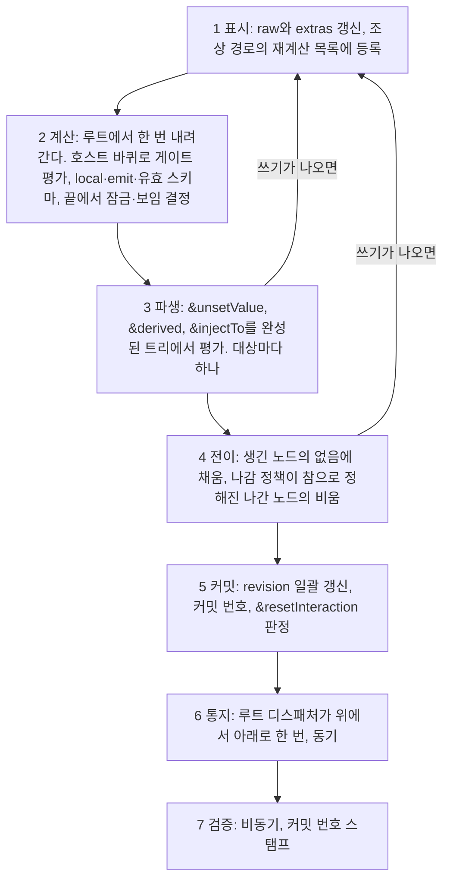
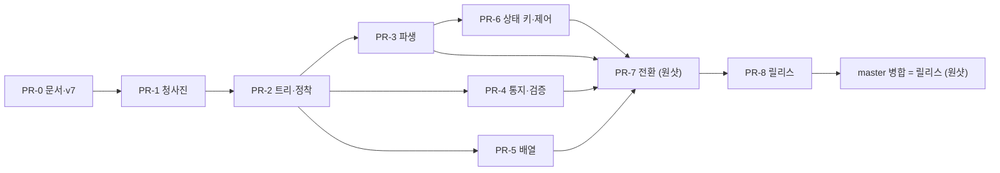

# 설계서 A부터 Z까지 — 소유자 최종 검토용

상태: **14라운드(2026-09-24).** 이 문서는 새 결정을 만들지 않는다. 원리 원장 [`03-mental-model.md`](./03-mental-model.md), 결정 기록 `adr/`, 목표 구조 [`02-target-overview.md`](./02-target-overview.md), 결론 [`07-conclusions.md`](./07-conclusions.md)에 흩어진 결론을 **처음부터 끝까지 한 번에 읽히도록** 다시 쓴 것이다. 이 문서와 원장이 다르면 원장이 맞다. 소유자가 이 문서를 절 단위로 통과시키면 개발 단계로 들어간다. 14라운드 검증(다섯 가치에 비춘 스웜 검증)의 판정은 §16과 [`reviews/round-14-values-check.md`](./reviews/round-14-values-check.md)에 있다.

## 0. 읽는 법

- **절 단위로 통과 또는 반려한다.** 이해되지 않는 절은 그 절만 반려하면 된다. §16(검증 결과)과 §17(개발 단계)은 판정 대상이 아니라 보고와 제안이다.
- **약어는 쓰지 않는다.** 원리 `P1`–`P5`, 목표 `G1`–`G8`, 소유자의 축 열 항목은 처음 나올 때 풀어 쓴다. 근거는 괄호 안에 "원장 §n", "ADR 00nn", "07 n.n"으로 적는다.
- **용어.**

| 용어 | 뜻 |
| --- | --- |
| 작성자 | 스키마를 쓰는 사람. `&` 키와 표준 키워드를 적는다 |
| 호출자 | `<Form>`이나 core를 쓰는 코드. `setValue`·`reset`·Form 속성을 준다 |
| 사용자 | 입력란에 값을 넣는 사람 |
| 원본(`raw`) | 노드가 실제로 소유하는 값. 리프와 터미널 노드만 든다 |
| 형상 | 어떤 노드가 지금 존재하는가. (스키마, 원본 전체)의 순수 함수 |
| 조각 | 게이트가 켜고 끄는 선언 묶음(`then`·`else`, `allOf` 항목, `oneOf`·`anyOf`의 분기) |
| 게이트 | 조각이나 노드를 켜는 조건. `if`(검증기가 판정)와 `&active`(작성자의 식) 둘뿐 |
| 정착 | 쓰기 하나(또는 묶음)가 커밋된 상태에 이르는 동기 절차. 일곱 단계 |
| 자동 쓰기 | 작성자의 규칙이 원본에 쓰는 것. 채움, `&derived`, `&injectTo`, `&unsetValue`, 나감의 비움의 다섯 |
| 방출 값 | 원본과 형상의 투영. 검증기와 `onChange`가 보는 값 |
| 노드가 생김 / 나감 | 직전 커밋의 형상에 없다가 이번 최종 형상에 있음 / 그 반대 |

## 1. 무엇을 만드는가 — 한 문장과 다섯 가치

> 표준 JSON Schema를 **그대로** 받아, 표준 검증기와 **같은 판정**을 내리면서, 큰 폼을 **변경에 비례하는 비용**으로 움직이는, **한 장으로 설명되는** 폼 엔진(00-goals).

소유자가 14라운드에 핵심 가치 다섯을 이름 붙였다. 목표(`00-goals.md`의 G1–G8)와 원리(원장 §1의 P1–P5)가 어느 가치를 받치는지 적는다.

| 가치 | 뜻 | 받치는 목표·원리 |
| --- | --- | --- |
| 일관성 | 같은 개념은 어디서나 같은 이름·같은 규칙·같은 우선순위다. 하나의 개념에는 하나의 장치 | G4(하나의 개념에 하나의 장치), G2(층의 분리), P3(형상은 순수 함수) |
| 투명성 | 작성자와 호출자가 "왜 이 값이 이렇게 됐는가"를 문서와 런타임에서 알 수 있다 | C2(작성자 실수의 가시성), P2(원본을 쓰는 주체는 셋뿐), 오류·경고 분류표(§11) |
| 예측가능성 | 같은 스키마·같은 입력이면 문서만으로 결과를 미리 말할 수 있다 | G5(한 장으로 설명되는 라이프사이클), G1(판정의 동치), P1(판정은 검증기의 것) |
| 고속성 | 입력 한 번에 드는 일이 작고 상한이 있으며 스키마 크기에 비례 이상으로 커지지 않는다 | G6(비용은 변경에 비례), G7(반응의 척추 보존), 예산 다섯(§7) |
| 표현자유도 | 실제 폼 요구를 스키마와 `&` 명령으로 적을 수 있고 표준 JSON Schema 표현을 잃지 않는다 | G2, G8(보편 관행), 축 6·7항(`&`는 값을 제어하는 층, JSON Schema 표현은 `&`로 대체 가능), P4(방출은 정책) |

가치끼리 부딪히는 자리에서 설계가 고른 쪽은 §16.2에 모아 적었다.

## 2. 원리 다섯과 소유자의 축

### 2.1 원리(원장 §1.1)

| 원리 | 한 문장 |
| --- | --- |
| P1 판정은 검증기의 것이다 | 폼은 스키마의 뜻을 해석하지 않는다. 판정 = `validator(작성된 스키마, 방출 값)`. 폼이 읽는 것은 형상을 만드는 최소한이다 |
| P1′ 폼이 읽는 것은 모양 문법뿐이다 | `type`, 자식의 존재(`properties`·`items`·`prefixItems`), 조건부 존재(`if/then/else`, `allOf` 항목, `oneOf`·`anyOf`의 분기). 값의 유효성 문법(`required`, `false`, `not`, 범위·패턴)은 읽지 않는다. 폼은 게이트 없이 분기를 고르지 않는다. 게이트는 `if`와 `&active` 둘뿐이고 `&discriminator`는 `&active`를 적어 주는 설탕이다 |
| P2 원본은 호출자와 작성자만 쓴다 | 쓰는 주체는 사용자 입력, 호출자의 `setValue`·`reset`·Form 속성의 나감 정책, 작성자의 규칙(채움·`&derived`·`&injectTo`·`&unsetValue`·나감의 비움)이다. core가 스스로 원본을 고치는 일은 없다 |
| P3 형상은 상태의 순수 함수다 | 켜진 조각과 존재하는 자식은 (스키마, 원본 전체)에서 매번 같은 절차로 계산된다. 이력을 읽지 않는다 |
| P4 방출은 정책이다 | 방출 값은 원본과 형상의 투영이다. 비활성 노드의 제외, `omitEmpty`·`omitTrailing`은 원본을 건드리지 않는다 |
| P5 core는 렌더러를 모른다 | core는 노드 트리·정착·통지만 안다. 렌더 계층이 core를 구독한다 |

P1이 가장 위다. P2·P3·P4는 값을 쓰기·계산·읽기로 나눈 것이며 한 사건이 두 칸에 걸치면 설계가 잘못된 것이다.

### 2.2 소유자의 축 열 항목(원장 §1.2, 요지)

1. 폼은 JSON Schema 문법을 해석하지 않는다. `if` 블록은 켜지는지만 본다. 예외는 작성자가 `&discriminator`로 명시한 union의 `const`·`enum`뿐이다.
2. 조건에 쓰는 프로퍼티는 `properties`에 선언한다. 컨벤션이며 폼은 검사하지 않는다.
3. `then`·`oneOf`·`allOf`·`anyOf` 블록에서 프로퍼티 노드를 선언할 수 있다.
4. JSON Schema 설정에 의한 형상 변환은 값을 조작하지 않는다. 조각의 켜짐·꺼짐은 있는 값을 바꾸거나 지우지 않는다.
5. 각 노드가 지금 가진 제약을 최신화해 제공할 의무는 폼이 진다(병합표, §9).
6. `&` 키에는 완전히 다른 규칙이 적용된다. 값을 제어하는 층이다.
7. JSON Schema 표현은 `&` 표현으로 대체할 수 있어야 한다.
8. `&` 표현식과 `injectTo`는 예약어이며 명확한 동작 위계와 이름 컨벤션을 가진다.
9. `control`(옛 `computed`)과 `&`의 동시 제공은 유지한다.
10. **개정(13라운드).** 코어에는 글로벌 잠금이 없다. 모든 제어 필드는 자체 노드만 지원하고 `&children`이 예외다. Form 속성 `readOnly`·`disabled`만 "코어 트리와 유리된 전역 동작"으로 렌더 계층이 특별 관리한다.

### 2.3 소유자의 답 셋(원장 §1.3)

- `oneOf`·`anyOf`는 형상 선언이 아니라 진짜 검증 조건이다. 분기의 필드는 `if/then/else`나 `&`로 제어하고, 순수 분기는 작성자가 `&`로 제어할 책임을 진다.
- 없는 값 채우기·있는 값 바꾸기·있는 값 지우기는 모두 가능해야 한다. 채움의 원천은 `&default` > `default` > 없음, 시점은 노드가 생길 때다.
- 코어의 상태 키는 그 노드에만 걸린다. 조상 상속도 루트 글로벌도 없다.

## 3. 두 층과 키 목록

### 3.1 JSON Schema 층

| 폼이 읽는 것 | 어떻게 쓰는가 |
| --- | --- |
| `type`, 튜플(다중 `type`은 §15의 설계 항목) | 노드의 종류 |
| `properties`, `items`, `prefixItems`(옛 철자 `items: [...]`도 읽는다) | 자식의 존재 |
| `if/then/else`, `allOf` 항목, `oneOf`·`anyOf`의 분기 | 조각(§6) |
| `default` | 노드가 생길 때 채움의 원천(`&default` 다음) |
| `readOnly` | 그 노드의 잠금 |
| `$ref`, `$defs`·`definitions` | 참조를 따라 형상을 만든다. 재귀는 지연 해석으로 유한 트리(11라운드 실측) |
| 주석 키워드(`title`, `description`, `format`, `examples`, `$comment`, `writeOnly`) | 유효 스키마에 병합해 렌더 계층에 건넨다 |

읽지 않는 것: `required`, `false`, `not`, `additionalProperties`, `patternProperties`, `dependentSchemas`(슬라이스 1 전 설계 항목), 범위·패턴·`enum`·`const`(`&discriminator` 아래만 예외). 이것들은 검증기에 그대로 간다.

### 3.2 예약 층 — 제어 키

`&키`와 `control.키`는 한 선언의 두 철자다. 한 노드에 둘 다 있으면 `control`이 이긴다. 품사가 동작을 말한다. 형용사는 참인 동안 유지되는 상태, 명사는 값의 출처, 동사는 참이 되는 순간의 동작이다.

| 키 | 품사 | 자리 | 단계 | 하는 일 | 로드에서 | 런타임에서 |
| --- | --- | --- | --- | --- | --- | --- |
| `&active` | 형용사 | 노드 스키마(노드 게이트), 조각 객체(조각 게이트) | 계산(호스트 바퀴) | 거짓이면 형상에서 뺀다. 원본은 기본으로 남고 방출에서 빠진다 | 거짓인 노드는 생기지 않는다 | 거짓→참에 노드가 생겨 채움을 받는다 |
| `&visible` | 형용사 | 노드 | 계산의 끝 | 표시만 가린다. 형상·값·방출을 바꾸지 않는다 | — | 전환은 생성이 아니다 |
| `&readOnly`, `&disabled` | 형용사 | 노드 | 계산의 끝 | 그 노드의 입력을 잠근다. 자손에 내려가지 않는다 | — | — |
| `&default` | 명사 | 노드 | 전이 | 노드가 생길 때 없음이면 채운다. 표준 `default`보다 앞 | 형상의 모든 노드가 생긴 노드 | 생긴 노드에만 |
| `&derived` | 명사 | 노드 | 파생 | 의존 값이 바뀔 때 자기 값을 덮는다. 식이 `undefined`면 쓰지 않는다. 사용자가 쓴 값은 다음 의존 변화 또는 그 노드가 다시 생길 때까지 남는다 | 발화한다(직전 값이 없다) | 에지 |
| `&injectTo` | 동사 | 노드 | 파생 | 원천의 방출 값이 바뀔 때 대상에 전체 교체를 쓴다 | 발화한다 | 에지 |
| `&unsetValue` | 동사 | 노드 | 파생 | 식이 거짓→참이 되는 순간 값을 없음으로. 입력은 남는다 | 로드된 값으로 평가해 참이면 지운다 | 거짓→참에서 지우고 참→거짓에서는 아무 일도 없다 |
| `&resetInteraction` | 동사 | 노드 | 커밋 | 식이 참이 되면 `dirty`·`touched`를 초기화한다. 값은 건드리지 않는다 | `&unsetValue`와 같은 시점 규칙 | 같음 |
| `&unsetOnInactive` | 형용사(불리언) | 노드, `&children`의 `control`, 조각의 `control`, Form 속성 | 전이 | 정책이 참으로 정해진 노드가 나갈 때 원본을 한 번 비운다(나가는 조상의 정책이 내려온다, §8.4). 기본 꺼짐 | 로드에는 나감이 없다 | 나갈 때 한 번 |
| `&children` | — | 객체 노드 | 각 키의 단계 | `[{ targets: [자식 이름…], control: { readOnly, visible, active, disabled, unsetValue, default, derived, resetInteraction, unsetOnInactive } }]`. 이름으로 가리킨 직계 자식에 건다 | — | — |
| `&discriminator` | — | union 호스트 | 청사진 | 분기의 그 키 `const`·`enum`을 읽어 분기별 `&active: "../키 === 값"`으로 바꾼다. 상태와 루프를 바꾸지 않는다. 그 키의 분기 선언을 **게이트 없는 선언으로도 취급해 끌어올린다**(14라운드 확정. 태그 키가 분기 안에만 있는 생성기 스키마도 그대로 받는다. 존재만 더하는 선언이며 제약은 교차하지 않는다 — 게이트 없는 분기와 같은 문맥, 편집자 도출). 어느 분기에도 그 키의 `const`·`enum`이 없거나, 분기 선언의 종류가 서로 다르거나, `const`·`enum` 값이 두 분기에 겹치면 청사진 오류 | — | — |
| `&watch` | — | 노드 | 청사진·표시 | 의존 경로 선언. 식이 읽는 경로를 정적으로 알 수 없을 때 작성자가 적는다 | — | — |

- **조각 객체의 제어 키.** 조각 객체(`allOf` 항목, 분기, `then`)에 둔 `&active`는 그 조각의 게이트이고, 그 밖의 제어 키(`control.readOnly` 등)는 그 조각이 직접 선언한 호스트의 직계 자식에 조각이 켜진 동안 걸린다(조각 범위 제어). 더 깊은 자손에는 그 자손을 직접 선언한 안쪽 조각의 `control`이 걸린다.
- **식의 기준점.** 모든 JSON Pointer는 그것을 선언한 노드를 기준으로 푼다. 조각 객체·`&children`·`&discriminator`의 식은 호스트의 직계 자식 자리가 기준이라 `../kind`는 호스트의 `kind`다. `.`·`..`는 폼의 확장 표기다(원장 §4).
- **게이트 입력.** 게이트는 검증기가 볼 값(투영 뒤의 값)을 본다. 선언되지 않은 키의 값(`extras`)도 그 값에 든다(원장 §5). `extras`는 정적이다. 청사진 어디에도 선언되지 않은 키만 `extras`이고, 조각이 선언한 키는 그 조각이 모두 꺼지면 잠복 원본이라 게이트도 검증기도 보지 않는다(P1·P4, 14라운드).

### 3.3 표현 키와 `virtual`

접두 없는 폼 전용 키는 둘로 나뉜다(소유자 13라운드: "제어용 필드들에 대해서만 &". 닫힌 목록은 14라운드에 확정).

| 부류 | 키 | 누가 읽는가 |
| --- | --- | --- |
| 형상·투영 키 | `terminal`, `FormTypeInput`(유무만), `virtual`, `propertyKeys`, `options.omitEmpty`·`options.omitTrailing` | 코어. 청사진이 노드 종류(터미널인가)와 형상을 정할 때, 방출 투영이 키 순서와 빈 값 처리를 정할 때 읽는다. 정착 루프의 제어(게이트·잠금·값 규칙)는 읽지 않는다 |
| 표현 키 | `FormTypeInputProps`, `FormTypeRendererProps`, `formType`, `errorMessages`, 그 밖의 `options` | 렌더 계층만 |

둘 다 `&`를 붙이지 않고, 검증기에 넘기기 전에 지운다. `virtual`은 현행대로 두되 오늘의 `required` 재작성(가상 이름을 실제 자식 이름으로 펼침)은 버린다. 작성자는 `required`에 실제 필드를 적는다.

오늘 맨 키로 쓰는 `disabled`·`visible`·`active`는 제어이고 표준 키워드가 아니므로 `&`로 옮긴다(이주).

### 3.4 검증기에 넘기기 전 지우는 규칙 둘

1. 키워드 위치의 `&` 키, `control` 컨테이너, `virtual`.
2. 형상·투영 키와 표현 키의 목록(위 §3.3).

지우는 이유는 판정이 아니라 컴파일이다(ADR 0003 §7). 작성된 스키마 자체는 변형하지 않고 검증기에 넘길 사본에서만 지운다(ADR 0001). 오늘은 여섯 키(`FormTypeInput`, `FormTypeInputProps`, `FormTypeRendererProps`, `errorMessages`, `options`, `injectTo`)만 지우고 `&` 키·`computed`·`virtual`·`terminal` 등은 검증기까지 가므로, 목록 확대는 이주 항목이다.

## 4. 상태 — 노드가 드는 것

```
raw          원본. 리프와 터미널 노드만 값을 든다. 자식 있는 노드는 "잘못된 종류의 값"이 왔을 때만
extras       호스트가 받은, 청사진 어디에도 선언되지 않은 키와 그 순서(정적. if 안에만 적힌 키도 여기)
--- 아래는 계산 결과 (P3) ---
active       이번 커밋의 활성 조각·노드 집합
local        활성 자식의 방출 값을 합성한 것, 투영 전
emit         local의 투영. 방출 값
schema       유효 스키마(켜진 조각을 병합한 것). 같은 조각 집합이면 같은 참조
--- 아래는 작업의 기록 ---
재계산 목록  이번 정착에서 다시 계산할 자식 (상호작용 상태 dirty와 다른 것)
revision     통지 원장. 커밋 시 일괄 갱신
커밋 번호    검증 결과의 스탬프
diagnostics  마지막 로드 이후의 기록 { status: 'stable' | 'degraded', cause?, exceededBudget?, iterations?, commit? } (모양과 이름은 ADR 0014 제안. 다음 로드까지의 지속은 14라운드 답 O-2)
```

- **상태는 `raw`와 `extras` 둘뿐이다.** 분기 선택(`selection`)은 폼이 분기를 고르지 않으므로 없다.
- **노드는 형상에 있거나 없다.** 없는 노드의 원본은 기본으로 남아 `getInactiveValues(path)`로 읽을 수 있고 방출에서 빠진다. 형상에 없는 노드의 규칙(`&derived` 등)은 평가하지 않는다.
- **상호작용 상태** `dirty`·`touched`는 현행 유지다(C6).
- **노드의 종류.** 리프(string·number·boolean·null), 객체, 배열, 터미널 객체·배열(`FormTypeInput`이 있거나 `terminal: true`. 자식 노드를 만들지 않고 값을 통째로 든다), 가상 노드(`virtual`). 터미널 아래 경로는 `find`·`findNodes` 모두 노드 없음으로 답한다(07 4.29).

## 5. 청사진 — 스키마를 한 번 읽는다 (ADR 0005)

폼 생성 때(그리고 스키마 교체 때) 한 번 도는 **순수 함수**다. 작성된 스키마를 변형하지 않고 결과를 별도 구조에 둔다.

1. **조각 표.** 모든 조각과 게이트를 정적으로 열거한다. 조각은 트리다(중첩 조각은 감싸는 조각이 켜져 있을 때만 순회). **전순서**는 호스트에서 조각까지의 경로를 (키워드 순위, 배열 인덱스) 쌍의 열로 보고 사전식으로 비교한 것이다. 키워드 순위는 본체 `properties` < `allOf` 항목 < `if/then/else` < `oneOf`·`anyOf` 분기이며 JSON 키 순서에 기대지 않는다. 노드 게이트는 그 노드를 선언한 조각 바로 뒤에, 같은 조각 안에서는 선언 순서로 든다.
2. **노드 공유.** 같은 이름·같은 종류(string, number, boolean, null, object, array)면 어느 조각에서 선언했든 노드 하나다. 켜진 선언이 하나라도 있으면 존재한다. 게이트 없는 분기끼리 같은 이름·다른 종류를 선언하면 늘 함께 켜지므로 충돌이 확실하고, 게이트에 달린 선언이 실제로 동시에 켜지면 그때 충돌이다. 둘의 드러남은 ADR 0014(제안)가 정한다: 앞은 청사진 오류, 뒤는 정착 오류(5차 문서는 경고였다. 소유자 14라운드: "경고만 일어나고 동작하는 것처럼 보이는 게 더 위험합니다").
3. **`&discriminator` 변환.** 작성자가 union 호스트에 적었을 때만 분기별 `&active`로 바꾼다. 분기에 그 키의 `const`·`enum`이 없으면 게이트 없음으로 둔다. `$ref`·`allOf` 평탄화, 분기 자체의 `&active`와의 결합(AND)은 슬라이스 1의 설계 항목이다.
4. **병합표 준비.** §9의 규칙을 적용할 준비를 한다. 적용은 정착의 계산 단계에서 켜진 조각에 대해 한다.
5. **게이트 컴파일.** `if` 서브스키마를 검증기의 `compileGuard`로 컴파일한다(동기, boolean). 컴파일은 작성된 스키마의 위치당 한 번이며 폼 인스턴스 사이에 공유한다(ADR 0004). 공유의 방식은 슬라이스 4의 설계 항목이다(ADR 0009: 가드 하나 70–270 µs, 200개면 14–54 ms).
6. **`&` 식 컴파일과 역의존 표.** 식이 읽는 경로를 정적으로 뽑아 역의존 표(경로 → 그 경로를 읽는 식을 가진 노드)를 만든다. 표시 단계는 쓰기 노드의 조상과 그 역의존 노드의 조상을 재계산 목록에 넣는다. 뽑을 수 없는 식은 `&watch`로 작성자가 적는다(오늘의 의존 경로 구독과 같은 역할).
7. **청사진 오류와 경고.** 형상이 정해지지 않는 모순은 throw(`JSONSchemaError`), 그 밖은 개발 모드 로그다(§11.3).

## 6. 조각과 게이트 (ADR 0002, ADR 0010)

조건부로 형상을 바꾸는 모든 구문은 "게이트 → 조각" 하나로 환원된다.

| 구문 | 게이트 | 조각 | 문맥 |
| --- | --- | --- | --- |
| 최상위·`allOf` 항목·분기 안의 `if/then/else` | `if`(검증기 플러그인의 `compileGuard`) | `then` / `else` | 연언(분기 안이면 그 분기의 문맥) |
| 게이트 없는 `properties`·`allOf` 항목 | 항상 참 | 블록 전체 | 연언 |
| `&active`를 가진 조각 객체 | `&active`(표현식) | 그 조각이 선언한 노드 집합 | 연언 |
| 게이트 없는 `oneOf`·`anyOf` 분기 | 항상 참(존재만) | 분기 전체 | 선언. 제약은 교차하지 않는다 |

- **한 장치, 두 범위.** `&active`는 노드 스키마에 쓰면 노드 게이트, 조각 객체에 쓰면 조각 게이트다. 둘 다 거짓이면 형상에서 빠지고 거짓→참이면 노드가 생긴다. 노드 게이트도 게이트 가진 조각처럼 꺼진 채 출발하고 전순서 안에서 평가된다(양의 순환에서 고정점이 하나로 정해진다).
- **폼은 분기를 고르지 않는다.** 분기를 고르는 상태·API·UI가 없다. 사용자가 분기를 고르게 하려면 작성자가 판별 프로퍼티를 본체 `properties`에 두고 분기가 그 값을 게이트로 읽게 한다. 사용자의 선택은 그 프로퍼티에 대한 보통의 입력이다.
- **게이트 가진 분기.** 분기가 `&active`를 갖거나(`&discriminator` 변환 포함) 분기에 `else: false`인 `if`가 있으면(키 유무로 판정) 게이트 가진 분기다. 정착 경고 "같은 `oneOf`에서 게이트 가진 분기가 둘 이상 켜짐"은 이 분기만 센다.
- **금지 문법은 읽지 않는다.** `properties: { x: false }`, `not: { required }`, `else: false`는 아무 노드도 선언하지 않는다. 숨기려는 작성자는 `&active`를 쓴다.
- **작성자의 약속(ADR 0010, 폼은 검사하지 않는다).** (1) `oneOf`·`anyOf` 분기의 `if`에는 `else: false`를 붙인다. 없으면 `if`가 거짓인 분기가 공허하게 통과한다(ajv 8.17.1 실측). (2) `if`에는 `required: [조건 프로퍼티]`를 넣는다. 없으면 빈 값에서 모든 분기가 켜진다. (3) `&active` 분기는 검증기 쪽에도 `const`+`required`를 둔다. (4) 생성기가 만든 `const` 태그 union은 `&discriminator`를 명시한다. (5) 표준 `readOnly`는 터미널이 아닌 객체 노드에서는 효과가 없고, 배열 노드에서는 아이템 추가·삭제·이동 입력을 막는다. (6) 조건 프로퍼티는 `properties`에 선언한다. (7) 왕복이 정확하지 않은 양방향 `&injectTo`는 대상이 이미 같은 값이면 식이 `undefined`를 돌려주어 멈춘다(폼은 오늘의 순환 자동 차단을 두지 않고 예산으로 잡는다).

예시(02 §3). 판별 프로퍼티 `kind`는 본체에, 분기는 약속대로, `allOf` 조각 하나는 `&active` 게이트를 가진다.

```json
{
  "type": "object",
  "properties": { "kind": { "type": "string", "enum": ["card", "bank"] } },
  "oneOf": [
    { "if": { "properties": { "kind": { "const": "card" } }, "required": ["kind"] },
      "then": { "properties": { "cardNumber": { "type": "string" } }, "required": ["cardNumber"] },
      "else": false },
    { "if": { "properties": { "kind": { "const": "bank" } }, "required": ["kind"] },
      "then": { "properties": { "account": { "type": "string" } }, "required": ["account"] },
      "else": false }
  ],
  "allOf": [ { "&active": "../kind === 'bank'", "properties": { "bankCode": { "type": "string" } } } ]
}
```

값 `{}`에서는 두 `if`가 `required` 때문에 거짓이라 `cardNumber`·`account`·`bankCode`가 형상에 없고, 검증기는 이 값을 기각한다(검증기의 판정). `kind`에 `card`를 넣으면 `cardNumber`가 생겨 없음이면 채움을 받는다. `bank`로 바꾸면 `cardNumber`는 형상에서 빠지되 원본은 남고, `account`·`bankCode`가 생긴다.

## 7. 정착 — 쓰기 하나가 커밋에 이르는 길 (ADR 0007)

쓰기(또는 `batch`의 묶음)마다 한 곳에서 고정된 순서로 돈다. 표시부터 통지까지 동기, 단방향이다. 비동기는 경계(검증, React, `onChange`)에만 있다.



| 단계 | 하는 일 | 예산 |
| --- | --- | --- |
| 표시 | 쓰기를 받은 노드의 `raw`·`extras`를 갱신하고 조상 경로의 재계산 목록에 등록한다. 동기 | 없음 |
| 계산 | 루트에서 한 번 내려간다. 재계산 목록의 자식을 먼저 완료하고 자기 `local`·`emit`·유효 스키마를 만든다. 호스트는 게이트 없는 조각만 켠 채 출발해(노드 게이트도 꺼진 채) 모든 게이트를 전순서로 평가하고 집합이 바뀌지 않을 때까지 반복한다. 게이트는 투영 뒤의 값을 본다. 계산의 끝에서 `&visible`·`&readOnly`·`&disabled`·표준 `readOnly`를 한 번 결정한다. **원본을 읽기만 한다** | 호스트 바퀴 = 게이트 가진 조각 수 + 노드 게이트 수 + 1. 자식 호스트의 덧씌움 재계산도 이 예산에 함께 센다 |
| 파생 | 완성된 트리에서 `&unsetValue`·`&derived`·`&injectTo`를 평가하고 같은 대상 규칙(§8.5)으로 대상마다 하나만 적용한다. 쓰기가 나오면 표시로 돌아간다 | 라운드 25(전이 뒤에도 이어 센다) |
| 전이 | 생긴 노드의 없음인 값에 채움(`&default` > `default`. 값은 처음 채워지는 라운드의 유효 스키마에서 읽는다). 중간 라운드의 채움은 그 노드가 최종 형상에 없으면 버린다. 나감 나감 정책이 참으로 정해진 노드가 나가면 한 번 비운다(하위 트리 포함, 공유 노드 제외, 로드에는 나감 없음). 쓰기가 나오면 표시로 | 라운드 = 트리 전체의 게이트 가진 조각 수 + 노드 게이트 수 + 1. 쓰기를 낸 라운드만 세고 `if/then/else`는 게이트 하나로 센다 |
| 커밋 | 계산 결과를 트리에 반영하고 배달 집합의 `revision`을 한 번에 올리고 단조 커밋 번호를 매긴다. `&resetInteraction` 판정 | 없음 |
| 통지 | 루트 디스패처가 문서 순서 위에서 아래로 한 번 배달한다. 유효 스키마가 바뀐 노드도 배달 집합에 든다. 루트 `onChange`는 최외곽 동기 진입당 한 번 | 리스너 되먹임 파동 25, `onChange` 중첩 25 |
| 검증 | `validator(작성된 스키마, 방출 값)`을 커밋 번호로 스탬프해 비동기로 요청하고 늦게 온 결과는 버린다 | 없음 |

- **원본을 쓰는 단계는 파생과 전이뿐**이고 둘 다 표시로 돌아가 다시 계산된다. 그래서 커밋된 트리는 (스키마, 트리 전체의 `raw`·`extras`)의 순수 함수다.
- **에지의 기준점은 직전 커밋**이다. 한 규칙은 원천 값의 한 번의 변화에 대해 한 정착 안에서 한 번만 쓴다(재발화 금지). 기준점은 그 규칙이 이 정착에서 마지막으로 소비한 원천 값이며, 원천이 다른 값으로 다시 바뀌면 새 에지다. 진짜 순환은 그래서 예산에 잡힌다.
- **로드는 새 수명이다.** 전체 교체(마운트, `setValue(V)`, `reset()`, `defaultValue`)는 형상의 모든 노드를 생긴 노드로 친다. 없음인 값은 모두 채움을 받고, `&injectTo`·`&derived`는 발화하며, `&unsetValue`는 로드된 값으로 평가해 참이면 지운다. 로드에는 나감이 없다.
- **예산 초과.** 정착의 세 예산(호스트 바퀴, 파생, 전이)을 넘기면 그 정착의 자동 쓰기를 모두 뺀 **원본 B**를 커밋하고 `diagnostics.status = 'budgetExceeded'`로 알린다(원본 B의 형상은 원본 B로 한 번 더 계산하며 그 바퀴도 걸리면 마지막 바퀴의 활성 집합으로 고정). 리스너 되먹임 파동을 넘기면 마지막 파동은 배달하되 그 파동 안의 되먹임 쓰기를 거부한다. `onChange` 중첩을 넘긴 쓰기는 적용하고 통지하되 그 `onChange` 하나는 부르지 않는다. 상한은 루프를 잇는 고리 하나만 끊고, 최외곽 쓰기는 결코 버리지 않으며, 커밋된 것은 반드시 통지된다. 그 뒤 **환경 불문 진입 사슬의 가장 바깥 끝에서 한 번 throw**한다(ADR 0014 제안 3판. 5차 문서의 "개발 모드 throw, 프로덕션은 신호만"과 Form 속성 `throwOnBudgetExceeded`를 대체한다). 이 상태는 다음 로드까지 남고 그 동안 제출은 거부된다(지속과 제출 거부는 14라운드 답 O-2로 확정. 이름 `degraded`와 원인의 확대는 ADR 0014 제안). 마운트의 첫 정착이 예산을 넘기면 청사진 오류와 같이 폼이 서지 않는다(ADR 0014 미결). 소유자: "루프의 가능성을 제한하지는 않는다. 상한을 초과하면 오류를 표시한다. React 훅과 같은 설계다."
- **비용의 상한(G6, 14라운드).** 파생·전이·커밋과 원본 B의 기록은 이번 정착의 재계산 목록과 자동 쓰기 기록만 순회한다(생긴 노드의 채움과 나간 하위 트리의 순회는 제외). 트리 전체 순회는 로드에서만 허용한다. 원본 B는 스냅숏이 아니라 자동 쓰기의 되돌림 기록이다. 한 정착의 라운드 상한은 파생 25 + 전이 상한이며 둘을 곱하지 않는다. `if` 게이트의 컴파일은 작성된 스키마의 위치당 1회이며 폼 인스턴스 사이에 공유한다. 토글 없는 키 입력 한 번의 검증기 호출은 조상 경로의 `if` 게이트 수에 묶인다(14라운드 고속성 검증의 어림, `reviews/raw-round14-speed.md`).
- **`&active` 식이 다른 호스트를 읽을 때**의 평가 순서와 재순회 규칙은 슬라이스 2 전의 설계 항목이다(§15). 역의존 표(§5의 6)가 재계산 목록을 채우는 것까지는 정해졌다.

## 8. 쓰기 — 원본을 바꾸는 사건 (P2, ADR 0013)

### 8.1 쓰기 표(원장 §3)

| 사건 | 종류 | 누가 | 자식 원본에 미치는 것 |
| --- | --- | --- | --- |
| 사용자 입력 | 부분 쓰기 | 렌더 계층 | 그 리프만. `onChange(undefined)`는 없음이 된다 |
| `setValue(V, Merge)` | 부분 쓰기 | 호출자 | V에 있는 키만. 키에 `undefined`를 쓰면 없음(`extras` 포함, `removeKey` 불필요). 통째로 준 배열은 통째 교체 |
| `setValue(V)`(기본 `Overwrite`), `defaultValue`, `reset()` | 전체 교체(로드) | 호출자 | V에 없는 자식 원본은 없음. `null`·`17`도 V다. `setValue(getValue())`도 전체 교체 |
| `&injectTo` | 전체 교체(대상에) | 작성자 | 원천의 방출 값이 직전 커밋과 다를 때. 로드에서 발화 |
| `&derived` | 자기 값 덮기 | 작성자 | 의존 값이 바뀔 때. 로드에서 발화. `undefined`면 쓰지 않는다 |
| `&unsetValue` | 자기 값 없음으로 | 작성자 | 거짓→참. 로드는 로드 값으로 평가 |
| 나감의 비움 | 나간 노드를 없음으로 | 정책 키를 켠 곳(작성자 또는 호출자) | 나갈 때 한 번, 하위 트리 포함, 공유 노드 제외. 로드에는 없음 |
| 채움 | 없음인 키에 한 번 | 노드 생성 사건 | 생길 때 없음이면 `&default` > `default` > 없음. 이미 있던 노드는 새 조각이 켜져도 다시 채우지 않는다. 지운 값은 다시 채우지 않는다 |
| 배열 `push`/`remove`/`update` | 구조 연산 | 호출자·렌더 계층 | 그 아이템만. `push`로 생긴 아이템은 채움을 받는다 |

호스트의 원본이 `null`·`17` 같은 잘못된 종류의 값일 때 그 자식은 존재하고 렌더되며 빈 상태를 보인다. 호스트의 그 원본을 비우는 것은 사용자·호출자의 부분 쓰기뿐이고 **그 자식의 투영된 방출이 존재하게 될 때만** 비운다. 자동 쓰기(채움 등)는 비객체 호스트의 원본을 건드리지 않으므로, `setValue({ user: null })` 뒤 `name`의 채움 값은 방출에 나타나지 않고 사용자가 `name`에 입력하면 `user`가 객체가 되어 방출된다(ADR 0007 F1, ADR 0013 F10).

### 8.2 쓰기의 종류는 호출자가 선언한다

비트마스크 `SetValueOption.Overwrite | Merge | DisableAutomaticWrites | EnableAutomaticWrites`. core는 추론하지 않는다. `DisableAutomaticWrites`의 범위는 **그 호출이 일으킨 자동 쓰기 전부**(채움, `&derived`, `&injectTo`, `&unsetValue`, 나감의 비움)이며 로드 값 자체는 막지 않는다. `Merge`에 주면 그 `Merge`가 통째로 준 배열의 아이템 채움도 막는다. 뒤이은 사용자 입력은 다른 호출이므로 듣지 않는다. 호출에 둘 다 없으면 Form 속성 `disableAutomaticWrites`를 따르고 둘 다 주면 억제가 이긴다. `&active`의 방출 제외는 쓰기가 아니라 투영이므로 범위 밖이다.

### 8.3 값 조작 표(07 4.28)

| 조작 × 주체 | 로드 | 노드 생성 | 런타임 |
| --- | --- | --- | --- |
| 채움 · 호출자 | `setValue(V)`, `defaultValue` | — | `setValue(V, Merge)`의 새 키 |
| 채움 · 사용자 | — | 입력으로 조각을 켜는 간접 유발 | 빈 입력란에 처음 입력 |
| 채움 · 예약 층 | `&default` > `default`, 없음에 한 번 | 같음(노드 단위) | 없음. 다시 채우지 않는다 |
| 변경 · 호출자 | `setValue(V, Overwrite)` | — | `setValue(V, Merge)` |
| 변경 · 사용자 | — | — | 입력란 편집 |
| 변경 · 예약 층 | `&derived`·`&injectTo`(발화) | 의존 변화에 따른 둘 | `&derived`(자기), `&injectTo`(남) |
| 제거 · 호출자 | V에 없는 키, `setValue(null)` | — | `Merge`로 `undefined` |
| 제거 · 사용자 | — | — | 입력란 비우기 |
| 제거 · 예약 층 | `&unsetValue`(로드 값 평가), `&active: false`(방출 제외) | 같음 | `&unsetValue`(에지), `&active: false`, 나감의 비움(정책 키) |

런타임에 "없음일 때만 채우는" 별도 키는 없다. "없음"과 `''`·`null`은 다르며 `null`은 키 없는 전체 교체다.

### 8.4 나감의 비움 정책 `unsetOnInactive`

- 철자 셋: 노드의 `&unsetOnInactive`, `control.unsetOnInactive`, Form 속성 `unsetOnInactive`. 불리언, 기본 꺼짐(유지).
- 단위는 **노드의 나감**(직전 커밋의 형상에 있었고 최종 형상에 없음). 하위 트리를 포함하고, 다른 켜진 선언이 남은 공유 노드는 나가지 않는다. 로드에는 나감이 없다. 전이 단계의 다섯째 자동 쓰기이므로 억제 비트와 원본 B의 대상이다.
- **누가 정하는가(14라운드, 소유자 확인 대기).** 나가는 노드의 비움 여부는 그 노드와 그 위의 **나가는** 조상들을 가까운 순서로 보아, 직전 커밋에서 세 층(노드 자신 > 그 노드를 가리키는 `&children` 항목의 `control` > 그 노드를 직접 선언한 조각의 `control`) 가운데 하나라도 명시된 첫 노드가 정하고(한 노드의 같은 층에 여럿이면 하나라도 유지면 유지), 끝까지 없으면 Form 속성이 정한다. 객체의 값은 리프에 있으므로 이는 상속이 아니라 "나가는 객체를 비운다"의 정의이며, 나가지 않는 조상의 정책은 내려가지 않는다(13라운드 답 1 "자체 노드만"의 유일한 귀결). 셈의 기준은 직전 커밋의 선언이다(P3). 조각 층은 그 조각이 꺼지는 순간에도 적용된다. 검증자가 시나리오 여덟으로 정합성을 확인했다(`reviews/raw-round14-unset-subtree.md`).
- **남은 결정 둘.** (가) 공유 객체가 남고 꺼진 조각 쪽에만 선언된 자손만 나갈 때, 그 조각의 `control`이 그 자손에 닿는가(닿지 않으면 "A 분기를 끄면 A의 값을 지운다"가 공유 객체 아래에서 새어 나간다). (나) 앞서 자기 게이트로 나가 잠복한 자손은 조상이 나갈 때 비워지지 않는다(나감은 순간이다) — 이대로 두는가.
- 노드 게이트 `&active: false`도 같은 장치라 정책대로 비우고, `&visible`은 언제나 보존한다.
- 비용: 나감의 비움은 나간 하위 트리를 위에서 아래로 한 번 순회하며 조상의 정책을 인자로 내려보낸다(노드당 상수, 위로 거슬러 오르지 않는다). 청사진이 "하위 트리에 정책 선언 없음"을 미리 표시하면 Form 속성이 꺼져 있을 때 순회를 건너뛴다.
- 오늘의 동작(꺼지면 원본을 지우고 켜지면 노드가 생성될 때의 값, 없으면 `default`로 복원)은 이주 항목이다. 소유자: "onChange로 넘어가는 값에서 지워지는 게 기본값이면 된다."

### 8.5 같은 대상 규칙(파생 단계)

라운드마다 후보를 모아 **대상 노드마다 하나만** 적용한다.

1. 종류 순위: `&unsetValue` > `&derived` > `&injectTo` > 채움.
2. 같은 종류끼리는 원천(선언) 노드의 **문서 순서에서 나중이 이긴다.** 같은 노드에 걸린 선언끼리는 층(조각의 `control` < `&children` 항목 < 노드 자신)에서 세부가 이기고, 같은 층이면 조각의 전순서에서 나중이 이긴다. 경고는 없다(소유자: "겹치지 않게 짜는 게 권장이지만" 순위와 순서로 푼다).
3. 진 쓰기는 버리고 그 에지도 소비한다. 소비하지 않으면 다음 라운드에 진 규칙이 이겨 순위가 무의미해진다.
4. 순위는 라운드가 아니라 **정착 단위**다. 한 정착에서 대상에 더 높은 순위의 쓰기가 이미 적용되었으면 뒤 라운드의 낮은 순위 후보는 버리고 그 에지를 소비한다.
5. 순위는 단계도 가로지른다. 생긴 노드의 `&unsetValue`가 참이면 채우지 않는다.
6. 재탄생은 새 삶이다. 사용자가 쓴 값은 다음 의존 변화 **또는 그 노드가 다시 생길 때**까지 남는다. 로드 정착에서 `&unsetValue`의 직전 값은 거짓이며 같은 정착 안의 채움이나 파생으로 참이 되어도 지운다.

## 9. 유효 스키마 병합표 (축 5항, 원장 §4)

노드의 유효 스키마는 켜진 조각을 전순서(§5의 1)로 합친 것이다. 렌더 계층이 읽는 힌트이며 검증기에는 가지 않는다.

| 부류 | 규칙 |
| --- | --- |
| 검증 키워드(`minimum`, `enum`, `required` …) | 연언 문맥에서 교차한다. 게이트 없는 `oneOf`·`anyOf` 분기는 존재만 더하고 제약은 교차하지 않는다. 정적 연언(본체와 게이트 없는 `allOf`)의 교차가 공집합이면 청사진 오류(throw), 켜진 `then`과의 런타임 교차가 공집합이면 검증기가 값을 기각한다 |
| 주석 키워드(`title`, `description`, `format`, `default`·`&default`, `writeOnly`, `$comment`, `examples`) | 뒤가 앞을 덮는다. 켜진 조각이 본체를, 전순서에서 나중 조각이 앞 조각을 덮는다 |
| 상태 키(표준 `readOnly`, `&readOnly`·`&disabled`·`&visible`·`&active`, `control.readOnly`·`control.disabled`·`control.visible`·`control.active`) | 그 노드에만 걸린다. 로컬 선언이 겹치면 잠금은 OR, 표시는 AND(§10) |
| 형상·투영 키와 표현 키(`FormTypeInput`, `options` …) | 뒤가 앞을 덮되 `options`는 깊은 병합이다. 빈 객체에서 시작해 조각 순서대로 적용하며(작성자 스키마를 변이하지 않는다) 객체는 재귀 병합, 함수·원시값은 나중 승, 나중 조각의 `undefined`는 앞 값을 지우지 않는다. 배열은 나중 조각의 것으로 통째 교체한다(14라운드 확정. `merge`에 배열 전략 옵션을 더해 쓴다) |
| 값·동작 키(`&derived`, `&injectTo`, `&unsetValue`, `&resetInteraction`) | 병합하지 않는다. 선언마다 규칙 하나이며 같은 대상은 §8.5가 푼다 |

게이트 없는 분기가 공유 노드에 둔 주석·표현·상태 키는 그 노드의 유일한 선언일 때만 쓴다. 게이트 없는 분기 안의 `if/then`도 그 분기의 문맥이라 `then`의 제약을 본체와 교차하지 않는다. 조각이 `FormTypeInput`을 더하거나 빼 터미널 전략이 바뀌는 경로는 슬라이스 6의 설계 항목이다.

## 10. 상태 키와 제어 — 그 노드에만 (ADR 0003 §5)

- **코어에 글로벌은 없다.** 루트 스키마의 키는 루트 노드의 로컬 키다. 오늘 루트 키 다섯(`readOnly`·`disabled`·`active`·`visible`·`pristine`)의 특수 처리와 README의 "Priority System"은 사라진다.
- **조상 상속은 없다.** 객체 노드의 잠금은 자손에 내려가지 않는다. 터미널이 아닌 객체 노드의 잠금은 입력이 없으므로 효과가 없고(표준 `readOnly`는 청사진 경고), 배열 노드의 잠금은 렌더 계층이 아이템 추가·삭제·이동 입력에 적용하며, 터미널 객체·배열은 입력이 있으므로 리프와 같다. `active`·`visible`은 구조상 하위 트리를 가린다.
- **자손을 거는 길은 둘뿐이다.** 부모의 `&children`(이름으로 가리킨 직계 자식)과 켜진 조각의 `control`(그 조각이 직접 선언한 호스트의 직계 자식). 둘 다 상속이 아니라 명시한 대상에 거는 제어다.
- **로컬 층 안의 결합.** 표준 `readOnly`, `&readOnly`·`control.readOnly`, 켜진 조각의 범위 제어, 부모의 `&children` 항목이 한 노드에 겹치면 잠금(`readOnly`·`disabled`)은 하나라도 참이면 잠기고, 표시(`active`·`visible`)는 모두 참이어야 켜진다(선언은 합집합·제한은 교집합). `&readOnly`와 `control.readOnly`는 한 선언의 두 철자라 `control`이 이긴다.
- **전체 잠금은 렌더 계층의 일이다.** Form 속성 `readOnly`·`disabled`는 참일 때만 거는 전체 잠금이며 코어의 상태가 아니다. 렌더 계층이 코어의 결과 위에 OR한다. 소유자: "코어 트리와 유리된 전역 동작으로 읽으면 된다."

## 11. 검증기 플러그인, 검증, 오류와 경고 (ADR 0001, 0004, 원장 §5)

### 11.1 계약

검증기는 내장하지 않고 플러그인으로 받는다. `compile(schema)`는 전체 검증(비동기 허용), `compileGuard(schema)`는 `if` 게이트를 평가하는 동기 boolean 함수다. 둘 다 작성된 스키마(제거 규칙 둘을 적용한 사본)를 받는다. 검증기는 두 자리에서 온다: 전역 기본인 플러그인과, 그 폼만의 인스턴스를 주입하는 Form 속성 `validatorFactory`(14라운드 확정: 없애지 않고 넓힌다. 같은 계약 `compile` + `compileGuard`를 받고 플러그인보다 앞선다). 미등록 판정은 둘을 함께 본다. 둘 다 없으면서 검증 모드가 `None`이 아니거나 스키마에 `if` 게이트가 있으면 청사진 오류다(ADR 0014 제안. ADR 0004의 "미등록이면 조각 없음"을 대체하며 소유자 확인 대기). `compileGuard`의 시그니처, 인스턴스 사이 공유의 방식, `$id`·`$dynamicRef` 문맥, 컴파일 실패 정책은 슬라이스 4의 설계 항목이다.

### 11.2 검증

커밋마다 커밋 번호를 스탬프해 비동기로 요청하고 늦게 온 결과는 버린다. 요청은 최외곽 진입당 1회이나 실행은 마이크로태스크에 모아 최신 커밋 번호 하나만 돌린다(14라운드 확정). 판정은 `validator(작성된 스키마, 방출 값)`이며 독립 표준 검증기의 판정과 같아야 한다(G1). 검증 결과를 노드로 나누는 규칙(에러 라우팅)은 슬라이스 4의 설계 항목이다. 잔여 키의 표시는 플러그인 계약 `rejectedKey`로 한다.

### 11.3 오류·경고 분류표(세 축: 언제, 누구 잘못, 어떻게 드러남)

**ADR 0014(제안 3판, 소유자 확인 대기)가 이 표를 세 층(오류 = 환경 불문 throw, 경고 = 개발 모드 로그, 검증 결과 = 노드 `errors`)으로 다시 쓴다.** 가르는 물음은 "이 사건 뒤에도 원장의 규칙이 지켜지는가"다. 스키마가 작성된 그대로 판정되는 한 스키마의 뜻이 의도와 다른 것은 경고이고, 폼이 작성자의 선언이나 호출자의 쓰기를 빼거나 바꾼 커밋은 오류다. 오류는 삼키는 스위치가 없다. 정착·통지 사슬(사슬 머리, 곧 리스너·`onChange` 밖에서 열린 동기 진입과 그 통지·`onChange`·리스너 안에서 열린 진입 전부)의 오류는 모두 모아 사슬 머리의 끝에서 한 번 던지므로(둘 이상이면 `AggregateError`) 값은 커밋되고 통지된다. `&` 식이 던지면 게이트는 거짓, 상태 키 선언은 없음, 파생 규칙은 후보 제외로 정착을 마친 뒤 던진다. Form 속성 `onError(error: unknown)`는 throw 직전에 한 번 불리는 관찰자이며 오류를 막지 못한다. 폼의 바운더리는 우리 오류를 다시 던진다(오늘은 삼킨다). 검증기가 없으면서 검증 모드가 `None`이 아니거나 `if` 게이트가 있으면 청사진 오류이고, 가드는 청사진에서 모두 컴파일한다. `OnChange` 검증의 실행 실패는 `onError`에 가고 미처리 거부로 한 번 드러난다. 확정되면 아래 표를 ADR 0014 §7의 표로 바꾼다. ADR 0014의 미결 아홉(뒤집는 답 셋, 관찰자의 뜻, 검증기 없는 폼의 마운트 실패, ADR 0004의 대체, `AggregateError`, 마운트 정착 오류의 처리, `degraded` 원인의 확대, 바운더리의 다시 던지기, `OnChange` 검증 실패의 드러남)이 소유자 확인 대상이다. 아래는 5차 문서의 표에 14라운드 확정 사항을 반영한 것이다.

| 부류 | 언제 | 누구 잘못 | 드러남 | 항목 |
| --- | --- | --- | --- | --- |
| 청사진 오류 | 청사진 분석 | 작성자 | throw(`JSONSchemaError`) | 지원하지 않는 `type`; 배열 형태 모순; 정적 연언의 `type` 재정의·`const` 충돌·불가능한 범위·공집합 `enum`; `virtual` 참조 오류; `&` 식 컴파일 실패; `&discriminator`가 가리키는 키의 `const`·`enum`이 어느 분기에도 없거나 분기 선언의 종류가 서로 다르거나 값이 겹침(14라운드 확정) |
| 청사진 경고 | 청사진 분석 | 작성자 | 개발 모드 로그(중복 억제). 프로덕션은 침묵 | 분기에 `if`는 있고 `else: false`가 없음; 게이트 없는 분기끼리 같은 이름·다른 종류를 선언함(게이트 가진 선언은 청사진에서 판정할 수 없다. ADR 0014에서는 청사진 오류); `null` 분기·`allOf` 키워드 무시(오늘의 경고 가운데 유지하는 둘. `null` 도달 불가 경고는 분기 내용을 읽으므로 폐기, 가상화 꺼짐 경고는 렌더 계층으로); 터미널이 아닌 객체 노드의 표준 `readOnly` |
| 정착 경고 | 계산·파생 | 작성자 | 개발 모드 로그 | 같은 `oneOf`에서 게이트 가진 분기가 둘 이상 켜짐. 같은 대상 규칙 둘은 경고가 아니다. 같은 이름·다른 종류의 실제 동시 활성, `&` 식의 런타임 throw, 풀리지 않는 `&injectTo` 대상은 ADR 0014에서 정착 오류(throw)다 |
| 정착 추적(개발 모드) | 정착 | — | 개발 모드에서 정착마다 기록: 진입(공개 API, 옵션 비트), 라운드별 {단계, 규칙 종류, 원천 경로, 대상 경로, 이전 값, 이후 값, 결과(적용 / 누구에게 짐 / `undefined`라 후보 아님 / 억제 / 최종 형상 밖이라 철회)}, 예산 초과 시 마지막 라운드의 규칙 목록. 프로덕션은 기록하지 않는다 | 자동 쓰기 다섯의 출처(C2·P2, 14라운드). 공개 payload에는 출처를 더하지 않는다(14라운드: 니즈가 약하다. 필요하면 나중에 더한다) |
| 정착 오류(예산) | 예산 초과 | 작성자 스키마(호스트 바퀴·파생·전이의 순환), 소비자 코드(되먹임 파동·`onChange` 중첩의 순환) | 원본 B 커밋·통지 뒤 사슬의 끝에서 throw(ADR 0014). 작성자의 선언이 빠진 커밋(원본 B, 식 실패, 동적 대상 없음, 공유 충돌)이 있으면 `diagnostics.status = 'degraded'`가 다음 로드까지 남고 그 동안 제출은 거부된다(지속·제출 거부는 O-2 확정, 원인 넷은 ADR 0014 제안). 되먹임·중첩 초과는 소비자 코드의 쓰기를 거부한 것이라 남기지 않는다 | 호스트 바퀴, 파생, 전이, 되먹임 파동, `onChange` 중첩 |
| 리스너 오류 | 통지 | 소비자 코드 | 배달을 끝낸 뒤 사슬 머리(리스너·`onChange` 밖에서 열린 동기 진입)의 끝에서 throw(둘 이상이면 `AggregateError`). `onError` 관찰자가 먼저 본다(ADR 0014) | 구독 리스너와 `onChange`가 던진 예외 |
| 호출자 오류 | 공개 API 호출 | 호출자 | throw(`SchemaFormError`) | `FormTypeInputMap` 패턴, 플러그인 등록 실패(`UnhandledError`), `Overwrite`와 `Merge`를 함께 준 `setValue` |
| 검증기 오류 | 검증 요청 | 플러그인·호출자 | `validate()`의 거부(`reject`). `onError` 관찰자에게도 한 번 간다(ADR 0014. 5차 문서는 노드 `errors`에 `jsonSchemaCompileFailed`로 흘렸다). 검증기 없음과 컴파일 실패는 마운트 때 알 수 있으므로 청사진 오류다 | 검증 함수의 런타임 throw, 요청 시점의 `$ref` 순환 |
| 검증 결과 | 검증 뒤 | 사용자 입력 | 노드 `errors`(`ValidationIssue`), 제출 시 `ValidationError` | 검증기가 낸 항목 |

개발 모드 경고는 게이트 결과, 키의 유무, 선언의 `type`, 등록 상태만 보며 `if`의 내용은 읽지 않는다. 검사하지 않는 것: 조건 프로퍼티가 `properties`에 있는지, `if`에 `required`가 있는지. 잘못된 스키마의 책임은 작성자에게 있고 폼은 고지할 의무만 진다. 이름 충돌 하나를 고친다: 노드 `errors` 항목의 인터페이스 `JSONSchemaError`는 `ValidationIssue`가 된다.

## 12. 통지와 렌더 계층 (ADR 0008, 0011)

- **통지는 커밋 뒤 1회, 루트 디스패처, 동기.** 렌더 계층은 정착된 상태만 본다. 동기여야 제어 입력의 캐럿이 남는다(계승 제약 T-1).
- **`batch(fn)`.** fn 안의 쓰기를 표시만 하고 끝에서 정착 한 번·통지 한 번. 중첩은 가장 바깥이 이긴다. 정착 횟수가 바뀌므로 채움과 `&injectTo`의 결과가 순차 호출과 다를 수 있다(축의 귀결, 문서화 대상).
- **루트 `onChange`는 최외곽 동기 진입당 1회.** 디바운스 없음.
- **진단.** 루트의 `diagnostics`는 마지막 로드 이후의 작업 기록이다: `{ status: 'stable' | 'degraded', cause?: 'budget' | 'expression' | 'injectTarget' | 'sharedConflict', exceededBudget?, iterations?, commit? }`, 모든 칸은 `commit`의 커밋을 기술한다(모양과 이름은 ADR 0014 제안. 다음 로드까지의 지속은 14라운드 답 O-2). 이벤트 `UpdateDiagnostics`(바뀐 커밋에만), Form 속성 `onDiagnosticsChange`. core는 제출을 모르며, `degraded` 동안의 제출 거부는 `<Form>`의 제출 경로가 한다.
- **core는 React를 모른다**(C3). 스키마의 컴포넌트 자리는 core에서 불투명한 값이다. 명령 `focus`·`select`·`refresh`·`remount`는 렌더러와 무관한 표현 계층의 어휘이며 원본을 쓰지 않는다. `Refresh`는 공개 쓰기 옵션이 아니며 core가 쓰기의 출처로 판단한다(자기 입력에서 온 쓰기에는 내지 않으므로 타이핑 중 리마운트가 없다).
- **터미널 전략.** `FormTypeInput`이 있는 객체·배열은 자식 노드를 만들지 않는다(의도된 기능, 1종 오류 감수). core는 "있고 `null`이 아니다"만 본다. `terminal: true`와 `terminal: false`로 양방향 명시할 수 있다(오늘도 그렇다).
- **에러 바운더리.** 사용자 주입 컴포넌트(`FormTypeInput`·`FormTypeRenderer`·`Placeholder`) 자신의 렌더 오류는 필드 바운더리가 격리한다(패키지 규칙). 폼의 모든 바운더리는 `JSONSchemaError`·`SchemaFormError`·`AggregateError`를 다시 던져 호스트에 닿게 한다(ADR 0014 제안. 오늘은 루트 바운더리가 삼킨다. 공개 동작 변경).
- **입력 계약.** 입력 컴포넌트의 `onChange(undefined)`는 그 키를 없음으로 만든다.

## 13. 공개 표면

| 자리 | 이름 | 뜻 |
| --- | --- | --- |
| 쓰기 옵션 | `SetValueOption.Overwrite`(기본), `Merge`, `DisableAutomaticWrites`, `EnableAutomaticWrites` | §8.2 |
| 쓰기 | `setValue(value 또는 updater, option?)`, `reset(option?)`, 배열 `push`·`remove`·`update` | `setSelectedBranch`는 없다 |
| 값 읽기 | `value`(합성 값), `outputValue`(방출 값, 옛 `normalizedValue`), `getInactiveValues(path)` | `FormHandle.getValue()`는 루트의 `outputValue` |
| 진단 | `diagnostics`, 이벤트 `UpdateDiagnostics`, Form 속성 `onDiagnosticsChange` | §12 |
| 배치 | `batch(fn)` | §12 |
| 경로 조회 | `find(path)`, `findNodes(path)` | 터미널 아래 경로는 노드 없음 |
| 명령 | `focus`, `select`, `refresh`, `remount` | 원본을 쓰지 않는다 |
| Form 속성(렌더 계층) | `readOnly`, `disabled`(전체 잠금, 참일 때만), `unsetOnInactive`(나감 정책의 포괄 층), `disableAutomaticWrites`(억제 기본값), `onError`(오류 관찰자, ADR 0014 제안. `throwOnBudgetExceeded`와 `onListenerError`를 대체), `onDiagnosticsChange`, `validatorFactory`(그 폼만의 검증기 인스턴스, `compile` + `compileGuard`) | §10, §8, §11 |
| 검증기 플러그인 계약 | `compile`, `compileGuard`, `rejectedKey` | §11 |
| 오류 클래스 | `JSONSchemaError`(throw), `SchemaFormError`, `ValidationError`, `UnhandledError`, 인터페이스 `ValidationIssue` | §11.3 |
| 이벤트 | 유효 스키마 변경 이벤트의 타입·payload·구독 표면은 슬라이스 4의 설계 항목 | |

`control` 컨테이너의 타입 표면(`watch`·`children`·`default`·`unsetValue`가 `control` 안에 드는지, `computed` 철자를 별칭으로 남기는지)은 슬라이스 6의 설계 항목이다.

## 14. 오늘과 달라지는 것 — 이주 항목

완전한 파괴적 변경이며 `@canard/schema-form`과 플러그인 패키지 전부가 함께 메이저 버전으로 올라간다(C7). 릴리스 노트와 이주 프롬프트(`docs/agents` 경로)를 낸다(C8).

| # | 오늘 | 새 설계 |
| --- | --- | --- |
| 1 | `oneOf`·`anyOf`의 `const`·`enum` 자동 감지로 분기를 고른다 | 폼은 분기를 고르지 않는다. 명시 `&discriminator` 또는 분기 안 `if/then/else: false` 또는 `&active` |
| 2 | `oneOfIndex`·`anyOfIndices`, 분기 선택 API | 대체물 없이 사라진다. 분기의 필드는 노드이고 활성 여부는 노드의 `active` |
| 3 | `&if`(분기의 조건) | `&active`로 흡수 |
| 4 | `computed` 컨테이너 | `control`로 이름 변경(별칭 여부는 슬라이스 6) |
| 5 | `&pristine` | `&resetInteraction` |
| 6 | 없음 | `&unsetValue`, `&default`, `&children`, `&discriminator`, `&unsetOnInactive` 신설 |
| 7 | `allOf` 항목 안의 `if/then/else`는 병합되지 않고 경고만 | 병합된다 |
| 8 | 분기 전환 때 공유 노드를 다시 채운다 | 이미 있던 노드는 다시 채우지 않는다 |
| 9 | 표준 `readOnly`와 `&readOnly`는 택일(표준이 이김) | OR |
| 10 | `allOf` 항목끼리 겹친 표준 `readOnly`는 먼저 승 | OR |
| 11 | 공개 문서의 `derived` 레벨 약속 | 에지(의존 값이 바뀔 때만) |
| 12 | 루트 키 다섯(`readOnly`·`disabled`·`active`·`visible`·`pristine`)의 특수 처리, README "Priority System" | 사라진다. 루트 키는 루트 노드의 로컬 키. 전체 잠금은 Form 속성 |
| 13 | 로컬 순위 사슬(노드 `readOnly: false`가 `&readOnly`를 이김) | OR |
| 14 | 맨 키 `disabled`·`visible`·`active` | `&disabled`·`&visible`·`&active` |
| 15 | 조각이 꺼지면 원본을 지우고 켜지면 노드가 생성될 때의 값(없으면 `default`)으로 복원 | 기본 유지(방출에서만 빠짐). 비움은 `unsetOnInactive` |
| 16 | `virtual`의 `required` 재작성(가상 이름 → 실제 자식) | 하지 않는다. 작성자가 실제 필드를 적는다 |
| 17 | `find`·`findNodes`가 터미널 아래 경로에 터미널 노드를 별칭으로 돌려줌 | 노드 없음 |
| 18 | 10비트 `SetValueOption` | 비트 넷 |
| 19 | 루트 `onChange` 매크로태스크 디바운스 | 최외곽 동기 진입당 1회 |
| 20 | `normalizedValue` | `outputValue` |
| 21 | 인터페이스 `JSONSchemaError`(노드 오류 항목) | `ValidationIssue` |
| 22 | `INFINITE_LOOP_DETECTED`는 배치 도중 throw해 커밋을 남기지 않음. 검증기 컴파일 실패는 `console.error` + 노드 오류. `Form`의 자기 바운더리가 마운트 오류를 삼킴. 검증기 없이도 조용히 동작 | 원본 B를 커밋·통지한 뒤 사슬의 끝에서 throw. 컴파일 실패는 청사진 오류, 요청 시점 실패는 `validate()`의 거부. 루트 바운더리는 다시 던진다. 검증기 없이 검증 모드가 `None`이 아니거나 `if` 게이트가 있으면 마운트에 실패한다(ADR 0014 제안) |
| 23 | 조건부 폼 생성 시 가드 컴파일 비용 없음 | `compileGuard` 컴파일이 생긴다(가드 200개에 14–54 ms, 위치당 1회·인스턴스 사이 공유) |
| 24 | `then`·`else`의 `required`로 필드를 켜고 끔(`then.required`가 `computed.active`가 됨) | 읽지 않는다. 그 필드를 `then.properties`로 옮기거나 `&active`를 적는다 |
| 25 | 조건도 판별식도 없는 `oneOf`·`anyOf`는 어느 분기도 켜지지 않음 | 모든 분기가 켜진다 |
| 26 | `&if`의 경로 기준점은 호스트(`./kind`) | 조각 객체의 `&active`는 호스트의 직계 자식 자리가 기준이라 `../kind`로 고친다 |
| 27 | `injectTo` 순환 자동 차단 | 없다. 예산이 잡는다. 왕복이 정확하지 않은 양방향 주입은 식이 `undefined`를 돌려주어 멈춘다(ADR 0010) |
| 28 | 검증기 앞 제거 키 여섯 | `&` 키·`control`·`virtual`·형상·투영 키·표현 키 전부(§3.4). strict 검증기에는 동작 변화 |
| 29 | 꺼졌다 켜질 때 노드 생성 시점의 값으로 복원, `oneOf` 전환에서 같은 이름·같은 타입 값을 이음 | 원본은 그대로 남는다(기본). 잇기 장치는 없고 노드 공유가 대신한다 |

## 15. 아직 정하지 않은 것 — 슬라이스 안의 설계 항목

소유자 판단이 남은 것은 §16.3이다. 아래는 구현 슬라이스가 시작할 때 짧은 설계로 닫는 항목이다(원장 §6, 07 11.2). 성능 예산 수치는 소유자 정책이다.

| 항목 | 슬라이스 |
| --- | --- |
| `$ref` 재귀에서 정적 열거가 끝나는 규칙, 값 union·다중 `type` 슬롯, `dependentSchemas`, `patternProperties`와 스키마 값 `additionalProperties`(동적 키의 노드화 여부), `&discriminator`의 `$ref`·`allOf` 평탄화와 분기 자체 `&active`와의 AND, 노드의 `required` 표시가 켜진 `then`을 반영하는 규칙 | 1 전 |
| `&` 식 언어의 명세: 허용 문법과 전역 이름, `@` 맥락과 그 변경이 에지인지, `#`·`*` 표기, 경로가 읽는 값(원본인지 방출인지 투영인지 — 게이트는 투영 값), 비활성·없는 노드를 읽을 때의 값, `&injectTo`의 함수 형태와 `ctx` 인자, 배열 항목의 색인과 길이를 읽는 문법 | 1·2 전 |
| `&active` 식이 다른 호스트를 읽을 때의 평가 순서, `setValue(undefined)`와 비객체 V의 `Merge`, 되먹임 거부를 호출자에게 알리는 표면 | 2 전 |
| 프로토타입 v7: 게이트 입력의 `extras`, 같은 순위 규칙, 나감 에지, 전이 라운드 상한이 나감 비움을 포함해 실제로 보장되는지 | 2 전 |
| 에지의 값 동등 판정(참조인지 깊은 비교인지), `&derived` 의존 집합의 출처, 조각의 `control`에 둔 식 규칙이 나감 에지에서 발화하는 세부 | 3 전 |
| `compileGuard` 계약 세부, 인스턴스 사이 공유의 방식, `validatorFactory`와 플러그인의 계약 통일, 검증 에러 라우팅, 유효 스키마 변경 이벤트의 표면 | 4 |
| 배열 아이템의 생김과 채움(통째 교체의 identity, `push`가 로드인가, `contains`·`prefixItems`) | 5 |
| `&children`의 대상별 식과 값 키 세부, 조각에서만 선언된 자식을 가리킬 수 있는가, 대상이 형상에 없을 때, `control` 컨테이너의 타입 표면, 조각이 `FormTypeInput`을 더하거나 빼는 경로 | 6 |
| 성능 예산 수치(ADR 0009 미결, **소유자 정책**). 기준선은 있다 | 착수 전 |

## 16. 14라운드 검증 — 다섯 가치에 비춘 판정

독립 검토 여덟을 동시에 돌렸다(가치 축 다섯, 현행 코드 대조, 코드 사실, antigravity 외부 시각). 판정·가름·수정 명세는 [`reviews/round-14-values-check.md`](./reviews/round-14-values-check.md), 원문은 `reviews/raw-round14-*.md`다.

### 16.1 판정

| 가치 | 판정 | 무엇이 걸렸고 어떻게 닫았는가 |
| --- | --- | --- |
| 일관성 | 조건부 통과 → 수정 반영 | 소유자 확정 규칙은 모든 문서에서 같았다. 편집자 문장 아홉 곳(표현 키의 코어 읽기, 07의 `&derived` 병합 행, 같은 종류 동점, 잠금 무효 범위, 키 목록, 낡은 문장)을 원칙으로 고쳤다 |
| 투명성 | 실패 → 수정 뒤 조건부 통과 | 자동 쓰기 다섯의 출처가 런타임에 없었다. 개발 모드 정착 기록을 C2·P2에서 도출해 넣었다(§11.3). 예산 초과 신호의 지속(O-2)과 공개 payload의 출처(O-3)는 14라운드 답으로 확정(§16.3) |
| 예측가능성 | 조건부 통과 → 수정 반영 | 문면만으로 결과가 갈리던 곳 넷: `extras`의 뜻(정적으로 확정), 노드 게이트의 위치·출발 상태, 나감 정책의 셈 기준(직전 커밋), 조각 전순서(경로의 사전식). 라운드 너머 순위, 재탄생의 새 삶, 채움 값의 출처, 로드의 `&unsetValue`도 문장으로 닫았다 |
| 고속성 | 조건부 통과 → 수정 반영 | 정착 전체의 상한 문장 넷이 비어 있었다(전체 순회, 역의존 표, 라운드 합산, 컴파일 공유). G6에서 도출해 §7에 넣었다. 검증 실행 합치기(O-6)는 14라운드 답으로 확정(§16.3). 프로토타입 v5·v6은 정착마다 트리를 전부 순회하므로 v7이 재계산 목록만 순회하도록 고친다 |
| 표현자유도 | 조건부 통과 → 수정 반영 | 오늘의 동작은 대부분 옮겨진다. 이주 항목 여섯(§14의 24–29)을 더했고, 식 언어의 경계와 표준 문법 넷은 §15의 설계 항목으로 적었다. 접두 없는 키의 닫힌 목록(O-9)은 14라운드 답으로 확정(§16.3) |

원리 다섯과 소유자의 축은 흔들리지 않았다. 여덟 검토 가운데 원리를 뒤집자는 것은 없다.

### 16.2 가치끼리 부딪히는 자리에서 설계가 고른 쪽

| 충돌 | 고른 쪽 | 어디에 적혀 있는가 |
| --- | --- | --- |
| 표현자유도 대 예측가능성 | 표현자유도. 동적 제어를 온전히 허용하고, `setValue(getValue())`의 재채움(로드는 새 수명), `batch`와 순차의 값 차이, 순환의 가능성을 예산과 신호로 받아들인다 | 원장 §3·§4, ADR 0008 §3, 소유자 답 4 |
| 고속성 대 투명성 | 고속성. 진 규칙의 에지를 경고 없이 소비하고 상태 칸을 둘로 제한한다. 14라운드에 개발 모드 정착 기록을 더해 프로덕션 비용 없이 추적성을 되찾았다 | 원장 §4·§5(정착 추적 행) |
| 고속성 대 일관성 | 고속성. 조상 잠금 상속을 두지 않아 트리 순회 비용을 없앴다. 그 대신 "그 노드에만"이라는 한 규칙으로 일관성을 잡았다 | 원장 §4 병합표 상태 키 행, 소유자 13라운드 답 1 |
| 표현자유도 대 일관성 | 일관성. `&`는 제어 키에만 붙이고 표현 키는 접두가 없다. 하나의 개념에 하나의 장치(게이트 둘, 없음으로 만드는 장치 하나) | 원장 §1.4, 소유자 13라운드 답 3 |

### 16.3 소유자의 답과 남은 확인

열하나(O-1 – O-11)의 답은 [`reviews/round-14-owner-answers.md`](./reviews/round-14-owner-answers.md)에 있다. 확정: O-1(끌어올림 + 불일치는 청사진 오류), O-2(신호 지속 + 제출 거부), O-3(출처 필드는 더하지 않음), O-6(검증 실행 합치기), O-7(`validatorFactory`를 넓힌다), O-9(닫힌 목록), O-11(배열 통째 교체, `merge`에 옵션). 소유자의 되물음 둘은 이 문서로 답한다.

| 확인 청구 | 어디 |
| --- | --- |
| **오류 정책(O-2·O-4·O-5·O-10을 하나로).** "오류는 삼키지 않는다: 오류·경고·검증 결과의 세 층". 12라운드 답 1("프로덕션은 신호만")과 10라운드 B-1(제출 비차단)을 뒤집고 O-4를 "가"에서 "나"로 바꾸며 `throwOnBudgetExceeded`·`onListenerError`를 없앤다. `onError`는 관찰자다. 검증기 없이 검증 모드가 `None`이 아닌 폼은 마운트에 실패한다(이주). ADR 0004의 "미등록이면 조각 없음"을 대체한다. 여기에 `AggregateError`의 폴백, 마운트 정착 오류로 폼이 서지 않음, `degraded` 원인의 확대와 제출 차단, 폼 바운더리의 다시 던지기, `OnChange` 검증 실패의 드러남을 더한 미결 아홉 | [`adr/0014-error-policy.md`](./adr/0014-error-policy.md) 미결 아홉, 이 문서 §7·§11·§12 |
| **나감의 비움이 하위 트리에 내려가는 규칙(O-8)**과 남은 결정 둘(공유 객체 아래의 자손, 잠복한 자손) | 이 문서 §8.4 |

## 17. 개발 단계 — 독립 PR로 나눈 계획

### 17.1 원칙

- **배포는 한 번, 개발은 나눈다.** 모든 패키지가 함께 메이저로 올라가고(C7) 호환 계층을 두지 않으므로(00-goals 비목표), `master`로의 병합은 우산 브랜치(`refactor/schema-form-internal-architecture`) 하나가 한 번에 한다. 그 안에서는 PR 아홉으로 나누며, 각 PR은 새 코드와 그 테스트만으로 독립 검증된다.
- **옆에 짓는다.** 새 엔진은 옛 `core`와 나란히 새 하위 fractal로 자라며 전환 PR 전까지 `<Form>`과 `nodeFromJSONSchema`에 닿지 않는다. 옛 코드와 새 코드는 상태 소유 방식이 달라 한 트리 안에서 공존할 수 없으므로(antigravity 검토와 같은 판단) 점진 교체는 하지 않는다.
- **문서가 코드보다 먼저 바뀐다**(filid 규칙). 각 PR은 새 fractal의 `INTENT.md`·`DETAIL.md`로 시작한다. 이름은 책임을 말하는 것으로 짓고(`blueprint`, `settle`, `dispatch`, `validation` 같은), 슬라이스 0에서 확정한다.
- **원샷이어야 하는 것은 둘뿐이다.** 전환 PR(PR-7)과 `master` 병합(릴리스). 나머지는 독립이다. 전체를 원샷으로 진행할 필요는 없다.

### 17.2 PR 목록

| PR | 내용 | 의존 | 착수 전 닫을 것 |
| --- | --- | --- | --- |
| PR-0 문서 | 이 문서, 14라운드 기록, ADR 최종 상태, HANDOFF. 프로토타입 v7(게이트 입력의 `extras` 정적 규칙, 같은 순위 동점·정착 단위 순위, 나감 에지, 전이 라운드 상한, 재계산 목록만 순회) | 없음 | 소유자의 O-1 – O-11 답, 이 문서의 절 단위 통과 |
| PR-1 청사진 | 순수 함수 `blueprint`: 조각 표와 전순서, 노드 공유, `&discriminator` 변환(끌어올림 포함), 유효 스키마 병합 함수(교차는 `helpers/jsonSchema`의 교차 연산 재사용), 검증기 앞 제거 규칙 둘, `&` 식 컴파일(`helpers/dynamicExpression` 재사용)과 역의존 표, 청사진 오류·경고. 테이블 테스트 | 없음 | `$ref` 재귀, 다중 `type`, `dependentSchemas`·`patternProperties`, 식 언어 명세(§15) |
| PR-2 노드 트리와 정착 | 노드(리프·객체·터미널·가상), `raw`·`extras`, 표시·계산(호스트 바퀴, 노드 게이트, 투영)·전이(채움, 나감 비움 네 층)·커밋, 예산 다섯과 원본 B(되돌림 기록), `diagnostics`, `SetValueOption`, 게이트는 술어 인터페이스 뒤의 스텁. 정착 루프 테스트(프로토타입 회귀 이식) | PR-1 | `&active` 식의 다른 호스트 읽기 순서, 비객체 V의 `Merge`, 되먹임 거부 표면 |
| PR-3 파생 | `&derived`·`&injectTo`·`&unsetValue`, 같은 대상 규칙(종류 순위, 문서 순서, 층, 전순서, 정착 단위), 에지 소비, `DisableAutomaticWrites`, `&resetInteraction`, 개발 모드 정착 기록 | PR-2 | 에지의 값 동등 판정, `&derived` 의존 집합, 조각 `control` 식의 나감 발화 |
| PR-4 통지와 검증 | 루트 디스패처, `batch`, 진입당 `onChange` 1회, 진입 사슬과 사슬 끝의 throw·`onError` 관찰자(ADR 0014), `UpdateDiagnostics`, 커밋 번호 스탬프 검증과 실행 합치기, 검증기 계약(`compileGuard`, `rejectedKey`)의 플러그인·`validatorFactory` 통일과 ajv6·7·8 플러그인 구현, 에러 라우팅, 오류 클래스(`ValidationIssue`) | PR-2 (PR-3과 병렬) | `compileGuard` 계약 세부, 에러 라우팅, 유효 스키마 변경 이벤트, ADR 0014 확정 |
| PR-5 배열 | 배열 노드와 아이템 호스트, `items`·`prefixItems`, `push`·`remove`·`update`, 통째 교체의 identity, 아이템 채움 | PR-2 (PR-3·4와 병렬) | 배열 아이템의 생김과 채움, `contains` |
| PR-6 상태 키와 제어 | `&visible`·`&readOnly`·`&disabled`·표준 `readOnly`의 결합(OR/AND), `&children`, 조각 `control`, `control` 별칭의 타입 표면, `unsetOnInactive` 층의 최종 확정(O-8) | PR-3 | `&children` 세부, 터미널 전략이 바뀌는 경로 |
| PR-7 전환 | `nodeFromJSONSchema`를 새 엔진 위에 다시 짓고, React 바인딩(`providers`·`hooks`·`components`)을 새 값 채널(`value`·`outputValue`)과 통지에 연결, Form 속성(`readOnly`·`disabled` 전체 잠금, `unsetOnInactive`, `disableAutomaticWrites`, `onError`, `onDiagnosticsChange`, `validatorFactory`), 루트 바운더리의 다시 던지기와 `degraded` 동안의 제출 거부, 터미널 전략, 명령, 옛 `core/nodes`·`parsers`·매니저·전처리 삭제, 렌더 시나리오 442건의 기대값 재작성, UI 플러그인 넷의 타입 대응, 벤치 비교 | PR-1 – PR-6 전부 | 성능 예산 수치(소유자), 브라우저 IME 확인 |
| PR-8 릴리스 | README·docs 재작성, ADR 0010 최종, 이주 안내와 이주 프롬프트(`docs/agents`), 릴리스 노트, 모든 패키지 버전 메이저 | PR-7 | — |



### 17.3 규모와 위험

- **교체 규모.** `src/core` 178파일 9,884줄 가운데 `AbstractNode`(71파일 3,991줄, 계산 속성·검증 매니저·이벤트 캐스케이드)와 `ObjectNode`의 `BranchStrategy`(39파일 2,185줄), `ArrayNode` 전략(15파일 930줄), `schemaNodeFactory`가 교체 대상이다. `helpers` 134파일 6,087줄 가운데 `jsonSchema`의 교차 연산과 `dynamicExpression`, `jsonPointer`, 가상화는 재사용한다. 테스트 205파일 약 3,150건은 동작이 달라져 다시 쓴다(`renderForm` 하니스는 재사용).
- **형제 패키지.** ajv 플러그인 셋은 `ValidatorPlugin`·`ValidateFunction`·`JSONSchema` 타입만, UI 플러그인 넷은 `FormTypeRendererProps`만 가져오며 내부 경로 침범은 없다. 그래서 ajv 플러그인은 PR-4에서, UI 플러그인은 PR-7에서 타입만 맞추면 된다.
- **위험이 모이는 곳은 PR-7이다.** PR-1 – PR-6은 `<Form>`에 닿지 않으므로 사용자 관점의 동작은 PR-7에서 처음 검증된다. 완화: PR-2부터 엔진 수준의 통합 시나리오(02 §9의 상황 목록)를 각 PR에 넣고, PR-4 뒤에 차등 테스트(독립 검증기와의 판정 동치)를 돌린다.
- **PR-7을 더 쪼갤 수 없는 이유.** 옛 엔진과 새 엔진은 값의 소유(다중 사본 대 `raw` 하나), 통지(마이크로태스크 배치 대 동기 1회), 분기(자동 감지 대 게이트)가 다르다. `<Form>`이 둘을 동시에 섬길 수 없고, 렌더 시나리오의 기대값도 한 계약에만 맞는다.

## 18. 검증 전략 (02 §9)

1. **차등 테스트.** 임의의 (스키마, 상호작용 시퀀스)에 대해 `form.validate()`의 판정이 독립 검증기(작성된 스키마, `FormHandle.getValue()`)의 판정과 같아야 한다. 독립 검증기는 폼이 쓰는 플러그인과 다른 구현이어야 하고 값은 JSON으로 직렬화한 뒤 넣는다.
2. **청사진 테이블 테스트.** 조각 열거, 중첩, 노드 공유, `&discriminator` 변환을 표로 단언한다.
3. **정착 루프 테스트.** 동기이므로 타이머 flush 없이 단언한다. 프로토타입 v5·v6의 회귀 단언(63 + 108 + 26 + 52)을 이식한다.
4. **`renderForm` 시나리오.** 하니스는 재사용하고 기존 시나리오의 기대값은 버리되 상황 목록은 자산으로 옮긴다.
5. **성능.** 기존 구현의 기준선(패키지 벤치 일곱, `benchmark-form`의 scale 벤치)과 비교한다. 예산 수치는 소유자 정책이다.
6. **절대 실패하지 않는 단언을 경계한다**(이슈 #342 §4의 교훈).
