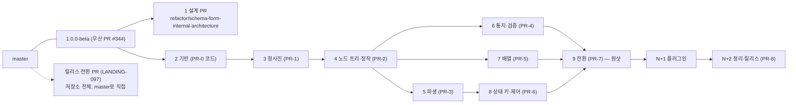

# 개발계획 — 단계별 PR과 독립 검증

> 2026-09-27. 정본은 원장 `../ledger/`다. 이 문서들은 원장의 PR 정의(LANDING-058·060–068·071·072·081–097·159)를 개발 순서로 다시 읽은 표면이며, 어긋나면 원장이 이긴다. 문장의 근거는 괄호 안 원장 ID다. 인용한 ID가 모두 현행인지는 `node ledger/checks/plan-links.mjs plan/*.md -- ledger/*.md`가 검사한다.

## 1. 우산 구조

자식 PR은 모두 `1.0.0-beta`를 base로 열고 merge commit으로 들어온다. 원샷이어야 하는 것은 전환 PR(PR-7)과 `master` 병합 둘뿐이고 나머지는 독립이다(LANDING-058). 우산 브랜치는 PR-8 전에 배포하지 않는다(LANDING-159).

| 우산 순서 | 계획서 | 원장 단계 | 의존 | 병렬 |
| --- | --- | --- | --- | --- |
| 1 | [pr-design.md](pr-design.md) | PR-0의 문서 부분(LANDING-060) + 이 계획 | 없음 | — |
| 2 | [pr-0-foundation.md](pr-0-foundation.md) | PR-0의 코드 부분(LANDING-060·090) | 없음 | 1과 병렬 |
| 3 | [pr-1-blueprint.md](pr-1-blueprint.md) | PR-1(LANDING-061·081·091) | 2 | — |
| 4 | [pr-2-node-and-settle.md](pr-2-node-and-settle.md) | PR-2(LANDING-062·082·092) | 3 | — |
| 5 | [pr-3-derive.md](pr-3-derive.md) | PR-3(LANDING-063·083) | 4 | 6·7과 병렬 |
| 6 | [pr-4-dispatch-and-validation.md](pr-4-dispatch-and-validation.md) | PR-4(LANDING-064·084·093) | 4 | 5·7과 병렬 |
| 7 | [pr-5-array.md](pr-5-array.md) | PR-5(LANDING-065·085·094) | 4 | 5·6과 병렬 |
| 8 | [pr-6-state-and-controls.md](pr-6-state-and-controls.md) | PR-6(LANDING-066·086) | 5 | — |
| 9 | [pr-7-switch.md](pr-7-switch.md) | PR-7(LANDING-067·087·095) | 3–8 전부 | 원샷 |
| N+1 | [pr-plugins.md](pr-plugins.md) | PR-4·PR-7에서 떼어 낸 플러그인 몫 | 9 | — |
| N+2 | [pr-8-release-and-cleanup.md](pr-8-release-and-cleanup.md) | PR-8(LANDING-068·096) | N+1, 릴리스 전환 PR | — |
| 별도 | [pr-release-transition.md](pr-release-transition.md) | 릴리스 전환(LANDING-097) | 없음 | 언제든, PR-8 전 |

## 2. 단계마다 독립적으로 검증되는 까닭

한 PR을 그 PR만으로 통과시키는 장치는 넷이다.

1. **옛 엔진이 PR-7까지 `<Form>`을 그대로 섬긴다.** `src/core/index.ts`·`src/index.ts`는 PR-7까지 옛 엔진을 가리키고, 새 엔진은 그때까지 `<Form>`에 닿지 않는다(LANDING-159 규칙 3). 그래서 오늘의 시험 전체가 매 PR의 회귀 신호이고, 각 PR이 새로 쓰는 영역의 옛 파일은 `src/__legacy__/`로 옮겨 상대 경로 그대로 돈다(LANDING-159).
2. **새 fractal은 레거시를 가져오지 않는다.** 파일 한정 ESLint `no-restricted-imports`로 막고 PR-1에서 건다(LANDING-159 규칙 1). 새 코드의 시험은 새 코드만 본다.
3. **자기 기제만 시험한다.** 게이트처럼 다른 PR의 기제는 술어 인터페이스 뒤의 대역 하나로 세우고, 미룬 사례는 어느 PR이 받는지 적는다(TEST-069). 정착 루프 시험은 타이머 없이 단언하고 프로토타입 회귀를 이식한다(TEST-003).
4. **엔진 수준 시나리오가 PR마다 자란다.** 시나리오는 실행기 없는 순수 데이터 모듈이고(TEST-008), 코어 러너가 React 없이 돌린다(LANDING-090). PR-2부터 각 PR이 자기 상황 목록을 넣고, PR-4 뒤에는 독립 검증기와의 판정 동치(차등 테스트)를 돌린다(LANDING-071, TEST-001). 사용자 관점의 렌더 동작은 PR-7에서 처음 검증되므로 위험은 거기 모이며, 완화는 이 두 가지다(LANDING-071).

그 위에 PR마다 게이트가 있다: 벤치 행(옛 판보다 느린 항목은 이유를 적고 소유자가 받아들여야 병합, TEST-027; PR-2·3·5의 회귀 항목), 공개 형의 `tsc --strict`(TEST-070), 18라운드 닫기 블록이 PR에 배정한 확인 항목(각 계획서의 "검증 게이트" 절, 원문은 `reviews/round-18-closing.md`).

## 3. 하나의 PR로 뭉칠 것인가

권장은 **단계별 PR**이다. 까닭은 셋이다. (1) 위 장치 1–3이 성립하는 것은 단계가 나뉘어 있을 때다. 하나의 PR이면 새 엔진이 `<Form>`에 닿는 순간까지 회귀 신호가 옛 시험 하나뿐이고, 3만 줄 규모의 리뷰가 원샷이 된다. (2) 원장이 원샷으로 정한 것은 PR-7과 `master` 병합 둘뿐이다(LANDING-058, LANDING-072). (3) PR-3·4·5는 서로 병렬이므로 세션을 나눠 진행할 수 있다.

다만 **경계가 얇은 인접 단계는 합칠 수 있다.** 합쳐도 장치 1–4가 깨지지 않는 조합은 다음 둘이다.

| 합침 | 조건 | 얻는 것 |
| --- | --- | --- |
| 기반(PR-0 코드) + 청사진(PR-1) | 프로토타입 v7과 시나리오 뼈대가 청사진 시험의 하니스로 바로 쓰이므로 | PR 하나 감소 |
| 파생(PR-3) + 상태 키·제어(PR-6) | PR-6이 PR-3만 의존하고 둘 다 `settle/`의 계산 단계다(LANDING-083·086) | PR 하나 감소, 정착 단계 리뷰 한 번 |

이 두 합침을 다 쓰면 개발 PR은 여섯(기반+청사진, 노드·정착, 파생+상태 키, 통지·검증, 배열, 전환)이다. PR-2와 PR-7은 어느 것과도 합치지 않는다.

## 4. 소유자 결정이 필요한 것

| 번호 | 물음 | 원장의 현재 위치 | 권장 |
| --- | --- | --- | --- |
| P1 | 플러그인 일을 어디에 두는가 | ajv6·7·8의 `compileGuard`는 PR-4(LANDING-064·093), UI 플러그인 27파일의 `presentation.*` 이주와 자사 플러그인 수정은 PR-7(LANDING-067·078·151·198) | PR-4는 계약(`app/plugin/type.ts`)과 ajv8 하나만 구현해 차등 시험을 돌리고, ajv6·7과 UI 플러그인 넷은 N+1 플러그인 PR로 뗀다. PR-7은 기본 입력으로 검증한다. 채택하면 LANDING-064·067·093·151에 충돌 줄을 적는다 |
| P2 | `src/__legacy__/` 삭제 시점 | PR-7이 진입점을 바꾸고 디렉토리를 통째로 지운다(LANDING-159 규칙 4) | 원장대로 PR-7에서 지운다. "가리키는 import가 하나도 없다"는 점검이 같은 PR에서 닫힌다. N+2 정리 PR의 "레거시 정리"는 옛 스토리·옛 설계문서 백업·스파이크 이식·벤치 기준선 정리로 한정한다 |
| P3 | §3의 합침 채택 | 원장은 PR-0…PR-8 아홉 단계 | 두 합침 모두 채택(개발 PR 여섯). 채택하면 이 계획서의 순서 표만 고치고 원장은 그대로다(단계 정의는 바뀌지 않음) |
| P4 | 릴리스 전환 PR의 시점 | PR-8 전 병합, PR-0과 순서 없음(LANDING-097) | 우산과 독립으로 `master`에 직접 연다. 시점은 소유자가 정한다 |

## 5. 계획서의 공통 형식

각 계획서는 같은 절을 가진다: 목적 → 우산 안의 자리 → 범위(원장이 정한 내용) → 부딪히는 코드·그대로 쓰는 것·새 fractal → 레거시 이동 → 착수 전 닫을 것 → 검증 게이트 → 완료 기준 → 원장 항목 색인. "원장 항목 색인"과 "18라운드 닫기 블록의 게이트 줄"은 원장에서 기계로 뽑은 것이다(`plan-links.mjs`가 ID의 현행 여부를 검사한다). 착수 전 닫을 것은 18라운드에서 모두 닫혀 열림이 0이므로(HANDOFF §1) 각 계획서는 그 닫힌 위치만 가리킨다.
