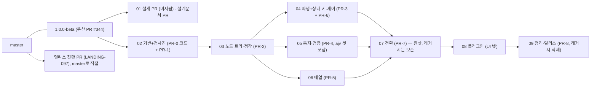

# 개발계획 — PR별 디렉토리

> 2026-09-27. 정본은 원장 `../ledger/`다. 이 디렉토리는 원장의 PR 정의(LANDING-058·060–068·071·072·081–097·159)와 소유자의 개발계획 결정(LANDING-204·205·206, PROCESS-067)을 개발 단위로 다시 읽은 표면이며, 어긋나면 원장이 이긴다. 인용한 ID가 모두 현행인지는 `node ledger/checks/plan-links.mjs plan/*.md plan/*/*.md -- ledger/*.md`가 검사한다.

## 1. 디렉토리를 쓰는 법

개발 PR마다 디렉토리 하나에 문서 셋이 있다(PROCESS-067). 개발자는 그 디렉토리만 보고 개발하고, 그 PR은 단독으로 검증되어야 한다.

| 파일 | 무엇 | 언제 읽는가 |
| --- | --- | --- |
| `request.md` | 개발요청서 — 목적, 범위(원장 항목 링크), 부딪히는 코드와 새 fractal, 레거시 이동, 산출물, 완료 기준, 절차 | 착수 때, 매일 |
| `verification.md` | 그 PR의 검증 구성요건 — 시험 구성, 게이트, 벤치 행, 합격 판정, 리뷰 체크리스트 | 시험을 쓸 때, PR을 열 때 |
| `adr-and-axes.md` | 이 PR이 지켜야 하는 ADR과 핵심 축 — 어긋나면 안 되는 원리와 결정, 그 출처 | 설계 판단이 갈릴 때 |

원장 항목은 `AREA-nnn`으로 인용한다. 원문은 `ledger/<area>.md`에서 `### AREA-nnn`을 찾는다. 계획서가 원장과 다르게 읽히면 코드는 원장을 따르고, 원장이 틀렸다면 새 라운드 항목으로 기록한 뒤 고친다.

## 2. 우산 구조와 순서

| 순서 | 디렉토리 | 원장 단계 | 의존 | 병렬 |
| --- | --- | --- | --- | --- |
| 01 | [01-design-docs/](01-design-docs/) | PR-0의 문서 부분(LANDING-060) — 설계 PR #345는 머지됨, 남은 설계문서 PR | 없음 | 02와 병렬 |
| 02 | [02-foundation-and-blueprint/](02-foundation-and-blueprint/) | PR-0의 코드 부분 + PR-1(LANDING-060·090·061·081·091) | 없음 | 01과 병렬 |
| 03 | [03-node-and-settle/](03-node-and-settle/) | PR-2(LANDING-062·082·092) | 02 | — |
| 04 | [04-derive-and-controls/](04-derive-and-controls/) | PR-3 + PR-6(LANDING-063·083·066·086) | 03 | 05·06과 병렬 |
| 05 | [05-dispatch-and-validation/](05-dispatch-and-validation/) | PR-4(LANDING-064·084·093), ajv6·7·8 포함 | 03 | 04·06과 병렬 |
| 06 | [06-array/](06-array/) | PR-5(LANDING-065·085·094) | 03 | 04·05와 병렬 |
| 07 | [07-switch/](07-switch/) | PR-7(LANDING-067·087·095), 레거시 보존 | 02–06 전부 | 원샷 |
| 08 | [08-plugins/](08-plugins/) | UI 플러그인 넷(LANDING-206) | 07 | — |
| 09 | [09-release-and-cleanup/](09-release-and-cleanup/) | PR-8(LANDING-068·096) + `src/__legacy__/` 삭제(LANDING-205) | 08, 릴리스 전환 PR | — |
| 별도 | [release-transition/](release-transition/) | LANDING-097 | 없음 | 언제든, 09 전 |

자식 PR은 모두 `1.0.0-beta`를 base로 열고 merge commit으로 들어온다(LANDING-204). 원샷이어야 하는 것은 전환 PR과 `master` 병합 둘뿐이다(LANDING-058). 우산 브랜치는 PR-8 전에 배포하지 않는다(LANDING-159).

## 3. 단계마다 독립적으로 검증되는 까닭

1. **옛 엔진이 07까지 `<Form>`을 그대로 섬긴다.** `src/core/index.ts`·`src/index.ts`는 전환 PR까지 옛 엔진을 가리키고 새 엔진은 그때까지 `<Form>`에 닿지 않는다(LANDING-159 규칙 3). 오늘의 시험 전체가 매 PR의 회귀 신호다. 각 PR이 새로 쓰는 영역의 옛 파일은 `src/__legacy__/`로 옮겨 상대 경로 그대로 돈다(LANDING-159). 레거시 디렉토리는 09까지 참고용으로 보존한다(LANDING-205).
2. **새 fractal은 레거시를 가져오지 않는다.** 파일 한정 ESLint `no-restricted-imports`로 막고 02에서 건다(LANDING-159 규칙 1).
3. **자기 기제만 시험한다.** 다른 PR의 기제는 술어 인터페이스 뒤의 대역 하나로 세우고, 미룬 사례는 받는 PR을 적는다(TEST-069). 정착 루프 시험은 타이머 없이 단언한다(TEST-003).
4. **엔진 수준 시나리오가 PR마다 자란다.** 시나리오는 실행기 없는 순수 데이터 모듈이고(TEST-008) 코어 러너가 React 없이 돌린다(LANDING-090). 03부터 각 PR이 자기 상황 목록을 넣고, 05 뒤에는 독립 검증기와의 차등 테스트를 돌린다(LANDING-071, TEST-001).

그 위에 PR마다 게이트가 있다: 벤치 행(느린 항목은 이유를 적고 소유자가 받아들여야 병합, TEST-027), 공개 형의 `tsc --strict`(TEST-070), 18라운드 닫기 블록이 배정한 확인 항목(각 `verification.md`).

## 4. 개발 절차 — seiri와 filid (PROCESS-067)

- **filid(구조).** 새 fractal은 `INTENT.md`(공개 경계)와 `DETAIL.md`(구현 계약)를 코드보다 먼저 쓴다. 분류는 파일로 정해진다(INTENT → fractal, 관례 이름 → organ). 형제 fractal은 진입점으로만 건너고, organ은 소유자 하위 트리 안에서만 직접 가져온다. 외부에서 organ을 쓰는 예외는 소유 fractal의 `DETAIL.md`에 이유와 함께 적는다. 스캔·검증은 PR 경계에서 한 번 돌리고, 경고는 발견으로 기록한다. `max-depth` 14.
- **seiri(코드).** 저장소의 `seiri_*` 규칙(agent-legible, code-comments, cognitive-discipline, context-efficiency, function-boundaries, naming, public-contract, reuse-first, structure, test-validity)이 늘 적용된다. 게이트(`seiri gates`)는 PR 경계에서 돌린다. 한 파일에 내보낸 함수 하나, 문서 주석은 매개변수·결과·목적, 이름은 형제를 따른다.
- **PR 본문.** `request.md`의 완료 기준과 `verification.md`의 리뷰 체크리스트를 그대로 옮겨 하나씩 닫는다. 원장과 어긋난 발견은 본문에 ID와 함께 적는다.
- **사람.** 구현은 한 세션이 설계하고 worker가 적용, verifier가 게이트를 대조, codex·antigravity 교차 확인 한 번, 그다음 PR을 열어 소유자 리뷰. 04·05·06은 세션을 나눠 병렬로 진행할 수 있다.

## 5. 소유자 결정 기록

| 물음 | 결정(2026-09-27) | 원장 |
| --- | --- | --- |
| 플러그인 일의 자리 | ajv6·7·8은 원장대로 05(PR-4)에서 셋 다. UI 플러그인 넷은 08 플러그인 PR로 | LANDING-206 |
| `src/__legacy__/` 삭제 | 09까지 참고용 보존, 07은 import 0 점검만, 삭제는 09 | LANDING-205 |
| 인접 단계 합침 | 기반+청사진, 파생+상태 키·제어 → 개발 PR 여섯 | LANDING-204 |
| 릴리스 전환 PR | 시점은 소유자가 정한다 | LANDING-204 |
| 설계문서 | 별도 설계문서 PR, 02와 병렬 | LANDING-060 보충 |
| 계획서 형식 | 디렉토리마다 문서 셋, seiri·filid 절차 | PROCESS-067 |
