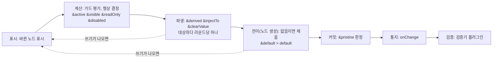
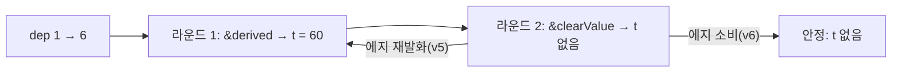
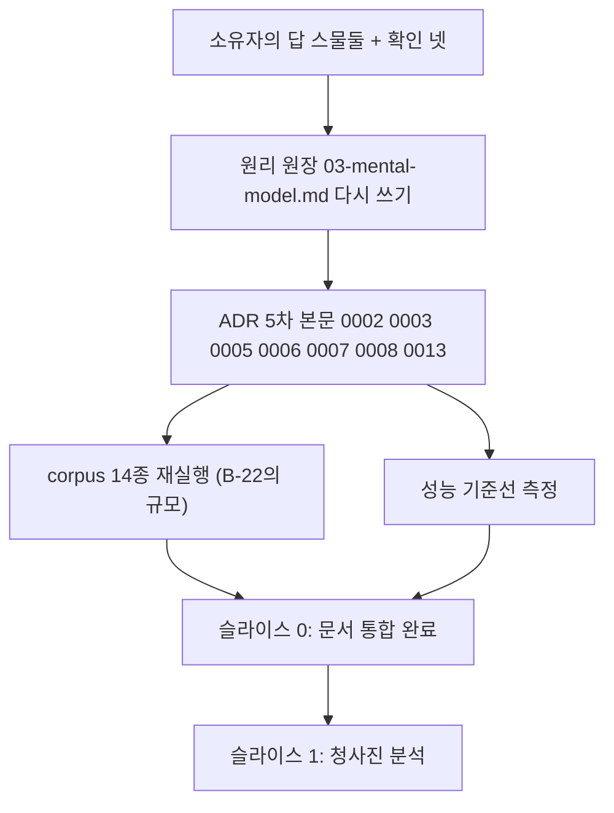

# 소유자 검토서 — 답하실 항목 스물둘과 확인 항목, 배경·근거·예시 포함

2026-09-23. `07-conclusions.md`(최종 결론 2판)의 5절과 4절 핵심을 답하기 쉽게 풀어 쓴 것입니다. 각 항목의 끝에 **답:** 줄이 있습니다. 그 줄에 예·아니오·다른 답을 달아 주시면 됩니다. 근거의 원문은 `07-conclusions.md`, `reviews/round-10-derivation.md`, `reviews/round-9-spec.md`에 있습니다.

표기. **도출** = 축(원리·목표·소유자의 열 항목)이 답을 하나로 정함. **권고** = 축이 두 답을 허용하나 검토자 셋이 같은 쪽으로 기움. **정책** = 소유자의 것.

---

## 0. 먼저 그림 하나 — 값이 오가는 자리

정착(settle)은 쓰기 하나가 들어온 뒤 트리가 안정될 때까지의 한 번이며, 예약 층(`&` 키)의 쓰기는 파생 단계에, 채움은 노드 생성(전이) 단계에 놓입니다.



---

## A. 확인만 받을 것 — 07의 3절·4절 핵심 넷

### A-1. 채움은 노드가 생길 때 한 번, 원천은 `&default` > `default` (07 4.22)

- **배경.** 소유자의 답 A("노드가 생길 때 채운다")를 받았습니다. "생김"의 단위가 조각인지 노드인지가 남아 있었고, 실행으로 노드 단위가 명세와 맞는 것을 확인했습니다.
- **규칙.** 노드가 직전 커밋의 형상에 없고 이번 정착의 최종 형상에 있을 때만 생긴 것으로 보고, 값이 없음이면 `&default`(표현식) > `default`(표준) > 없음 순으로 한 번 채웁니다. 이미 있던 노드는 새 조각이 켜져도 다시 채우지 않습니다.
- **예시.**

```json
{
  "type": "object",
  "properties": { "kind": { "type": "string" }, "x": { "type": "string" } },
  "allOf": [
    { "if": { "properties": { "kind": { "const": "a" } }, "required": ["kind"] },
      "then": { "properties": { "x": { "default": "A" } } } },
    { "if": { "properties": { "kind": { "const": "b" } }, "required": ["kind"] },
      "then": { "properties": { "x": { "default": "B" } } } }
  ]
}
```

| 순서 | 결과 | 왜 |
| --- | --- | --- |
| `{kind:'a'}` 로드 | `x = 'A'` | 로드에서 `x`가 생김, 켜진 조각의 `default` |
| 사용자가 `x`를 지움, `kind`를 `'b'`로 | `x` 없음 | `x`는 본체 노드라 이미 있었음. 다시 채우지 않음 |
| `{}` 로드 뒤 `kind`를 `'a'`로 | `x` 없음 | 같은 이유. `x`는 로드 때 이미 생겼음(기본값 없이) |

- **답:**

### A-2. 노드 게이트 `&active`는 조각 게이트와 같은 장치 (07 4.24, 5.2의 10)

- **배경.** `&if`를 `&active`로 통합하기로 하셨습니다. 그 귀결로, 노드 스키마의 `&active`가 거짓이면 그 노드는 형상에 없습니다(원본은 남고 `getInactiveValues`로 읽습니다). 프로토타입 첫 판은 반대로 동작해 고쳤습니다.
- **예시.**

```json
{ "properties": {
    "vip": { "type": "boolean" },
    "discount": { "type": "number", "&active": "../vip === true", "default": 10 }
} }
```

| 순서 | 결과 |
| --- | --- |
| `{vip:false}` 로드 | `discount`는 형상에 없음, 채우지 않음 |
| `vip`를 `true`로 | `discount`가 생김, `10`으로 채움 |
| `discount`를 지우고 `vip`를 `false`→`true` | 다시 생김, 없음이므로 다시 `10` |

- **답:**

### A-3. 폼은 분기를 고르지 않는다 (07 4.25)

- **배경.** 소유자의 1항과 읽기 1. `oneOf`·`anyOf`는 검증 조건이지 형상 선언이 아닙니다. 판별식 식별, `selection` 칸, `setSelectedBranch`, 동점 규칙이 모두 사라지고 상태 칸은 원본과 `extras` 둘뿐입니다.
- **분기의 세 표현.** (가) 분기 안의 `if/then/else` 조각, (나) 예약 층(`&active`, 자식 집합 제어), (다) 둘 다 없는 순수 분기(작성자 책임, 모든 분기가 켜짐).
- **컨벤션(ajv 실측).** `oneOf`/`anyOf`의 분기에 `if`를 쓰면 `else: false`와 `if`의 `required`가 함께 필수입니다.

```json
{ "type": "object",
  "properties": { "kind": { "type": "string" } },
  "oneOf": [
    { "if": { "properties": { "kind": { "const": "card" } }, "required": ["kind"] },
      "then": { "properties": { "cardNumber": { "type": "string" } }, "required": ["cardNumber"] },
      "else": false },
    { "if": { "properties": { "kind": { "const": "bank" } }, "required": ["kind"] },
      "then": { "properties": { "accountNumber": { "type": "string" } }, "required": ["accountNumber"] },
      "else": false }
  ] }
```

| 배치 | 올바른 값 | 누락 값 | 조건 없는 값 `{kind:'x'}` |
| --- | --- | --- | --- |
| `if/then`만 (`else` 없음) | **거부** | 통과 | 거부 |
| `if/then` + `else: false` | 통과 | 거부 | 거부 |
| `required` 없음 | `{x:'s'}`처럼 조건 프로퍼티가 없는 값이 통과하고, 빈 값에서 모든 분기가 켜짐 | | |

- **답:**

### A-4. 한 정착 안에서 한 규칙의 에지는 한 번만 소비 (07 4.30, 편집자 판정)

- **배경.** 10라운드에서 드러났습니다. 규칙의 에지(값이 바뀜)는 직전 커밋과 비교하는데, 한 정착 안에서 라운드가 돌면 같은 변화가 라운드마다 다시 발화합니다.
- **예시.**

```json
{ "properties": {
    "dep": { "type": "number" },
    "t": { "type": "number", "&derived": "../dep * 10", "&clearValue": "@.value > 50" }
} }
```

`dep`를 1에서 6으로 바꾸면 `t`는 60이 되고, 60 > 50이라 지워지고, 다음 라운드에 `dep`의 변화가 다시 발화해 60이 되고… 25라운드 예산 초과가 나며 원본 B 커밋이 옛 값 `t = 10`을 남깁니다. 에지를 한 번만 소비하면 3라운드에 `t`가 지워진 채 안정됩니다(실험 v6).



- **답:**

---

## B. 소유자만 정할 것 (셋)

### B-22. 생성기가 만든 스키마를 그대로 받는 길을 둘 것인가 (`&discriminator`)

- **배경.** pydantic, zod, OpenAPI의 판별 union은 `const` 태그만 두고 `if`나 `else: false`를 두지 않습니다. A-3의 모델에서는 이런 스키마의 모든 분기가 동시에 켜집니다. 분기끼리 같은 이름·다른 종류(`value: string` 대 `value: number`)가 있으면 노드 공유 규칙의 충돌이 됩니다. 소유자의 앞선 발언 "서버에서는 oneOf anyOf를 실제로 많이 쓴다"(`adr/0002:141`)와 닿습니다.
- **근거.** 1항은 특수 문법을 쓰지 않되 "추가해야할 근거가 있다면 상당한 이유로 제안하라"고 했습니다. 7항은 "jsonSchema 로직과 동일한 로직을 &에 넣어야 할 수도 있고"라고 했습니다.
- **제안.** 작성자가 union 호스트에 명시하는 예약 층 설탕 문법. 각 분기의 그 키 `const`를 읽어 분기별 `&active`로 바꿉니다. 변환은 청사진(정적 분석) 단계에서 끝나 상태 칸과 코어 루프를 바꾸지 않습니다.

```json
{ "type": "object",
  "properties": { "kind": { "type": "string" } },
  "&discriminator": "kind",
  "oneOf": [
    { "properties": { "kind": { "const": "card" }, "cardNumber": { "type": "string" } }, "required": ["kind", "cardNumber"] },
    { "properties": { "kind": { "const": "bank" }, "accountNumber": { "type": "string" } }, "required": ["kind", "accountNumber"] }
  ] }
```

위는 아래와 같게 읽힙니다.

```json
{ "oneOf": [
    { "&active": "../kind === 'card'", "properties": { "cardNumber": { "type": "string" } } },
    { "&active": "../kind === 'bank'", "properties": { "accountNumber": { "type": "string" } } }
] }
```

- **예이면.** 3.4에서 지운 판별식 읽기가 "작성자가 명시했을 때만" 되살아납니다. `adr/0009`의 "`const` 직접 비교는 넣지 않는다"와의 관계를 정합니다. **아니오이면.** 그런 스키마는 작성자가 `if/then/else: false`나 `&active`를 덧붙여야 하며, 이주 안내와 ADR 0010이 절차를 적습니다. 코드 전에 corpus 14종을 v5로 돌려 규모를 재기로 했습니다(07 11.1의 3).
- **답:**

### B-12. 루트 스키마의 `readOnly: false`가 하위 잠금을 푸는 오늘 동작을 버릴 것인가

- **배경.** 오늘 코드는 `rootJSONSchema[f] ?? jsonSchema[f] ?? computed[f] ?? &f` 순이라 루트 키가 정의되어 있으면 값이 `false`여도 노드의 식을 덮습니다. 새 결합 규칙(07 4.26)은 `readOnly`·`disabled`를 OR(하나라도 잠그면 잠김)로 합칩니다.
- **근거.** 10항 "글로벌·로컬 경합도 기존과 같이"와 G4(특수 경로 없음, 루트도 "가장 위의 조상")가 정면으로 부딪힙니다.

```json
{ "type": "object", "readOnly": false,
  "properties": {
    "name": { "type": "string", "&readOnly": "../locked === true" },
    "locked": { "type": "boolean" }
} }
```

| `locked` | 오늘(루트 우선) | OR 결합 |
| --- | --- | --- |
| `true` | `name` 편집 가능(루트 `false`가 덮음) | `name` 잠김 |
| `false` | 편집 가능 | 편집 가능 |

- **예(버림)이면.** 루트 키는 조상 하나가 되어 특수 조회가 사라지고, 루트 `readOnly: false`는 아무것도 풀지 못합니다(이주 항목). **아니오이면.** 루트 키의 특수 조회를 남기고, 그것이 중간 조상의 잠금까지 덮는지 따로 정해야 합니다(B-13과 함께).
- **답:**

### B-1. 예산 초과만으로 Form이 제출을 막을 것인가

- **배경.** 자동 쓰기가 가드를 뒤집어 정착이 수렴하지 않으면 자동 쓰기를 모두 뺀 원본 B를 커밋하고 `diagnostics.status = 'budgetExceeded'`로 알립니다. 이것은 작성자의 규칙 결함이 데이터로 촉발된 것이지 값이 스키마에 맞지 않는다는 뜻이 아닙니다.
- **근거.** G1은 폼이 더 엄격해지는 것을 "표준 판정에 AND로 덧붙는 형태"로 허용합니다. P5는 코어가 제출을 모른다고 합니다. 축은 두 답을 허용합니다.

| 선택 | 사용자가 보는 것 | 대가 |
| --- | --- | --- |
| 신호만(권고) | 검증기를 통과한 값이 제출됨. 호스트가 `onDiagnosticsChange`로 선별 차단 가능 | 자동 쓰기가 빠진 값이 제출될 수 있음(그래도 검증기 통과 값) |
| AND 차단 | 필드 에러 없이 제출이 거절됨 | 사용자가 원인을 고칠 수 없음. 폼 수준 표시가 새로 필요 |

- **답:**

---

## C. 확인만 받을 것 (다섯) — 검증자 판정은 도출

### C-10. 노드 게이트 통합(A-2와 같음)

- **답:**

### C-11. 런타임에 "없음일 때만 채우는" 예약 키가 따로 필요한가 → 아니오

- **근거.** 규칙 A(노드가 생길 때 한 번, "빠질 때마다" 채우지 않음)가 그런 키를 둘째 채움 장치로 만듭니다. 오늘 그런 키가 없어 G2(표현력 유지)가 요구하지 않습니다. 런타임 계산은 `&derived`가 맡습니다.
- **답:**

### C-15. `&children`에는 상태 키(`active`·`visible`·`readOnly`·`disabled`)만 허용 → 예

- **근거.** 예약 층 뜻 표가 `&children`을 "자식 집합에 상태 키를 건다"로 정했습니다. 값 키(`derived`·`injectTo`·`clearValue`)까지 허용하면 대상마다 식이 필요해 같은 대상 규칙과 얽힙니다.
- **답:**

### C-20. 같은 `oneOf`의 게이트 가진 분기가 둘 이상 동시에 켜지면 개발 모드에서 경고 → 예

- **근거.** 소유자가 읽기 1에서 "oneOf 복수 브랜치 일치 문제"를 풀 문제로 불렀습니다. 경고는 게이트 결과(켜진 분기 수)만 세므로 1항의 "활성화 되는지만 본다" 안이고, C2(작성자 실수의 가시성)가 개발 모드 경고를 채택했습니다. `anyOf`는 여럿이 정상이므로 `oneOf`에만 냅니다.
- **답:**

### C-2. `Merge`로 `extras` 키에 `undefined`를 쓰면 그 키가 없어짐 → 예(`removeKey` 불필요)

- **근거.** 리프 규칙 "`undefined`를 쓰면 없음"(ADR 0013)과 G4. 규칙을 두지 않으면 "없음으로 만들기"에 `removeKey`라는 둘째 장치가 남습니다.

```ts
form.setValue({ legacyField: undefined }, SetValueOption.Merge); // legacyField(extras)가 사라짐
```

- **답:**

---

## D. 권고에 동의하시면 "예" (넷) — 검토자 셋이 같은 방향

### D-6. 로드에서 작성자의 `&injectTo`가 호출자가 준 대상 값을 덮는가 → 권고 `fire`(덮는다)

- **배경.** 서버에서 `{ price: 100, total: 90 }`을 받았고 스키마가 `price`를 `total`에 주입합니다. 마운트, `reset()`, `setValue(V)` 전체 교체가 모두 이 장면입니다.
- **근거.** 6·8항이 예약 층을 "값을 제어하는" 층으로 세웠습니다. `fill`(없음일 때만 채움)은 한 장치에 로드 모드를 하나 더 다는 것이며, P2에 "로드에서는 작성자 규칙도 호스트 값을 덮지 않는다"는 문장을 넣어야 성립합니다. 06은 이것을 "스키마의 규칙이 진실인가, 받은 데이터가 진실인가"라는 제품의 가치로 분류했습니다. 데이터가 위여야 하는 호출은 `SetValueOption.DisableAutomaticWrites`로 그 로드의 자동 쓰기 전부를 끕니다.

```json
{ "properties": {
    "price": { "type": "number", "&injectTo": "(value) => ({ '../total': value })" },
    "total": { "type": "number" }
} }
```

| 로드 `{price:100, total:90}` | `total` |
| --- | --- |
| `fire` | 100 |
| `fill` | 90 (없음일 때만 채움) |
| `fire` + `DisableAutomaticWrites` | 90 |

- **답:**

### D-7. 켜진 조건부 조각의 주석 키워드(`title`·`description` 등)가 본체를 덮는가 → 권고 예(C)

- **배경.** 조건 프로퍼티는 본체 `properties`에 있어야 하므로(2항) 본체와 조각이 같은 노드에 주석을 두는 일이 흔해집니다.
- **근거.** 5항 "노드가 지금 가진 제약을 최신화해 제공". 먼저 선언된 것이 이기면(F) `then`이 본체 노드에 적은 `title`은 영영 보이지 않습니다. RJSF 6.6.1 실측도 C입니다. 다만 5항은 "커스텀 필드 병합은 고민해볼 필요가 있다"고 열어 두었습니다.

```json
{ "properties": { "kind": { "type": "string" }, "amount": { "type": "number", "title": "금액" } },
  "if": { "properties": { "kind": { "const": "refund" } }, "required": ["kind"] },
  "then": { "properties": { "amount": { "title": "환불 금액" } } } }
```

`kind === 'refund'`일 때 C는 "환불 금액", F는 "금액"입니다.

- **답:**

### D-14. `&children`의 값 형태 → 권고 (나) 대상 집합별 제어 묶음

```json
{ "type": "object",
  "&children": [
    { "targets": ["name", "email"], "readOnly": "../locked === true" },
    { "targets": ["note"], "visible": "../showNote === true" }
  ],
  "properties": { "locked": {}, "showNote": {}, "name": {}, "email": {}, "note": {} } }
```

- **근거.** 조각 범위 제어(`allOf: [{ "&readOnly": "...", "properties": {...} }]`)와 노드 자신의 `&` 키와 같은 모양(G4)이고, 소유자의 "컨트롤 블록" 발언과 맞습니다. (가) 제어 종류별 `{ readOnly: { targets, expression } }`는 대상 목록이 제어마다 되풀이됩니다. 대상은 직계 자식 이름만.
- **답:**

### D-17. 켜진 게이트 조각끼리 겹치면 전순서에서 나중 조각이 이기는가 → 권고 예

- **근거.** 전순서는 본체 < `allOf` 항목 < `if/then/else` < 분기, 같은 종류 안은 소스 순서입니다. D-7에서 C를 고르면 "뒤가 앞을 덮는다"가 한 방향으로 일관됩니다.
- **답:**

---

## E. 수렴하지 않은 것 (열) — 권고를 적었습니다

### E-8. 같은 정착에서 같은 대상에 쓰는 `&clearValue`가 `&derived`·`&injectTo`를 이기는가 → 권고 예

- **근거.** 실험에서 두 후보의 예산 초과·쓰기 손실·순서 의존 집계가 모두 같아 안전성으로는 갈리지 않습니다. 뜻의 선택입니다. 지움은 참이 되는 순간의 명시 동작이고, 같은 정착에서 지운 값을 되살리면 작성자의 의도가 사라집니다.
- **답:**

### E-9. 같은 정착에서 `&injectTo`(남의 규칙)가 대상 자신의 `&derived`를 이기는가 → 권고 `&derived`가 이김

- **배경.** `a`가 `t`에 주입하고 `t`는 `b`에서 파생될 때, 한 정착에서 둘이 동시에 쓰면 대상별로 하나만 적용합니다(도출). 누가 이기는지는 축이 침묵합니다.
- **근거.** 실험: `inject-wins`와 `derived-wins`는 집계가 같고, "선언 순서" 후보만 선언 의존을 새로 만들어 예측 가능성에서 불리합니다. 자기 값의 출처를 자기 스키마에서 읽을 수 있어야 예측 가능하므로 `&derived`를 권합니다. 진 쓰기를 버릴지 다음 라운드 후보로 남길지도 함께 정합니다(권고: 버림. 실험에서 선언 의존이 더 적음).

```json
{ "properties": {
    "a": { "type": "number", "&injectTo": "(value) => ({ '../t': 'inj:' + value })" },
    "b": { "type": "number" },
    "t": { "type": "string", "&derived": "'der:' + ../b" }
} }
```

`batch(() => { set a=2; set b=2 })` 뒤 `t`는 권고대로면 `'der:2'`입니다.

- **답:**

### E-13. 중간 객체 노드의 `readOnly`·`disabled`가 자손을 잠그는가 → 권고 예

- **근거.** 결합 규칙 "제한은 교집합"(잠금은 OR로 아래로 전파)의 자연스러운 귀결이나, 오늘 코드에는 중간 조상 전파가 없어 10항 "기존과 같이"와 긴장합니다. B-12와 함께 답하시면 됩니다.

```json
{ "properties": { "address": { "type": "object", "readOnly": true,
    "properties": { "city": { "type": "string" } } } } }
```

권고대로면 `city`도 잠깁니다(오늘은 잠기지 않음).

- **답:**

### E-16. 무조건 조각(본체와 게이트 없는 `allOf` 항목) 사이의 주석·폼 전용 키를 나중-승으로 통일하는가 → 권고 예

- **근거.** 오늘은 `title`·`default`·`readOnly` 등은 먼저-승, 나머지는 나중-승으로 갈려 있습니다(G4에 어긋남). 나중-승으로 통일하면 D-7·D-17과 같은 방향이 됩니다. 반대 근거는 G8(RJSF는 `allOf`끼리 먼저-승)입니다.
- **답:**

### E-18. `options`는 키 단위로 얕게 병합하는가 → 권고 예

- **근거.** 오늘은 통째 교체입니다. 열린 컨테이너를 통째로 바꾸면 한 조각이 옵션 하나를 적을 때 다른 조각의 옵션 전체가 사라집니다.

```json
{ "options": { "placeholder": "이름", "maxLength": 20 },
  "allOf": [ { "if": {"...": "..."}, "then": { "options": { "placeholder": "회사명" } } } ] }
```

얕은 병합이면 켜진 뒤 `{ placeholder: '회사명', maxLength: 20 }`, 통째 교체면 `{ placeholder: '회사명' }`.

- **답:**

### E-19. 2항(조건 프로퍼티는 `properties`에)을 개발 모드에서 `if.properties`·`if.required`의 이름만 읽어 검사하는가 → 권고 예

- **근거.** 값이 아니라 이름만 읽으므로 P1′ 안이고 C2가 원합니다. 반대로 1항 "if 블록은 해석하지 않는다"와 닿습니다.
- **답:**

### E-21. `&clearValue`·`&pristine`의 조건이 참인 채로 `reset`이나 전체 교체가 오면 에지로 보는가(지우는가) → 권고 D-6과 같게

- **근거.** 확실한 것은 "마운트와 `reset`은 같아야 한다"(D-7·G4가 프로토타입의 혼합 동작을 지움)뿐입니다. 로드에서 발화하는지는 D-6의 `fire`와 같은 읽기입니다. 후보는 "로드에서 모두 지움"과 "로드에서 모두 지우지 않음" 둘이며, 마운트만 지우는 혼합은 후보가 아닙니다.
- **답:**

### E-23. 게이트 가진 분기의 `if`에 `required`가 없으면 개발 모드에서 경고하는가 → 권고 예

- **근거.** 빈 값에서 모든 분기가 켜지는 것은 대부분 실수입니다(A-3의 실측). 다만 "조건 프로퍼티가 없을 때 모두 켜기"가 의도일 수도 있어 작성자 의도를 단정합니다.
- **답:**

### E-4. `virtual`을 참조 그룹 노드로 바꾸고 `type: 'virtual'`을 값으로 남기는가 → 권고 예

- **근거.** D-6(참조 그룹 노드, 값을 소유하지 않는 읽기 전용 뷰)의 귀결. `virtual`은 오늘 `type`의 값이면서 객체 스키마의 키이기도 해 `&`를 붙이지 못합니다. D-6 자체가 "도출은 아니다"라 정책입니다.
- **답:**

### E-5. `dirty`·`touched`를 초기화하는 `&pristine`을 새 이름으로 바꾸는가 → 권고 `&resetInteraction`

- **근거.** 소유자 발언 "만든 사람도 헷갈리는 이름은 잘못 지은 것". 후보 `&resetTouched`는 `dirty`를 빠뜨립니다. 다른 이름을 주셔도 됩니다.
- **답:**

---

## F. 답의 귀결 요약

답이 모이면 원리 원장(`03-mental-model.md`)과 ADR 5차 본문을 쓰고, corpus 14종 재실행과 성능 기준선 측정 뒤 슬라이스 0으로 넘어갑니다.


