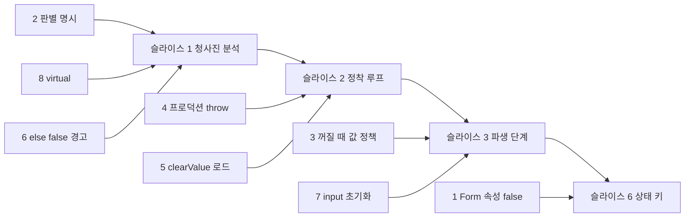
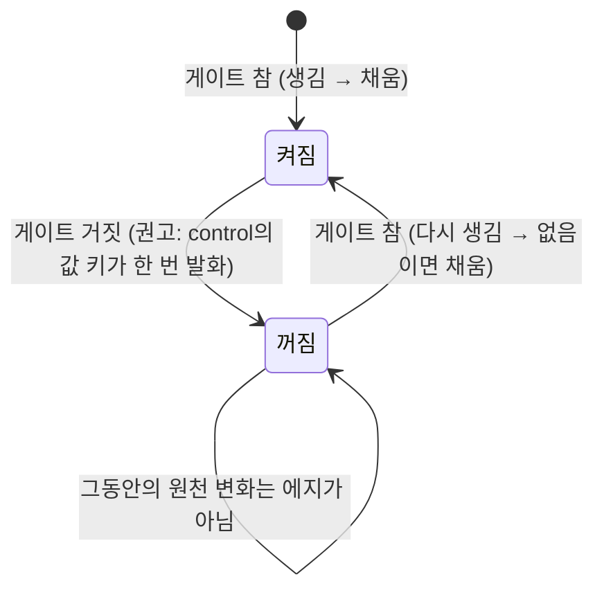

# 12라운드 — Vincent의 판단이 필요한 것 여덟 (원칙으로 닫히지 않는 것만)

2026-09-23. 11라운드의 두 검증(소유자 답 정합성, 착수 전 건전성)이 남긴 항목을 다시 갈랐다. 원칙에서 답이 나오는 것은 원장 `03-mental-model.md`에 이미 넣었고 이 문서 끝(§9)에 통보로만 적었다. 아래 여덟은 원칙이 두 갈래를 모두 허용하거나, Vincent의 전제가 오늘 코드와 달랐거나, Vincent의 원문을 편집자가 해석해야 했던 것이다. 항목마다 **권고**를 첫 줄에 두었다. 줄마다 "가/나/다" 또는 한 줄로 답해 주시면 된다.

별도로 `07-conclusions.md` §3–4의 통과(슬라이스 0의 조건)는 이 문서 밖의 일이다.



여덟 가운데 슬라이스 1을 막는 것은 2·8(과 경고 스위치 6)이다. 나머지는 뒤 슬라이스 전까지만 답이 있으면 된다.

---

## 1. Form 속성 `readOnly`·`disabled`가 `false`일 때 로컬 잠금을 푸는가

**권고: 가.** Form 속성은 참일 때만 덮고(OR), 루트 스키마 키는 정의되면 `false`여도 덮는다. 오늘 코드 그대로다.

**배경.** 답 12에서 "props로 전달되는 글로벌 값이 개별 값을 덮는다. rootJSONSchema도 props와 동치"라 하셨다. 그런데 오늘 코드에서 둘은 동치가 아니다. Form 속성은 OR(`readOnly={rootReadOnly || node.readOnly}`, `SchemaNodeInput.tsx:111`)이고, 루트 스키마 키만 정의되면 덮는다(`rootJSONSchema[fieldName] ?? …`). 축 10항의 "기존과 같이"를 지키려면 둘을 다르게 두어야 한다.

**왜 판단이 필요한가.** "동치"를 글자대로 적용하면 `<Form readOnly={isViewMode}>`에서 `isViewMode`가 `false`인 순간 모든 노드의 `&readOnly`가 풀린다. 답 13의 이유("모두 잠궈버려야 하는 조건")는 참일 때 덮는 것만 요구한다.

```jsonc
// Form: <Form readOnly={false} jsonSchema={schema} />
{
  "type": "object",
  "readOnly": false,                       // 루트 스키마 키(글로벌)
  "properties": {
    "email": { "type": "string", "&readOnly": "../locked === true" }
  }
}
// locked === true일 때 email은?
// 가: 루트 키 false가 정의되어 있으므로 풀림(답 12의 "오늘의 동작 유지"). Form 속성 false는 아무 것도 안 함.
// 나: Form 속성도 정의되면 덮음 → 풀림. Form 속성 쪽은 오늘과 달라져 이주 항목.
// 다: 둘 다 OR → locked면 잠김. 답 12(루트 false가 푸는 오늘의 동작 유지)와 충돌.
```

함께 정할 것: 글로벌 안에서 Form 속성 `true`와 루트 스키마 `readOnly: false`가 부딪치면? 권고는 Form 속성 `true`가 이긴다(OR가 마지막에 걸린다, 오늘과 같음).

| 선택 | 뜻 |
| --- | --- |
| 가 (권고) | Form 속성은 참일 때만 덮음. 루트 스키마 키는 정의되면 덮음. Form `true` > 루트 `false` |
| 나 | 둘 다 정의되면 덮음. Form 속성 `false`가 로컬을 푼다(이주 항목) |
| 다 | 둘 다 OR(참일 때만). 루트 `false`는 아무것도 안 함(답 12와 충돌) |

---

## 2. `&discriminator`는 명시해야만 동작하고, 오늘의 `const`·`enum` 자동 감지는 사라진다

**권고: 가.** 명시 필수. 명시 없는 `oneOf`·`anyOf`는 모든 분기가 켜진다. 자동 감지 삭제는 이주 항목. OpenAPI의 `discriminator.propertyName`은 인정하지 않는다(그것도 예약 층 밖의 문법이라 P1′의 "모양 문법만 읽는다"에 걸린다).

**배경.** 답 22에서 "그럼 현행과 같은 거 같긴 하군요"라 하셨다. 현행은 표시 없이 `const`·`enum`을 자동 감지한다(`getExpressionFromSchema.ts:35-51`). 새 설계는 작성자가 `&discriminator: 'kind'`를 적을 때만 청사진이 분기별 `&active`를 만든다. 그래서 오늘의 스키마를 그대로 올리면 union의 모든 분기 입력란이 한꺼번에 보인다. 11라운드 실측(생성기 스키마 14종)에서 12종은 `&discriminator` 한 줄로 되고, 2종(OpenAPI 3.0 mapping-only, pydantic `Optional[Union]`)은 공통 태그 키가 없어 어차피 안 된다.

**왜 판단이 필요한가.** 축 1항("enum·const를 판별식으로 쓰는 특수 문법은 쓰지 않는다")과 P1′에서 "명시 필수"가 나오지만, "현행과 같다"는 말씀이 자동 감지가 남는다는 뜻이었다면 축 1항 자체를 고쳐야 한다.

```jsonc
// 오늘: kind의 const를 자동 감지해 분기를 고름.
// 새 설계: 아래 한 줄이 없으면 card·bank 필드가 모두 보인다.
{
  "type": "object",
  "&discriminator": "kind",
  "properties": { "kind": { "enum": ["card", "bank"] } },
  "oneOf": [
    { "properties": { "kind": { "const": "card" }, "cardNumber": { "type": "string" } }, "required": ["kind", "cardNumber"] },
    { "properties": { "kind": { "const": "bank" }, "account":    { "type": "string" } }, "required": ["kind", "account"] }
  ]
}
// 청사진이 만드는 것: 분기 0에 &active "../kind === 'card'", 분기 1에 &active "../kind === 'bank'". 스키마는 손대지 않음.
```

| 선택 | 뜻 |
| --- | --- |
| 가 (권고) | 명시 필수. 자동 감지 삭제(이주 안내). OpenAPI `discriminator`도 읽지 않음 |
| 나 | 명시 필수이되 OpenAPI `discriminator.propertyName`은 같은 표시로 인정(생성기 산출물을 손대지 않고 받음. P1′에 예외 하나 추가) |
| 다 | 오늘처럼 자동 감지 유지(P1′와 축 1항 수정) |

---

## 3. 분기(조각)가 꺼질 때 대상의 값을 제거·변경하고 입력을 초기화하는 장치

**권고: 가.** 새 발화원 "조각(대상)이 켜짐→꺼짐이 되는 에지". 조각 객체와 `&children` 항목의 `control`에 둔 값 키(`clearValue`·`derived`·`resetInteraction`)는 그 에지에서 대상에 한 번 적용한다. 식 대신 `true`면 "꺼질 때 무조건".

**배경.** 답 15: "A 브랜치가 비활성화 될때, A의 값을 제거할지 남겨둘지, 혹은 변경할지, 그리고 input을 초기화할지 등을 제어해야 해서요. 좀 복잡해져도 거의 풀펑션을 지원하길 바랍니다." 그런데 오늘의 키에는 "꺼질 때"라는 발화원이 없다. `&clearValue`는 자기 식이 거짓→참일 때, `&derived`는 의존 값이 바뀔 때, 채움은 생길 때 발화한다. 게다가 `if`로 켜지는 조각은 게이트가 검증기가 컴파일한 스키마라 작성자가 그 부정을 식으로 적을 수 없다. 그래서 지금 문법으로는 "꺼질 때 제거"조차 표현되지 않는다.

**원칙이 답하는 부분.** 이것은 채움이 아니라 작성자 규칙의 쓰기(P2, 축 6항)이므로 답 11("런타임 채움 키는 두지 않음")·답 1("다시 채우지 않음")과 양립한다. P4("형상 변화는 쓰기가 아니다")는 폼이 스스로 지우지 않는다는 뜻이고, 작성자가 적은 규칙의 쓰기를 막지 않는다. 다시 켜질 때는 지금처럼 생긴 노드로서 채움(`&default` > `default`)을 받는다.

**원칙이 답하지 않는 부분.** 발화원을 어디에 둘 것인가.

```jsonc
{
  "type": "object",
  "properties": { "kind": { "enum": ["card", "bank"] } },
  "oneOf": [
    {
      "&active": "../kind === 'card'",
      "properties": { "cardNumber": { "type": "string" }, "cvc": { "type": "string" } },
      "control": {                      // 이 조각이 꺼지는 순간 조각이 선언한 노드에 적용
        "clearValue": true,             // cardNumber·cvc를 없음으로
        "resetInteraction": true        // dirty·touched 초기화
      }
    },
    {
      "&active": "../kind === 'bank'",
      "properties": { "account": { "type": "string" } },
      "control": { "derived": "'—'" }   // 꺼질 때 account를 '—'로 "변경"
    }
  ],
  "&children": [                        // 부모가 대상을 골라 같은 것을 걸 수도 있다
    { "targets": ["cardNumber", "cvc"], "control": { "clearValue": "../kind !== 'card'" } }
  ]
}
```



| 선택 | 뜻 |
| --- | --- |
| 가 (권고) | 새 발화원 "조각(대상)이 꺼지는 에지". 조각·`&children`의 `control` 값 키를 그 에지에서 적용. `true`는 "무조건" |
| 나 | 별도 키 `&onInactive: { clear: true \| keep \| derived: '…', resetInteraction: true }` 같은 꺼짐 정책 객체 |
| 다 | 지원하지 않음. `&active` 조각만 식으로 표현(`if` 조각은 불가). 답 15의 "거의 풀펑션"과 어긋남 |

---

## 4. 예산 초과 시 프로덕션에서도 throw하는가

**권고: 가.** 개발 모드 throw, 프로덕션은 `diagnostics` 신호만. Form 속성 하나(가칭 `throwOnBudgetExceeded`)로 프로덕션에서도 throw하게 켤 수 있다.

**배경.** 답 1: "권고를 따릅니다만, 기본적으론 form을 터트려서(error를 throw해서) 알려주는게 좋지 않을까 싶네요… 런타임에 발생할 확률은 비교적 낮겠고요." 답 4: "react의 hook과 동일한 설계." 편집자는 "권고를 따름"을 프로덕션 신호만, "기본적으론 throw"를 개발 모드로 나누어 적었다. 두 검증이 모두 이것을 편집자의 절충이라 지적했다. React는 프로덕션에서도 무한 렌더에서 throw한다.

**왜 판단이 필요한가.** 원칙은 둘 다 허용한다. C2(고지 의무)는 신호로 충족되고, "루프는 작성자의 잘못"은 throw를 지지한다. 제품 정책이다.

| 선택 | 뜻 |
| --- | --- |
| 가 (권고) | 개발 throw, 프로덕션 신호만. 속성으로 프로덕션 throw 켜기 가능 |
| 나 | 항상 throw(React처럼). 제출은 호스트의 에러 경계가 막는다 |
| 다 | 코어는 throw하지 않고 `diagnostics`만. 중단은 호스트가 |

---

## 5. `&clearValue`의 두 문장 확인, 그리고 `&resetInteraction`의 로드 동작

**권고: (a) 예, (b) 예, (c) 런타임 에지만.**

**배경.** 되물음 답 21: "최초 로드시에입니다. 런타임에는 false->true, true->false 경계에서만 동작하는걸 생각합니다." 편집자는 두 가지를 해석했다. (a) "최초 로드"를 마운트뿐 아니라 `reset`·전체 교체까지 모든 로드로 읽었다. 이유는 P3(마운트와 `reset`이 같아야 한다, D-7·G4). (b) "true->false 경계에서 동작"을 "아무것도 하지 않는다(값을 되살리지 않는다)"로 읽었다. 이유는 답 1("지운 값은 다시 채우지 않는다")과 양립하는 유일한 읽기이기 때문이다. (c) `&resetInteraction`의 로드 동작은 물었으나 답이 없었다.

```jsonc
{ "properties": { "mode": {}, "x": { "default": "D", "&clearValue": "../mode === 'r'" } } }
// 로드 {mode:'r', x:'v'} → x는 지워지고, 생긴 노드의 &clearValue가 참이므로 'D'도 채우지 않음 → {mode:'r'}
// mode → 'w'          → 참→거짓: (b) 아무 일 없음. x는 계속 없음
// mode → 'r'          → 거짓→참: x가 이미 없음이라 변화 없음
// reset() 같은 값     → (a) 로드이므로 로드된 값으로 다시 평가(마운트와 같음)
```

| 물음 | 권고 | 다른 읽기 |
| --- | --- | --- |
| (a) 모든 로드에서 로드된 값으로 평가 | 예 | 마운트만(그러면 `reset`과 마운트가 달라져 P3 위반) |
| (b) 참→거짓은 무동작 | 예 | 무언가 한다면 무엇을(편집자는 후보를 찾지 못했다) |
| (c) `&resetInteraction` 로드 | 런타임 거짓→참 에지만(로드 직후 `dirty`·`touched`는 어차피 초기) | 로드에서도 평가 |

---

## 6. `oneOf`·`anyOf` 분기에 `if`는 있고 `else: false`가 없을 때 개발 모드 경고를 두는가

**권고: 가(둔다).**

**배경.** 답 19·23: "`if`의 내용에 관여하면 끝이 없다", "우리가 참견할 문제는 아니다." 편집자는 이 경고를 도출로 유지했다. 검사는 `if`의 내용이 아니라 `else` 키의 유무만 본다. 검증자는 "답 19의 이유(`if` 내용을 읽지 않음)와는 맞지만 답 23의 이유(합법적 JSON Schema에 참견하지 않음)와는 안 맞는다"고, antigravity는 "불간섭 원칙 위반, 제거"라고 했다.

**왜 판단이 필요한가.** 두 원칙(C2 고지 의무, 답 23 불간섭)이 반대 방향을 가리킨다. 실질은 이렇다. `else: false`가 없는 분기는 "게이트 가진 분기"가 아니므로 답 20의 런타임 경고(둘 이상 켜짐)에도 잡히지 않는다. 그러면 `if`가 거짓인 분기가 조용히 켜진 채 남고, 작성자는 왜 필드가 다 보이는지 모른다. 이 경고가 유일한 신호다.

```jsonc
// 경고 대상: else가 없어 if가 거짓이어도 분기가 공허하게 통과한다(ajv 실측)
{ "oneOf": [
  { "if": { "properties": { "kind": { "const": "card" } }, "required": ["kind"] }, "then": { "properties": { "cardNumber": {} } } },
  { "if": { "properties": { "kind": { "const": "bank" } }, "required": ["kind"] }, "then": { "properties": { "account": {} } }, "else": false }
] }
// 첫 분기만 경고. 둘째는 else: false가 있어 게이트 가진 분기.
```

| 선택 | 뜻 |
| --- | --- |
| 가 (권고) | 둔다. 키 유무만 본다 |
| 나 | 두지 않는다. 정적 검사는 없고 런타임 경고(답 20)만. 컨벤션 문서(ADR 0010)로만 안내 |

---

## 7. 답 15의 "input을 초기화"는 무엇인가

**권고: 가.** `dirty`·`touched` 초기화(`resetInteraction`). 화면 입력란은 값이 바뀌면 렌더 계층이 따라온다.

**배경.** 편집자는 "input을 초기화"를 `resetInteraction`에 대응시켰다. 그런데 9라운드에 "input을 남겨두고 값만 지우는건"이라 쓰셔서, 그때의 "input"은 화면의 입력란을 뜻했다. 같은 낱말이 두 뜻일 수 있어 묻는다.

| 선택 | 뜻 |
| --- | --- |
| 가 (권고) | `dirty`·`touched` 초기화 |
| 나 | 화면 입력란의 되돌림(표현 계층의 명령, P5에 따라 코어 밖) |
| 다 | 둘 다 |

---

## 8. `virtual`: 검증기에는 작성된 스키마를 그대로 넘기는가

**권고: 가.** 오늘의 `required` 재작성을 버린다. 검증기에 넘기기 전 `virtual`을 지우기만 하고 `required`는 작성된 그대로 둔다(P1, ADR 0001). `virtualRequired`는 폼 쪽 표시 전용으로 남긴다.

**배경.** 답 4: "virtual은 스키마로 선언되는건 아니니까 그냥 둡시다. 유효성검증도 영향 없고." 그런데 오늘 코드는 두 전제와 다르다. `virtual`은 객체 스키마의 키로 선언되고(`types/jsonSchema.ts:197`), 전처리가 `required`의 가상 이름을 실제 자식 이름들로 펼쳐 검증기에 넘긴다(`processVirtualSchema.ts:16-27`). 곧 검증기가 보는 `required`가 작성된 것과 달라진다. 이는 "판정은 작성된 스키마로"(P1, ADR 0001)와 부딪힌다.

**왜 판단이 필요한가.** "현행 유지"와 P1이 반대다. P1을 따르면 `required: ['fullName']`(가상)은 검증기에게 "fullName 키가 있어야 한다"가 되어 늘 실패한다. 작성자가 `required`에 실제 자식 이름을 적어야 한다(이주 항목). 현행을 따르면 폼이 검증기 입력을 고치는 유일한 예외가 남는다.

```jsonc
{
  "type": "object",
  "properties": { "first": { "type": "string" }, "last": { "type": "string" } },
  "virtual": { "fullName": { "fields": ["first", "last"] } },
  "required": ["fullName"]          // 오늘: 전처리가 ["first","last"]로 펼쳐 검증기에 넘김
}
// 가: 검증기에는 required: ["fullName"] 그대로 → 작성자가 required: ["first","last"]로 고쳐야 함(이주). 폼은 virtual만 지움
// 나: 오늘처럼 펼침 → P1의 명시적 예외로 ADR 0001에 적음
```

| 선택 | 뜻 |
| --- | --- |
| 가 (권고) | 재작성 폐지. `virtual`만 제거 목록에. 이주 안내 |
| 나 | 오늘처럼 `required` 재작성 유지. P1의 명시적 예외로 기록 |

---

## 9. 원칙으로 닫아 원장에 넣은 것 (답하지 않으셔도 됩니다. 반대하시면 그때 엽니다)

| 항목 | 답 | 원리 |
| --- | --- | --- |
| 같은 순위끼리(`&injectTo` 둘이 한 대상) | 원천 노드의 문서 순서에서 나중이 이김. 같은 종류 충돌도 경고 | G5 전순서, "뒤가 앞을 덮는다" |
| 형상에 없는 노드의 규칙 | 평가하지 않음. 그동안의 원천 변화는 에지가 아님. 다시 생기면 거짓→참 | P4 |
| 로드에서 `&derived` | 발화한다(`&injectTo`와 같은 읽기) | 로드는 새 수명, 답 6 |
| `&derived`·`&injectTo`가 `undefined`를 돌려줌 | 쓰지 않음. 없음으로 만드는 장치는 `&clearValue` 하나 | G4 |
| 조각 수준 식의 경로 기준 | 호스트의 직계 자식 자리(`../kind`는 호스트의 `kind`) | 조각은 호스트의 선언 |
| 게이트 없는 분기 안의 `if/then` | 그 분기의 선언 문맥. `then`의 제약을 본체와 교차하지 않음 | 폼은 해당 여부를 모른다 |
| 로컬 층 안의 결합 | 잠금은 하나라도 참이면 잠김, 표시는 모두 참이어야 켜짐. 글로벌이 덮음. 객체·배열 대상의 잠금은 효과 없음 | 선언 합집합·제한 교집합 |
| `&options` 깊은 병합의 배열 | 통째 교체(자리별 병합 아님). 함수·원시값은 나중 승. 늘 새 객체에 병합 | 원장 §3 "배열은 통째 교체", 작성자 스키마 불변 |
| `&derived`·`&injectTo` 같은 대상 충돌 | 개발 모드 경고 | 답 2 고지 의무, 답 9 "권하지 않음" |
| 같은 이름·다른 종류의 동시 활성 | 에러가 아니라 경고 | C2. 명시 없는 생성기 union이 마운트마다 터지면 안 됨 |
| 개발 모드 경고 목록 | 일곱으로 닫음(위 넷 + 공집합 `enum`, 터미널 빈 자식, 검증기 미등록) | 1항 |
| 게이트 가진 분기의 정의 | `&active`가 있거나 `else: false`인 `if`가 있는 분기(키 유무) | 1항 |
| 예산 초과 처리 | 정착 예산 셋은 원본 B, 되먹임 파동은 되먹임 쓰기 거부, `onChange` 중첩은 그 호출 생략. 상한은 고리 하나만 끊음 | P2, P5 |
| 전이 라운드 상한 | 게이트 가진 조각 수 + 노드 게이트 수 + 1 | 채움은 노드마다 한 번 |
| `&active` 분기의 컨벤션 | 검증기도 가를 수 있게 분기에 `const`+`required`를 둔다(폼은 검사하지 않음) | P1, 답 23 |
