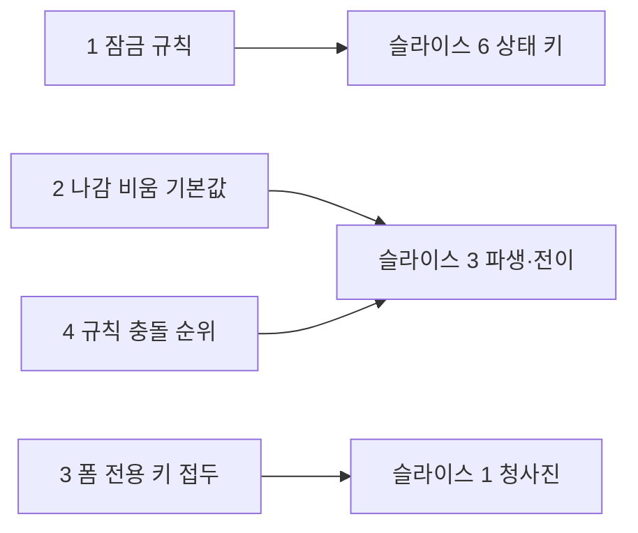

# 13라운드 — Vincent의 판단이 필요한 것 넷 (레드팀 뒤)

2026-09-24. 12라운드의 답 22개는 반영했고(`round-12-derivation.md`), 요청하신 레드팀 공격 둘의 결과가 아래 1·2다. 3·4는 12라운드에서 새로 물으신 것과 답끼리 어긋난 것이다. 항목마다 첫 줄이 권고이고, 줄마다 "가/나/다" 또는 한 줄로 답해 주시면 된다. 이번에는 편집자 권고가 소유자의 원래 제안과 다른 곳이 둘(1·2)이라, 근거를 조금 길게 적었다.



---

## 1. 잠금(`readOnly`·`disabled`) 규칙 — 루트 스키마의 글로벌을 빼는 대신

**권고: 가.** 잠금은 철자를 가리지 않고 **하위 트리로 OR**된다. `false`는 어디서도 풀지 않는다. 루트에 특수 규칙이 없다.

**Vincent의 제안.** "그냥 jsonSchema 상의 글로벌 readOnly와 disabled 스펙은 제거해버릴까? 생각보다 성가시네." 레드팀 둘 다 원안(제거)에 반대했다.

**레드팀이 오늘 코드에서 확인한 사실.**
- 루트 스키마 키는 `readOnly`·`disabled`만이 아니라 `active`·`visible`·`pristine` 다섯을 덮는다. 루트 `active: true`는 모든 노드의 `&active: false`를 무력화한다. "글로벌은 `readOnly`·`disabled`뿐"이라는 말씀과 다르다.
- 루트 키가 문자열 식이면 노드마다 상대 경로로 컴파일되어 깊이에 따라 일부만 잠긴다.
- "정의되면 `false`여도 덮는다"는 2025-09-04 커밋부터다. 그 전에는 참일 때만 걸리는 OR였다. 저장소 안에 루트 `readOnly`로 폼 전체를 잠그는 쓰임은 없다.
- 객체 노드의 `readOnly: true`는 오늘 자식을 잠그지 않는다. 루트만 예외다.
- 오늘 로컬 층은 OR가 아니라 순위 사슬이다(노드 `readOnly: false`가 `&readOnly: 'true'`를 이김).

**왜 성가셨는가.** "정의되면 `false`여도 덮는" 비대칭 때문이다. Form 속성은 참일 때만 덮기로 하셨으니, 루트 스키마 키만 다르게 두면 "루트 = props 동치"가 깨지고 둘이 부딪칠 때의 규칙이 또 필요하다. 비대칭을 없애면 성가심도 없어진다.

```jsonc
{
  "type": "object",
  "properties": {
    "audit": {                          // 생성기 스키마에 흔한 모양
      "type": "object", "readOnly": true,
      "properties": { "createdBy": { "type": "string" } }
    },
    "email": { "type": "string", "&readOnly": "../locked === true" }
  }
}
// 가: audit.createdBy 잠김(표준의 뜻). locked면 email 잠김. 루트나 Form 속성에 readOnly:true를 주면 전부 잠김. false는 아무것도 안 풂.
// 나: audit.createdBy 안 잠김(오늘과 같음). 루트 키는 참일 때만 전체 잠금.
// 다: 루트 키는 아무것도 안 함. Form 속성으로만 전체 잠금.
```

| 선택 | 규칙 | 얻는 것 | 잃는 것 |
| --- | --- | --- | --- |
| 가 (권고) | 잠금은 표준 키·`&`·`control`·`&children`·Form 속성 어디서 오든 하위 트리로 OR. `false`는 풀지 않음. `visible`·`active`·`pristine`은 글로벌 아님 | 표준 `readOnly`(인스턴스 전체)와 일치. 규칙 하나. 루트 = props가 글자대로 성립. 생성기 스키마의 `audit.readOnly`가 뜻대로 | 답 13 "중간 조상 상속 없음"을 개정해야 함(단조 OR는 값을 덮는 상속이 아니므로 그때의 걱정에는 걸리지 않음). 위→아래 전파 비용 |
| 나 | 루트 스키마 키는 Form 속성처럼 참일 때만 덮는 OR. 중간 객체 `readOnly`는 오늘대로 무효 | 답 13 유지, 변화 최소 | 중간 객체의 표준 `readOnly`가 계속 무효. 루트만 특수 |
| 다 (원안) | 루트 키를 글로벌에서 뺌 | 규칙 단순 | 스키마만으로 폼 전체를 잠글 길이 없어짐(코어만 쓰는 호스트). 루트 `readOnly: true`가 신호 없이 무효 |

어느 안이든 루트 키의 `active`·`visible`·`pristine` 특수 처리는 사라진다(이주).

---

## 2. 노드가 형상에서 나갈 때 원본을 비우는가 — 기본값

**권고: 유지(가).** 기본은 P4대로 원본을 남기고 방출에서만 뺀다. 비움은 작성자가 켠다.

**Vincent의 제안.** "조각이 꺼질때 해당 값을 '제거'할 것인지는 별도 옵션을 쓴다. 단, 기본값은 true, false로 끌 수 있도록 한다. 이는 omitEmpty와 동일하게, 빼는게 기본 동작이라고 가정한 구성이다."

**장치의 모양은 정해졌다(어느 기본값이든 같다).** 레드팀이 원안의 구멍을 막은 형태다.
- 단위는 조각이 아니라 **노드의 나감**(직전 커밋 형상에 있었고 최종 형상에 없음, 하위 트리 포함). 본체와 분기가 함께 선언한 노드는 한쪽이 꺼져도 나가지 않는다. 채움의 "생김"과 대칭.
- 시점은 전이 단계, 최종 형상 기준. **로드에는 나감이 없다**(로드된 값을 조용히 지우지 않는다).
- 다섯째 자동 쓰기. 억제 비트와 원본 B의 대상. `&unsetValue`와 같은 장치이며 발화원이 둘(식의 거짓→참, 노드의 나감).
- 정책 키는 `&unsetValue`와 다른 이름(가칭 `&unsetOnExit`). 자리는 네 층이고 세부가 포괄을 덮는다: 노드 자신 > `&children`의 `control` > 조각의 `control` > Form 속성. 같은 층에 여럿이면 하나라도 "유지"면 유지한다(되돌릴 수 없는 쓰기는 만장일치로만).
- 노드 게이트 `&active: false`도 같은 장치다. 그래서 `&active`는 비우고 `&visible`은 보존한다 — 오늘의 구분과 같다.
- 식 규칙(`unsetValue` 식, `derived`)은 정책이 아니라 규칙이므로 부모와 자식 것이 둘 다 발화하고 같은 대상 규칙이 푼다. OR도 체인도 아니다.

**레드팀이 오늘 코드에서 확인한 사실.** 오늘은 이미 비운다. `active`가 거짓이 되면 원본에 `undefined`를 쓰고, `oneOf` 전환은 이전 분기를 초기화하며, 다시 켜지면 마지막 입력이 아니라 **로드 값**(없으면 `default`)으로 되돌린다. 원장에 "오늘은 방출에서만 뺀다"고 적었던 것은 틀렸고 고쳤다. ADR 0013(4차)이 이 reset을 의도적으로 버렸던 것이다.

**남은 것은 기본값 하나다.** 세 동작을 비교하면:

```jsonc
{ "properties": { "kind": { "enum": ["card", "bank"] } },
  "oneOf": [
    { "&active": "../kind === 'card'", "properties": { "cardNumber": { "type": "string", "default": "0000" } } },
    { "&active": "../kind === 'bank'", "properties": { "account": { "type": "string" } } } ] }
// 로드 {kind:'card', cardNumber:'C1'} → 사용자가 '1234' 입력 → 실수로 bank → 다시 card. cardNumber는?
// 오늘:        'C1'   (로드 값으로 복원)
// 유지(가):    '1234' (원본이 남아 있음. 방출에서만 빠졌다가 돌아옴)
// 비움(나):    '0000' (나갈 때 비워지고, 다시 생겨 default로 채움)
// 로드 {kind:'bank', cardNumber:'x'} → 셋 다 'x'는 남는다(로드에는 나감이 없음). 방출에는 안 나간다.
```

| 선택 | 기본값 | 얻는 것 | 잃는 것 |
| --- | --- | --- | --- |
| 가 (권고) | 유지. `&unsetOnExit: true`로 비움을 켠다 | 축 4항("조각의 켜짐·꺼짐은 값을 지우지 않는다")·축 6항("값 변경은 전량 `&`로")·P1′ 끝 문장이 그대로. 순수 `if/then` 스키마에서 폼이 `&` 없이 값을 지우는 일이 없음. 잠깐 전환해도 입력이 남음 | 방출에서 빠진 값이 원본에 남아 `getInactiveValues`로만 보임(오늘과 다름 — 오늘은 지움) |
| 나 (원안) | 비움. `&unsetOnExit: false`로 유지 | "빼는 게 기본"이라는 직관. 오늘의 "꺼지면 지운다"와 방향이 같음 | 축 4항과 P1′ 끝 문장을 개정한다고 선언해야 함. 순수 JSON Schema만 쓴 스키마에서도 폼이 값을 지움. 잠깐 전환하면 입력이 `default`로 바뀜(오늘의 로드 값 복원보다 더 잃음) |

`omitEmpty`와의 비교: `omitEmpty`는 방출의 투영(P4)이라 되돌릴 수 있고, 비움은 원본 쓰기(P2)라 되돌릴 수 없다. "빼는 게 기본"은 방출 층에서는 이미 참이다.

---

## 3. 폼 전용 키의 접두 — `&options`인가 `options`인가

**권고: 가(전부 `&`).** 규칙 하나 때문이다. 다만 이주 비용이 크므로 나를 고르셔도 원리에 어긋나지 않는다.

**Vincent의 물음.** "options도 & 키워드를 가지나? 컨트롤이 아닌데?"

**배경.** 4차에서 폼 전용 키 전부(`&FormTypeInput`, `&options`, `&formType` …)에 `&`를 붙이기로 했다. 이유는 "검증기에 넘기기 전에 `&` 키를 전부 지운다"는 규칙 하나로 끝내기 위해서였다. 레드팀이 확인한 사실 하나가 여기 얹힌다: 오늘 스키마에 맨 키로 쓰는 `disabled`·`visible`·`active`는 JSON Schema 키워드가 아니며, ajv가 엄격 모드를 끈 덕에 통과할 뿐이다. "투명한 JSON Schema"를 따르면 이 셋은 어느 쪽을 고르든 `&` 전용으로 옮겨야 한다(표준 키는 `readOnly` 하나).

```jsonc
// 가: 검증기에 넘기기 전 규칙 하나 — "&로 시작하는 키와 control, virtual을 지운다"
{ "type": "string", "&FormTypeInput": "Select", "&options": { "items": [] }, "&visible": "../show" }
// 나: 표현 키는 접두 없이, 제거 목록을 열거 — "FormTypeInput, options, formType, placeholder … 와 & 키를 지운다"
{ "type": "string", "FormTypeInput": "Select", "options": { "items": [] }, "&visible": "../show" }
```

| 선택 | 뜻 | 얻는 것 | 잃는 것 |
| --- | --- | --- | --- |
| 가 (권고) | 폼 전용 키 전부 `&` | 제거 규칙 하나. 새 표현 키를 더해도 목록 관리 없음. 예약 층 = `&`라는 정의가 그대로 | 이주 비용 큼(모든 스키마의 `FormTypeInput`·`options` 이름) |
| 나 | 제어(`&`)와 표현(접두 없음)을 나눔. 제거 목록 열거 | 이주 비용 작음. "`&`는 제어"라는 직관 | 제거 규칙 둘. 표현 키를 더할 때마다 목록 갱신 |

어느 쪽이든 맨 키 `disabled`·`visible`·`active`는 `&`로 옮긴다(이주).

---

## 4. 같은 대상에 종류가 다른 규칙이 오면

**권고: 가(종류 순위).** 답 9대로 `unsetValue` > `derived` > `injectTo`, 같은 종류 안에서만 문서 순서(나중 승). 경고는 뺀다.

**어긋난 두 답.** 10라운드 답 9: "`&derived`가 이긴다(충돌 자체는 권하지 않음)." 12라운드: "기본적으로 둘 다 동작하는데, 이벤트 전파 순서에 따라 나중에 선언된 것이 이김. 경고를 할 필요는 잘 모르겠음."

```jsonc
{ "properties": {
    "a": { "&injectTo": { "target": "../t", "value": "../a * 2" } },
    "t": { "&derived": "../b + 1" },
    "b": {} } }
// a와 b가 같은 정착에서 바뀌면 t에 후보가 둘.
// 가: derived가 이김(종류 순위). 선언 순서를 바꿔도 결과 같음.
// 나: 문서 순서에서 나중인 t의 derived가 이김. injectTo를 t 뒤에 선언하면 injectTo가 이김 — 선언 위치가 결과를 바꿈.
```

| 선택 | 규칙 | 얻는 것 | 잃는 것 |
| --- | --- | --- | --- |
| 가 (권고) | 종류 순위 `unsetValue` > `derived` > `injectTo` > 채움. 같은 종류끼리만 문서 순서 | 선언 위치와 무관한 결과. 자기 규칙(`derived`)이 남의 규칙(`injectTo`)보다 세부라는 뜻과 맞음 | 규칙 둘(종류, 순서) |
| 나 | 종류 무관 문서 순서(나중 승) | 규칙 하나 | 선언 위치가 값을 바꿈(10라운드 실험에서 선언 의존 24건) |

---

## 5. 통보 (답하지 않으셔도 됩니다)

- `&clearValue`를 `&unsetValue`로 바꿨다. `&resetInteraction`의 시점은 `&unsetValue`와 같다.
- 경고 목록은 오늘 코드의 체계(`JSONSchemaError`·`SchemaFormError`·`ValidationError`·`UnhandledError`, `warnDevelopmentIssue`)를 이어 세 축(언제·누구 잘못·드러남)의 분류표로 바꿨다(원장 §5). 이름 충돌 하나(throw 클래스 `JSONSchemaError`와 노드 `errors` 항목 인터페이스 `JSONSchemaError`)는 후자를 `ValidationIssue`로 부른다.
- `virtual`은 지우기만 하고 `required`는 작성된 그대로 검증기에 간다. 가상 노드는 폼 안에서 같은 대우.
- 모든 JSON Pointer는 선언한 노드 기준이고 `.`·`..`는 폼의 확장 표기다.
