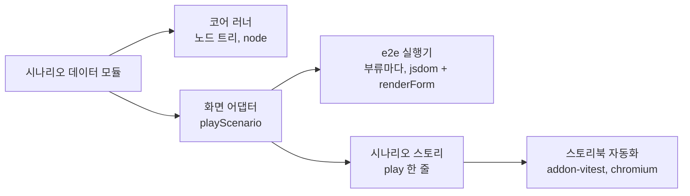

# 16라운드 — 달라진 것과 물음

**답은 `round-16-owner-answers.md`에 있다. 아래는 물은 때의 기록이다. 다만 머리의 '검증' 문장은 답 뒤의 게이트까지 센다.**

2026-09-24. 15라운드에 보신 08 이후 **달라진 것만** 모았습니다. 원리, 축, 15라운드의 이름 규칙은 바뀌지 않아 뺐습니다.

| 표지 | 뜻 | 수 |
| --- | --- | --- |
| **바뀜** | 보신 08에서 고친 곳(전 → 후) | 아홉 |
| **새로 정함** | 이번에 처음 정한 것. `09-landing-and-test-strategy.md`에 있다 | 일곱 |
| **확인 필요** | 예·아니오로 답하실 것. 권고대로면 "예" 한 마디 | 열 |

검증: 정착 검토(verifier, 코드 대조, 조건부 통과, 조건 여덟 모두 처분) 뒤 문서 게이트 여덟 번(첫째 31건·둘째 23건·셋째 12건·여섯째 19건·일곱째 14건 실패 → 모두 반영, 넷째·다섯째·여덟째 조건부 통과 → 조건 반영). 그 뒤 소유자의 말("다 정책판단 문제는 아닌 것 같은데?")에 따라 스웜 수렴(도출 셋·반박 셋·판정)과 게이트 여섯 번(스웜 게이트 하나, 적용 게이트 셋, 좁은 게이트 둘. 마지막은 조건부 통과 → 조건 반영)을 거쳤다.

## 1. 바뀜 — 08의 전과 후

| 자리 | 전 | 후 | 왜 |
| --- | --- | --- | --- |
| §5·§11.1·§17.2 PR-7, ADR 0004 가드 계약 | `compileGuard(schema)`. 시그니처와 공유 방식은 슬라이스 4 | `compileGuard(root, pointer)`. 사본과 가드 캐시는 코어가 검증기 인스턴스마다 든다(키는 작성 루트). 사본 루트의 등록은 플러그인의 검증기 인스턴스가 든다. `Form`의 스키마 `clone`은 없앤다 | 떼어 낸 `if`는 `$ref` 때문에 단독 컴파일이 실패하고, ajv는 같은 키의 재등록에 실패한다(둘 다 실행 확인) |
| §17 PR-1 교차 연산 | `helpers/jsonSchema`의 교차 연산 재사용 | 병합표는 새로 쓰고 잎 교차 함수 일곱만 옮긴다. `intersectEnum`·`intersectConst`·`validateRange`는 던지지 않고 공집합 표시를 돌려준다. 옛 `intersect*Schema`는 PR-7까지 옛 동작 | 오늘의 교차는 먼저 승·얕은 덮어쓰기·무조건 throw라 §9와 다르다 |
| §17 PR-1 식 컴파일러 | `helpers/dynamicExpression` 재사용 | 오늘은 `AbstractNode` 조직 안에 있다. 청사진으로 통째로 옮긴다(PR-7까지는 청사진 진입점이 옛 엔진에도 내보낸다) | 재사용 문장이 사실과 달랐다. 새 엔진에서 식을 컴파일하는 곳은 청사진뿐이고, `helpers/dynamicExpression/`은 표현식 직접 실행을 금한다 |
| §17.3 ajv 플러그인 셋 | 타입만 맞춘다 | PR-4에서 동기 `compileGuard(root, pointer)` 경로를 셋 모두에 구현한다 | 셋 모두 `$async: true`로 컴파일한다 |
| §17.3 UI 플러그인 넷 | 타입과 등록 키 넷 | 더해서 27파일의 `options.*`·맨 키 읽기를 `presentation.*`로 옮긴다(PR-7) | `options`가 닫힌 다섯 키라 남겨 두면 청사진 오류 |
| §17.3 테스트 규모 | 205파일 약 3,150건을 다시 쓴다 | 234파일을 넷으로 가른다(아래 새로 정함의 넷째) | 다시 셌다 |
| §14 이주 표 | 32행까지 | 33–37행을 더함: `validatorFactory`는 `{ compile, compileGuard }` 객체 / 플러그인 계약에 `compileGuard`·`rejectedKey` / `node.jsonSchema`는 켜진 조각의 병합 / `reset`은 로드(확인 필요의 둘째) / 플러그인 자유 키와 맨 키는 `presentation.*` | 정착 검토가 찾은 빠진 이주 |
| §15 설계 항목 | 없음 | 객체 호스트 `default`의 자손 분배 규칙(슬라이스 2 전) | 프로토타입에만 흔적이 있었다 |
| §17 PR-2·PR-4·PR-7 범위 | PR-7의 '렌더 시나리오 442건의 기대값 재작성' 외에는 없음 | PR-2: 되돌림 기록 항목(노드, 이전 `raw`·`extras`, 배열 구조). PR-4: 훅 수준 바인딩 시험, 같은 `$id` 루트의 중복 등록, 배달 경로(확인 필요의 셋째). PR-7: 바인딩 계약 다섯(첫째·넷째는 ADR 0014 확정 뒤), React 18 시험(확인 필요의 다섯째), 렌더 시나리오 438건의 처분(17파일의 단언 유지는 확인 필요의 일곱째) | 정착 검토의 조건 |

## 2. 새로 정함 — 09

1. **물으신 것: `node.jsonSchema`는 상수가 아니다.** 켜진 조각을 전순서로 병합한 유효 스키마다. 활성 조각 집합마다 메모해 같은 집합이면 같은 참조를 돌려주고, 재계산 목록에 든 노드만 다시 셈하며, 바뀌면 통지의 배달 집합에 든다. 렌더 쪽은 이 장 셋째(React 바인딩 계약 다섯)의 다섯째 계약으로 따라간다(08 §14의 35행).
2. **노드는 합성.** 하위 클래스 없는 단일 클래스 하나, 종류별 데이터는 `branch` 한 칸, 종류별 동작은 `KIND[kind]` 표, 정착은 `settle`의 자유 함수. 공개 타입과 가드 아홉은 판별 인터페이스로 지킨다. 세부와 클래스의 자리는 PR-2의 `DETAIL.md`가 정한다. 요건(상속 구조 존치, 타입별로 흩어진 공유 함수, 불필요한 중복 불허)을 지키는 틀이다.
3. **React 바인딩 계약 다섯.** 첫째 마운트 정착 동안 `onChange`·`onDiagnosticsChange`·`onError` 억제, 둘째 입력 출처 표식은 내부 통로로, 셋째 `handleChange`는 `batch` 하나, 넷째 ErrorBoundary에 다시 던지기 판정 인자, 다섯째 유효 스키마를 따라간다(`useFormTypeInput`의 메모 의존, `SchemaNodeProxy`의 변경 비트). 첫째와 넷째는 ADR 0014 미결의 확정에 기댄다.
4. **테스트 위계와 기존 234파일.** 코어 유닛(`node`), `<Form>` e2e(`jsdom` + `renderForm`), 개별 함수·훅. 기존 234파일은 그대로 산다 약 30, 표면만 고친다 약 25, 버리고 새로 쓴다 약 150(상황 목록은 데이터 모듈로 옮긴다), 미분류 약 29(PR-0에서 가른다).
5. **시나리오는 한 곳에만 적는다.** 실행기 없는 데이터 모듈에 스키마·초기값·단계·기대를 적고, 코어 러너와 e2e와 스토리가 가져다 쓴다. 단계 어휘는 여덟(`setValue`·`clear`·`push`·`remove`·`update`·`submit`·`reset`·`batch`).
6. **스토리북 개편.** 스토리는 e2e의 화면 미러이고(파일당 다섯 줄), 자동화는 그 스토리의 `play`를 `@storybook/addon-vitest`가 브라우저 모드(chromium)로 돌린다. `@storybook/test-runner`는 뺀다. vitest `test.projects`는 `unit`·`render`·`storybook` 셋이다.
7. **벤치와 릴리스.** 옛 판 대 새 판은 `@aileron/benchmark-form`이 잰다. 문법이 달라 옛·새 스키마 쌍을 두고, 같은 상호작용 뒤 같은 `[data-path]` 집합을 그리는지 시험이 먼저 단언한다. 코어와 렌더를 나눠 워밍업 10회·표본 100회 이상, 중앙값과 99번째 백분위로 잰다. 패키지 벤치 일곱은 새 엔진의 회귀 감시로 다시 쓰고, 옛 엔진의 마지막 기준선을 남긴다.

스키마와 단계는 한 번만 적히고, 화면을 거치는 두 경로는 같은 해석기를 쓴다.

## 3. 확인 필요 — 예·아니오

1. **e2e는 `jsdom`에서 돈다.** `<Form>` e2e는 vitest `jsdom` + `renderForm` + `playScenario`이고, 실제 브라우저 실행은 스토리북 자동화가 맡는다. 브라우저를 e2e의 본체로 두셔도 두 층의 이름만 바뀐다. 권고: 예.
2. **`reset`은 로드다.** `FormHandle.reset`은 `<Form>`을 다시 마운트하지 않고 코어의 로드(전체 교체)로 한다. 트리와 가드 캐시를 다시 만들지 않는다. 권고: 예.
3. **배달 경로 제안.** 정착을 거치지 않는 사건(상태, 외부 오류, 명령)은 같은 루트 디스패처가 같은 진입 규칙으로 배달하고, 검증 결과는 커밋 번호 스탬프를 검사한 뒤 자기 파동으로 배달한다(09 §2.4). 권고: 예.
4. **옛 스토리 49파일의 처분.** 시나리오를 담은 것은 데이터 모듈로 옮겨 다섯 줄 스토리가 되고, 사용법 스토리는 소수만 새 문법으로 다시 쓰며, 스키마를 인라인으로 든 스토리는 남기지 않는다. 권고: 예.
5. **React 18을 계속 지원한다.** 예라면 PR-7에 React 18 실행 시험을 둔다(동료 의존은 `>=18 <20`인데 오늘 설치는 19뿐). 아니오라면 동료 의존을 올리고 시험을 뺀다. 권고: 예.
6. **벤치 게이트의 문장.** "옛 판보다 느린 항목이 있으면 이유를 적고 Vincent가 받아들여야 병합한다." 예산 수치는 ADR 0009의 미결 그대로다. 권고: 예.
7. **렌더 시나리오 17파일은 단언을 살린다.** 조합과 옛 키가 없는 17파일은 기대값을 버리지 않고 이름만 바꿔 e2e의 추가 단언으로 둔다. 08 §18의 넷째('기존 시나리오의 기대값은 버린다')의 예외가 된다. 권고: 예.
8. **시나리오 모듈은 비공개 패키지로.** 플러그인 패키지 일곱의 스토리와 릴리스 점검 앱도 같은 시나리오를 가져가야 하므로, 데이터 모듈과 `playScenario`를 공개 `exports`를 넓히지 않는 비공개 워크스페이스 패키지로 둔다(`packages/aileron/`의 `@aileron/*` 관례, `benchmark-form`·`production-testbed`와 같은 자리). 그 패키지는 `@canard/schema-form`을 가져오지 않는다(가져오면 schema-form의 시험과 서로 가져오는 고리가 된다. 가능한지는 PR-0이 확인한다). 시나리오 감싸개도 `Form`을 주입받는 형태로 같은 패키지에 둔다. 권고: 예. **예라면 이름을 정해 주십시오**(근거 없는 이름은 짓지 않는 배치 규칙).
9. **릴리스 테스트는 `@aileron/production-testbed`다.** 예라면 패키지 산출물을 가져와 UI 플러그인 넷과 ajv 플러그인 셋으로 그리는 점검을 릴리스 전에 한 번 돌린다. 아니오라면 가리키신 것을 알려 주십시오.
10. **편집자 결정 여섯(09 §8의 열한째).** 가드 캐시는 코어가 검증기 인스턴스마다 든다. 사본 루트의 등록은 플러그인의 검증기 인스턴스가 든다. e2e는 부류마다 실행기 하나(파일당 15건 이하, 패키지 `CLAUDE.md`의 상한)가 돌리고 추가 단언이 있는 시나리오만 자기 파일을 둔다(3차 게이트 뒤 "실행기 하나"에서 바뀜). `FormHandle`은 그린 쪽이 DOM에 등록하고 `playScenario`가 찾는다(3차 게이트 뒤). 식 컴파일러는 청사진으로 통째로 옮긴다(3차·4차 게이트 뒤). `architecture/spikes/**`의 실험 시험 4파일은 새 vitest 프로젝트에 넣지 않는다(3차 게이트 뒤). 권고: 예.

이전 라운드의 확인 대기(ADR 0014 미결 아홉, O-8의 둘, 15라운드 게이트 뒤 편집자 결정 일곱)는 이번에 바뀐 것이 없어 이 장에서 뺐습니다. `HANDOFF.md`에 그대로 있습니다.
